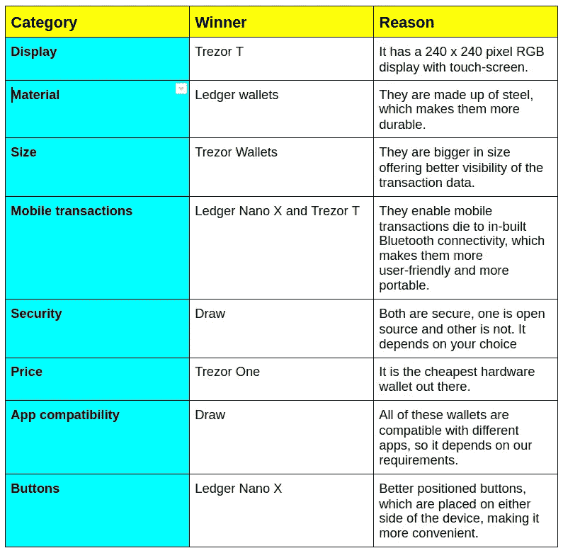
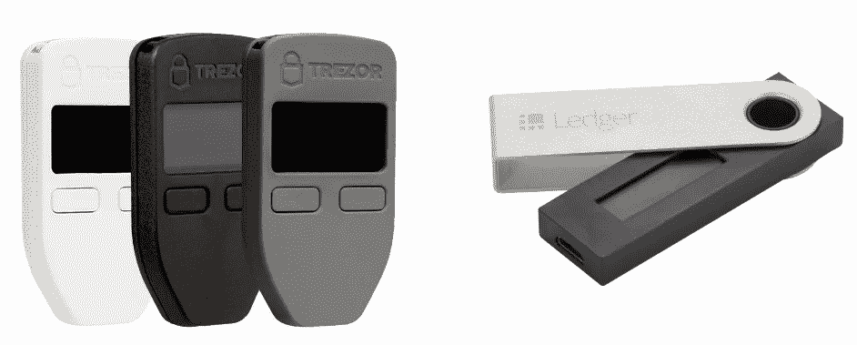
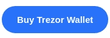
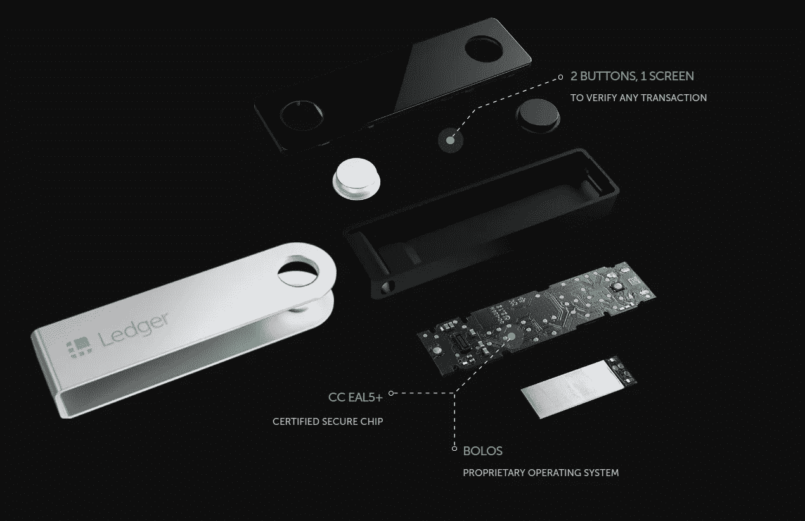
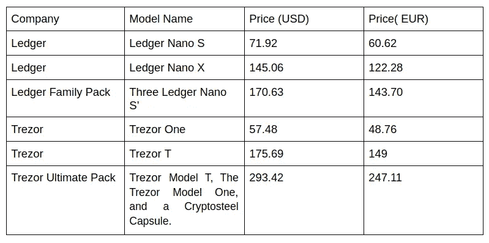
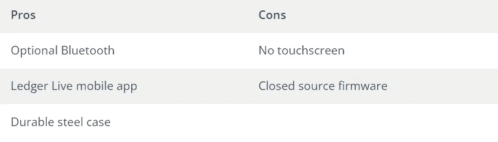
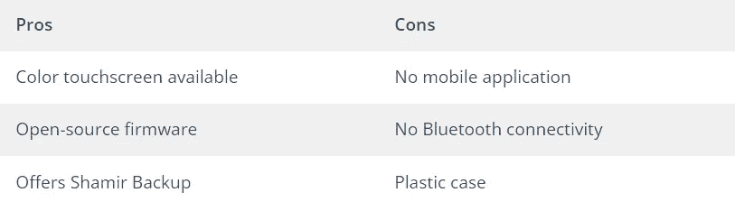
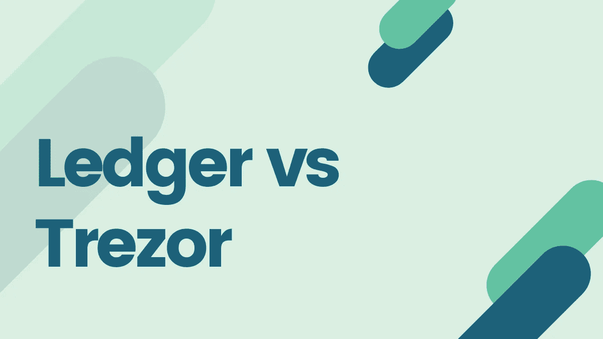

# Ledger 与 tre zor—2023 年回顾与比较

> 原文：<https://medium.com/coinmonks/ledger-vs-trezor-best-hardware-wallet-to-secure-cryptocurrency-22c7a3fd391e?source=collection_archive---------0----------------------->

本文将根据多项标准比较 [Ledger](https://shop.ledger.com/products/ledger-nano-s?r=da6d9b98e517) 与 [Trezor](https://shop.trezor.io/?offer_id=10&aff_id=5199) ，帮助您决定最适合您需求的[硬件钱包](/coinmonks/the-best-cryptocurrency-hardware-wallets-of-2020-e28b1c124069)。

## **什么是硬件钱包？**

硬件钱包是存储加密货币的物理设备。它们在离线模式下包含私钥，无法连接到互联网或运行复杂的应用程序；因此，它们不会受到攻击。

因此，它们也被称为冷库(或冷钱包)。硬件钱包兼容多种界面和应用，支持多种加密货币。它们还兼容其他第三方钱包，后者充当管理硬币的界面。

请记住，设备越复杂，受到攻击的可能性就越大。这些钱包有一个最小和简单的设计，减少了整体[攻击面](https://en.wikipedia.org/wiki/Attack_surface)。

## **硬件钱包是如何工作的？**

硬件钱包只签交易。因此，为了准备交易并将其广播到网络，您需要使用另一台连接到互联网的设备(前笔记本电脑)。

通常，您需要下载一个程序来与硬件钱包进行交互，因为这些钱包只允许特定类型的信息，如交易数据。

要开始交易，我们需要在硬件钱包中输入 pin(密码)。始终确保我们在硬件钱包屏幕上批准的交易与连接的设备(笔记本电脑)相同。

您永远不要忘记种子短语，它是一个 12- 24 个单词的组合，用于初始化我们的硬件钱包。任何能够访问种子短语的人都可以访问您的加密货币，因此，您必须将它们离线保存在安全的地方。

Ledger and Trezor Comparison Table

## **莱杰 vs 特雷佐:外形**

## **显示**

Trezor 和 T2 的账本都有显示屏。它们用于显示种子短语和发送加密货币。与 Ledger 相比，Trezor 的显示屏更大，因此查看起来更方便。然而，[Trezor T 型](https://shop.trezor.io/product/trezor-model-t?offer_id=15&aff_id=5199)也有一个漂亮的彩色触摸屏。

## **材质**

Trezor 钱包由塑料制成，而 Ledger 钱包则采用不锈钢材质。不锈钢使 Ledger 钱夹更加耐用和便于携带，使其外观更加时尚。

## **按钮**

这两款设备都带有两个用于管理软件的按钮。值得注意的是，Trezor 的按钮更容易使用，因为它们之间有很大的空间。分类账钱包中的按钮彼此非常接近，增加了同时按下两个按钮的风险。

## **尺寸**

Trezor 比[莱杰纳诺 S](https://shop.ledger.com/products/ledger-nano-s?r=da6d9b98e517) 大。因此，它可能更容易随身携带分类账钱包，因为它的尺寸较小。

Physical appearance of wallets

## 莱杰与特雷佐:**加密货币支持**

了解两个钱包都支持哪些硬币至关重要。目前，Trezor 和 Ledger 钱包都支持 1000+硬币。这两个钱包都支持以太坊网络上的所有 ERC20 令牌。

> 又念:[莱杰纳米 S vs 特雷佐 one vs 特雷佐 T vs 莱杰纳米 X](https://coincodecap.com/ledger-nano-s-vs-trezor-one-vs-trezor-t-vs-ledger-nano-xledger-nano-s-vs-trezor-one-vs-trezor-t-vs-ledger-nano-x)

# Ledger vs. Trezor: **开源**

## **总账**

总账钱包运行他们自己的定制操作系统。这意味着我们看不到什么代码进入了设备以及它运行的固件。然而，规范是完全开放和详细的，所有的加密操作都是确定性的，允许它们拥有所需的信息。

## 特雷佐

Trezor 钱包使用开源固件和软件。使用开源软件有利也有弊。这些缺陷可以很容易地被识别出来，但是它伴随着一个附加的安全风险。

你可以在的 [GitHub](https://github.com/trezor) **上了解更多关于 Trezor 的信息。**

## Ledger 与 Trezor: **支持的操作系统**

Trezor 和 Ledger 兼容电脑和智能手机。支持的[操作系统](https://wiki.trezor.io/Operating_system)有 [Windows](https://wiki.trezor.io/Windows) 10、 [macOS](https://wiki.trezor.io/MacOS) 10.11 及更高版本、 [Linux](https://wiki.trezor.io/Linux) 和 [Android](https://wiki.trezor.io/Android) OS。

Ledger 支持 Windows 8+，macOS 10.10+，Linux 不包括 ARM 处理器。也兼容 Android 7+智能手机。

## 莱杰 vs 特雷佐:**密码加密的不同**

Trezor 和 Ledger 钱包都有密码功能。每个不同的密码解锁一组独特的帐户。我们可以使用多个密码。

这些设置有助于从同一个钱包中拥有一个主帐户和两个或更多隐藏帐户，并具有相同的 24 字恢复种子。因此，不管我们是否有恢复种子，我们都需要密码来访问相应的钱包。如果非要强行给你密码，总可以给资产少的那个。

在 [Trezor 钱包](https://shop.trezor.io/?offer_id=10&aff_id=5199)中，这个密码是通过笔记本电脑等连接设备输入的，这使得攻击者很容易读取。

然而，在分类账钱包中，密码与使用普通钥匙输入的另一个 PIN 相关联。

Trezor 钱包有一个密码管理器，可以在 MacOS、Windows 和 Linux 上与 Chrome 和跨平台一起工作。我们可以安装 Trezor 密码管理器 Chrome 扩展(TPM)并用 Google Drive 或 Dropbox 登录。我们也可以通过输入我们的 PIN，然后在我们的 Trezor 设备上启用密码管理器来连接到我们的 Trezor 设备。

## Ledger 与 Trezor: **与其他应用程序的兼容性**

## **总账**

[账本钱包](https://shop.ledger.com?r=da6d9b98e517)兼容账本直播、Electrum、MyEtherWallet、Copay、菌丝体、电子现金、GreenBits、MyCrypto、币安、Magnum 等应用。

## **特雷佐**

Trezor 钱包兼容 MyTrezor、Copay、MultiBitHD、Magnum、GreenBits、Electrum、菌丝体、MyEtherWallet 等应用。

这两个钱包都兼容大量的应用程序，并且有许多相同的应用程序。所以永远选择，看你需要什么。

## 莱杰对特雷佐:**硬件**

## **总账**

[账本钱包](https://shop.ledger.com?r=da6d9b98e517)拥有非常独特的硬件架构，由非常安全的操作系统 [BOLOS](https://www.ledger.com/introducing-bolos-blockchain-open-ledger-operating-system/) (区块链开放账本操作系统)和被称为[安全元素](https://www.ledger.com/academy/security/the-secure-element-whistanding-security-attacks)的专用芯片组成。

为了利用安全元件的独特安全能力，同时能够管理不同的外围设备，安全元件配备有 STM32 微控制器(MCU ),该微控制器充当外围设备和安全元件之间的路由器，并且每当要接收新数据时通知它。

安全元件负责执行 BOLOS 环境的所有应用。

## 特雷佐

**CPU:**Trezor 使用的处理器是 120 MHz 的 ARM Cortex-M3 处理器，而软件是定制的。

**屏幕:**屏幕是一个重要的工具，它使用户能够验证输入数据的真实性。Trezor One 采用有机发光二极管屏幕(128 x 64 像素)；而 Trezor 型使用的是 LCD 触摸屏(240 x 240 像素)。两个屏幕都在屏幕上提供了充足的空间，以便显示警告、请求、图像或交易细节。它还用于显示我们私钥的恢复种子。

**按钮:**两个按钮由 [Trezor One](https://shop.trezor.io/product/trezor-one-black?offer_id=35&aff_id=5199) 使用，以接收用户的确认。为了保护帐户免受攻击，物理确认非常重要。

Trezor model T 还使用了一个 Micro-SD 卡插槽和一个 USB-C 连接器。

## 莱杰与特雷佐:**安全**

当考虑输入密码的安全性时，在 [Trezor 钱包](https://shop.trezor.io/?offer_id=10&aff_id=5199)中，密码是通过连接设备的键盘输入的，这使得攻击者很容易读取密码。

然而，在[的账本钱包](https://shop.ledger.com?r=da6d9b98e517)中，密码与另一个 PIN 码关联，后者是使用普通钥匙输入的。

## 如何检查自己的 Trezor 或 Ledger 钱包是否被钢化？

有两种方式可以对设备进行物理攻击。首先，它可能在我们收到之前就被破坏了。为了避免这种情况，Trezor 使用了**防篡改封条**。它们使用工业胶水密封，在对硬件进行更改后再装回去是非常棘手的，所以我们知道，如果钱包有损坏或破损的密封，它就已经被破坏了。

Ledger 使用可信的计算基础，并通过加密证据进行验证。用户可以通过执行证明检查来验证设备的完整性。他们还防止[邪恶女仆攻击](https://en.wikipedia.org/wiki/Evil_maid_attack)。

## Trezor 或 Ledger 钱包被盗怎么办？

这些设备由一个 pin 码保护，在三次不成功的尝试后，它会擦除所有内容，自毁，并将可疑用户锁在外面。

按照设计，Trezor 和 Ledger 都可以免受远程攻击。它们不直接连接到互联网；当连接到支持互联网的设备时，它们只传递必要的信息，如交易细节。

虽然 [Ledger](https://shop.ledger.com?r=da6d9b98e517) 和 [Trezor](https://shop.trezor.io/?offer_id=10&aff_id=5199) 都以自己的方式高度安全，但 Trezor 被认为是更好的选择，因为它更安全，因为它具有开源特性。

# **总帐与 Trezor:定价**

# 莱杰与特雷佐:**型号**

莱杰和特雷佐都有两种型号。在本节中，我们将相互比较各自的模型。

# 莱杰纳米 S 对莱杰纳米 X

分类帐硬件钱夹由以下型号组成:

## [**莱杰纳米 S**](https://shop.ledger.com/products/ledger-nano-s?r=da6d9b98e517)

Nano S 是 Nano X 的前身，开发于 2014 年。它由钢制成，由 [ST31H320](http://www.st.com/content/ccc/resource/technical/document/data_brief/ac/ed/36/cb/1c/04/43/a8/DM00240763.pdf/files/DM00240763.pdf/jcr:content/translations/en.DM00240763.pdf) 安全元件和 [STM32F042K](http://www.st.com/content/ccc/resource/technical/document/datasheet/52/ad/d0/80/e6/be/40/ad/DM00105814.pdf/files/DM00105814.pdf/jcr:content/translations/en.DM00105814.pdf) 微控制器芯片组成。

它比 Nano X 更轻更小。它由一个 128 x 32 像素的小屏幕组成，在设备的一侧有两个按钮。

它不包括电池，因为它只支持有线交易，并带有一个微型 USB 型。

[Ledger Nano S](https://shop.ledger.com/products/ledger-nano-s?r=da6d9b98e517) 并不完全是为移动交易设计的，但需要电脑访问来执行交易。它的存储空间有限，最多可以容纳 10 个应用程序。

由于其相对便宜的价格，Nano S 仍然是加密货币爱好者和新手交易者的热门选择。

## [**莱杰纳米 X**](https://shop.ledger.com/pages/ledger-nano-x?r=da6d9b98e517)

莱杰纳米 X 是纳米 S 的继任者。它由钢制成，由 ST33J2M0 安全元件和 STM32WB55 微控制器组成，它们是无线芯片，内置蓝牙支持。

Nano X 比 Nano S 更重更大。它的屏幕比 Nano S 更大，显示尺寸为 128 x 64 像素，并为显示信息提供了更多空间。

它由两个按钮组成，分别位于设备的两侧，使用起来更耐用、更方便。

100 mAh 可充电电池支持 Ledger Nano X。配有 USB Type C 连接器。它为我们提供了更多的存储空间，可以轻松容纳 100 多个应用程序，每个应用程序都支持不同的加密货币。Ledger Nano X 在需要随时随地存取资金的专业人士中更受欢迎。

> 又念:[莱杰纳诺 S vs X](https://coincodecap.com/ledger-nano-s-vs-x)

## **Trezor One vs . Trezor T 型**

Trezor 硬件钱包由以下型号组成:

## [**特雷佐一人**](https://shop.trezor.io/product/trezor-one-black?offer_id=35&aff_id=5199)

Trezor One 是由 SatoshiLabs 开发的首款 Trezor 硬件钱包。

它有两个按钮和一个 128 x 64 像素的有机发光二极管显示屏，而不是触摸屏。它类似于一个钥匙链，非常小巧轻便，便于携带。

[Trezor One](https://shop.trezor.io/product/trezor-one-black?offer_id=35&aff_id=5199) 由 ABS 塑料外壳保护，该外壳耐冲击且坚固耐用，可防止轻微的物理损坏。

它由一个 STM32 F2 [微控制器](https://wiki.trezor.io/Microcontroller)和运行在 120 MHz 的 ARM Cortex-M3 [处理器](https://wiki.trezor.io/Processor)组成，为我们的资金提供了平稳安全的访问。

Trezor One 和 tre zor T 型车都没有电池。

这两款 Trezor 钱包都支持各种功能，如密码管理器(使我们能够存储、访问和管理各种应用程序的登录详细信息)和 U2F 认证令牌(允许轻松登录 Twitter、Github、Google 等各种社交媒体网站)。

对于低预算条件的硬件钱包来说，这是一个**理想的选择。**

## [**Trezor 型号 T**](https://shop.trezor.io/product/trezor-model-t?offer_id=15&aff_id=5199)

Trezor T 是第二代钱包，是 Trezor One 硬件钱包的更新、升级和更安全的版本。

它拥有更新、更快、更好的操作系统和处理器。它由 ABS+PC 塑料外壳保护，由 STM32F4 [微控制器](https://wiki.trezor.io/Microcontroller)和运行在 168 MHz 的 ARM Cortex-M4 [处理器](https://wiki.trezor.io/Processor)组成。

tre zor T 型由一个 240 x 240 像素的 RGB 彩色显示屏和一个触摸屏组成，支持比 Trezor One 更多的加密货币。

触摸屏为用户提供了更友好的用户体验、更好的可访问性以及对硬件钱包的最终控制。

屏幕是输入密码或 PIN、解锁设备、恢复现有钱包以及确认其他操作的唯一媒介，这使得在种子恢复过程中不容易发生网络犯罪，并且更加安全。

屏幕也有更大的尺寸，让钱包方便很多。

该钱包内置移动连接、SD 卡插槽和 USB Type C 连接器，支持移动交易，并与任何移动设备或计算机兼容。钱包允许我们使用自己的网络钱包接口进行 ERC20 令牌交易，而不是使用第三方接口。

## **硬件钱包优势**

使用硬件钱包有多种优势:

*   硬件钱包能够在一个隔离的离线环境中同时托管多种加密货币。
*   这些钱包更加安全，不易受到计算机病毒和恶意软件的攻击，这确保了更安全的交易。
*   硬件钱包由我们生成的加密 pin 码保护。在连续三次输入错误密码后，钱包会自毁并锁定，任何试图通过尝试不同的 pin 强行进入的人。该设备会删除密钥，以确保我们的资金安全。
*   私钥只在我们加密的硬件设备上输入，这使得它不会暴露给其他人和设备，并防止它被黑客攻击。
*   这些钱包不允许任何人在没有访问设备的情况下进行任何交易，因为硬件钱包本身进行交易验证。因此，只要我们是唯一有权访问硬件钱包的人，我们的数据和交易就是安全的。

# **硬件钱包劣势**

硬件钱包的缺点如下:

*   他们不自由。
*   钱包可能会丢失或损坏。
*   私钥提取变得非常困难。
*   因为它们高度安全，所以不允许我们只点击几下就完成交易，有时设置钱包也很困难。
*   许多人和在线购物平台参与制造和销售假冒的硬件钱包，最终可能会掏空我们的资金。

## 莱杰与特雷佐:如何设置？

## 分类帐

1.  您必须等待设备生成私钥来访问您的加密资产。
2.  您还必须写下您独特的恢复短语(24 个单词)，这是您私钥的备份。
3.  要开始设置过程，您必须将设备连接到计算机，并等待欢迎消息。
4.  浏览完说明后，同时按下两个按钮开始设置新设备。
5.  之后，按照步骤选择 PIN 码。选择勾号后，按下两个按钮确认他们的选择。
6.  设备现在将显示 24 个单词的恢复短语，您应该记下这些短语。

## 特雷佐

1.  你必须首先访问 trezor.io/start.，你将被重定向到钱包。在这里你可以安装 TREZOR Bridge 或者 TREZOR Chrome 扩展。
2.  由于新设备中没有安装固件，因此您必须安装最新的固件。
3.  按照说明生成 PIN。Trezor 使用基于网格的 PIN 生成系统。
4.  生成 PIN 后，您应该记下生成的 24 个单词的唯一组合。

## 莱杰与特雷佐:赌注

## 分类帐

分类账钱包允许在他们的平台或外部钱包中同时下注多达 7 个硬币。可供下注的加密货币包括以太坊、Tezos、Tron、Cosmos、Algorand 和 Polkadot。

## 特雷佐

Trezor 硬件钱包不允许加密货币赌注。您可以将 Trezo Model T 或 Trezor One 钱包链接到第三方验证器或赌注池。此外，你也可以使用 Exodus 钱包作为一个赌注接口。

## 莱杰与特雷佐:利弊

## 分类帐

Ledger Pros and Cons

## 特雷佐

Trezor Pros and Cons

## 常见问题

## 总帐钱包是如何工作的？

账本钱包基本上是离线保存多种货币的 USB 存储设备。它能够在设备上存储用户的私钥，从而使第三方难以访问用户的帐户。此外，如果物理设备被盗，用户可以依靠 24 字密码备份恢复来访问他/她存储的加密货币。

***还有，在这里你可以对比*** [***莱杰 vs Ngrave***](https://coincodecap.com/ledger-vs-ngrave-zero) ***，决定哪一款最适合你。***

## 如何设置 Trezor 钱包？

1.  将 trezor 钱包连接到您的电脑。
2.  转到[trezor.io/start](https://trezor.io/start/)
3.  安装 trezor 钱包。
4.  安装固件。
5.  重新连接崔佐。
6.  给 trezor 设备起个名字。
7.  设置 PIN。
8.  记下恢复种子

## 如何用你的 Trezor 钱包兑换加密货币？

1.  连接您的 trezor 钱包并登录。
2.  从 trezor 钱包的左上角选择相关的加密货币类型。
3.  选择一个你想交易的账户。
4.  从主导航菜单中，单击“交换”。
5.  选择您想要购买的加密货币类型。
6.  点击"继续交流"
7.  填写你希望出售的数量。
8.  最后，选择最佳交易。

## 如果我丢失了账本钱包怎么办？

你总是可以得到一个新的账本设备，输入你的恢复短语，然后你就可以重操旧业了。此外，建议设置一个具有相同恢复短语的备份分类帐设备，以便在丢失或出错时轻松访问您的资金。

## 分类账钱包的用途是什么？

分类账硬件钱包是多货币钱包，用于离线存储加密货币的私钥。

***你可以读读*** [***账本纳米 S vs X***](/coinmonks/ledger-nano-s-vs-x-battery-hardware-price-storage-59a6663fe3b0) ***来更好的对比这两个钱包。***

## Trezor 是个好钱包吗？

是的，Trezor 是加密货币世界中一个可靠值得信赖的钱包。这是一个众所周知的硬件钱包，提供高安全性，正在被全球超过 100 万加密用户使用。

## 我可以在 Trezor 上储存什么硬币？

Trezor 硬件钱包支持几种主要的加密货币。其中一些包括 ERC 20 代币，比特币，XRP，恒星，系绳，创，等等。

## 以太坊钱包哪个好？

以太坊是世界上最有价值的加密货币之一。一些最好的以太坊钱包包括 Trezor One、Metamask 和 Ledger Nano。

## 硬件钱包为什么安全？

硬件钱包通过使用 USB 驱动设备非常安全地存储用户的私钥。这使得钱包不受可能存在于用户电脑上的病毒的影响。

> 加入 Coinmonks [电报频道](https://t.me/coincodecap)和 [Youtube 频道](https://www.youtube.com/c/coinmonks/videos)获取每日[加密新闻](http://coincodecap.com/)

## 另外，阅读

*   [密码电报信号](http://Top 4 Telegram Channels for Crypto Traders) | [密码交易机器人](/coinmonks/crypto-trading-bot-c2ffce8acb2a)
*   [复制交易](/coinmonks/top-10-crypto-copy-trading-platforms-for-beginners-d0c37c7d698c) | [加密税务软件](/coinmonks/crypto-tax-software-ed4b4810e338)
*   [网格交易](https://coincodecap.com/grid-trading) | [加密硬件钱包](/coinmonks/the-best-cryptocurrency-hardware-wallets-of-2020-e28b1c124069)
*   [印度的加密交易所](/coinmonks/crypto-exchange-dd2f9d6f3769) | [加密应用](/coinmonks/buy-bitcoin-in-india-feb50ddfef94)
*   [零审核](/coinmonks/ngrave-zero-review-c465cf8307fc) | [零审核与总账](https://coincodecap.com/ledger-vs-ngrave-zero)
*   [Ellipal Titan review](/coinmonks/ellipal-titan-review-85e9071dd029) | [莱杰 Nano S vs X](/coinmonks/ledger-nano-s-vs-x-battery-hardware-price-storage-59a6663fe3b0)

Ledger vs Trezor