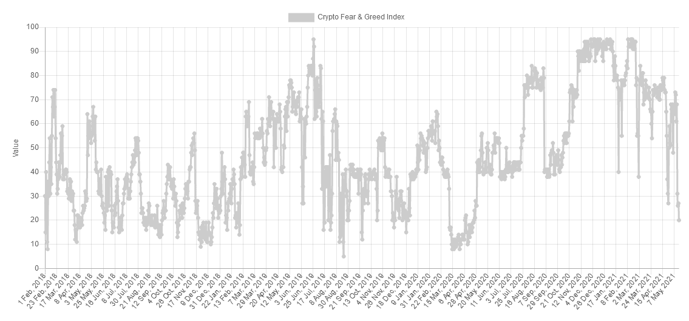

# 传统银行消耗的能量是比特币的两倍！

> 原文：<https://medium.com/coinmonks/legacy-banking-consumes-twice-as-much-energy-as-bitcoin-5b439fe10240?source=collection_archive---------5----------------------->

比特币正在经历一次修正，这是由一系列广泛不准确的埃隆马斯克推文引发的。虽然损害已经造成，但最近的一份报告通过将比特币与当前的传统金融基础设施进行比较，将比特币的能源消耗置于特定背景下。虽然埃隆的推文提供了无尽的娱乐价值，但比特币现在正与时间赛跑，在 5 月 23 日之前夺回关键水平。

咱们挖吧。

# 银行系统消耗的能量是比特币的两倍

根据 Galaxy Digital 汇编的数据，比特币每年的能源使用量为 114 千瓦时，而银行业每年的能耗超过 260 千瓦时。迈克尔·诺沃格拉茨的加密公司银河数字发布了一份[报告](https://twitter.com/glxyresearch/status/1393166955864117248?s=20)，题为“关于比特币的能量消耗:一个主观问题的定量方法”[，提供了](https://github.com/GalaxyDigitalLLC/Financial-Industry-Electricity-Balance)公开其方法和计算的途径。

**查看** [全文点击这里](https://chrisoncrypto.com/blog/f/banking-system-consumes-twice-more-energy-than-bitcoin) **！**

## 比特币与时间赛跑

上周，我提请大家注意加密领域正在增长的一个重大投机泡沫。自那以后，尽管在过去的 48 小时内损失了 5000 亿美元，但泡沫仍然很大。事实上，Dogecoin 仍然拥有高达 640 亿美元的市值，是第六大最受欢迎的加密软件，除了一只毛茸茸的狗之外没有任何东西可以展示。疯狂的比特币投机并不是一个健康市场的标志。

抛开 Meme 币不谈，BTC/美元也未能幸免于崩盘，并导致抛售加剧，而一系列的 Elon Musk 推文也加剧了抛售。

在撰写本文时，比特币的交易价格低于 20 周指数移动平均线(EMA)，似乎即将确认趋势的变化。然而，7 天内可以发生很多事情，比特币尚未收盘低于这一定义性的牛/熊信号。

为了让比特币保持中期看涨的姿态，价格必须在 5 月 23 日周日之前收于 46，600 美元上方。如果比特币未能收复这一水平，未来几周和几个月可能会继续盘整，直到底部结构显示并非如此。

话虽如此，这是 BTC/美元自牛市开始以来首次测试周均线。如果历史是一个指南，当价格与这条移动平均线相互作用时，持续的折扣是远远不能保证的。在以前的市场周期中，该指标表示近乎完美的买入机会。

[**关卡观看**](https://www.tradingview.com/x/MD3zDo5S/)

*   每周回收 46，600 美元表明牛市的继续(100，000 美元之前的最后一站)
*   低于 42，800 美元的 4 小时收盘价表明向 38，000 美元移动(确定的兴趣水平)
*   低于 35，000 美元的弱势建议清除至 30，000 美元

## 市场情绪表明底部已经接近

与此同时，情绪指标表明，比特币可能很快就会停止流血。

加密恐惧和贪婪指数，从各种来源采样数据来衡量整体加密情绪，达到了自 2020 年 4 月 29 日以来的最高水平。这与 2020 年 3 月崩盘(也被称为黑色星期四)后的恐惧程度相同。

具体来说，虽然比特币交易价格为 44500 美元，但加密情绪与比特币交易价格低于 7700 美元时处于同一领域。

从历史上看，当该指数显示出极度恐惧时，持有比特币是一个明智的选择。

下次再见。

**加入** [电报](https://t.me/chrisoncryptochannel) **频道，实时更新&设置！
关注我** [推特](https://twitter.com/ChrisOnCrypto1) **&** [多嘴多舌](https://gab.com/chrisoncrypto) **下面还有我的社交门户。**

[https://www.paypal.com/donate?hosted_button_id=C9VRLGTBHQX2N](https://www.paypal.com/donate?hosted_button_id=C9VRLGTBHQX2N)

# 阅读更多:美国消费者物价指数报告显示自 2008 年以来最高的通货膨胀数字

[https://chrisoncrypto.com/blog/f/us-cpi-report-shows-highest-inflation-figures-since-2008](https://chrisoncrypto.com/blog/f/us-cpi-report-shows-highest-inflation-figures-since-2008)

[http://www.chrisoncrypto.com/](http://www.chrisoncrypto.com/)

你也可以用比特币支持我！
BTC 地址:**3 eydseypjhn 68 axkncuqbb 7 ebqcxrejamr**

最诚挚的问候，
**克里斯托弗·阿塔尔德**
克里斯对加密的创始人
贡献者[www.cityam.com](https://www.cityam.com)
直接接通:[电报](https://t.me/chrisoncrypto)

*原载于*[*https://mailchi . MP*](https://mailchi.mp/311cd5b8f56b/legacy-banking-consumes-twice-as-much-energy-as-bitcoin)*。*