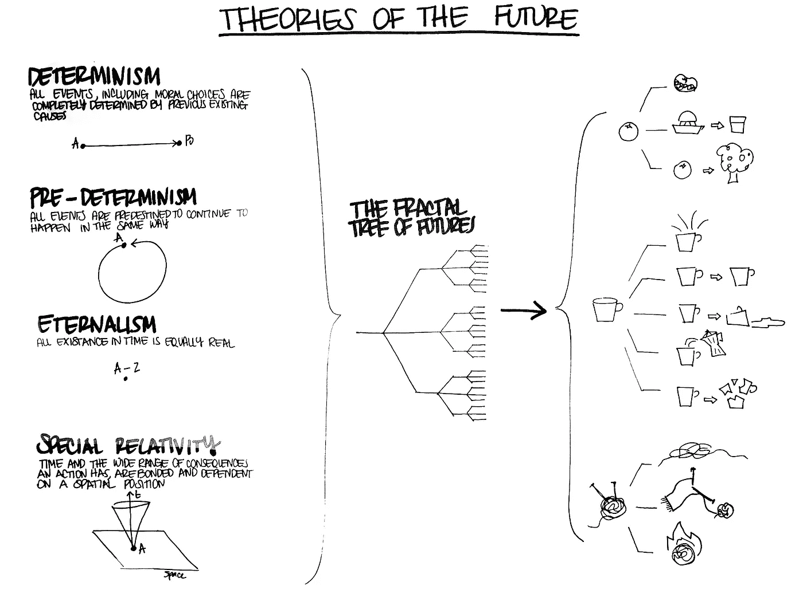
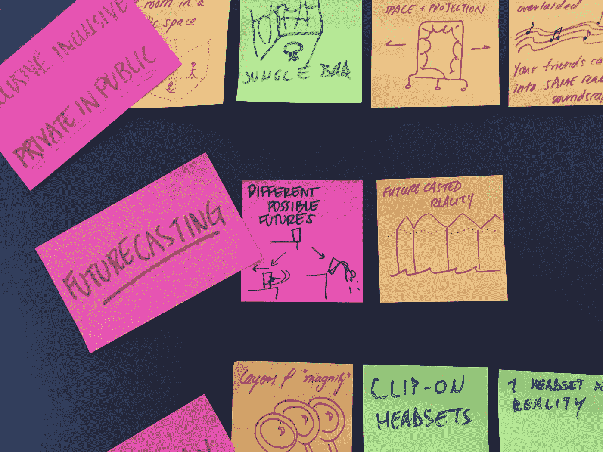
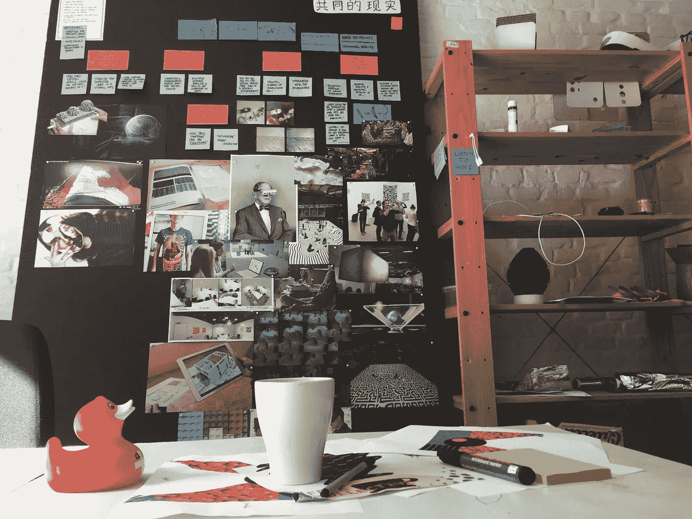
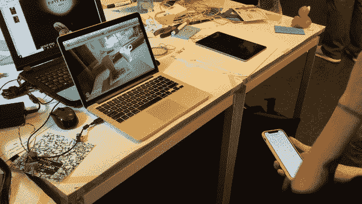
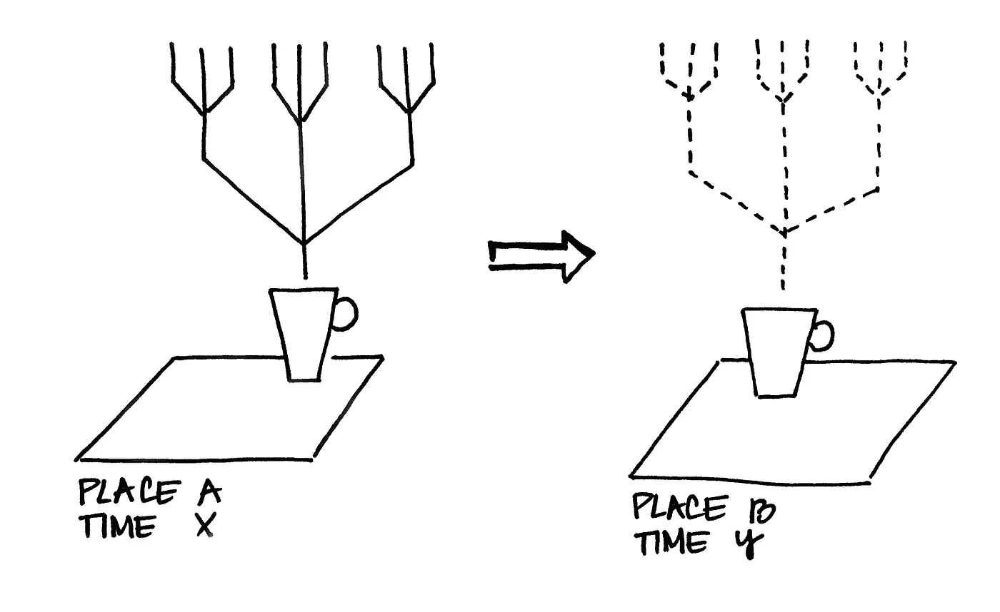
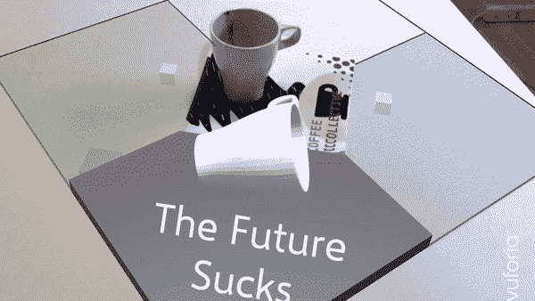
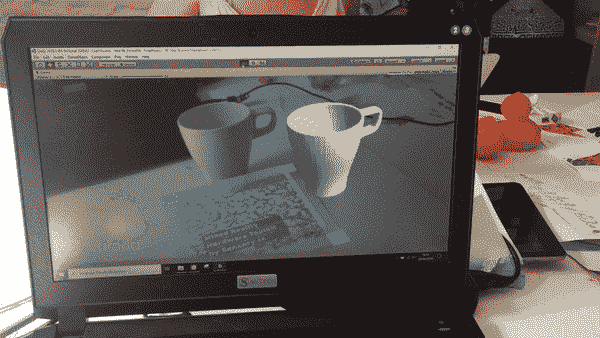

# 未来的教训

> 原文：<https://medium.com/coinmonks/lessons-for-the-future-22e769e296eb?source=collection_archive---------13----------------------->

*未来之窗*，一个由[余婧](https://github.com/nybeath/CIID2018-18_Immersive-Window-to-the-Future)、[米克尔·加莱奥蒂](http://www.linkedin.com/in/micol-galeotti-013a65119)和[萨米·德西尔](http://ciid.dk/education/people/students-2018/sami-desir/)在[哥本哈根交互设计学院(CIID)](http://www.ciid.dk) 由詹姆斯·蒂切诺尔[乔舒亚·沃顿](https://www.sensory.cc/joshuawalton)主持的沉浸式体验研讨会上构思和原型制作的项目。

Window to the Future

**总结**

在为期三周的 AR/VR 深入研究中，我们设计了一个通向未来的 AR *窗口*，它可以读取日常物品的未来，并暗示嵌入在时间和空间中的无限可能性。

该界面旨在为未来提供一个可视化的框架，并翻译物体周围空间导航的启示，从而实现其他未来。*未来之窗*是我们第一次涉足混合现实的媒介，这是我们的过程和一些经验教训。

**简介**

事实证明，未来是一件非常有趣的事情。现在有多少种可能的未来，就有多少种关于时间的 T21 的理论。

Theories of the future

在整个项目中，我们思考了很多关于人们思考时间的不同方式以及人们思考未来的框架。这个来自狭义相对论的想法激发了我们的想象力，即现在是一个点，无限的可能性必须从这个点被限制。我们用一个树形图来推测某一时刻所有可能的未来。像一个杯子离桌子边缘有多近这样平凡的事情可能会改变它的潜在未来，奇怪的是，我们现在如何围绕着杯子思考和行动。

在预测未来的过程中，我们改变了未来。无论是乌托邦还是反面乌托邦，对社会未来的想象都是我们表达对当代现实的恐惧和渴望的常用手段。

未来预测是一种众所周知的企业战略，通过推断当前的趋势和模式来设计问题和识别多年后的机会。用 Sean Rhodes(Frog 的 ECD)的话说，“以一种更开放的方式思考未来，这有助于我们克服固有的固有偏见，这些偏见真正限制了我们对未来的创造性思考。”

统计和概率可能是我们拥有的最接近预测未来的实用模型的东西，也是我们用来理解未来之树的第一个模型。概率帮助我们导航和分类选择，从可能，到合理，到可能，到不可能。

其他更有偏见的框架，如 4 futures 模型或经典的乐观/悲观模型，被用作思考未来前景的启发。

每个未来理论都带来了新的元素和视角，我们在探索 AR 主题时考虑了这些元素和视角，在这个主题中，我们试图找到关于为什么我们在生活中想要或需要 AR 的问题的答案。

> “对我来说，将 AR 构建为沉浸式体验的想法伴随着对现实的挑战——毕竟，有什么比现实更具沉浸感？我喜欢现实，我认为这已经足够了”

**案情摘要**

使用混合现实创建一个展示更美好未来的项目。它应该是一个原型，让人们感觉自己是未来的一部分。

**流程**

在我们项目的初期，我们非常专注于实际应用的设计，AR/VR 的“有用”应用。AR 最明显的价值之一是对上下文信息的承诺。我们最初的想法是使用 AR 和未来预测来帮助解释糟糕的、过于简约的 UI。

这感觉是一个很强的概念，取代了没有人真正使用的用户手册，并以一种非常直接的方式使他们的内容在需要时立即可用。然而，有趣的是，当我们开始开发它的时候，我们遇到了技术上的限制，并揭示了它的含义，这使得它变得更像是在现场演示 UI，而不是展望未来。

所以我们回到构思和讨论，到底是什么让我们发现期货如此迷人。查尔斯·伊姆斯在 1970-1971 年哈佛大学关于新贪婪者的演讲中展示的视频促使我们谈论每一件事情、每一个尺度、每一个时刻的潜力的多样性。

The Norton Lecture, “Good” — Charles Eames (1971)

随着讨论的展开，我们开始做实验，我们从工作桌上拿起一个杯子，开始思考如果能够*看到*投射在它周围的多种可能性，那将意味着什么。

两种方法，控制狂和混沌，出现了导航无限的可能性。

作为一个控制狂，你可以选择你想要看到什么样的未来，乐观、悲观还是现实。使用这种启发法，你可以沿着未来之树前进，看看一种特定的可能性如何演变，并暗示出一种新的未来多样性。

对于团队中的控制狂来说，这个想法显然是优越的，然而，为了使它可以理解，它意味着有必要浏览这个可能性之树，并且理想地，将它可视化。考虑到我们不想依赖基于屏幕的交互范例，在每个交互中解释树被证明是非常难以管理的。

另一方面，混乱的未来更多地关注于潜在可能性中的哪一种会发生的不可预见性。因此，核心是想象，*随机地*，这些选择之一。为了展示不同的可能性，我们决定用一个容易理解的隐喻的物理表现形式:八号球。摇动这个神器，一个不同的未来将会实现。

因为我们发现八球的不可预测性更接近现实的体验，所以我们决定开发混沌 futurecasting，并进行了一轮用户测试。然而，全班发现我们讲的故事不清楚，我们的比喻没有被理解。在美学和执行方面，八号球更像是一个雪球。此外，将球作为一个完全独立的物体进一步削弱了摇动和不同选择的视觉化之间的联系。一个一致的反馈是测试人员努力寻找一个逻辑；他们试图为他们的机构找到与正在发生的事情相关的方向。

我们对这种多样性的混乱表现似乎太混乱了。因此，我们再一次后退一步，试图通过批判的视角来审视我们的概念，剥离所有多余的元素，分离出核心互动:心甘情愿地、有意识地看待事物，以看到其中蕴含的潜在多重未来之一。

**概念**

使用代表未来之窗的 iPad，我们选择看物体，它们是我们周围环境的一部分。该程序将在范围内识别对象，并从预言者所站的独特视角阐述此时此刻嵌入其中的多种可能性。

一旦检测到，会出现一个界面，并显示所看到的未来所属的类别，远处会出现其他元素，以提示进一步的交互。该界面旨在为可视化的未来提供一个框架，并翻译正在被扫描的对象周围的空间导航的启示，这导致其他未来的具体化。

**AR 作为媒介**

在最初的阶段，在构思阶段，我们考虑了很多关于技术限制的问题:即使工程师们正在迅速弥合差距，实现完全沉浸也需要所有感官的参与。无论是由于技术的限制，还是我们对视觉的严重依赖，在这种媒介中，我们的一些感官，特别是触觉和嗅觉被忽视了。

出于这个原因，在我们的过程中，我们的目标是远离 2D UI 常见的屏幕交互范例，并努力将人工干预作为主要的交互方式。人类在展示未来的物体上的行动导致了这种表象所属的多重性不复存在，并创造了一套全新的可能性。

Destruction and creation of the multiplicity of potential futures

然而，直到今天，AR 仍然存在于屏幕上，这是一个问题。

正如 Magic Leap 前用户交互高级总监张辰婕·那不勒斯在 2015 年的 IDSA 会议上所说，“增强现实是一种将计算机生成的图像叠加到用户对真实世界的看法上的技术”。虽然今天它仍然必须通过屏幕的过滤，但事实上，它发生在现实世界和用户的设备之间。

当谈到混合现实时，我们认为数字和虚拟世界将以无缝的方式集成到我们的物理世界中，允许虚拟世界与用户和环境进行交互。然而，数字世界仍然被禁锢在屏幕和设备中，使体验支离破碎，在两个不同的现实之间不断跳跃。

AR 需要一个过滤器，无论是 iPad 的屏幕还是笨重怪异的耳机，这两种解决方案都需要我们妥协我们的部分概念。戴上耳机会使人的手能够自由地干预物体及其电位。然而，戴上耳机会使翻译未来可视化请求的意图性变得复杂。如果我们把这一点想得更极端，这是否意味着你看到的每样东西都会不断地出现它们未来的虚拟副本？否则，我们必须想出一种交互方式来表达观看这些内容的意图，这将使体验更加可控，但仍然与佩戴耳机的人隔离。

出于这个原因，我们选择了 iPad，它虽然仍然是一个过滤器，但提供了更多的共享体验，并允许我们将人与环境的关系作为主要互动。它的存在被隐喻为一扇通向未来的窗户，我们努力将它与人的行为联系起来。事实上，通过提示他们对被扫描物体采取不同的观点和视角，不同的可能未来就出现了。

Joshua Walton 说“有时最好的 AR 交互只是看着”，所以针对一个凝视的界面，我们试图扭转技术限制并将其集成到设计中。

AR 是一个相当新的设计领域，在这个领域中，仍然可以在不尝试的情况下创建和开发东西，但是，通过体验和测试你正在设计的东西，你可以获得巨大的价值，特别是当你试图实现沉浸感时。

很难解释当我们给一个同学看我们的*窗口*时，他们的反应是“这对我来说看起来没什么”。事实上，在那个屏幕上不仅有通过摄像机拍摄的实物。因此，我们开始思考是什么因素让那一刻发生。我们发现了三个:

*   *与环境的联系*:让可能的未来的投影以同样的比例出现，并与未来所属的物体并排，遵守同样的预期法则，使我们更容易理解和接受这种投影是同一物体的替代版本。
*   *物理学:*为了实现虚拟和现实之间的完全融合，并允许数字内容在物理世界中的完全集成，人们生活的体验需要如此无缝，以至于他们需要努力或需要注意区分数字投影和物理元素。事实上，让数字内容按照规范现实世界的相同物理法则运行，使其变得更加强大。

*   *无缝过渡*:当未来的投影出现相机故障*时*，这种效果开始时是第一次迭代中动画的一个 bug，然而在用户测试中，它变成了一个加强未来表现的元素，而未来是不确定和不稳定的。此外，该效果旨在对*窗口*的移动给出微妙的反馈，并在人的能动性和未来投影的外观之间建立联系。

**工具**

> “那些在 AR/VR 中投机的人，那些实际上在 AR/VR 中工作过的人的声音来自一个完全不同的角度，来自那些从外面看的人的声音”——约书亚·沃尔顿

我们在 Unity 中发现的一个巨大价值是我们用来开发未来大部分动画的内嵌物理定律。这简化了我们的工作，因为它让我们有可能以快速简单的方式创建可信且忠实于现实的行为，而不需要一行代码，这对于没有接受过计算机科学培训的人来说意义重大。

我们的原型是在 Unity 中使用 Vuforia 开发的。在 Unity 中编写代码就像打开一盒巧克力，虽然你很确定你会得到巧克力——你不确定是哪一种，有时，盒子是空的。薛定谔的巧克力。玩笑归玩笑，这通常是一个简单的过程，只要你记住一个基本的事情:所有的脚本都是链接的。

无论你编码什么，无论你把它保存在哪里，它都会影响到控制你的 Unity 项目的一个更大的编码系统的一小部分。从初级处理和 Arduino 的世界来看，我们的脚本要么孤立地存在，要么处于非常干净和受控的交互中，这种分层和嵌套的编码方式一直是一个巨大的挑战，尤其是在调试时。

Vuforia 平台也可以利用基本的编码知识。我们使用 Vuforia 中可用的本地脚本，并设法实现了一个复杂的行为，该行为在跟踪的目标图像和丢失的目标图像上发送事件，以初始化场景管理器。

使用 Vuforia 作为工具来实现场景管理是控制时间敏感动画的一个好方法，然而，与任何类型的再利用一样，它也有自己的缺点。它的扩展跟踪已被证明是一件好事也是一件坏事，它提供了一个非常健壮的基准跟踪，有时甚至太健壮了，因为当用户看向别处时，跟踪丢失没有实现。这导致场景粘在视窗上，破坏了我们的沉浸感。虽然我们确信可能有聪明的方法来绕过这些限制，甚至编写我们自己的基准跟踪系统——考虑到本课程的时间和知识限制，这对我们来说似乎是不可能的。

**未来预测的未来**

如前所述，在我们的原型中引入 UI 是我们对更清晰理解的要求的回答，以帮助用户代理，它包括标记不同的未来选择。当我们考虑控制狂版本时，以及当讨论在用户界面中指示的类别时，我们都遇到了几个冲突的时刻，问题是关于我们在谈论未来时想要使用的语气。我们被分成两类，一类是非常客观公正的声音，另一类是有目的地注入我们自己的偏见。

这就是我们开始思考的时候:什么时候用个性和偏见来设计是合适的？对于 AR 来说，答案取决于产品及其用途，对于未来的预测，我们仍未做出决定，意见相当分歧。我们选择了一组隐含着明显偏见的类别，我们充分意识到人们可能不同意我们的框架。这就是我们的目标，用我们的原型引发关于未来的对话。

希望这些讨论不仅围绕着可能性，而且围绕着我们生活的环境中的每一个元素的潜力。如果这可以成为某种创意工具，为其他设计师提供灵感和创新，那就太好了。

潜力是无限的，尤其是因为它的部分使用方式取决于使用它的人。

我们认为，在构思过程中，我们被未来预测作为一个主题所吸引的原因之一主要是因为我们与 AR 的潜在价值进行了斗争，我们努力寻找这种媒体可以在上下文模型中带来外部信息的吸引力。“很难想象一个有 AR 的世界会比没有 AR 的世界更好”，这可能是因为我们还没有到那一步。

对我们来说，这项技术太新了，以至于我们不能完全理解它的含义。我们没有停留在推动 AR 尝试创造有价值的东西的思维模式中，而是努力尝试这种媒体来引发对话并发现它的可能性。