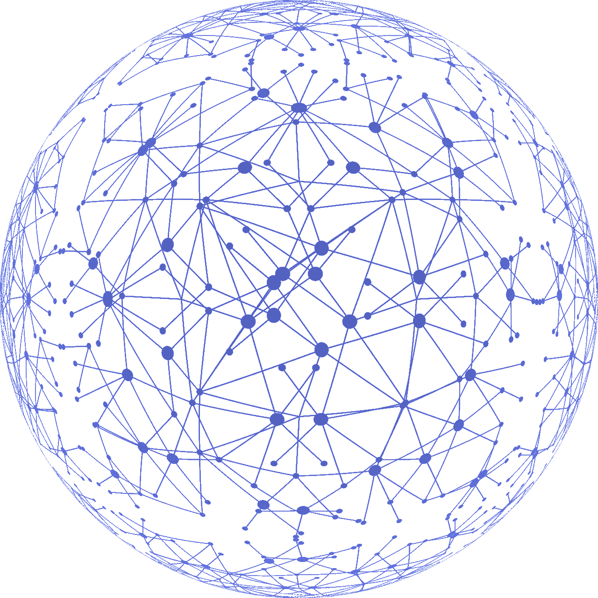
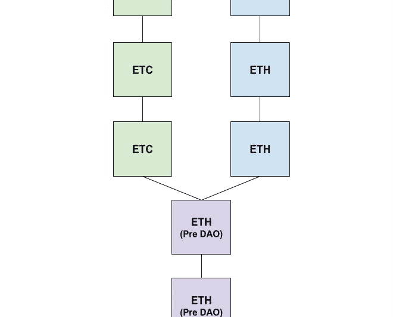
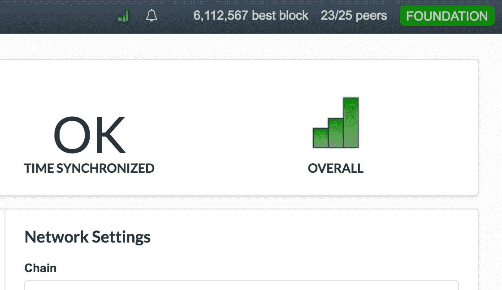

# 去中心化的教训:运行完整节点的好处

> 原文：<https://medium.com/coinmonks/lessons-in-decentralization-the-benefits-of-running-a-full-node-35bf98febad7?source=collection_archive---------2----------------------->

我曾经认为挖掘节点是唯一重要的节点类型。毕竟，真正的区块链总是拥有最多工作证明的人，对吗？

[在我最近失去了一个 twitter 牛肉](https://cryptodigestnews.com/is-ethereum-as-decentralized-as-bitcoin-4cbb5c3bffa9)后，我意识到我严重低估了运行一个非挖掘节点的价值。在这篇文章中，我将描述一个完整的节点做什么，它如何增加网络的安全性，以及它如何给你，用户，更多的自主权和控制权。

注意:在这篇文章中，我将主要以以太坊为例来讨论节点。这些信息的大部分(但不是全部)也适用于比特币。

# **非挖掘节点如何帮助你**

[在我之前的帖子](https://cryptodigestnews.com/is-ethereum-as-decentralized-as-bitcoin-4cbb5c3bffa9)中，我讨论了我是如何意识到我依赖第三方如[以太扫描](https://etherscan.io/)、[我的以太钱包](https://www.myetherwallet.com/)和 [Infura](https://infura.io/) (Metamask)来访问区块链的。尽管他们在用户加密方面做得非常出色，但这些服务仍然是失败的主要原因。区块链技术的一个重要租户正在消除一个人对第三方的依赖，因为他们是失败和控制的中心点。

下面的文字描述了运行一个节点可以增加你的自主性的方法。

## **不再需要信任第三方来发送交易**

当你使用 MyEtherWallet 和 Metamask (Infura)等服务时，你相信它们会将你的交易转发到以太坊区块链。您相信您对这些服务的访问永远不会被切断。

如果你运行自己的节点，你可以直接把你的事务分发给以太坊网络中的对等体，因为你自己就是一个对等体。

## **不再需要信任第三方来验证以太坊交易**

当您使用以太网扫描验证交易时，您依赖以太网扫描来了解区块链的真实状态。通过运行一个完整的节点，您的笔记本电脑上就有了区块链的全部历史。您不需要第三方来验证交易。你可以自己验证一下！

## **有助于增加你的隐私**

如今，隐私感觉像是越来越稀缺的资源。

Nicolas Massart 声称，如果你使用第三方将你的交易发送到区块链，访问你的互联网日志的人可以使用元数据来识别你的公钥，从而识别你在区块链的活动。

当你通过同步节点发送交易时，Nicolas 建议更难( **但并非不可能**)追踪你在区块链上的活动。

## **哪个叉子是真链你有发言权。**

2016 年 6 月[道](https://en.wikipedia.org/wiki/The_DAO_(organization))被黑，360 万以太被“偷”出道智能合约。以太坊社区成员组织了一个 [fork](https://www.investopedia.com/terms/h/hard-fork.asp) 活动，将被盗资金物归原主。然而，对于社区中的少数成员来说，这是一种意识形态上的不，这是一种隐秘的亵渎。

以太坊有效地改写了区块链的历史，违反了区块链科技最重要的特征之一:不变性。

运行一个节点让用户有权选择他们认为哪个分支是真正的以太坊。尽管它后来被称为以太坊经典，但对许多用户来说，它始终是真正的以太坊。

经营“以太坊经典”的区块链人也在关键时期支持以太坊经典。如果您在分叉时正在运行以太坊经典节点，那么您正在帮助将有效的事务和块传播到整个对等网络。

## **选择叉子的注意事项**

通过在分叉过程中运行一个节点，您可以选择真正的区块链，但这并不意味着您的令牌的值将保持不变。你的分叉代币的价值是由你无法控制的市场力量决定的。

拒绝硬分叉也可能对你的区块链的安全有影响。Hashpower 通过使双重花费攻击难以得逞来增加网络的安全性。hashrate 低的网络更容易受到双重开销攻击。

**奖励材料**:了解更多双倍花费攻击！

*   看我关于 [PoW](/@julianrmartinez43/understanding-proof-of-work-part-1-586d7ee6b014) 和[双花攻击](/coinmonks/understanding-proof-of-work-achieving-consensus-and-the-double-spend-attack-f822ab68e20b)的文章。
*   阅读关于比特币黄金的真实[双倍消费攻击。](https://www.ccn.com/bitcoin-gold-hit-by-double-spend-attack-exchanges-lose-millions/)

# **非挖掘节点如何帮助保持协议分散**

This is the UI for a Parity Node. This node has achieved consensus.

## **执行共识规则**

非挖掘节点对网络没有贡献散列能力，但是它们仍然对网络安全有贡献。他们通过确保所有节点都遵守共识规则来做到这一点。

节点通过在整个对等网络中仅发送**有效**块和未决(未确认)事务来确保共识规则得到遵守。如果一个节点接收到一个无效块，节点不仅会拒绝将该块包含在它们的本地区块链中，**它们还会拒绝将该信息传递给它们的对等节点。**

## **帮助同步其他节点**

通过运行一个节点，你可以帮助其他人成为对等网络中的一个节点。

为了完全同步节点，您需要有关区块链状态的数据。那么这些数据存储在哪里呢？和你的同龄人。

当您运行一个节点时，您连接到以太网中的其他对等点(节点)。我正在运行的奇偶校验节点在任何给定时刻最多连接 25 个对等节点。

对等机通过以下方式帮助彼此同步:

*   共享以太坊网络中的所有历史块和状态
*   共享在网络中挖掘的最新块。

# **未来文章**

我确信，运行自己的节点对于实现真正的去中心化极其重要。我非常自豪地声明，我终于成为了对等网络中的一员！我运行的是完全同步的以太坊节点。

尽管取得了这一成就，我仍然不知道如何验证交易。其次，**看起来**创建节点的目的是主要通过[命令行接口](https://en.wikipedia.org/wiki/Command-line_interface)使用。奇偶性确实有用户界面，但是感觉很有限。

最后，我没有运行一个存档以太坊节点:我运行的是一个修剪过的以太坊节点。我还在了解这种节点的局限性。

在以后的文章中，我将进一步探讨这些想法，最终目的是给你关于如何运行你自己的节点的简单信息。我不仅想帮助您运行自己的节点，还想帮助您了解如何使用它。我想帮助你增强你的自主权，为真正的分权做出贡献。

感谢阅读！

## 我错过了这篇文章中的一个重要细节吗？让我知道！

运行自己的节点的其他重要原因是什么？

运行完整节点对您还有什么好处？

运行完整节点还能如何支持以太坊网络？

## 喜欢你读的吗？在 Twitter 上关注我！

> [在您的收件箱中直接获得最佳软件交易](https://coincodecap.com/?utm_source=coinmonks)

