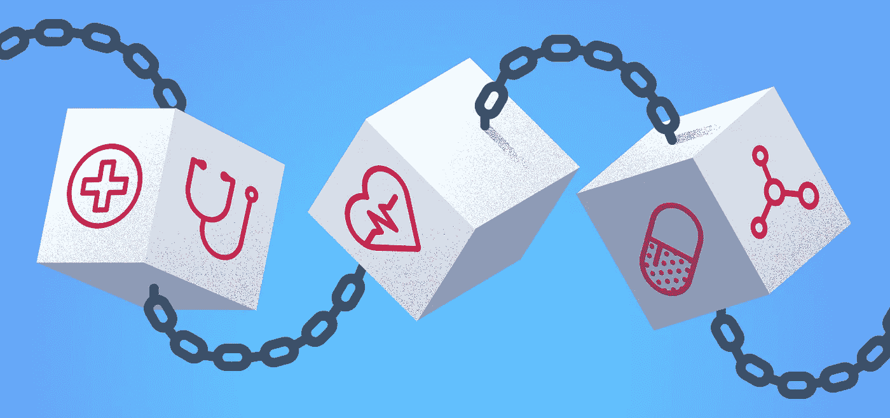
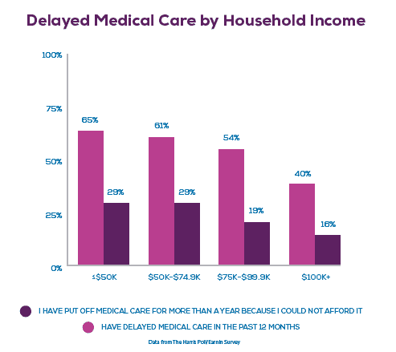
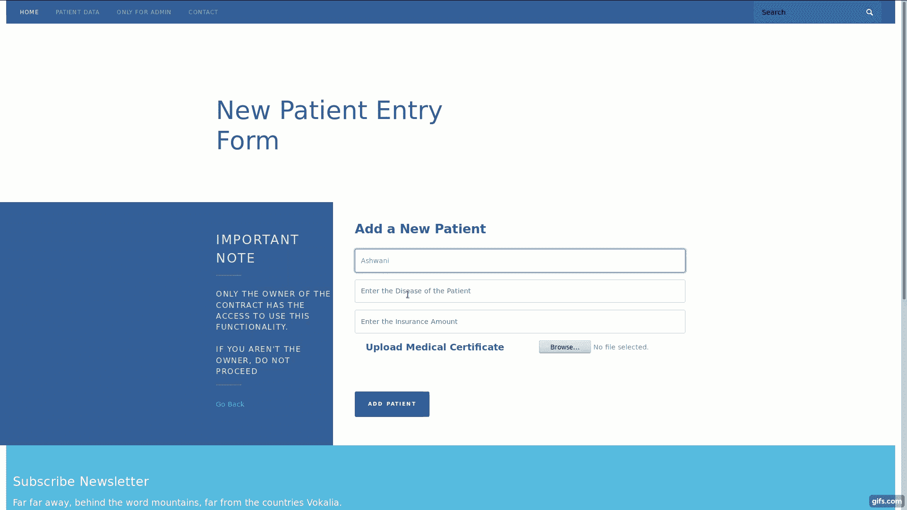
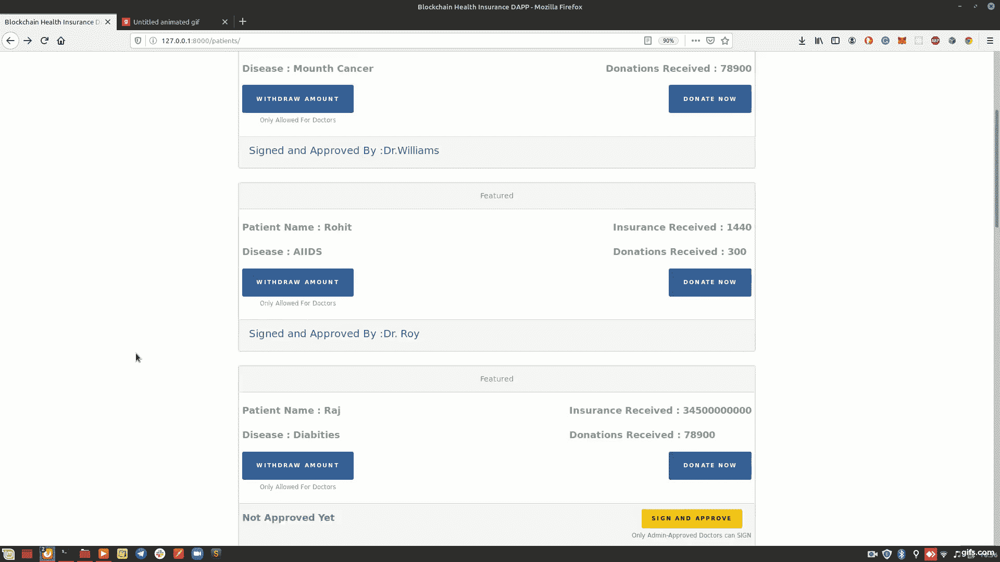
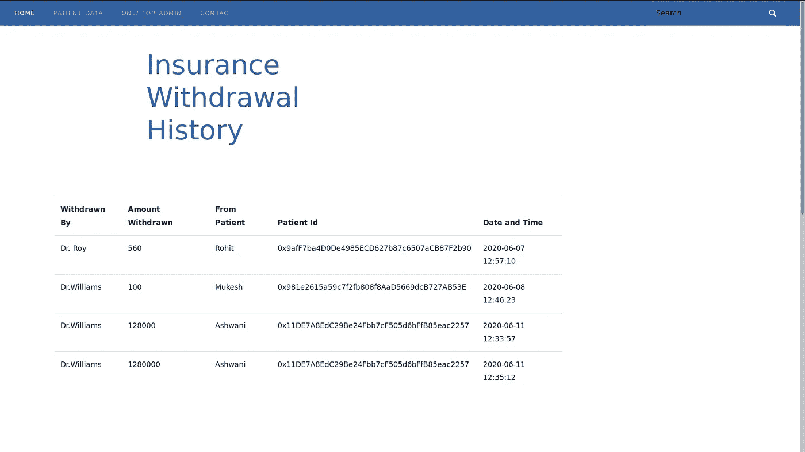
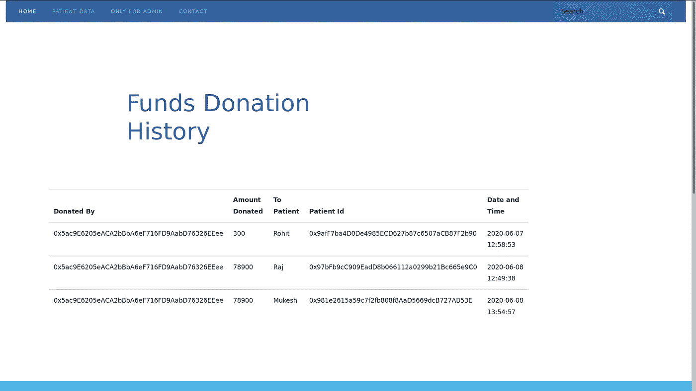

# 让智能合约照顾你的健康

> 原文：<https://medium.com/coinmonks/let-smart-contracts-take-care-of-your-health-f5898ce05443?source=collection_archive---------1----------------------->

pic credit: stormventures.com

自 2008 年发布长达 8 页的比特币白皮书以来，世界一直在见证区块链对众多不同领域的破坏。非常幸运的是，区块链在所有这些领域都比现有系统更加有效。

一个真正需要区块链彻底转型的行业是医疗保健。

虽然这在当时可能是一项非常麻烦的任务，但利用区块链无疑可以提高医疗保健行业的效率。

因此，当我说-

> 是时候让智能合同来照顾我们的健康和医疗保险了。

万一你不同意， ***给点时间，你会的。***

# 但是为什么…但是怎么做？

现在，当我们谈论用区块链和智能合同改变整个行业时，很明显，一个人的大脑中可能会出现过多的问题。

如果你也是这种弹出窗口的一员，让我们先深入了解一下 ***为什么是*** 。

> [在 CoinCodeCap 上购买最佳加密交易](http://coincodecap.com/)

## 为什么选择智能合约和区块链？

**卫生领域的混乱**

说实话，医疗保健行业是少有的几个我们不能承受任何混乱的行业之一。医疗保健行业最迫切的需求之一是组织有序、透明可靠，因为我们的生命危在旦夕。

不可否认的是，医疗数据对任何患者都至关重要，但不可否认的是，现有系统无法确保适当管理和安全处理如此庞大的数据。

此外，考虑到患者的医疗数据不仅仅是一张纸，而是几个文档、x 光片、图像等的集合，并且这些关键数据通常分散在多个医疗机构的多个数据库中。

在这一点上，区块链以其惊人的特点像

*   *不变性*
*   *消除控制中心点*
*   *强大的数据完整性*
*   *全网络公共问责等*

已经被证明是最可靠的工具，可以用来改变现有的医疗保健。

事实上，有了星际文件系统(IPFS)，存储医疗文件、图像等将比我们现在存储的方式更有效。

医疗保健行业的这个问题仅仅代表了该行业中适当的存储系统的问题。然而，目前的医疗保健和医疗保险领域仍然存在一些重大问题。

**财政问题**

这个部门的第二个问题是当前医疗保险世界的范式和患者的财务解决方案。

随着科技和医学的进步，很明显，不是每个病人都能负担得起昂贵的医疗设施。不幸的是，这是大多数人的情况。

Source: [https://www.cnbc.com](https://www.cnbc.com/2018/11/29/over-half-of-americans-delay-health-care-becasue-they-cant-afford-it.html)

根据一项 [CarePayment Research 调查](https://www.carepayment.com/new-carepayment-research-shows-americans-cant-afford-medical-bills/)，非常清楚地发现几乎 ***64%的美国患者因为高昂的费用而避免或推迟任何医疗护理。***

而其中 61%的人甚至连医疗费用都想不起。

**其他国家的这一数据保持不变，甚至更糟。**

虽然保险和捐赠确实帮助患者获得了最好的医疗设施，但在这个过程中仍然存在着一个庞大的多层中间商链。

此外，我们必须信任特定的中央机构或组织以及所有此类医疗保险部门中的中央数据库。因此，始终存在安全、金融数据操纵和资金损失的持续威胁。

这就是*智能合约发挥重要作用的地方，因为它完全消除了信任第三方来执行、维护或提供资金的任何理由或需要。*

这些契约不仅独立操作，而且保持参与者提取或捐赠资金的不变记录，同时维护限制网络中参与者对某些特征的可访问性的控制系统。

## 智能合同如何改变医疗保健行业？

现在，这确实是一个迫切的问题。

智能合约能够彻底改变这个行业的方式，需要的不仅仅是理论上的解释。

**因此，让我们扩展我们的界限，理解我编写的一些可靠性代码，以开发一个智能合同，解决医疗保健部门的一些问题。**

相信我，不无聊！

> **注意:**为了完全理解这些代码，你需要对 Solidity 编程语言有一些基本的了解。
> 
> 然而，由于我将解释整个代码，您仍然可以继续。

# 理论够多了，让我们编码吧

## 声明状态变量

Solidity 中的状态变量是那些永久存储在区块链上的变量。

> 理解状态变量的最佳方式之一是将它们视为硬盘或 SSD，因为即使智能合约不处于执行状态，它们也会保留其值和空间。

可以很清楚地看到， *pidCount、withdrawCount 等*是我定义的一些状态变量，稍后会用到。

***什么是可拥有合同？***

这段代码中需要适当解释的部分位于第 3 行和第 5 行。

在第 3 行中，我们只是从***openzeplin 中导入了一个更可靠的名为 ***Ownable.sol*** 的契约。*** 在第 5 行中，我们使用 **is** 关键字简单地继承了这个契约。

**为什么？**

如前所述，智能合同旨在为医疗保健安全提供高级别的安全性，因此它确保网络中并非所有参与者都可以访问智能合同的每项功能。

这意味着 ***可能有些功能只有医生才能访问，而其他功能只有捐赠者或患者才能访问。***

因此，为了实现这个安全层，我们使用 Ownable.sol 契约来限制网络上的特定节点访问特定的功能。

**设置结构**

Solidity 中的结构与其他编程语言中的 ***类*** 非常相似。

它们只是用来定义特定实体应该具有的属性。

例如，在上面的片段中，我们在网络中有不同的参与者或实体，并提到了它们将具有的属性。

**使用映射存储数据**

映射是一种存储数据的方式，类似于哈希映射。

这些是提升键值对存储系统的数据结构。

例如，第 4 行中的映射，即***【pati enlist】***被存储为键值对，其中每个不同的地址对应于网络中的不同患者。

## 这个智能合约提供了哪些功能？

好吧！现在最有趣的部分来了。

我们现在将研究这个智能合约可以执行的功能。

**1。在区块链中添加新患者**

这个函数基本上获取了一些关于病人的信息，如姓名、疾病、病人的保险金额，以及图像或医疗文件的 IPFS 散列，一旦我们将文件上传到星际文件系统，这些信息就会出现。在这里阅读更多关于 IPFS 的信息。

此外，该函数只能由智能合约的所有者调用。

此功能执行的任务:

*   **生成患者的唯一 ID:** 正如您在第 5 行中看到的，我使用了 keccak256，这是一种散列算法，它返回一个完全唯一的散列。该散列成为网络上特定患者的身份。
*   **增加保险金额:**第 9 行为患者增加初始保险金额(msg.value)。这些资金以后可以用于病人的医疗费用。
*   **增加患者计数:**最后，我们简单地将第 12 行的患者计数增加 1，每增加一个患者到区块链中。

**2。添加新医生**

该函数与上面的 ***setPatient()*** 函数非常相似。

此功能也只能由智能合约的所有者访问。

**3。医生的数字签名**

这个功能在合同中也起着重要的作用。

在向区块链添加新患者时，没有医生被分配给患者。

然而，这是在特定医生彻底检查了患者的病历并调用该函数之后进行的。

> 注意:该功能只能由网络中的医生调用。

Doctor’s Digital Signature

***一旦医生对患者的唯一 Id 文件和签名感到满意，该特定医生就会被分配给患者。***

***该医生现在将有权使用患者的资金，并且他/她将是唯一一个从该患者账户中提款的人。***

关于 ***取款功能*** 的更多说明如下。

**3。从病人身上取钱**

这是智能合同中最重要的部分之一，因为它处理网络中的货币交易。

更简单地说，该函数被设计为只接受患者的 Id 和金额作为输入，并将该金额转移到医生的帐户。

然而， ***考虑到整个资金交易将在智能合约内进行，不涉及任何第三方，该功能需要确保在执行该功能期间不存在安全威胁。***

因此，为了确保安全可靠的资金转移，我们确实需要在函数中设置某些检查点。

*让我们深入了解一下这个函数如何确保安全性:*

***功能中的 3 个主要检查点***

在开始执行之前，该函数需要满足三个主要条件才能继续执行。此外，如果这些条件中的任何一个失败，整个功能将停止。

*5、6、7 号线的 3 个条件如下:*

*   **只有医生:**根据这份合同，网络中唯一可以提取患者基金的参与者就是医生。因此，如果其他任何人调用这个函数，执行就会停止。
*   **仅指定的医生:**由于网络内可能有多名医生，因此确保从特定患者账户中提取的金额只能由指定给该患者的医生完成至关重要。否则，执行停止。
*   **可用资金充足:**还必须检查患者账户中是否有医生要求提取的金额。

一旦这三个条件都得到满足，该函数就会继续执行资金转移的主要任务。正如第 10 行到第 12 行清楚显示的那样，从病人的账户中扣除该金额，并将其添加到医生的账户中，以便满足病人的医疗费用。

**将整个交易存入区块链**

该功能在传输后不会停止。事实上，一旦事务完成，该函数就执行一个最迫切的任务。

然后，它将整个取款历史( *li* ne *no. 16* )存储到区块链中，其中包括收到资金的医生、资金被取走的患者、交易时间、转账金额等。

*因此，该功能不仅确保了交易的安全，而且维护了交易的正确分类账，该分类账是不可变的，并且在将来不能被篡改。*

**向患者捐款**

网络中的所有参与者都可以使用这一功能，因为向需要资金的患者捐赠资金没有任何害处。对吗？

***该功能执行的任务:***

*   **检查捐赠者的可用余额:**在最开始，该功能确保向患者捐赠资金的人已经有足够的资金。嗯，这是一个至关重要的关卡。不是吗？
*   **资金转移:**一旦条件满足，资金从供体转移到患者身上。
*   **存储捐赠历史:**好吧，我们不能在区块链上不存储整个捐赠历史就结束这个功能。

这是因为

> 有了钱，就有了潜在的安全威胁。

# 是总结的时候了

智能合约确实拥有改变各个行业的潜力。*以防万一你想了解更多，去这篇文章* [*为什么智能合约正在吞噬大部分预先存在的金融服务行业？*](/coinmonks/why-are-smart-contracts-engulfing-most-of-the-pre-existing-financial-services-industries-7c3151344d2c)

嗯，我在这篇文章中所涉及的只是智能合同如何以我们无法想象的方式改变现有医疗保健行业的一个小演示。

此外，我已经用 Web3 将这个智能契约连接到前端，并在 Django 中创建了一个[完整的去中心化应用程序。](/coinmonks/how-i-integrated-django-with-blockchain-and-built-a-decentralized-application-dapp-f104ae551e12?source=---------5------------------)

因为不可否认的事实是，我们仍然有很多方法可以升级这份合同，并增加更多的功能。

因此，请[在 Github](https://github.com/zaryab2000/MediCare-Chain) 上贡献自己的一份力量来进一步完善这份合同。

干杯！

> [直接在您的收件箱中获得最佳软件交易](https://coincodecap.com/?utm_source=coinmonks)

