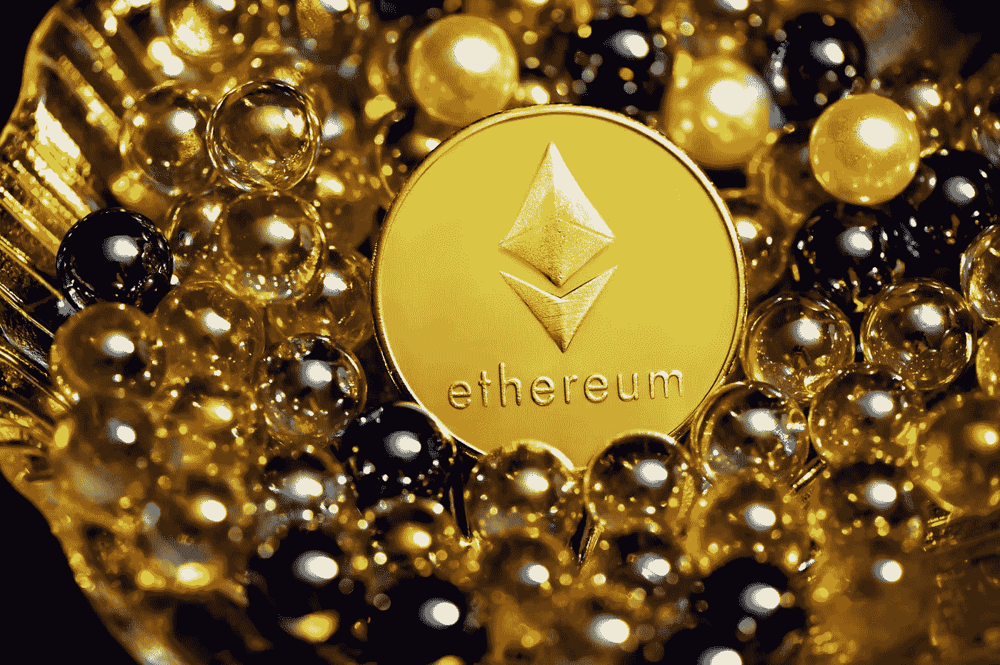

# 让以太坊超级周期开始吧！

> 原文：<https://medium.com/coinmonks/let-the-ethereum-supercycle-begin-cdbf8180a522?source=collection_archive---------3----------------------->

## 为什么 ETH 可以看到 5000-12000 美元

Photo by [Executium](https://unsplash.com/@executium?utm_source=unsplash&utm_medium=referral&utm_content=creditCopyText) on [Unsplash](https://unsplash.com/s/photos/ethereum?utm_source=unsplash&utm_medium=referral&utm_content=creditCopyText)

在我的文章“[我们是否正处于以太坊超级周期](/coinmonks/are-we-in-the-midst-of-an-ethereum-supercycle-be0b7eb75cf4)之中”中，我分析了以太坊在其“第三个周期”(也就是以太坊版本的比特币减半周期，其供应被切断)前后的价格走势。)

我注意到一个重要的观察，以太坊的第三个牛市周期(和第二个第三个周期)将在…