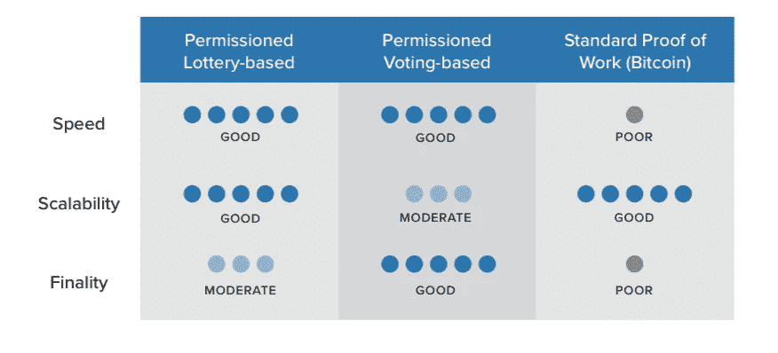

# 让我们达成一致意见

> 原文：<https://medium.com/coinmonks/lets-agree-about-the-consensus-ee792e50e073?source=collection_archive---------0----------------------->

Source: [https://brandimpact.wordpress.com/2011/01/18/consensus-or-progress/](https://brandimpact.wordpress.com/2011/01/18/consensus-or-progress/)

对我来说，这是在企业环境中开发区块链或分布式总账解决方案的关键设计决策之一。选择错误的共识算法可能会影响效率、性能、交易率、潜在漏洞、成本和产品所需的基础设施。

*“共识算法是计算机科学中的一种过程，用于在分布式过程或系统中就单个数据值达成一致。共识* [*算法*](http://whatis.techtarget.com/definition/algorithm) *设计用于在涉及多个不可靠节点的网络中实现可靠性*【1】。简而言之，共识算法负责**使分布式账本技术(DLT)工作，确保其容错**。但是如何为我的项目选择最佳共识呢？到目前为止，针对 DLTs 提出了许多不同的算法，每种算法都有各自的优缺点。让我们快速地看一下它们，这样你就有了一张“**DLT 共识算法的备忘单。**

*   **工作证明**:卓越的共识算法。不是因为它是最好的，而是因为它是第一个在区块链实施的。具体在比特币，并且是目前运行在比特币和以太坊上的。在工作证明中，**矿工们通过比赛解决一个极其困难的密码难题**来竞争添加链中的下一个块(一组交易)。第一个解决难题的人，因不便(以及在此过程中消耗的能量)而获得一些比特币。十年来，比特币在生产过程中一直是安全的(看看比特币就知道了)。然而，它有两个主要缺点:**其吞吐量相当低，并且挖掘所需的计算能量非常大**，因此不适合于中到高吞吐量的解决方案或高性能/效率的产品。
*   **利害关系证明**:工作证明的潜在继承者。以太坊已经基于这一共识发布了测试网。在这种共识算法中，一个**“验证者”投资于系统的硬币，而不是投资于昂贵的计算机设备来开采区块。作为赌注的证明，你被选中创建下一个区块的机会取决于你拥有的系统中硬币的比例**(或预留用于下注)。拥有 300 枚硬币的验证者被选中的可能性是拥有 100 枚硬币的人的三倍。这种共识更加节能，而且事实上，矿工们不需要解决难题，**允许更高的产量。然而，由于网络中的每个节点都是潜在的验证者，我们可能会面临“[无利害关系](https://www.coindesk.com/ethereum-casper-proof-stake-rewrite-rules-blockchain/)”问题，其中节点迫使分类帐中的分叉在验证过程中赚取双倍。还有其他可选的容错一致性算法(不是严格意义上的 PoS ),例如 IBFT，其中在块提议阶段，不是每个节点都是候选节点。到目前为止，对拜占庭容错共识和 PoS 算法的修改似乎是公司环境和财团的最佳解决方案，其中效率和性能很重要，节点是“可信的”。下一个要点将详细介绍这一点…**
*   **从分布式系统继承的共识**:对于企业环境来说，有一个新的趋势，即**来自分布式系统的传统同行评审共识算法正在被恢复、修改和实现用于 DLT**。事实上，它们是经过同行评审的，这意味着它们经过了充分的研究和测试。其中一些甚至已经用于生产系统中。目前 DLT 最常用和首选的是 **RAFT (Quorum，etcd)、BFT/IBFT (Quorum，Hyperledger)、Paxos (Neo4j，Hyperledger)** 等。它们可能是工业区块链的良好候选者，**在工业中，为了更高的性能、效率、安全性和吞吐量，牺牲了一些信任。**
*   **活动证明**:活动证明是一种混合方法**结合了工作证明和利益证明**。根据块验证过程中的阶段，它使用一个或另一个。它从工作证明的角度解决了“公地悲剧”问题，然而，我们仍然有低吞吐量和高能耗的问题。
*   燃烧证明:有了燃烧证明，你不用把钱投入昂贵的电脑设备，而是通过把硬币送到一个无法找回的地址来“燃烧”它们。通过将您的硬币提交到永不永不岛，您将获得终身特权，可以根据随机选择过程在系统上采矿。
*   **经过时间证明**:这个系统的工作原理类似于工作证明，但是耗电少得多。该算法不是让参与者解决密码难题，而是使用可信执行环境(TEE)——如 SGX——来确保块以随机抽签的方式产生，但没有所需的工作。因此，根据在每个节点中选择的随机超时，每个参与者同样有可能被选择用于下一个块的提议。**这种共识算法和其他基于随机的共识算法已经在 Hyperledger 中实现和评估。**

但问题是， ***我能选择共识算法在我的区块链技术上运行吗？诚然，就目前而言，你无法改变比特币使用的共识算法。然而，**所有为企业环境设计的区块链技术已经可以让你插入你想要的共识。**定额组，超账本，甚至以太坊都是这种情况。因此，在设计我们的区块链解决方案**时，我们不需要适应特定的共识算法来支持我们的分布式账本**，但是我们可以选择最适合我们用例的算法。这为 DLT 系统的设计提供了额外的自由度。通过这一点，我们可以同时对系统的安全性、性能和吞吐量采取行动，而不是适应“设计强制”的区块链共识的细节(尽管这是有限制的)。***

尽管如此，从头开始设计一个一致的算法确实非常困难。在这方面已经有很多学术研究，这就是为什么我建议，除非你的团队中有一个分布式系统的专家，并且你知道你在做什么，否则**为你的系统使用一个众所周知的、经过测试的、最好是同行评审的共识算法的实现。**

下图描述了**根据三个主要特征**对不同类型的共识算法进行的总结比较(例如，PoS 和 BFT 基于投票，而耗时证明基于抽签)。在为您的系统评估最佳一致性算法时，这是一个良好的开端。

Comparison of consensus algorithms (Source: Hyperledger Documentation)

在接下来的文章中，我将介绍一些为特定项目或用例选择最佳共识算法的步骤示例，敬请关注！。

[1][http://whatis.techtarget.com/definition/consensus-algorithm](http://whatis.techtarget.com/definition/consensus-algorithm)

[2][https://www . coin desk . com/short-guide-区块链-共识-协议/](https://www.coindesk.com/short-guide-blockchain-consensus-protocols/)

> [在您的收件箱中直接获得最佳软件交易](https://coincodecap.com/?utm_source=coinmonks)

