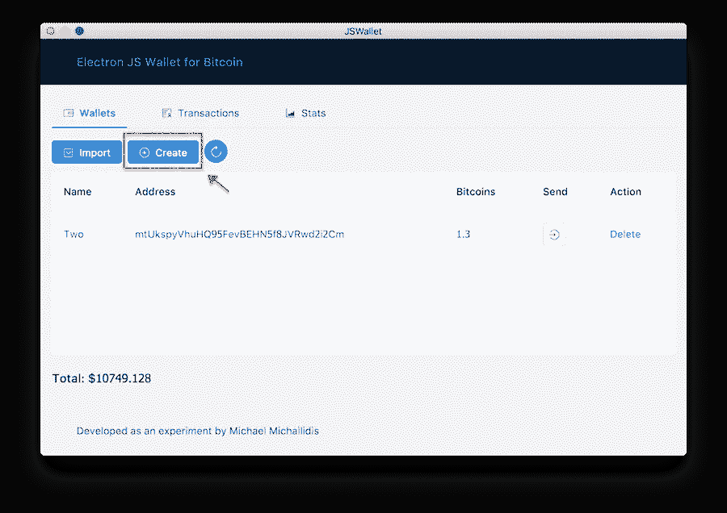
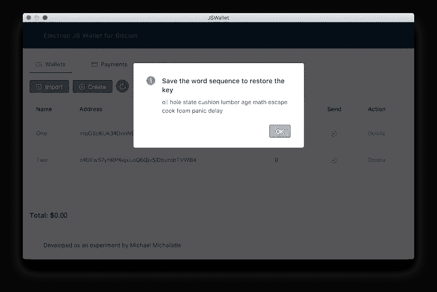
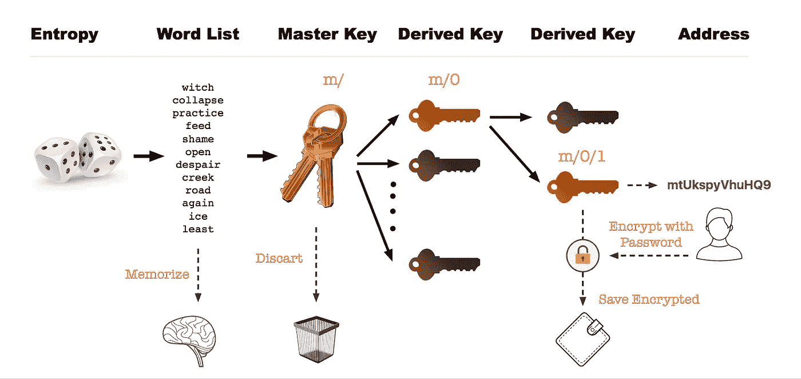
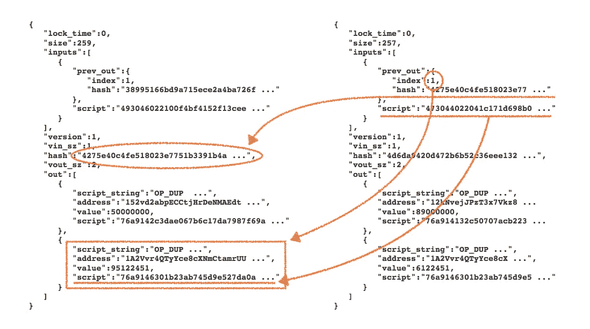
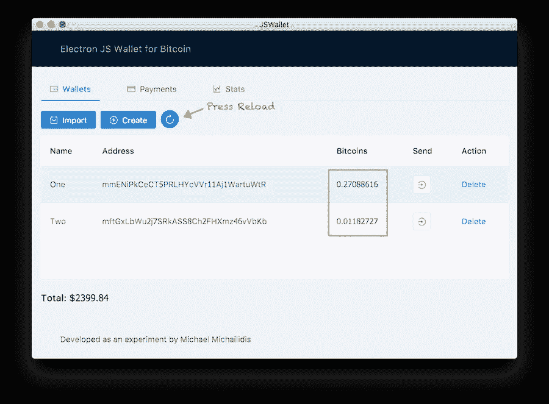

# 让我们在 Electron + React.js 中创建一个安全的高清比特币钱包

> 原文：<https://medium.com/coinmonks/lets-create-a-secure-hd-bitcoin-wallet-in-electron-react-js-575032c42bf3?source=collection_archive---------0----------------------->

(完整代码托管在 [GitHub](https://github.com/mmick66/jswallet) 上)


当这个星球正准备迎接一个激动人心的加密未来时，我们，开发者们也在紧跟技术的发展。由于仍然很少有关于区块链编程的帖子，我决定写一个成熟的高清比特币钱包作为一个[电子](https://electronjs.org/)桌面应用程序，在这个过程中教会自己和他人。

> 还念:[最佳比特币硬件钱包](/coinmonks/the-best-cryptocurrency-hardware-wallets-of-2020-e28b1c124069)

> 本文的目的不是加深我们对电子、反应或蚂蚁的了解，而是探索比特币。出于这个原因，任何 UI 或交互性代码都被省略了，应该直接从 GitHub 上的源代码中查看。请[立即下载回购协议](https://github.com/mmick66/jswallet)并将其作为本文的附件打开，因为我将引用代码，而不是粘贴到这里。

# 打造我们的第一款钱包

[下载](https://github.com/mmick66/jswallet)并运行示例应用程序。



Application Screenshot for Creating Wallets

示例应用程序的第一个选项卡包含我们创建地址、接收比特币并将其发送到另一个地址所需的所有功能。其他两个大多是绒毛，因为我只是觉得有必要创造一些更完整的东西。

创建钱包的第一步是创建一个[密钥对](/@vrypan/explaining-public-key-cryptography-to-non-geeks-f0994b3c2d5)。按下“创建”将调出一个模式面板，其中包含一个带有必要字段的表单。现在，在一些例子中，你可能会看到这样的东西:

```
constbitcoin **=** require**(**'bitcoinjs-lib');
const keyPair = bitcoin.ECPair.makeRandom();
const address = keyPair.getAddress();
```

这确实是创建密钥对和地址的最简单的方法，但它并不真正完整。现代实现使用一种方法，通过这种方法，在创建密钥时使用的初始随机性(熵)被序列化为一个**助记短语**并被保存，以便它可以在以后用于重新创建密钥。这在从一个钱包向另一个钱包导入密钥和恢复丢失的密钥时非常有用。

```
*/* file: wallet.class.js 
 * methods: generate, create */*constmnemonic = bip39.generateMnemonic();

constseed = bip39.mnemonicToSeed(mnemonic);
constmaster = bitcoin.HDNode.fromSeedBuffer(seed);

constderived = master.derivePath("m/44'/0'/0'/0/0");
constaddress = derived.getAddress();
constprivateKey = derived.keyPair.toWIF();
```

现在，发生了很多事情。一个[助记符](https://en.bitcoin.it/wiki/Mnemonic_phrase)只是一个随机数，呈现为取自 [bip39](https://github.com/bitcoin/bips/blob/master/bip-0039.mediawiki) 中定义的预设列表的单词(字符串)数组。原始种子号被分成 5 位部分，每一部分都用作表的偏移量来检索一个字。我们将**不**存储这些单词，而是简单地显示它们，将一些责任委托给用户，他们可以像单词“助记符”所暗示的那样将它们存储在她的记忆中。



如果用户希望丢弃它们，则由他们决定。除了在另一个系统中恢复钱包的能力之外，钱包将具有同样的功能。

使用种子号(或单词列表)，创建一个**主密钥**。由此我们可以派生出无限数量的子键，每个子键都可以派生出自己的子键。这是如何做到的...

# 了解密钥派生

**HD** 代表**分层确定性**。假设主密钥是树结构的根节点。每个子节点是从主节点确定性地导出的另一个密钥(即，每次我们导出它时它都是相同的)。每个子节点都可以导出它们自己的密钥，依此类推。



Key Derivation Diagram

派生路径`m/0/1`意味着从主路径(m)开始，我们获取第一个(0 索引)子路径，从**获取第二个子路径**，如上所示(一些路径在索引号后用单引号标记为`m/0'/0'`，意味着**硬化**)。

现在，我们可以扔掉万能钥匙，让用户决定如何存储助记符以及存储在哪里。这意味着我们最终得到的地址是一个不再存在的主密钥的派生。所有存在的是通过记忆序列重新创造它的可能性。

# 安全存储密钥

我没有把“安全”作为诱饵放在我的标题上！正如您在创建密钥时可能看到的那样，除了名称之外，还会要求您提供密码。该密码将加密密钥的私有部分，并将其存储在数据库中。对于这项工作，我选择了一个名为 [NeDB](https://github.com/louischatriot/nedb) 的纯 Javascript 平面文件 DB。它不是为存储数百万条记录或在数毫秒内检索复杂数据而设计的，但它能胜任这项工作。

当在数据库中保存任何类型的密码时，我们**从来不使用明文**而只使用散列派生。这样，即使数据库被破坏，黑客也不能检索原始密码并在我们的系统上使用它(或者更糟糕的是，因为许多用户在任何地方对任何东西都使用一个密码！).我使用节点的`crypto`模块来散列密码。

```
**import** Datastore **from** 'nedb';*// pwd is the password we retrieved from the form* **const** hash = crypto.pbkdf2Sync(pwd, 'salt', 2048, 48, 'sha512');
**const** cipher = crypto.createCipher('aes-256-cbc', hash);
**let** encrypted = '';
encrypted += cipher.update(privateKey, 'utf8', 'hex');
encrypted += cipher.final('hex');const wallet = { name: name, address: address,  // metadata
                 enckey: encrypted, pass: hash, // security
                 coins: 0, utxos: [] };         // coins**const** options **=** { filename:'./db/wallets.db', autoload:**true** }; **this**.db = **new** Datastore(options);
**this**.db.insert(wallet, cb); // in cb, notify the user through the UI
```

(注意:在我的代码中，我使用了异步版本的`pbkdf2`函数，因为这些类型的算法被有意设计得很慢，以避免字典式的攻击。)

要解码，向用户询问密码，重新加密并解密密钥:

```
**const** hash = crypto.pbkdf2Sync(pwd, 'salt', 2048, 48, 'sha512');
**const** cipher = crypto.createDecipher('aes-256-cbc', hash);
**let** decrypted = '';
decrypted += cipher.update(encryptedData, 'hex', 'utf8');
decrypted += cipher.final('utf8');
```

# 了解交易

想象一下，如果您将生活在这样一个经济体中，商品可以通过交换以前购买的收据来购买，而不是现金或信用卡。例如，如果我在这种奇怪的经济中拥有一家商店，我可以从我的收银台拿一张收据，去我旁边的一家商店，把它当作钱使用。我会这样告诉店主:*“看，有人从我店里买了总共 20 克的商品，我有他签名的收据为证。我想在那边买这件东西。我们的公共广场上有一个地方，有一个“钉书机”，就像我们在餐馆里看到的那样，用来堆放收据。我会把我的收据贴在这个“公共分类账”上，然后签字给你。现在，您可以为我想购买的物品开具新的收据，我也会在上面签名。从那时起，您就可以像我一样使用这张新收据为自己购物。如果有人声称我一开始就没有钱，他可以看看公共分类账上的原始收据，上面有我自己客户的签名，证明我得到了这笔钱。如果有人怀疑我自己的客户有钱，他们可以查看这个公共分类账，并在里面的某个地方挖掘，他们会发现他在过去的某个时候也收到了收据。他们可以继续重复这个过程，直到确信钱存在。”*


现在你可能会问，第一张收据到底是如何产生的，从而启动了整个系统？嗯，设计这个系统的人有点自讨苦吃……在比特币中，这叫做*挖掘*。我知道，这听起来有点简单，但我向你保证，这离现实并不远。看，比特币钱包不**也不**存储任何形式的比特币！所有存在的都是块链:一个从时间开始的事务链表，每个事务引用一个先前的事务。在这里，一个事务(在 JSON 中格式化)看起来像这样:

```
{
   "lock_time":0,
   "size":191,
   "inputs":[
      {
         "prev_out":{ // 1\. (see below)
            "index":0,
            "hash":"7e3ab0ea65b60f7d1ff4b231016fc958bc0766a4677"
         },
         "script":"47304402201c3be71e1794621cbe3a7adec1af25f818..."
      }
   ],
   "version":1,
   "vin_sz":1,
   "hash":"5d42b45d5a3ddcf2...",
   "vout_sz":1,
   "out":[ // 2.
      {
         "script_string":"OP_DUP OP_HASH160 e81d74...", // 3.
         "address":"1NAK3za9MkbAkkSBMLcvmhTD6etgB4Vhpr",
         "value":20000,
         "script":"76a914e81d742e2c3..."
      }
   ]
}
```

每个事务都有一个散列形式的标识符，在上面的例子中是***5d 42 b 45d 3a 3 DD[…]***。它还包含 ***输入*** 和 ***输出*** ，它们表明钱来自哪里(以前的交易)和去哪里(有效地址)。

如果上面的交易被发送到我拥有的一个地址，它会显示如下内容:

1.  已经有人通过之前的一次交易用 hash***7 e 3 ab 0 ea 65 b 60[…]***给我发了比特币。为了证明这一点，我在我的*输入中提供了`"script":"473044022…"` ，它可以从先前事务的第一个(0 索引)`"out"`中解锁等价的脚本。*(注意，与我的地址* ***一起发送的金额未在上面显示。*** *这意味着为了验证我所说的，应该使用这里提供的散列查询区块链，并检索它所引用的事务)**
2.  *使用之前交易中包含的比特币，我将发送 20000*Satoshis*(0.00000001 BTC)到地址 **1NAK3za9MkbAkk[…]** 。我将此记录在上面的**输出**部分。*
3.  *I **用`"script":"76a914e8…"`锁住**20000*聪聪*。要求接收地址(例如将它们发送到另一个地址)，它需要创建一个事务，其中`"inputs":[{"prev_out":{"hash":…`将是**这个**事务的散列，`"inputs":[{"prev_out":{"index":…`将是 *0* 引用它的第一个(也是唯一的)输出，而最后`"inputs":[{"script":…`将匹配**这个**事务上的`"out":[{"script":…`。*

*目前，让我们不要关心脚本如何匹配。重点是 ***事务成对*** 工作。每一笔交易都会引用之前的一笔交易，而之前的一笔交易又会引用之前的一笔交易，从而形成一条长长的链条，从比特币网络的起点一直延伸到无穷远处。*

> *另一种说法是，拥有比特币只不过是拥有解锁存储在比特币网络上的先前交易的输出脚本所需的密钥。*

*以下两笔交易说明了上述情况:*

**

*Transactions Illustrated*

*如果我们手中只有第二个(右侧)事务，我们需要使用来自 *prev_out* 的*散列*和*索引*来获取它所引用的事务及其输出。在那里，我们将找到地址和手头交易使用的金额。*

# *让我们往钱包里寄点钱吧*

*以比特币目前的价值，你可能会认为我们疯了。出了问题怎么办？然而，这里我们并没有使用真正的比特币网络及其区块链，而是另一个，专门为开发名为 **testnet** 的应用程序而维护的。让我们参观一个[水龙头](https://testnet.manu.backend.hamburg/faucet)并把我们的新地址放在场地上。我们现在应该有硬币了！请记住，这些硬币不是存储在任何地方，而是在全球网络上注册为 UTXOs(未用交易输出)。可以使用各种服务器来查询网络。这里我已经使用了为查询`blockchain.info`而设计的[官方客户端](https://github.com/blockchain/api-v1-client-node)，所以让我们用 npm 安装它。*

```
***import** { blockexplorer } **from** 'blockchain.info';
**let** testexplorer = blockexplorer.usingNetwork(3); // use testnet*// given a simple wallet object* 
const resolve = (obj) => { 
    const utxos = obj.unspent_outputs;
    wallet.utxos = utxos;
    let satoshis = utxos.reduce((s,c) => s + curr.value, 0);
    wallet.coins = satoshis / 100000000;
};
testexplorer.getUnspentOutputs(wallet.address).then(resolve);*
```

*请注意，实际应用程序中的代码略有不同(考虑到多个钱包)，但本质是我们使用我们通过水龙头发送硬币的地址发出请求，并将所有未用的输出相加，以获得总价值。*

> *钱包可获得的硬币是全球网络上所有有其地址的未用输出的总和。*

*现在，我们合计了所有输出，以获得每个钱包的硬币，我们可以合计所有钱包，以获得我们拥有的比特币总数(在 testnet 上)。为了我们的例子，我们可以使用比特币的真实价格来了解我们做了什么。我们将再次使用同一个客户端:*

```
***import** { exchange } **from** 'blockchain.info';const resolve = (price) => {
    let total = this.wallets
                    .map(w => w.price * price)
                    .reduce((s,c) => s + c, 0); 
    this.setState({ total: total }); // React's state
};
exchange.getTicker({ currency: 'USD' }).then(resolve);*
```

# *进行交易*

*现在是最后一个阶段。向收款人汇款。请记住，从上面来看，钱包拥有的不是比特币，而是解锁之前交易中发现的输出脚本的能力。我们刚刚从一个水龙头中转了硬币，通过 *blockchain.info* 查询时可以看到。*

*让我们创建第二个地址，并在那里转移一些钱。虽然两者都在同一个钱包里，但支付仍然需要通过网络。*

*首先，我们必须检索密钥的私有部分，因为我们已经加密了它。*

```
*// get the encrypted key from the database
**const** cipher = crypto.createDecipher('aes-256-cbc', password);
**let** decrypted = cipher.update(wallet.wif_enc, 'hex', 'utf8') 
decrypted += cipher.final('utf8');
**const** key = bitcoin.ECPair.fromWIF(decrypted, net);*
```

*还记得我们如何查询区块链并获得每个地址的所有 UTXOs 吗:*

```
***import** { blockexplorer } **from** 'blockchain.info';**const** testexplorer = blockexplorer.usingNetwork(3); // for testnet
testexplorer.getUnspentOutputs(wallet.address).then(result => {
    wallet.utxos = result.unspent_outputs;
});*
```

*有了这个，我们就可以试着总结出足够的 *satoshis* 来满足我们的发送请求。*

```
***const** sending = 200000; // the amount we wish to send**const** net = bitcoin.networks.testnet;
**const** txb = new bitcoin.TransactionBuilder(net);// loop through the available outputs until the amount is reached
**let** input = 0;
**for** (let utx of wallet.utxos) {
    txb.addInput(utx.tx_hash_big_endian, utx.tx_output_n);
    input += utx.value;
    **if** (input >= sending) **break**;
}**const** change = total - sending;txb.addOutput(values.address, sending);// return the rest to the wallet's address
**if** (change) txb.addOutput(wallet.address, change);txb.sign(0, key);**const** raw = txb.build().toHex();
console.log(raw);*
```

*输出的字节可以通过任何[服务](https://blockchain.info/decode-tx)进行验证。*

*最后，我们需要向网络广播我们的交易。我们将通过从 *blockchain.info* 中选择的界面来完成。*

```
***import** { pushtx } **from** 'blockchain.info';
const promise = pushtx.usingNetwork(3).pushtx(raw);
const message = 'Transaction Submitted';
promise.then(result => {
    if (result === message) { /* handle success */ } 
    else { /* handle failure */ } 
});*
```

*如果我们继续这样做，我们将无法通过，反而会收到一条警告，说“未达到最小中继费用”。对于从网络上进行的交易，它需要通过更改几行代码来提供费用。需要注意的是，费用是**不是**一个额外的产出，而是**一个隐含的**金额，减去*【投入使用】-(金额发送+变更)]* 之间的差额。*

```
***const** change = input - (sending + fee);
txb.addOutput(values.address, sending);
**if** (change) txb.addOutput(sw.address, change);*
```

**

> *注意:计算费用并不容易，因为它是每个人都为他们认为公平的东西下注的结果，并且价值是相对的。在这段代码中，我使用了一个 [API](https://bitcoinfees.earn.com/api) 来提供一个合理的估计。*

# *结论*

*我希望我描述的实践比这个网站(以及整个网络)上的其他教程更先进一点，并且来自比特币应用的实际经验。*

> *加入 Coinmonks [电报频道](https://t.me/coincodecap)和 [Youtube 频道](https://www.youtube.com/c/coinmonks/videos)获取每日[加密新闻](http://coincodecap.com/)*

## *此外，请阅读*

*   *[拷贝交易](/coinmonks/top-10-crypto-copy-trading-platforms-for-beginners-d0c37c7d698c) | [密码税务软件](/coinmonks/crypto-tax-software-ed4b4810e338)*
*   *[网格交易](https://coincodecap.com/grid-trading) | [加密硬件钱包](/coinmonks/the-best-cryptocurrency-hardware-wallets-of-2020-e28b1c124069)*
*   *[密码电报信号](http://Top 4 Telegram Channels for Crypto Traders) | [密码交易机器人](/coinmonks/crypto-trading-bot-c2ffce8acb2a)*
*   *[最佳加密交换机](/coinmonks/crypto-exchange-dd2f9d6f3769) | [印度最佳加密交换机](/coinmonks/bitcoin-exchange-in-india-7f1fe79715c9)*
*   *[开发人员的最佳加密 API](/coinmonks/best-crypto-apis-for-developers-5efe3a597a9f)*
*   *[如何在 Uniswap 上交换密码？](https://coincodecap.com/swap-crypto-on-uniswap) | [A-Ads 综述](https://coincodecap.com/a-ads-review)*
*   *[WazirX vs coin dcx vs bit bns](/coinmonks/wazirx-vs-coindcx-vs-bitbns-149f4f19a2f1)|[block fi vs coin loan vs Nexo](/coinmonks/blockfi-vs-coinloan-vs-nexo-cb624635230d)*
*   *[本地比特币审核](/coinmonks/localbitcoins-review-6cc001c6ed56) | [加密货币储蓄账户](https://coincodecap.com/cryptocurrency-savings-accounts)*
*   *[什么是融资融券交易](https://coincodecap.com/margin-trading) | [成本平均法](https://coincodecap.com/dca)*
*   *[支持卡审核](https://coincodecap.com/uphold-card-review) | [信任钱包 vs 元掩码](https://coincodecap.com/trust-wallet-vs-metamask)*
*   *最佳[密码借贷平台](/coinmonks/top-5-crypto-lending-platforms-in-2020-that-you-need-to-know-a1b675cec3fa)*
*   *[免费加密信号](/coinmonks/free-crypto-signals-48b25e61a8da) | [加密交易机器人](/coinmonks/crypto-trading-bot-c2ffce8acb2a)*
*   *杠杆代币的终极指南*