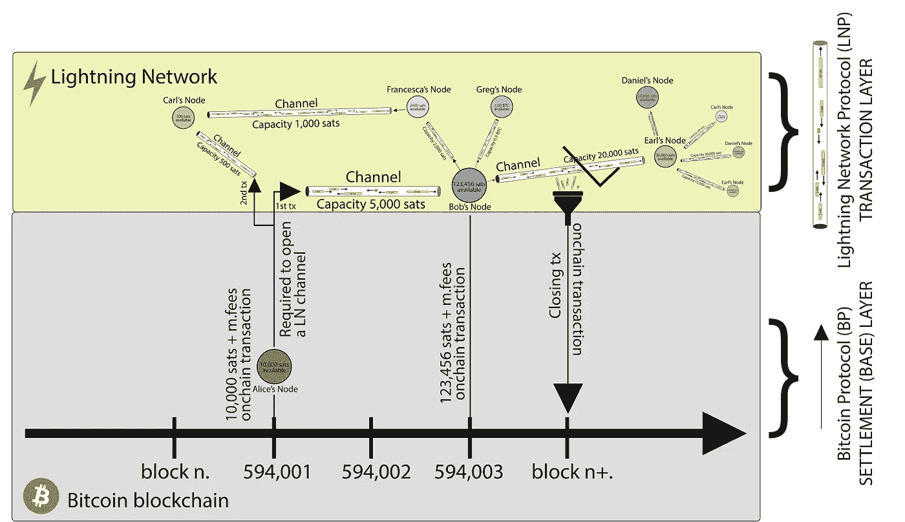
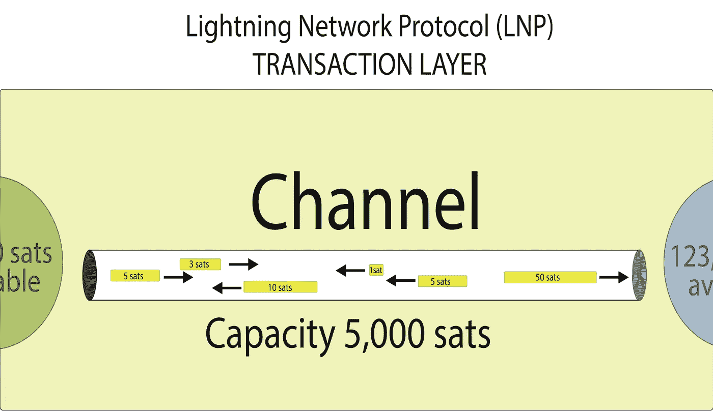

# 让我们保持低收费|启动闪电网络收费市场

> 原文：<https://medium.com/coinmonks/lets-keep-the-fees-low-starting-the-lightning-network-fee-market-634de10a5a64?source=collection_archive---------0----------------------->

闪电网络(LNP)是在私人和/或公司之间开放的**支付渠道**的结构，代表比特币的扩展解决方案；这就是为什么我们经常称之为比特币的第二层。

有了闪电，我们可能在一秒钟内完成几十万甚至上百万笔交易，从而(几乎)立即到达世界的任何地方。

”*是的，而且免费！*
不尽然。我们可以在 Lightning Network 上交易，而且每笔交易的费用非常便宜:就我个人而言，我从未花费超过 10 sats 的费用。但这种情况不会持续太久。

在探索为什么和我们能做什么之前，让我们看一下闪电网络是如何工作的。如果你已经知道它是如何工作的，请跳过解释，去闪电网络费用市场部分。

网络中的每个成员都可以创建自己的节点，配备一个钱包，在里面可以保存一定数量的 satoshis，或者他可以依靠托管服务，所有的关键都随之而来。

当用户想要向网络上的另一个人或服务付款时，他可以与它打开一个通信通道，satoshis 将在该通道内传输，就像 TCP 等传输协议路由的数据包在连接到互联网的设备之间传输一样。关于互联网潜在结构的讨论有点复杂，我在我的书[关于比特币](https://www.amazon.com/dp/1697134785)的问答中的一个特定章节里讨论了这个问题。在这里可以免费找到章节:[https://github . com/6102 比特币/比特币-intro/raw/master/QA % 20 比特币-159-165.pdf](https://github.com/6102bitcoin/bitcoin-intro/raw/master/QA%20bitcoin-159-165.pdf)

*图中:直接来自节点的黑色箭头代表区块链交易，通道内的箭头代表闪电交易。
按照惯例，只有三笔交易显示为与比特币区块链直接相关，并用于打开两个通道，即爱丽丝与鲍勃的通道和爱丽丝与卡尔的通道，以及关闭鲍勃与厄尔打开的通道。通道外的所有其他黑色箭头也代表区块链交易。
Alice 能够通过两个 onchain 事务打开两个不同节点的两个通道。
在这些渠道中，她可以完成所有她想要的交易，无需等待确认或向矿工支付费用。
鲍勃关闭了他和厄尔之间的渠道，他的智慧通过一笔交易就被注入了区块链。
在图像中，两个大面板象征性地代表了两层:* ***结算层*** *，作为基础层(区块链)，和* ***交易层*** *(闪电网络通道)。*

*最正确的交易层的表示应该只考虑支付渠道，而不考虑支付渠道之外的交易，但是出于简化层表示的原因，选择了这种解决方案。*

# 让我们简单点。举例说明它是如何工作的。

想象一下，你和五个朋友在一起，他们有一个固定的约会:星期五晚上在酒吧。
每次你们一起去喝酒吃饭，你们都会去酒吧结账，然后把账单分开，这样每个人都为他们消费的东西买单。酒吧的老板将不得不打印更多的收据，花一些时间通过增加收银员前面的队伍来向个人收钱，并小心达到正确的总数。简而言之，这个系统效率低下；它很慢，很贵，绝对不可扩展。

现在让我们假设你和你的朋友想更有效地做事。

你计算出每个月你平均花费 100 次睡眠。你可以把这 100 只 satoshis 放在一个共同的基金里，由你们每个人支付费用。一旦你到了酒吧的收银台，你可以一次性付款给店主，因为你知道每个人花了多少钱，所以你们都不会吃亏。从下一个月开始，如果小组成员 Alice 花费了 50 个 Satoshi，她将把共同基金与 50 个 Satoshi 整合，如果 Bob 花费了 20 个，他将添加相同的数字以达到 100 个 Satoshi，以此类推。

共同基金在酒吧之外也是有用的:如果鲍勃想买一个价值 5 satoshis 的比萨饼，但他身上没有钱，他可以从他和朋友的共同基金中贷款，并在酒吧以下一笔费用整合 5 satoshis。在酒吧的账单上，每人 20 只 satoshis，Bob 付 24 只，其他人付 19 只。

这些额外的花费理论上可以发生无数次，重要的是小组中的每个成员都记录了这些花费，并且每个月每个人都有 100 satoshis 的余额。

这与名为闪电网络的比特币第二层的情况类似。

你和你的四个朋友通过在比特币区块链上执行单笔交易，打开了一个支付通道(在本例中为共同基金)。与需要单个签名来花费资金的标准交易不同，这是一个**多签名**交易。简而言之，多重签名事务是复杂且可编程的事务，它允许不同的参与方参与。没有其他团体参与者的授权(签名),个人不能进行对外交易。

双方通过多重签名合同锚定在比特币区块链上，现在可以在通道内发送交易，而无需将所有交易传输到区块链。通道要求资金插入其中:**需要至少一方参与通道开通支付资金**。

这个插在支付通道的钱叫做**通道容量**，也就是刚刚开通的通道的 satoshis 容量。

渠道参与者跟踪余额(**渠道状态**)，并且仅在他们希望关闭比特币区块链的情况下，才将渠道的最后余额发送给后者。

因此，如果鲍勃想退出共同基金，他可以这样做:他欠该基金的债务将被计算出来，他可以将闪电网络中剩下的 satoshis 带回区块链，减去 onchain 交易的通常采矿费。

# **一个真正的 P2P 电子现金系统**

因此，现在我们知道 **Lightning Network 是一种支付渠道结构，用户可以直接相互交换 satoshis，而无需矿工收集他们的交易并将其插入新的区块。**

你和你的朋友需要支付的唯一采矿费用是将 satoshis 发送到 Lightning node 以打开支付通道的费用，以及关闭通道并随后将剩余 satoshis 发送到比特币区块链的费用，而不是所有来自你通常会做的个人在线交易的费用。

对于你想打开的每一个通道，都建立了一个容量:比如说我钱包里有 0.01 BTC，或者 100 万只小智。我可以决定和我的一个朋友开一个有 20，000 个 satoshis 容量的直接频道，和我最喜欢的酒馆和许多其他人的 100，000 个 satoshis 中的一个。然后，我将能够使用这些通道执行我想要的所有事务，而不必关闭它们。另一方面，酒吧可能会不时决定将 satoshis 转移到其 onchain cold wallet，只是为了让重要的数量离线，并由于比特币区块链的不变性(趋势)而受到保护。

# **不仅仅是直接渠道**

如果 Lightning Network 只允许将 satoshis 传送到直接渠道，它将完全没有用处，或者更好的说法是，它的用处将只用于直接联系的两个人和/或公司之间的经常性支付。实际上，这个网络允许行话中所说的**支付路由**:我可以通过节点间的“跳跃”(称为 hops)向那些与我没有直接联系的人发送 satoshis。

想象一下，一个朋友必须在酒吧为他的啤酒付费，但是在那里没有直接的支付渠道。
不是打开一个，支付相应的费用和等待时间，因为它必须等待区块链交易的确认，而是读取酒吧的发票并支付:satoshis 将首先通过我们的朋友和另一个人打开的通道，并将从一个节点跳到另一个节点，直到它们到达其节点与酒吧有直接通道的某人。

在我们的示例中，如果我们的朋友与我们的节点有一个直接通道，而我们与 pub 有一个直接通道，则可能发生的情况是，satoshis 将首先经过我们的节点，然后到达 pub 的节点。

闪电网络可用的节点越多，这些间接支付就越容易。节点少意味着支付不成功的可能性大！

这就好像在物质世界中，我们必须用钞票支付给一个在另一个城市的人:我们可以把钱交给我们的一个熟人，然后这个熟人会把钱交给其他人，直到钱到达真正的接收者手中。
显然，虽然类似于物质世界的间接支付系统，但这里不存在负责将钱交付给下一个参与者的参与者带着赃物逃跑的风险，因为该网络是基于**智能合同**而不是基于人们的直接干预。

**因此，Lightning 构成了一个真正的 P2P 网络**，完全符合中本聪创建的比特币白皮书的摘要，而基础(结算)层及其区块链更类似于一个广播系统，因为交易转录及其不可逆性取决于矿工。

所以我们达到了这篇文章的真正目的:我不想首先解释闪电是如何工作的，但是如果你来到这里，你必须经历这一切。很抱歉。

我的真实意图是开始探索所谓的**闪电网费市场**。

# 闪电网费市场

每笔交易都有代价。对于任何类型的交易都是如此，如果在传统交易层(例如 Visa 或 Mastercard)你不支付费用，那是因为有人在为你支付费用:通常是店主，如果聪明的话，会稍微提高商品的价格以支付佣金。
闪电网也是如此。

”*好的，但是我需要付多少钱？*

看情况。
如果使用比特币 onchain，您支付的挖掘费相当于您要支付的费用乘以您交易的字节大小——您可能会为低经济价值的交易支付高费用，而为高价值的交易支付低费用——使用 Lighting，您可能几乎没有费用，但您需要考虑其他参数。

**基本费用**:当你打开一个节点的通道时，你应该知道通过它到达另一个节点的每笔交易的基本费用是多少。
例如，如果基本费用是 1 sat，您将支付 1 sat 作为固定价格。

**费率**:当你发送一笔交易时，它经过一个节点，这个节点已经设置了费率，你支付总金额的一个百分比作为费用。
费率以百万兆卫星表示，因此例如，如果一个节点要求 1000 百万兆卫星作为费率，它将要求 0.001 兆卫星。
**你需要把这个金额乘以你的总金额**。

你想转 2000 个 sat？你支付 1 sat(基本费)+2000 x 0.001 sat(费率)= 3 sats 作为费用(基本费+费率)。

就这些吗？

号码

您还需要考虑您的事务需要进行的跳数！

如果您没有与某个节点的直接通道，并且您需要为某项服务付费，您将在另一个节点上中继，它最终将与另一个节点进行同样的操作，直到到达该服务的节点。我们之前看到过，我们称之为支付路由。

所以，让我们假设爱丽丝需要支付大卫——是的，更多的 sat 给我！—但没有与他直接沟通的渠道。

艾丽丝和鲍勃有一个直接频道，鲍勃和卡罗尔有一个频道，卡罗尔和大卫有一个频道。
交易需要经过 2 个节点！

因此，假设这些节点有相同的费率和基本费用:Alice 也需要支付 Carol，而不仅仅是 Bob，所以费用是 2x。

现在大卫的 2000 sats 考试需要通过 6 次。

如你所见，即使费用很低(总额的 0.3%)，也不是零。

需要注意的是，Alice 可以决定她愿意支付的最高费用。
如果 6 个 sat 对她来说太高了，她可以选择一个更小的上限:比如说 3 个 sat。她的节点将计算到 David 的另一条路由(如果有的话),其中路由节点需要更少的费用。

Alice 和 David 都连接到 LSP(闪电服务提供商)Isaac。其费率为 1000 百万沙特阿拉伯先令，基本费用为零沙特阿拉伯先令。

如果 Alice 向 David 支付 2000 sats，她只需支付 2000 x 0.001 sats(费率)= 2 sats。

她将支付总额的 0.1%作为费用。

因此，如您所见，如果用户设置了他/她愿意支付的最大费用，节点将搜索费用最低的最佳路由。

# **闪电网费市场正在启动。**

我们可以理解，节点操作符有两个主要选项:

1.  他们可以决定保持费用几乎不变，甚至高于平均水平，以保持他们的渠道平衡，偶尔赚取一些高额的路由费。
2.  他们可以跟随(或者更好，创造)市场，并有动态费用，这样他们可以有更多的路由事件，每次路由赚得更少，但所有交易加起来总的路由费用更高。

# 我们怎样做才能成为活跃用户并保持低费用？

嗯，首先我们应该开始创建节点和打开通道。

**拥有众多节点比拥有众多渠道和小型节点网络更好！**

然后，我们应该从容量和可用性方面选择好的节点，但我们也可以看看所需的基本费用和费率。

在我的例子中，我用名为 davidcoen.it_TEST [myNode]的测试节点为我的路由服务创建了一种**价格列表**，[0206 ba 1 bccc 9241 FDA 43879095 f 54 f 276 b 41373 ca 236735 c 5357d 55 e 385 a 8062 e 5 @ ewrfly 2 uomkxeo 5k . onion:9735](https://1ml.com/node/0206ba1bccc9241fda43879095f54f276b41373ca236735c5357d55e385a8062e5):

因此，这就像是我在出售我的路由服务(或容量)的价格:在这种情况下，我请求零 Sat 作为基本费用和可变费率，如果用户向我的节点打开一个具有 200 万 Sat 容量的通道，则从 100 万 mSat(0.000001 sat)到 2000 万 mSat (0.002 sat)。

这个价目表最终会改变，适应闪电网费市场，一旦网络更大，路由节点之间会有更多的竞争。请考虑到这只是一个测试节点，所以它只是为了学术目的。
如果相反，你需要一个专业的节点来打开通道，请参考 [btcpay.davidcoen.it](https://1ml.com/node/02e74c09ca720c891221164424651f62176a4737a4b2fd4f75a5befee127e90b9e) 。

*(不要)鲁莽！*