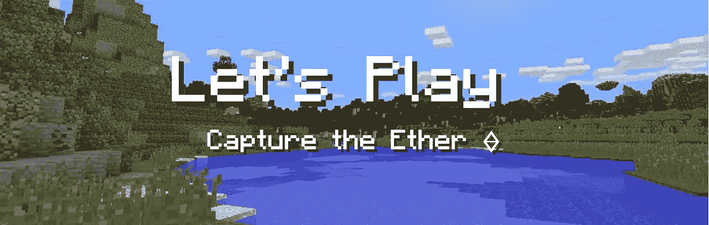
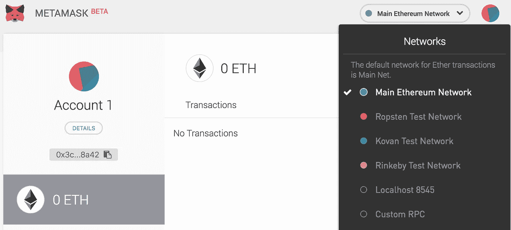
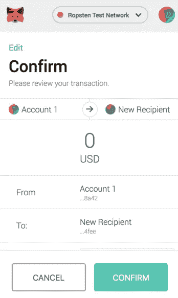
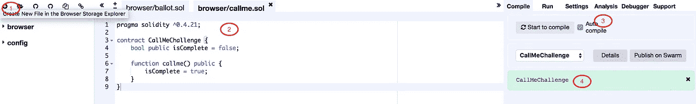
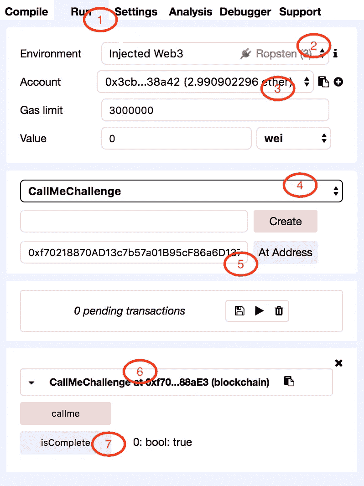

# 让我们来玩—捕捉以太:热身

> 原文：<https://medium.com/coinmonks/lets-play-capture-the-ether-warmup-68a5fc38e670?source=collection_archive---------2----------------------->



这是我在[捕捉以太](https://capturetheether.com/)的旅程中的一系列故事，在这个游戏中，我们为了好玩而破解以太坊实体代码，并学习智能合约安全性。

**目录**

*   彩票:智能合约中的随机数。[第一部分](/@saurfang/lets-play-capture-the-ether-lotteries-part-i-4e0b40687efd)、[第二部分](/@saurfang/lets-play-capture-the-ether-lotteries-part-ii-478365775a34)
*   数学:如何在扎实中安全地做数学？
*   帐户:帐户所有权和安全性。
*   杂:其他一切。

# 什么是捕捉以太？

在*夺取以太*中，我们通过完成挑战赢得分数。每个挑战都有一个智能合同来部署，目标可以通过利用合同进入特定状态来完成。挑战按类别分组，集中于智能合约中安全漏洞的特定领域。

# 为什么是这个系列？

我已经通过 [CryptoZombies](https://cryptozombies.io) 学会了我的稳固技能，并且在几次黑客马拉松中用 [Truffle](http://truffleframework.com/) 框架写了一些智能契约。在撰写本文时，我已经完成了彩票部分的一半，并发现它是一个引人入胜的教育资源。

我还没有想出如何应对挑战的想法，但我有很多痛苦的时刻来找出实现我的方法所需的工具，并调试我的智能合同。

在这一系列文章中，我将重点关注**实用的智能合约编程和我的艰难学习的错误**。我将展示**工具和 IDE/CLI 设置，**解释每个问题的****，****向您展示如何在实践中**实现它们**。它假设你对以太坊的工作原理有基本的了解，我强烈建议你先通过[隐型僵尸](https://cryptozombies.io)来学习坚固的基础。出于篇幅的考虑，我不会详细解释概念，但会提供必要的链接。********

****在我们开始之前，我应该提一下，*捕获以太*已经提供了一个极好的[资源](https://capturetheether.com/resources)让你开始。热身挑战也是为了让你准备好你需要的工具。我将重点关注在我的经历中给我带来麻烦的缺失细节。****

# ****部署合同****

****按照指示，你首先需要 [Metamask](https://metamask.io/) ，一个浏览器内以太坊钱包。安装后，您可以按照提示完成安装。现在我们需要`Switch to Ropsten Test Network`。我将在一个勇敢的浏览器中演示使用 Metamask 的测试版。****

********

****Metamask Chrome Extension Standalone Page — Select a network****

****可以通过点击右上角的网络选择器来选择网络。`Main Ethereum Network`是生产网络，在该网络中，乙醚和(ERC20)令牌具有实际价值，可以交易并用于操作智能合约。****

****其他测试网络用于开发和测试智能合约。它们运行与主网络中相同的 [EVM](https://github.com/pirapira/awesome-ethereum-virtual-machine) ，但有些使用更高效(也更不安全)的一致性算法，如 [PoA](https://github.com/kovan-testnet/proposal) 。测试网络上的醚可以类似地开采，但是**水龙头也可用于获取测试用的自由醚**。在*夺取以太*中，你需要**比两个以太**多一点才能玩游戏(你需要两个以太来完成智能契约交互，然后再多一些来交气。)****

****以下是一些水龙头:****

1.  ****[https://水龙头. metamask.io](https://faucet.metamask.io) 每个账户每天 1 乙醚****
2.  ****[https://faucet.bitfwd.xyz/](https://faucet.bitfwd.xyz/?ref=producthunt)每天每账户 1 乙醚****
3.  ****[https://水龙头. kyber.network/](https://faucet.kyber.network/) 每个账户 1 个乙醚****
4.  ****[http://faucet.ropsten.be:3001/](http://faucet.ropsten.be:3001/)1 乙醚每滴(队列基础)****

****我建议你先获得 3 个乙醚，只有当你在挑战中出错时需要它们时再回来。****

****测试网络中的以太没有真正的价值，所以当你玩游戏时，请确保你在测试网络上。你的私钥和所有以太坊地址在 miannet 和 testnet 中的工作是一样的。**不要把你的主机发送到 testnet 账户，否则你会失去它们。** **为了万无一失，不要在 mainnet 和 testnet 之间共享私钥/种子/帐号。******

********

****Metamask Dropdown — Confirm a transaction****

****这样，点击`Begin Challenge`，并确认。将部署您自己的以下智能合同副本。再次单击“检查答案”完成挑战。****

```
**pragma solidity ^0.4.21;contract DeployChallenge {       
  // This tells the CaptureTheFlag contract that the challenge is complete. function isComplete()
  public 
  pure
  returns (bool) {
   return true;
  }
}**
```

****请注意，捕获以太依赖于调用`isCompelete`函数来确定您是否已经实现了目标。此外，**因为你用你的以太坊账户部署了这个智能合约代码的副本，所以 Capture the Ether 可以不可信地将成就链接到你的以太坊地址。******

# ****叫我****

****这个问题要求我们调用已部署契约上的函数，即向智能契约地址发送一个包含函数接口和参数的事务。可以参考[与智能合约](http://ethdocs.org/en/latest/contracts-and-transactions/accessing-contracts-and-transactions.html#interacting-with-smart-contracts)互动，了解引擎盖下发生的细节。****

****最核心的方法是我们计算出有效载荷数据，通过 CLI 运行，并直接与本地节点通信。在这里，我将演示两种直接与元掩码交互的最简单的方法。****

## ****带有 web3.js 的 Javascript 控制台****

****Web3.js 是一个 Javascript 库，通过 JSON-RPC 接口与以太坊节点通信。你可以在 Github 网站上阅读更多 API 文档。****

****Metmask 将 web3.js 注入到浏览器中每个正在运行的网页中。这有一个很棒的效果，你可以直接与以太坊交互，而不用担心管理私钥和节点连接。事实上，让我们通过命令/Ctrl+Option+J**打开控制台并运行下面的代码来尝试一下:******

****🎉您应该看到您的默认元掩码地址及其余额。您可能会发现语法相当笨拙，因为一切都是异步的和基于回调的。好消息是 **web3.js 1.x 将返回异步函数的承诺，因此您可以链接承诺或使用异步/等待语法**。(我们将在下一篇文章中用 Truffle 编写 web3.js 代码时讨论这个问题。)可以在 Github 上跟踪 web3.js 1.x 支持的 [Metamask 进度。](https://github.com/MetaMask/metamask-extension/issues/3642)****

****为了与契约进行交互，web3.js 依赖于**[**ABI**](https://github.com/ethereum/wiki/wiki/Ethereum-Contract-ABI)**(应用程序二进制接口)，它指定了哪些函数可用以及每个函数接受哪些参数。********

****从源代码中获取 ABI 最简单的方法是使用 solidity 编译器。如果你不关心 solidity 编译器和 web3.js 的细节，请随意跳到下一小节，它介绍了一个在线 IDE Remix。****

****我们将使用 Mac 上二进制 Solidity 包中的`solc`,你可以在文档中找到许多其他编译器[。](http://solidity.readthedocs.io/en/v0.4.21/installing-solidity.html)****

****Compile Solidity Contract with solc****

****我们可以在 js 控制台用 web3.js 加载这个 ABI，发出一个事务调用契约中的`callme`函数:****

****Get instance of deployed smart contract and send transaction to `callme`****

****Metamask 应该会弹出，要求您授权最后一行触发的事务。确认后，您可以继续检查您的解决方案。🎉+100 分。****

## ****再搅拌****

****Remix 是一个可靠的浏览器内置集成开发环境。您可以使用友好的 GUI 编写、编译智能合约并与之交互。****

****让我们点击左上角的+按钮创建一个新文件，并将其命名为`CallMeChallenge.sol`。然后，我们将合同代码放入编辑器中:****

********

****Remix in-browser Solidity IDE****

1.  ****创建文件****
2.  ****复制并粘贴实体代码****
3.  ****检查`Auto Compile`,它会在你的代码改变时编译你的代码****
4.  ****绿色框庆祝你的代码编译与检测合同名称:`CallMeChallenge`****

********

****现在我们可以与以太坊区块链上的合同进行交互:****

1.  ****点击`Run`选项卡****
2.  ****选择`Injected Web3`并确认您在右侧的`Ropsten`测试网络上。还有一些其他可用的环境。简单地说，这些是你可以与之互动的可能的区块链(提供者)。`Injected Web3`表示 web3.js 被注入到浏览器页面中，在本例中，是通过元掩码注入的。****
3.  ****验证您是否在指定的账户上，并且您的余额是否正确反映。如果您在 Metamask 中创建了多个帐户，您将可以从中进行选择。****
4.  ****此处将列出当前文件中定义的合同列表。在这种情况下，我们只有`CallMeChallenge`****
5.  ****您可以选择`Create`新合同或`Load`已部署的现有合同。在这种情况下，**我们在挑战**中输入我们部署的契约的地址。****
6.  ****下面应该显示一个合同实例。这类似于我们在上面运行`CallMeChallenge.at('<address>')`时发生的情况。****
7.  ****有两个按钮`callme`和`isComplete`，这是合同的两个公共功能。**注意不同的颜色**,因为`callme`是一个**状态修改函数**,只能在您要支付汽油的交易中调用。另一方面，`isComplete`是一个**只读函数**可以被调用而不需要付出任何代价。(注意，如果在事务中调用只读函数，您仍然需要支付汽油费。)****

****点击`isComplete`，如果你已经完成了挑战，你会立即看到右边的`0: bool: false`。现在点击`callme`，Metamask 应该要求授权一个交易。交易状态将在下面的控制台中更新。一旦事务被挖掘，您可以再次单击`isComplete`，现在它应该显示`0: bool: true`。恭喜你+100 分！****

# ****选择昵称****

****这个对你来说应该很容易，因为你知道如何使用混音。唯一棘手的部分是，现在我们需要用一个参数调用函数。****

****继续将代码复制并粘贴到一个新文件中。从地址`0x71c46Ed333C35e4E6c62D32dc7C8F00D125b4fee`加载合同。在`setNickname`功能的右边填写您喜欢的昵称。****

******你需要用双引号把** `**string/bytes**` **的参数括起来。Remix 使用空格来分隔参数。******

****人生最轻松的 200 分！😬****

****为了完整起见，您可以使用 web3.js 与此契约进行交互，如上所示:****

****Get instance of deployed smart contract and send transaction to `setNickname`****

# ****结论****

****在这篇文章中，你已经学会了使用 Metamask 在 Ropsten 测试网络上创建自己的 Ethereum 帐户，在 Metamask 注入的 Javascript 控制台中使用 web3.js，并通过 GUI 使用代码或 Remix 调用使用 web3.js 的合同。****

****下一次，我们将深入到彩票部分，在那里我们将发现智能合约中常见且有趣的安全漏洞。我们还将看看如何使用 [EthFiddle](http://ethfiddle.com) 在浏览器中编写和测试 Solidity 代码，而无需支付任何费用。****

> ****《捕捉以太》由 [@smarx](https://twitter.com/smarx) 为您带来，他在[项目区块链](https://programtheblockchain.com/)撰写了关于智能合约开发的博客。****

****我不隶属于游戏本身和背后的牛逼公司。所表达的观点仅是我个人的观点，并不代表我过去、现在和将来所隶属的任何实体的观点或意见。****