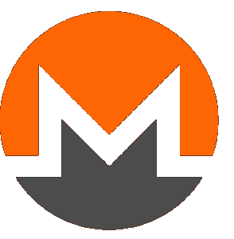
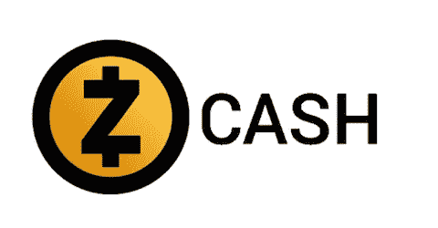
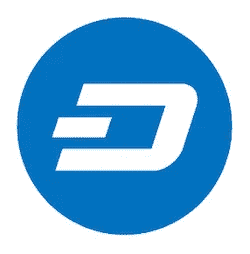
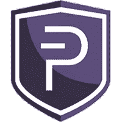

# 让我们预测一下隐私币的未来

> 原文：<https://medium.com/coinmonks/lets-predict-the-future-of-privacy-coins-1376f095037b?source=collection_archive---------6----------------------->

对一些人来说，加密货币中的隐私是不必要的。也许他们会在网上公布银行对账单？也许他们觉得不需要隐藏开支？我不知道。但是如果(或者实际上什么时候)加密货币成为主流，我的猜测是大多数用加密支付的人不希望他们的交易被发现。(出于目标营销、诈骗或其他原因)

在我个人看来。工作证明已经过时，这是早期达成共识的好方法，但目前是更可持续的选择。硬币使用这将得到一个更差的评级相比，股权货币的证明。

让我们从大的开始:

# 莫内罗

Monero

Monero 目前是隐私币之王。这是一个考虑到隐私的比特币叉子。

Monero 不仅隐藏寄件人的地址，还隐藏交易金额。Monero 网络上的每一笔交易都经过一个秘密地址，这个地址无法与原始发送者联系起来。

Monero 使用工作证明，并且没有改变这一点的计划。

一笔交易的平均价格是正负 0.37 美元

相对较高的交易费用和价格并没有使 Monero 成为一种可行的未来硬币。

# Zcash

zcash

Zcash 也是一个考虑到隐私的比特币叉子。Zcash 通过加密网络上的交易来获得隐私。

在 Zcash 中，隐私功能的使用是可选的

Zcash 很少在真实交易中使用，背后也没有一个坚实的开发团队。

Zcash 是工作的证明。

**考虑到开发者团队，我看不到 Zcash 的光明未来。**

# 破折号

Dash

Dash，承诺成为数字现金的硬币。Dash 也是一个比特币分支，但除了提供与比特币相同的功能外，它还提供私人和即时交易。

Dash 通过联合支付实现隐私保护。基本上是把交易粘在一起，然后再分开。

破折号是赌注的证明

**Dash 交易即时、廉价，网络是利益的证明。所有这些加起来就是一个很好的未来证明隐私硬币。**

# PIVX

PIVX

私人即时可验证交易，听起来正是我们想要的，不是吗？

PIVX 是 Dash 的一个分支，有很多改进。PIVX 是第一个实现完全私有和匿名方式发送硬币的 PoS 硬币。

和 Dash 一样，你可以花 PIVX 公有或者私有。如果你甚至不喜欢区块链上的硬币，你可以把它们保存在你的 USB 上，当你需要它们的时候再把它们放进去

PIVX 是股份的证明

PIVX 交易是即时的、廉价的，网络是利益的证明。考虑到 Dash 上所做的改进，我猜想这将是“未来隐私硬币”的赢家

你有什么补充吗？
请在评论里告诉我！