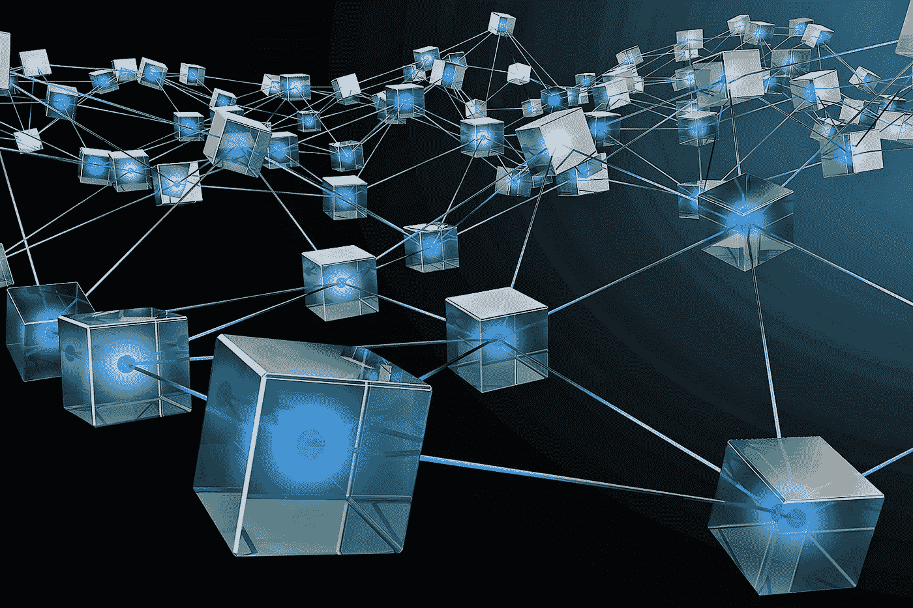
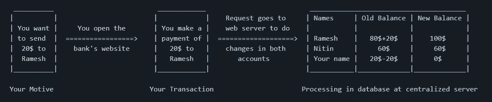

# 先说区块链

> 原文：<https://medium.com/coinmonks/lets-start-with-blockchain-2f94aa1cf3d6?source=collection_archive---------13----------------------->

Image taken from [here](https://static.bangkokpost.com/media/content/20210430/c1_2108411_210430122446.jpg)

到目前为止，我有各种道德黑客的概念，如**如何开始**，道德黑客的不同步骤，如**足迹，扫描，枚举，破解密码，清除日志**；我也讨论过类似**黑客如何入侵你的安卓或个人电脑或者他们如何攻击 MITM 或 DOS**的攻击，也在上一篇博客中讨论过**网络取证**的各种概念。
但是现在既然我们已经有了密码学的概念和加密的用途，我们就应该从区块链的概念开始，这个领域是从密码学的概念衍生出来的。这一点也不像看起来那么难。你应该熟悉密码学的概念。

# 1.为什么是区块链？

这整个概念是由一个叫**中本聪**的人发现的，他在**比特币**中实现了这个概念。在当今世界(没有区块链)，一切都是中央集权的。使用术语**集中式**，我的意思是数据存储在一个地方，有一个机构管理它，该机构的一些人有权访问银行交易的数据库。每次你做交易的时候，这个过程都会涉及到那个中央机构，在你的名字/账号前面放钱。让我们直观地看看这个:

数据库将得到更新，这意味着交易成功。**如果**由于某些技术错误导致交易不成功，则该集中机构将负责回滚到旧状态。或者你可以投诉提供银行服务的公司。您不必为发生的技术错误负责，因为有一个中央机构控制着这项服务。中央机构有责任提供最好的服务，保护数据安全，并确保通信安全。
但**区块链**却不是这样。区块链不受任何中央机构控制，事实上没有中央服务器的概念。作为区块链一部分的节点/计算机本身就是服务器，即它们具有使用该服务的所有客户的信息，这些信息以分类帐的形式存储在它们的设备中。账本就是区块链的数据库。与使用相应区块链服务的客户相关的所有信息被存储在分类帐中，并且该分类帐被存储在作为该区块链服务的一部分的所有节点/计算机中。
不同之处在于，存储在特定服务器中的数据现在被分发到区块链网络中的所有节点/计算机上。**集中数据向分散数据转变。**让我们从银行业的角度来讨论一下区块链的概念。加密货币**是区块链网络中的新货币。如**比特币、以太坊、Dogecoin 等。**
现在你会有一个问题，在银行系统中，提供服务的公司首先核实和确认进行交易的人是否是真实的，在区块链是如何做到的？答案很简单，所有参与区块链的节点都执行验证过程，以便进行交易的人是真实的，并且有足够的余额进行交易。每个节点都没有足够的硬件资源来验证事务并创建一个块(这将在后面讨论)，因此可以轻松完成这项工作的节点被称为**矿工**。**

# 2.什么是区块链？

顾名思义，**一个区块链**。类似于链表数据结构的概念，其中一个节点包含第二个节点的地址，第二个节点包含第三个节点的地址，以同样的方式在区块链，一个块包含另一个块的地址，以及同一块包含前一个块的地址。这实际上不是地址，你会在区块链即将发布的博客中发现它是什么。该块作为一个整体包含一个人已经完成的交易，它可能是单笔交易，也可能是 10，20，50，1000，20000…..交易。块的平均大小为 1MB，最大可达 8MB。区块链中的每个数据块都有一个数据块编号和存储在该数据块中的所有数据的散列，包括事务和标头。

# 2.1 区块链有什么好处

如今，区块链正在蓬勃发展，而区块链可以成为任何东西，直到它被分散。比特币的区块链和以太坊的区块链完全不同，Dogecoin 也是如此，尽管它们使用了相同的区块链概念。参与比特币区块链的节点无法访问以太坊的总账。如果你是两个区块链的一部分，那就另当别论了，因为你有很棒的硬件设施。对其需求很大的特征是:

1.  **不变性:**在一个块中输入的数据不能再次改变/更改/修改。
2.  **去中心化:**它没有管理机构，因此不需要从人们那里收取高额的服务费。事实上，节点维护着整个网络。
3.  **安全:**区块链中的每个数据都是加密的，由于**不变性**的特性，没有人能够更改数据。
4.  **透明性:**在区块链，一切都是公开的，如果发生了恶意的事情，那么每个人都会知道被修改的数据，然后在其他节点的账本副本的帮助下恢复这些数据。
5.  **共识:**是网络中所有节点都必须流动的协议，与场景中的决策相关。
6.  **更快的结算:**在集中的情况下，如果交易中出现问题，那么需要很多天来确定实际交易在哪里。但这在区块链是没有的，你做的交易会被另一方收到。

*我在这篇博客中讨论了区块链的概念，是的，它还没有完成。还有许多其他的概念需要讨论。我将在接下来的博客中讨论它们。这个博客只是对区块链的介绍，当然还有更多。*

> 社交媒体链接:[LinkedIn](https://www.linkedin.com/in/ansh-vaid/)|[GitHub](https://github.com/AnshVaid4)|[insta gram](https://www.instagram.com/being_optimist/)|[Twitter](https://twitter.com/anshvaid4)
> 
> 访问我的网站:[https://cybergeeks.website/](https://cybergeeks.website/)
> 
> *原载于*[*https://github.com*](https://github.com/AnshVaid4/Blogs/blob/caff161e83f7cb87d41468660ab5875de2cd47a4/blogs/2021-10-13-ExploitingServices.md)*。*

> 加入 Coinmonks [电报频道](https://t.me/coincodecap)和 [Youtube 频道](https://www.youtube.com/c/coinmonks/videos)了解加密交易和投资

## 另外，阅读

*   [eToro vs robin hood](https://blog.coincodecap.com/etoro-robinhood)|[MoonXBT vs by bit vs Bityard](https://blog.coincodecap.com/bybit-bityard-moonxbt)
*   [Stormgain 回顾](https://blog.coincodecap.com/stormgain-review) | [Bexplus 回顾](https://blog.coincodecap.com/bexplus-review) | [币安 vs Bittrex](https://blog.coincodecap.com/binance-vs-bittrex)
*   [Bookmap 评论](https://blog.coincodecap.com/bookmap-review-2021-best-trading-software) | [美国 5 大最佳加密交易所](https://blog.coincodecap.com/crypto-exchange-usa)
*   [如何在 FTX 交易所交易期货](https://blog.coincodecap.com/ftx-futures-trading) | [OKEx vs 币安](https://blog.coincodecap.com/okex-vs-binance)
*   [如何在势不可挡的域名上购买域名？](https://blog.coincodecap.com/buy-domain-on-unstoppable-domains)
*   [印度的秘密税](https://blog.coincodecap.com/crypto-tax-india) | [altFINS 审查](https://blog.coincodecap.com/altfins-review) | [Prokey 审查](/coinmonks/prokey-review-26611173c13c)
*   [区块链 vs 比特币基地](https://blog.coincodecap.com/blockfi-vs-coinbase) | [比特坎评论](https://blog.coincodecap.com/bitkan-review) | [币安评论](/coinmonks/binance-review-ee10d3bf3b6e)
*   [Coldcard 评论](https://blog.coincodecap.com/coldcard-review) | [BOXtradEX 评论](https://blog.coincodecap.com/boxtradex-review)|[uni swap 指南](https://blog.coincodecap.com/uniswap)
*   [阿联酋 5 大最佳加密交易所](https://blog.coincodecap.com/best-crypto-exchanges-in-uae) | [SimpleSwap 评论](https://blog.coincodecap.com/simpleswap-review)
*   购买 Dogecoin 的 7 种最佳方式
*   [iTop VPN 审查](https://blog.coincodecap.com/itop-vpn-review) | [曼陀罗交易所审查](https://blog.coincodecap.com/mandala-exchange-review)
*   [美国最佳加密交易机器人](https://blog.coincodecap.com/crypto-trading-bots-in-the-us) | [经常性回顾](https://blog.coincodecap.com/changelly-review)
*   [A-Ads 审查](https://blog.coincodecap.com/a-ads-review) | [Bingbon 审查](https://blog.coincodecap.com/bingbon-review) | [Mudrex 投资](https://blog.coincodecap.com/mudrex-invest-review-the-best-way-to-invest-in-crypto)