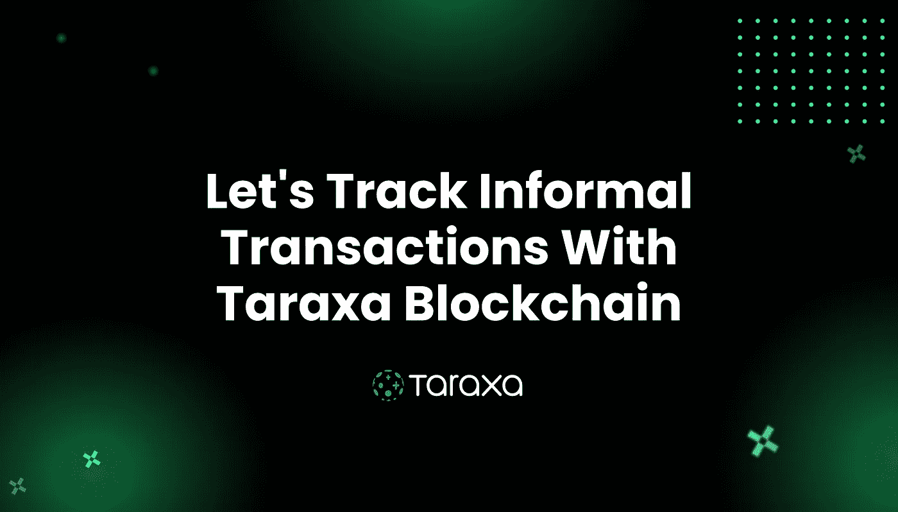

# 让我们用 Taraxa 区块链追踪非正规交易

> 原文：<https://medium.com/coinmonks/lets-track-informal-transactions-with-taraxa-blockchain-f5b7c08f1efd?source=collection_archive---------4----------------------->

## 让大部分运营数据可验证是一项艰巨的任务，但 Taraxa 可以跟踪非正式交易。

[区块链](https://en.wikipedia.org/wiki/Blockchain)是为了追踪金融交易而创建的，但后来，在区块链[以太坊](https://en.wikipedia.org/wiki/Ethereum)推出后，我们意识到区块链可以解决许多严重的问题。今天，在这个时代，每个行业都在利用区块链的力量重塑其生态系统。但是，许多运营数据变得越来越孤立、非结构化、不可验证，并且大部分(> 80%)未被捕获，导致越来越多的错误决策，阻碍了创新和扩展。

你有没有想过有可能使用区块链跟踪每一个非正式交易，使其可验证！

**如果你是一个正在思考为什么需要跟踪每一笔非正式交易以使其可验证的人？**那我用一个例子让你明白；当你从使用[比特币](https://en.wikipedia.org/wiki/Bitcoin)的人那里获得报酬时，矿工们通过验证比特币的来源是否合法来帮助你获得这笔资金。因此，假比特币无法进入市场。当你在商店用法币付款时，没有人验证你给店主的法币是合法的，所以假法币可以进入流通。

我们正在利用区块链技术验证 [crypto](https://en.wikipedia.org/wiki/Cryptocurrency) 的真实性，就像我们验证非正式数据的真实性一样，让它对数据驱动的业务更有帮助。

所以在这里 [Taraxa](https://taraxa.io/) 区块链可以发挥作用，因为 [Taraxa](https://taraxa.io/) 是为了跟踪任何非正式交易而创建的，今天，在本文中，我们将讨论 [Taraxa](https://taraxa.io/) 以及跟踪非正式交易的重要性。

# Taraxa 是什么？

数据是新的货币，我们生活在一个大多数业务都由数据驱动的时代。尽管如此，世界上超过 80%的非正式数据都被浪费了，因为交易所中没有一个系统可以增强问责制。假设一个大型组织通过一家调查公司进行了一项调查，以获得客户的反馈。在这种情况下，调查制作公司可能会通过提供虚假的调查数据来进行欺骗，但如果该组织可以验证调查数据来自真实的客户，该怎么办呢？然后，通过获得实际数据，组织可以快速成长或扩展。

[Taraxa](https://taraxa.io/) 是一款创新的区块链，可以帮助任何人跟踪非正式交易，这意味着 [Taraxa](https://taraxa.io/) 甚至可以让一笔小额的非正式交易可信。

# 跟踪非正式交易的重要性

数据驱动的业务或组织依赖于数据，因此数据推动了数据驱动业务的快速创新和增长。但有时，大组织不能信任数据，因为大多数利益相关者不直接处理它，这就造成了开发上的冲突。

[Taraxa](https://taraxa.io/) 可以追踪非正式交易，使其可验证或可信。有了 [Taraxa](https://taraxa.io/) ，你可以获得足够的非正式交易数据来建立一个本地化的信誉网络，即使是最次要的参与者也能获得信誉，并在交易中得到信任。

建立声誉并不容易，因为只有名人才有声誉，所以大多数人可以盲目地信任他们，但 [Taraxa](https://taraxa.io/) 可以帮助你获得可证实的声誉。 [Taraxa](https://taraxa.io/) 影响每一个实体，无论是个人、项目还是设备，使其可信和可验证。

## 结论:

如今，信任一个人是非常困难的，那么你如何信任数据、项目或设备呢？ [Taraxa](https://taraxa.io/) 区块链可以在这里发挥重要作用，因为它可以帮助我们让任何东西都值得信赖，让组织/个人可以选择正确的人、数据、项目和设备。所以如果你问我对 Taraxa 的看法，我必须告诉你，我们在生活和工作中需要这些工具。

> 加入 [Coinmonks 电报频道](https://t.me/coincodecap)，了解加密交易和投资

 [## 最佳加密交易所| 2021 年十大加密货币交易所

### 加密货币交易所的加密交易需要了解市场，这可以帮助你获得利润…

blog.coincodecap.com](https://blog.coincodecap.com/crypto-exchange)  [## 2021 年 9 大最佳加密借贷平台

### 当谈到加密货币贷款时，大量因素等同于良好的收入状况。此外，借款的一部分…

blog.coincodecap.com](https://blog.coincodecap.com/crypto-lending)  [## 2021 年最佳加密交易机器人(免费和付费)

### 2021 年币安、比特币基地、库币和其他密码交易所的最佳密码交易机器人。四进制，位间隙…

medium.com](/coinmonks/crypto-trading-bot-c2ffce8acb2a)