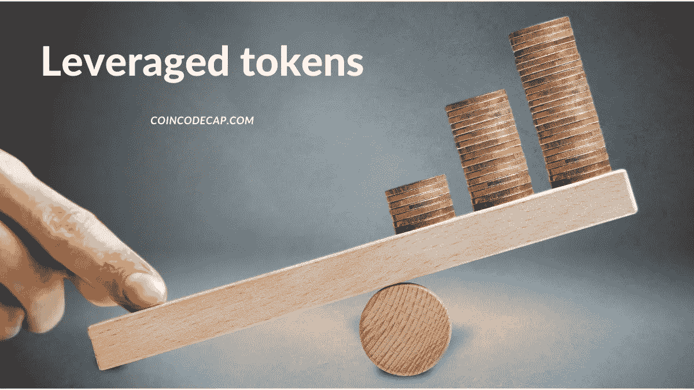
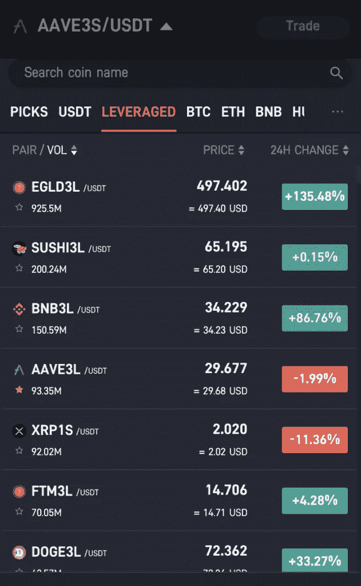
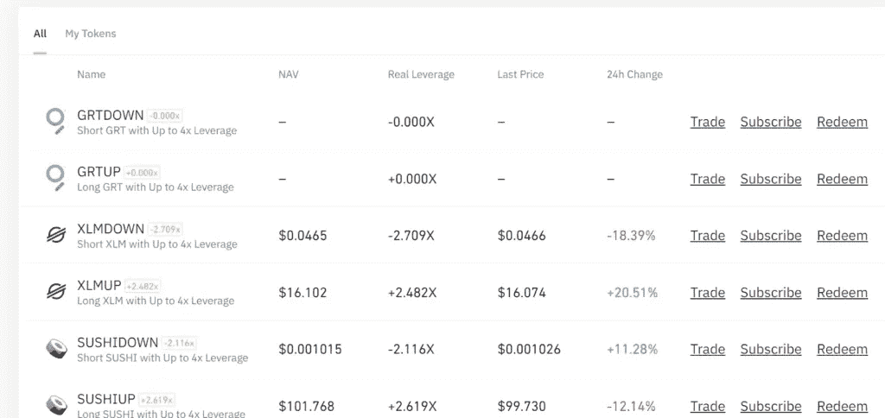
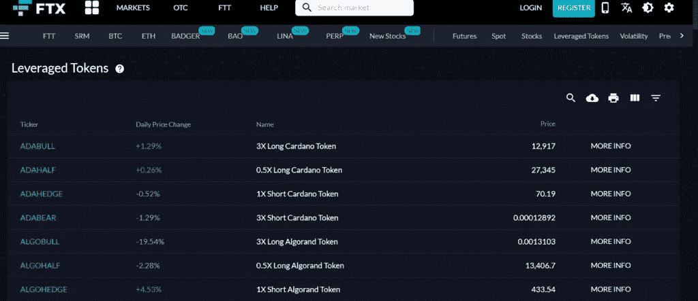

# 杠杆代币[多头代币]终极指南

> 原文：<https://medium.com/coinmonks/leveraged-token-3f5257808b22?source=collection_archive---------1----------------------->



杠杆代币是具有杠杆风险敞口的 ERC20 代币，不考虑保证金、要求、管理和清算风险。换句话说，杠杆代币是最简单的杠杆交易方式。

他们保持固定或可变的杠杆。在传统的杠杆代币中，杠杆在每天凌晨 2:00 和现货市场价格变化 10%时重新平衡。

然而，不同的交易所采用不同的技术来重新平衡它们的杠杆代币。本文将讨论提供杠杆代币的三大交易所——[](https://www.pionex.com/offers/#/grid-4?r=BI2UEarX)**[](https://www.binance.com/en/register?ref=UARTH1S1)**[**FTX**](https://ftx.com/#a=5809823)。****

> ****交易新手？尝试[加密交易机器人](/coinmonks/crypto-trading-bot-c2ffce8acb2a)或[复制交易](/coinmonks/top-10-crypto-copy-trading-platforms-for-beginners-d0c37c7d698c)****

# ****摘要****

*   ****杠杆代币使您能够获得杠杆交易头寸，而无需维持保证金、抵押品、管理和风险。****
*   ****他们提供固定和可变的杠杆。此外，再平衡机制有助于维持目标杠杆范围。****
*   ****杠杆代币不是为持有而设计的，快速买卖，不要持有。****
*   ****[**Pionex**](https://www.pionex.com/offers/#/grid-4?r=BI2UEarX) 提供具有优化的再平衡机制的杠杆代币。他们设计了具体的规则来触发再平衡。****
*   ****[**币安**](https://www.binance.com/en/register?ref=UARTH1S1) 提供币安杠杆代币(BLVT)，杠杆在 1.25 倍到 4 倍之间可变。****
*   ****BLVT 的杠杆作用是不公开可见的，它们不会定期进行自我再平衡。这些代币只在币安上市。****
*   ****[**FTX**](https://ftx.com/#a=5809823)**第一个推出杠杆代币(牛代币和熊代币)的交易所。他们提供高达 3 倍的杠杆。他们定义了明确的规则来触发再平衡和计算代币的价格。******

# ******1.皮奥克斯******

********Pionex** 杠杆代币通过优化的再平衡机制提供高杠杆敞口。它们提供可变的目标杠杆，根据加密资产价格在特定范围内波动。如果杠杆率超过特定限额，就会触发再平衡。******

****他们使用 Pionex 杠杆代币的“硬币+杠杆+多头/空头”命名法。例如，ETH3L 表示 ETH 长 3 倍。****

****杠杆率的计算公式是-****

```
**Leverage = current price * the leverage of the order/ the price of the order + the leverage of the order *（current price - the price of the order）**
```

****让我们举个例子来更好地理解这一点-****

****想象一下，如果你用 3 倍长的 ETH，价格是 10,000USDT。杠杆将是 3x = 10000 * 3/10000+3 *(10000–10000)。****

****现在，如果价格上涨到 11000 USDT，杠杆将是 11000 * 3/10000+3 *(11000–10000)= 33000/13000 = 2.5385 x****

****所以，价格往下走，杠杆增加，往上走，杠杆减少。****

****此外，您还可以使用带有杠杆令牌的 [**交易机器人**](/coinmonks/crypto-trading-bot-c2ffce8acb2a) 。可以根据不同情况选择使用 [**网格交易 bot**](https://coincodecap.com/grid-trading) 、无限网格 Bot、尾随止盈 Bot。****

********

****[Pionex](https://blog.coincodecap.com/go/pionex) Leveraged Tokens****

## ****调整资金组合****

****再平衡用于增加或减少风险敞口，以实现目标杠杆。定义了触发该机制的规则。****

****在传统的杠杆代币中，再平衡在凌晨 2:00 和现货市场价格变化 10%时触发。****

****Pionex 杠杆硬币的再平衡机制工作如下-****

1.  ******3 倍长 Pionex 杠杆代币**:杠杆可以在 2.2 倍-4.8 倍之间波动，但超过这个就会重新平衡到 3 倍。****
2.  ******3x 空头 Pionex 杠杆代币:**杠杆可以在 1.8X-4.8X 上下浮动，但超过这个就会重新平衡到 3x。****
3.  ******1x 空头 Pionex 杠杆代币**:杠杆可以在 0.75X-1.5X 之间波动，但超过这个，就会重新平衡到 1x。****

****Pionex 杠杆代币的资金手续费为每日 0.03%。因此，每天 16:00 (UTC)时，令牌价格将下降 0.03%。杠杆代币的价格取决于融资费、现货价格和再平衡。****

## ****Pionex 杠杆代币反向拆分****

****如果其净值低于 0.05 USDT，Pionex 会对其部分杠杆代币进行反向拆分。这样做是为了避免精确度的影响，并帮助用户进行交易。****

****反向分割比例决定了将被合并的股份数量。例如，如果比率是 1/10，那么十股将合并为一股。每股净值也会是十倍。****

****有关于反向拆分发生的日期和时间的预先信息。在此期间，所有正在运行的机器人和手动订单都将停止/取消。****

****要了解更多信息，请阅读我们全面的 [Pionex 评论](/coinmonks/pionex-review-exchange-with-crypto-trading-bot-1e459d0191ea)。****

# ****2.币安****

****[](https://www.binance.com/en/register?ref=UARTH1S1)**是市面上最好的[](/coinmonks/crypto-exchange-dd2f9d6f3769)****密码交易所之一。它提供[币安](https://blog.coincodecap.com/go/binance)杠杆代币(BLVT)，杠杆期货头寸的代币化版本。它们代表了永久期货市场上的一篮子未平仓头寸。**********

## ******币安杠杆代币的特点******

*   ******您不能从钱包中提取 BLVT。换句话说，您只能将 BLVT 存储在您的币安帐户中。******
*   ******它们提供可变的杠杆作用。确切的目标是不公开可见的，以避免交易者预期再平衡事件。代币不定期平衡，而是仅在市场条件必要时平衡。******
*   ******币安试图将杠杆率维持在 1.25 倍至 1.5 倍之间******
*   ******净资产值(NAV)是 BLVT 在 USDT 的价值。******
*   ******他们专注于在价格上涨时最大化收益，在价格下跌时最小化清算风险。******
*   ******每个 BLVT 的赎回和认购限额是不同的。******
*   ******您可以查看您的认购和赎回历史记录。******

************

******Binance Leveraged Tokens (BLVT)******

## ******币安赎回费******

******退出你的头寸有两个选择。******

*   ******在现货市场出售 BLVT。******
*   ******兑换您在 USDT 的 BLVT 的价值。但是，你要支付 0.1%的赎回费。赎回在大多数情况下是昂贵的，并且在非常情况下使用。******

# ******3.FTX******

******[**FTX**](https://ftx.com/#a=5809823) 是第一个引入杠杆代币设计的交易所。他们提供杠杆代币，你可以查看[完整列表](https://ftx.com/markets/leveragedtokens)。******

****在 **FTX** 的每一个未来都有四个杠杆代币:多头(+3 倍)、空头(-3 倍)、对冲(-1 倍)和一半。然而，一些期货可能有其他保证金比率的杠杆代币。****

********

****FTX Leveraged Tokens****

****杠杆代币通过交易 FTX 永久期货获得价格。例如，如果你以 1000 美元买入 BTCBULL，交易所的 BTCBULL 账户买入 3000 美元的 BTC 永续期货。****

****使用 [FTX](https://blog.coincodecap.com/go/ftx) 有三种不同的方式买卖杠杆代币****

1.  ****现货市场****
2.  ****兑换硬币****
3.  ****杠杆代币的创建或赎回。不推荐这种方法，因为除非你完成了这个过程，否则你不知道你会得到什么样的价格。****

****FTX 建议利用现货市场买卖杠杆代币。****

****平衡令牌每天在世界协调时凌晨 2:00 重新平衡。因此，每天，每个代币再投资利润，如果有的话。如果亏损，它会抛售一些头寸，重新获得杠杆，以避免清算风险。此外，如果杠杆率比目标高出 33%，就会重新平衡。****

****如果任何杠杆令牌达到 4 倍的杠杆，将触发重新平衡机制。然后，FTX 计算了他们必须买入或卖出的单位，以回到 3 倍的杠杆水平。他们使用以下三个公式来达到这个目的-****

1.  ****期望头寸(DP):[目标杠杆]* NAV/[标的价格]****
2.  ****当前头寸(CP):每股标的当前持有量****
3.  ****重新平衡大小:(DP—CP)*[未完成的 LT 令牌]****

****计算后，FTX 向 FTX 永续期货订单簿发送订单进行再平衡。他们每 10 秒钟最多发送 400 万美元的订单，直到发送完所需的订单总量。****

****这些可能有舍入误差。上述解释忽略了触发再平衡时基础价格之间的费用和舍入误差。****

# ****杠杆代币:风险与收益****

## ****风险****

1.  ****它们是高风险产品。如果你在投资杠杆代币之前没有足够的知识，你可能会不知所措。不建议新手交易。****
2.  ****杠杆代币每天重新平衡，因此不建议长期持有。****
3.  ****杠杆代币提供的透明度取决于您使用的交易所。****

## ****利益****

1.  ****它们提供杠杆敞口，而不管理保证金交易、清算、抵押品和融资利率。****
2.  ****允许你利用市场波动。****
3.  ****他们会自动将你的利润进行再投资，如果市场下跌，他们会卖出一部分以避免清算风险。****

# ****杠杆代币:结论****

****杠杆代币提供杠杆敞口，无需担心管理和其他风险。****

******Pionex** 杠杆令牌通过优化的重新平衡技术提供高杠杆。计算再平衡机制杠杆的所有规则对其交易员都是透明的。最重要的是，他们还对一些代币进行反向分割，以平滑交易体验。****

******币安**提供可变杠杆的币安税代币(BLVT)。可变杠杆(1.25 倍—4 倍)并不公开。它们仅在币安上市，不能从您的币安账户中提取到您的钱包中。****

******FTX** 为每一个未来提供四种杠杆代币。他们通过交易 FTX 永久期货来计算价格。他们每天在世界协调时 2:00 重新平衡，当杠杆比目标高出 33%时。****

****如果你想获得杠杆，而不用担心杠杆交易的所有细节，那么杠杆代币就是为你打造的。****

> ****加入 Coinmonks [电报频道](https://t.me/coincodecap)和 [Youtube 频道](https://www.youtube.com/c/coinmonks/videos)获取每日[加密新闻](http://coincodecap.com/)****

## ****另外，阅读****

*   ****[复制交易](/coinmonks/top-10-crypto-copy-trading-platforms-for-beginners-d0c37c7d698c) | [加密税务软件](/coinmonks/crypto-tax-software-ed4b4810e338)****
*   ****[网格交易](https://coincodecap.com/grid-trading) | [加密硬件钱包](/coinmonks/the-best-cryptocurrency-hardware-wallets-of-2020-e28b1c124069)****
*   ****[BigONE 交易所评论](/coinmonks/bigone-exchange-review-64705d85a1d4) | [电网交易机器人](https://coincodecap.com/grid-trading)****
*   ****[氹欞侊贸易评论](https://coincodecap.com/anny-trade-review) | [CoinSpot 评论](https://coincodecap.com/coinspot-review)****
*   ****[新加坡十大最佳加密交易所](https://coincodecap.com/crypto-exchange-in-singapore) | [购买 AXS](https://coincodecap.com/buy-axs-token)****
*   ****[投资印度的最佳加密软件](https://coincodecap.com/best-crypto-to-invest-in-india-in-2021) | [WazirX P2P](https://coincodecap.com/wazirx-p2p)****
*   ****[西班牙 5 大最佳文案交易平台](https://coincodecap.com/copy-trading-spain)****
*   ****[密码电报信号](http://Top 4 Telegram Channels for Crypto Traders) | [密码交易机器人](/coinmonks/crypto-trading-bot-c2ffce8acb2a)****
*   ****[最佳加密交易所](/coinmonks/crypto-exchange-dd2f9d6f3769) | [印度最佳加密交易所](/coinmonks/bitcoin-exchange-in-india-7f1fe79715c9)****
*   ****[开发人员的最佳加密 API](/coinmonks/best-crypto-apis-for-developers-5efe3a597a9f)****
*   ****最佳[密码借贷平台](/coinmonks/top-5-crypto-lending-platforms-in-2020-that-you-need-to-know-a1b675cec3fa)****
*   ****[杠杆代币](/coinmonks/leveraged-token-3f5257808b22)终极指南****