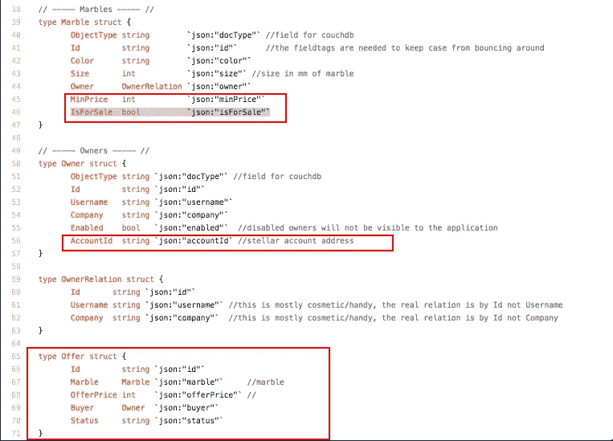

# 利用 Stellar 在 Hyperledger fabric 网络上结算交易—第 2 部分

> 原文：<https://medium.com/coinmonks/leveraging-stellar-for-settling-transactions-on-hyperledger-fabric-network-part-2-d474a414385c?source=collection_archive---------2----------------------->

*本部分包含 Hyperledger Fabric smart contract 中所做更改的技术细节，以及用于结算交易和完成 Fabric 网络中转账的 Stellar APIs。建议你看一下这个系列的* [*第一部*](/@sachinjha/leveraging-stellar-for-settling-transactions-on-hyperledger-fabric-network-8c22c141af70) *以便获得完整的背景。*

1.  **对 marbles.go 的更改**(资产定义) :

Fig 1\. (marbles.go )

2.**在 write_ledger.go 中添加了方法**来构建工作流，在该工作流中，卖家可以将弹珠标记为待售，买家可以创建带有报价的报价。鉴于上述结构，golang smart contract 发生了直接变化。这些方法是:

a)标记待售 b)发出要约 c)接受要约。

代码更改可以在[这个文件](https://github.com/sachinjha/marbles/blob/master/chaincode/src/write_ledger.go)中找到。

3.**支付客户端代码:**

几乎不需要对样本进行修改，在 Stellar API reference[中给出了发送付款](https://www.stellar.org/developers/guides/get-started/transactions.html)的示例。备忘录字段包括 offerId。

已经使用了本地货币，但是人们可以很容易地将货币转换成某种锚定资产。

**4。出售 stellar sdk** 及其在 marbles chaincode 中的依赖项

Stellar 使用'[*dep*](https://github.com/golang/dep)*'*进行依赖性管理，而 fabric 依靠'[*vendoring*](https://github.com/kardianos/govendor)*'*技术来管理外部依赖性。此[自述文件中记录了管理所有依赖项和完成此任务的步骤。](https://github.com/sachinjha/marbles/tree/master/chaincode/src/marbles/vendor)

5.**write _ ledger . go 和 lib.go **中的智能合约更改**，以验证已为给定的 offer_id 支付**

**解释用于验证支付的 Stellar API**

**a)****get transaction:**/transactions/<id>:

返回给定事务的详细信息。可以从这里读取 memo 字段，以交叉检查付款所依据的 offerId。

**b)getPayments** **用于给定交易**:/transactions/<id>/支付

返回给定交易中的付款操作。由于支付交易只有一个操作，我们可以从第一个操作中获取支付细节，该操作的类型为 payment。

为了测试这一点端到端的一些更多的变化将需要在大理石客户端仍然悬而未决。

> [在您的收件箱中直接获得最佳软件交易](https://coincodecap.com/?utm_source=coinmonks)

