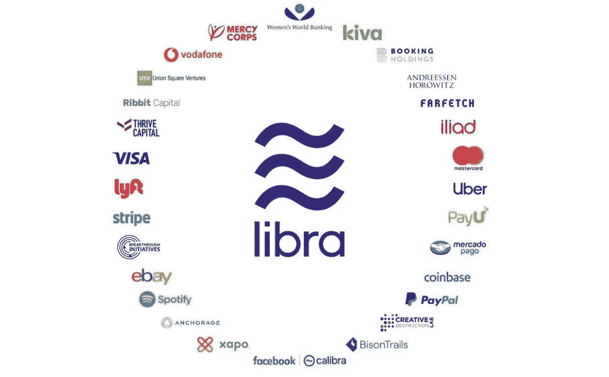

# Libra 区块链

> 原文：<https://medium.com/coinmonks/libra-blockchain-9713ea06e210?source=collection_archive---------4----------------------->

Libra 的使命是建立一个简单的全球货币和金融基础设施，为数十亿人提供支持。

[白皮书](https://libra.org/en-US/white-paper/#introduction)

[开发商文件](https://libra.org/en-US/open-source-developers/#libra_is_open)

[天秤座-cli](https://developers.libra.org/docs/reference/libra-cli)

## 议程

*   在 Mac OS 上设置 Libra Testnet
*   天秤座指令
*   Libra 帐户
*   将天秤座硬币铸造成…