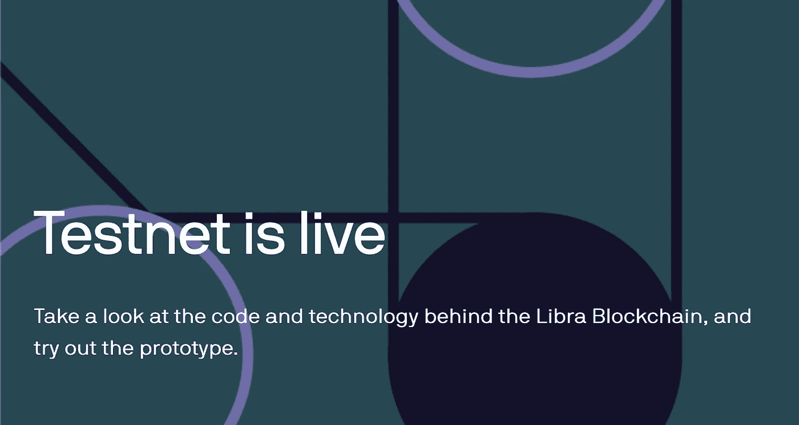
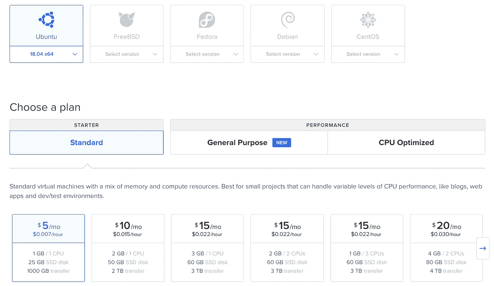
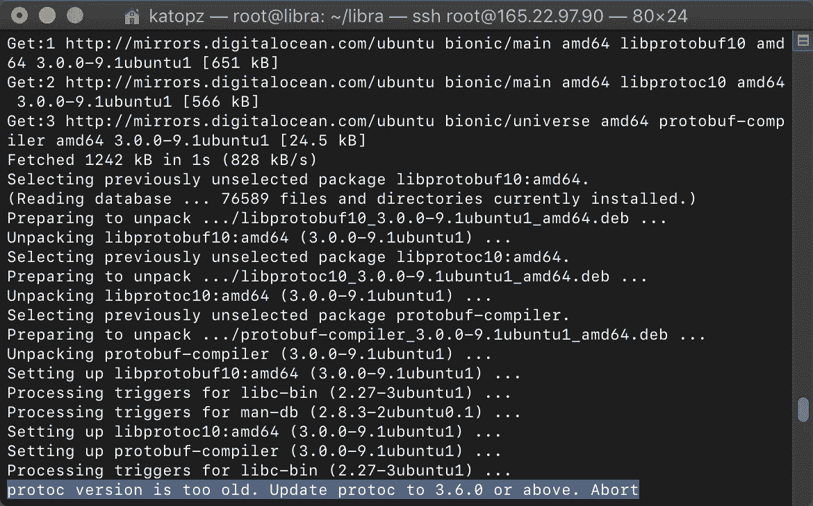
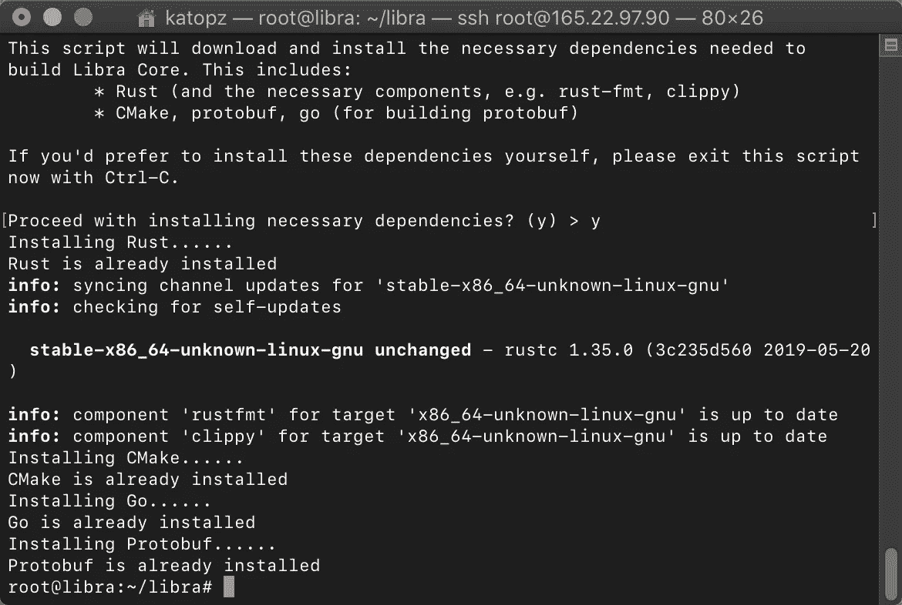
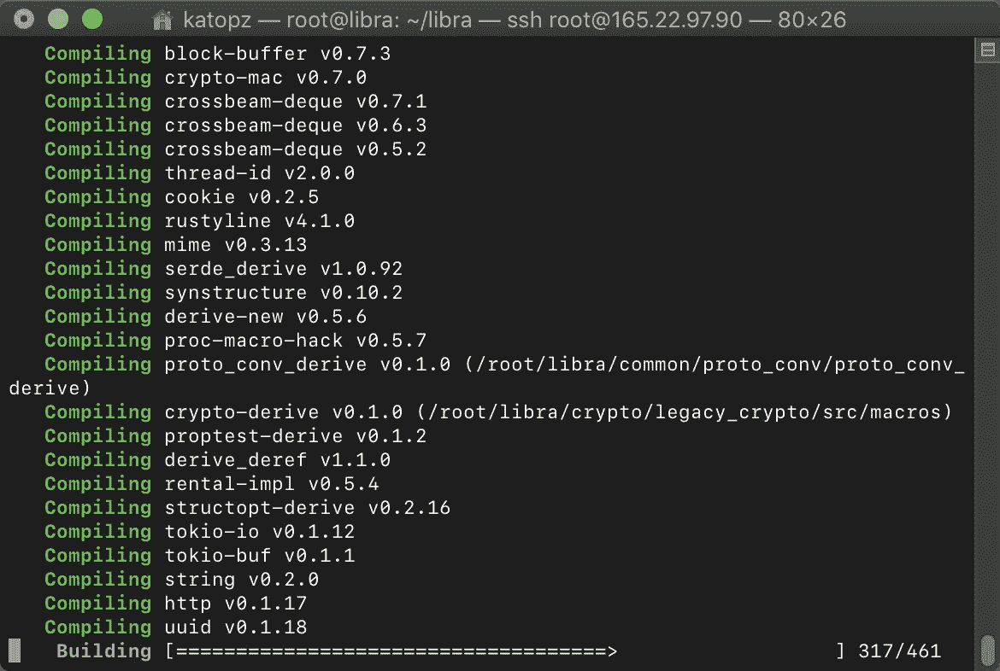
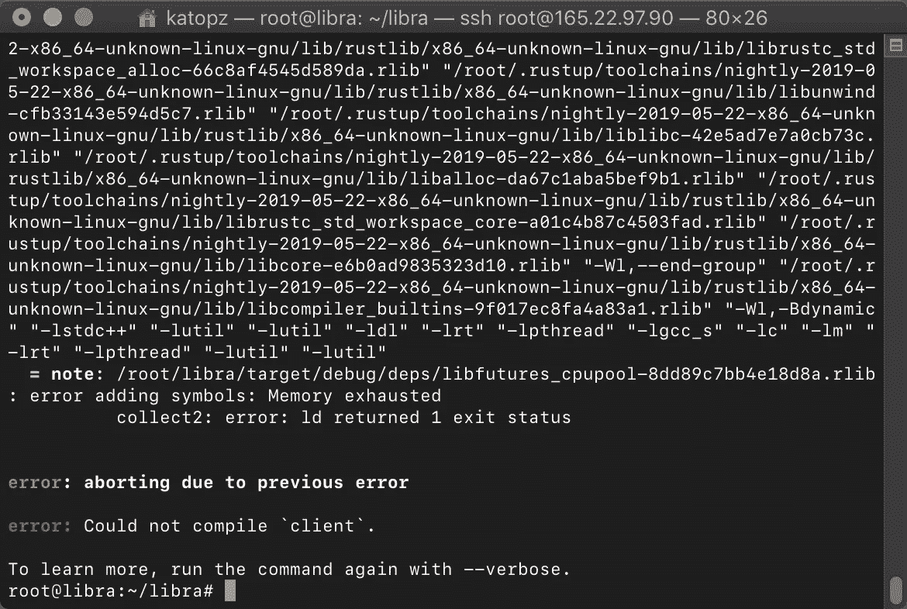
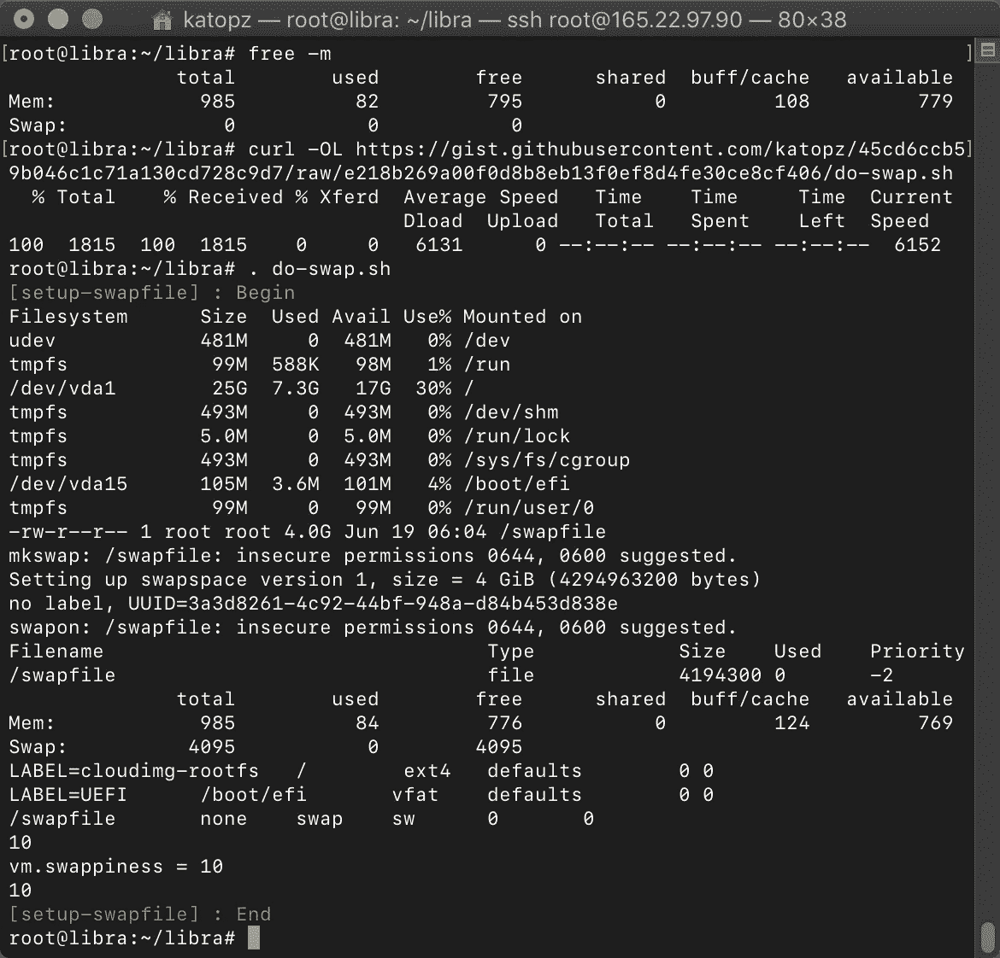
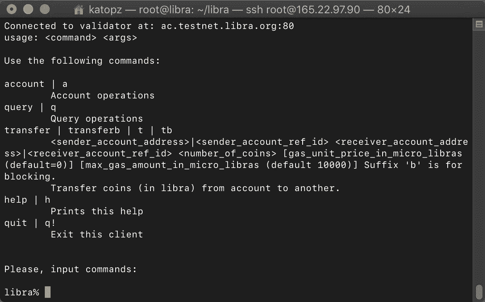
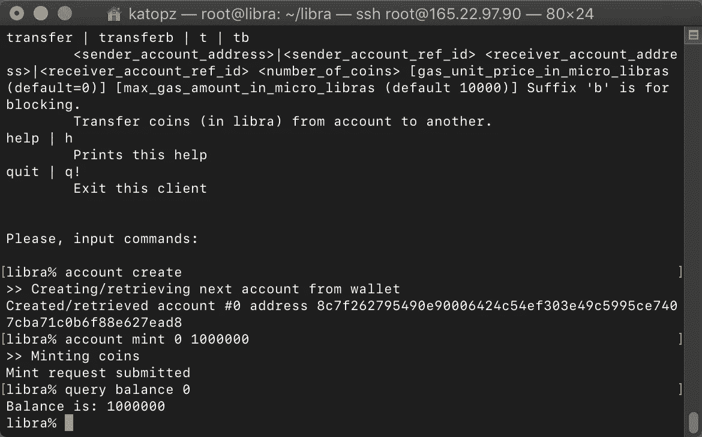

# 天秤座❤数字海洋公司

> 原文：<https://medium.com/coinmonks/libra-digitalocean-8083326bb266?source=collection_archive---------3----------------------->

**天秤座** =脸书稳定币，因为它是开源的所以让我们玩得开心点！



[https://libra.org/en-US/open-source-developers/](https://libra.org/en-US/open-source-developers/)

# 先决条件

*   【https://developers.libra.org/docs/welcome-to-libra#clients】导游 : [导游](https://developers.libra.org/docs/welcome-to-libra#clients)
*   **服务器**:使用此 [**数字海洋**](https://m.do.co/c/6dcfcc2a3392) 链接获得免费积分
*   咖啡！☕

# 衍生新服务器



这里没什么特别的，我会像往常一样选择 MVP。在这一步之后，您应该在。

```
ssh root@123.45.67.89
```

> 如果你困在这里，请谷歌“如何进入数字海洋”，这是题外话，抱歉！

# 克隆 Libra 核心存储库

一旦你进入，让我们按照医生的步骤…

```
# Clone the Libra Core Repository
git clone [https://github.com/libra/libra.git](https://github.com/libra/libra.git)# Setup Libra Core
cd libra
./scripts/dev_setup.sh# Build Libra CLI Client and Connect to the Testnet
./scripts/cli/start_cli_testnet.sh 
```

## 问题#1

```
protoc version is too old. Update protoc to 3.6.0 or above. Abort
```



protoc version is too old. Update protoc to 3.6.0 or above. Abort

## 解决方案#1

首先，检查你的**协议**版本

```
protoc --version
```

你应该得到…

```
libprotoc 3.0.0
```

这显然与 **3.6.0** 不匹配，所以让我们升级它。

在 macOs 上，你可以…

```
brew install protoc
```

没有啤酒吗？然后安装自制软件

```
/usr/bin/ruby -e "$(curl -fsSL [https://raw.githubusercontent.com/Homebrew/install/master/install](https://raw.githubusercontent.com/Homebrew/install/master/install))"
```

回到我们心爱的 Ubuntu，让我们安装 protocol(3 . 8 . 0 ATM)

你应该得到…



How to upgrade protoc for libra

Protobuf 已经安装好了耶！

## 问题#2

编译要花很长时间



Yawnnn

## **解决方案 2**

*   喝我们上面准备的☕咖啡
*   喂你的猫
*   等待它(构建发布版本大约需要 80 分钟)

## 问题#3

```
: error adding symbols: Memory exhausted
          collect2: error: ld returned 1 exit statuserror: aborting due to previous errorerror: Could not compile `client`.
```



Memory exhausted

## 解决方案 3

使用 4Gb 交换文件(或使用新的 4Gb droplet)

下载并运行

```
curl -OL [https://gist.githubusercontent.com/katopz/45cd6ccb59b046c1c71a130cd728c9d7/raw/e218b269a00f0d8b8eb13f0ef8d4fe30ce8cf406/do-swap.sh](https://gist.githubusercontent.com/katopz/45cd6ccb59b046c1c71a130cd728c9d7/raw/e218b269a00f0d8b8eb13f0ef8d4fe30ce8cf406/do-swap.sh). do-swap.sh
```



你应该得到…



testnet libra

现在，你应该能够按照下面的官方指南**“创建爱丽丝和鲍勃的账户”**…

[](https://developers.libra.org/docs/my-first-transaction#create-alice-s-and-bob-s-account) [## 我的第一笔交易天秤座

### 本文档将指导您在 Libra 区块链上执行第一笔交易。在你跟随…

developers.libra.org](https://developers.libra.org/docs/my-first-transaction#create-alice-s-and-bob-s-account) 

I’m rich!

# 概述

*   使用超过 4Gb ram 的[**digital ocean**](https://m.do.co/c/6dcfcc2a3392)**， **swapfile 不建议用于生产****
*   **升级**协议**版本以符合 libra 需求(3.6.0 或以上)**
*   **咖啡和猫是可选的！**

# **下一步是什么？**

**Docker 怎么样？**

**[](/@katopz/libra-docker-844629b5d6ae) [## 天秤座❤码头工人

### 让我们通过 docker 尝试 libra 客户端，我将提供本地、内部和 docker hub 方式。

medium.com](/@katopz/libra-docker-844629b5d6ae) 

# 待办事项

*   天秤座测试网的 RESTful
*   **Libra testnet 的 GraphQL**
*   **用天秤座测试网反应钩子**

> [直接在您的收件箱中获得最佳软件交易](https://coincodecap.com/?utm_source=coinmonks)

[](https://coincodecap.com/?utm_source=coinmonks)**

**为了支持这样的内容，请随时通过… [**PayPal**](https://paypal.me/katopz) 提示我，谢谢！**

**[](https://paypal.me/katopz) [## 使用 PayPal 向 todsaporn banjerdkit 付款。我

### 去 paypal.me/katopz 输入金额。既然是 PayPal，那就简单又安全。没有 PayPal 帐户？不…

paypal.me](https://paypal.me/katopz)**