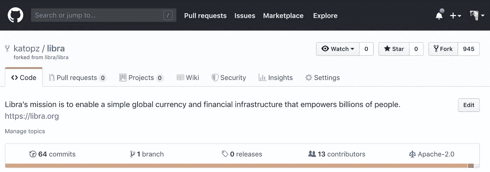
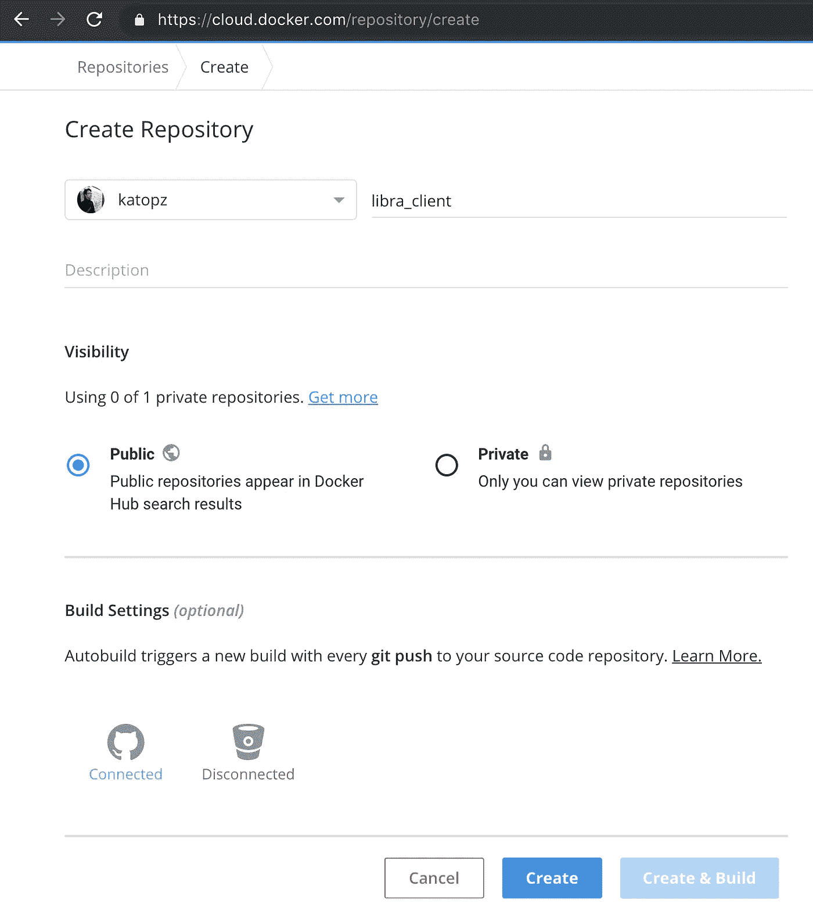
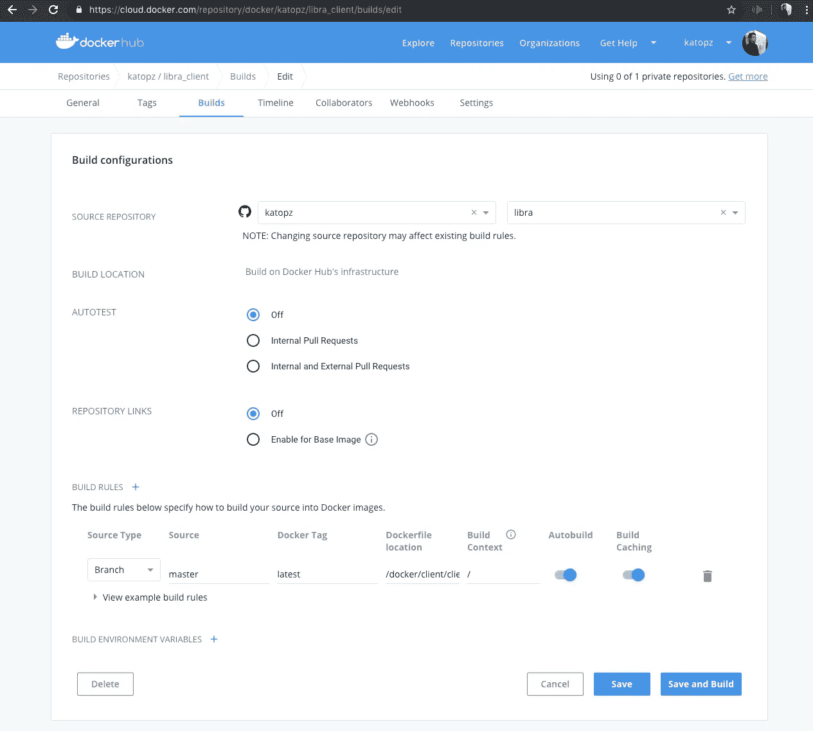
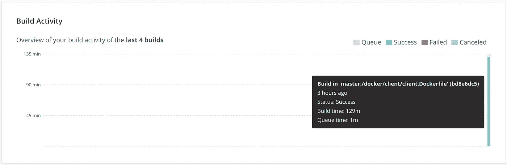

# 天秤座❤码头工人

> 原文：<https://medium.com/coinmonks/libra-docker-844629b5d6ae?source=collection_archive---------1----------------------->

🐳让我们通过 docker 试试 libra 客户端，我会提供本地 macOS，裸机和 docker hub 风格！准备好了吗？走吧。

## 基于 MacOS 构建

> 为了当地发展目的

```
git clone [https://github.com/libra/libra.git](https://github.com/libra/libra.git)
cd libra
docker build -f ./docker/client/client.Dockerfile -t libra_client .
```


## 基于 Docker Hub 构建

> 仅用于构建时，您将需要拉至您的服务器或 mac，以便稍后运行它)

*   分叉 [**天秤座回购**](https://github.com/libra/libra) 到你想要的回购



[https://github.com/katopz/libra](https://github.com/katopz/libra)

*   注册并转到[创建存储库页面](https://cloud.docker.com/repository/create)，填写 **libra_client** 作为名称并点击创建(忽略构建设置)



*   转到构建设置并填充您的 **libra** 库



*   填充 **Dockerfile** 位置

```
/docker/client/client.Dockerfile
```

*   **救**和**造**喂你猫(129 分钟！)



129 minutes!

*   若要使用它(在 mac 或服务器上)

```
docker run --rm --name libra katopz/libra_client
```

## 基于 Ubuntu 构建

> 用于在裸机上构建和运行，主要用于快速概念验证或内部使用

## 先决条件

*   **服务器**:使用此 [**数字海洋**](https://m.do.co/c/6dcfcc2a3392) 链接获得免费积分
*   保持 ssh 会话活动

## 专业提示

构建需要 80 多分钟，因此您可以从 SSH 管道中断开连接，为了确保不会发生这种情况，您需要保持客户端和服务器都处于活动状态

*   在 mac 上

```
open ~/.ssh/config
```

加上这个

```
Host *
  TCPKeepAlive yes
  ServerAliveInterval 120
```

*   在 Ubuntu 服务器上(我假设[已经有了 droplet](/coinmonks/libra-digitalocean-8083326bb266) )

```
nano /etc/ssh/sshd_config
```

加上这个

```
TCPKeepAlive yes
ClientAliveInterval 65535
ClientAliveCountMax 3
```

现在把 ssh 连接到你的服务器

```
ssh root@123.45.678.90 -o ServerAliveInterval=100
```

*   安装**对接设备**

[](https://docs.docker.com/install/linux/docker-ce/ubuntu/) [## 获取 Ubuntu 的 Docker CE

### 要在 Ubuntu 上开始使用 Docker CE，请确保您满足先决条件，然后安装 Docker。先决条件…

docs.docker.com](https://docs.docker.com/install/linux/docker-ce/ubuntu/) 

*   装载**天秤座**来源

```
git clone [https://github.com/libra/libra.git](https://github.com/libra/libra.git)
```

*   建立 Docker 图像(这需要一些时间，去喂你的猫)

```
docker build -f ~/libra/docker/client/client.Dockerfile -t libra_client ~/libra
```

## 运行它

*   运行本地 **libra_client** Docker 镜像为 **libra**

```
docker run --rm -it --name libra libra_client
```

*   远程运行(从 Docker Hub)

> 用自己的回购协议替换 **katopz/libra_client**

```
docker run --rm -it --name libra katopz/libra_client
```


## 专业提示

你也可以像这样输入到 docker 中…

```
echo account create | docker run --rm -i katopz/libra_client
```


Look ma! No hand! :D

玩得开心！

## 待办事项

*   使用 **docker 撰写**
*   使用 **docker swarm/K8S**
*   使用**云运行**

要支持这样的内容，请随时通过…[**PayPal**](https://paypal.me/katopz)**提示我，谢谢！**

**[](https://paypal.me/katopz) [## 使用 PayPal 向 todsaporn banjerdkit 付款。我

### 去 paypal.me/katopz 输入金额。既然是 PayPal，那就简单又安全。没有 PayPal 帐户？不…

paypal.me](https://paypal.me/katopz) 

> [在您的收件箱中直接获得最佳软件交易](https://coincodecap.com/?utm_source=coinmonks)

[](https://coincodecap.com/?utm_source=coinmonks)**