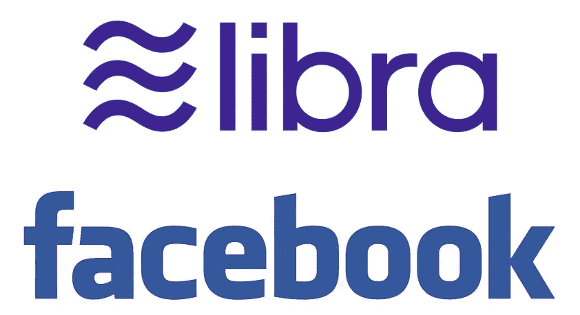
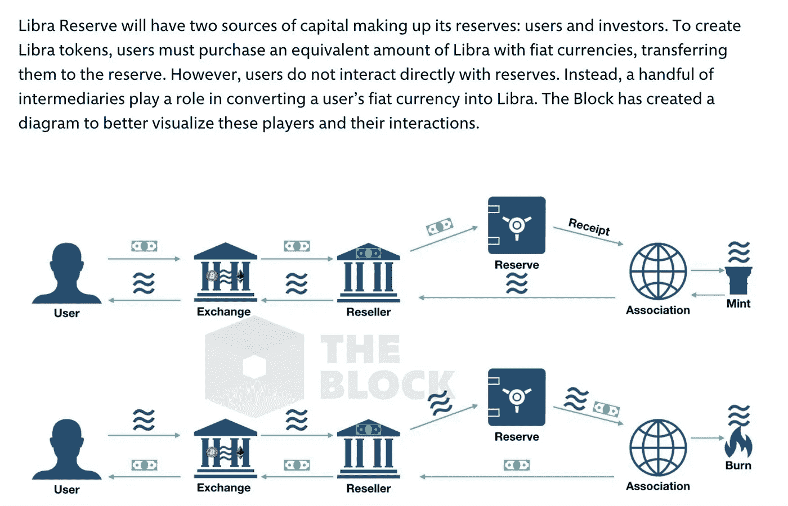
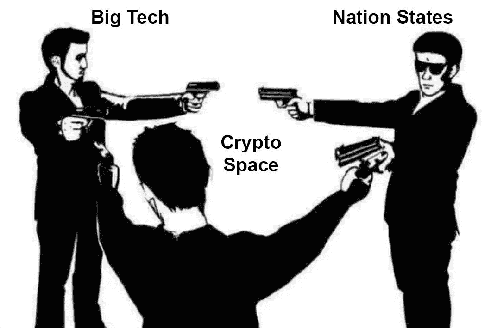

# 天秤座:分流美联储

> 原文：<https://medium.com/coinmonks/libra-forking-the-fed-67dcc376d7fc?source=collection_archive---------1----------------------->

## 天秤座代表解放。但是到底是为了谁呢？

## 定义术语:本文中的“三个天秤座”:

“天秤座”将意味着许多不同的事情。下面是我在本文中如何使用它们。

*   天秤座协会(Libra Association):一群公司，通常是科技公司，聚集在一起建立起**天秤座网络**
*   **天秤网:****天秤币**运行的区块链平台
*   **天秤座货币:**由**天秤座协会铸造和发行的数字货币。**又称天秤座币，或天秤座加密货币。

# 脸书宣布了他们建立 Libra 的计划，这是一种新的数字货币

从表面上看，天秤座似乎是脸书新的创新和实验的新产品。然而，剥开这层皮之后，很明显，天秤座对世界的状态有着重要的影响，并向我们发现自己所处的已经混乱的政治和技术环境抛出了另一个曲球。

# 天秤座到底是什么*？*

标题*“脸书宣布计划发布新的加密货币 Libra* ”甚至没有开始说明幕后真正发生了什么。

在本文中，我们将探讨 Libra 的幕后含义、Libra 货币系统的含义，并假设即将到来的政府、Libra 和加密货币之间的三方斗争。

## 天秤座旗帜

以上是天秤座发布公告的图片。科技和支付行业中最大的参与者的徽标，围绕着一个新实体及其徽标: **Libra，**这个词与“解放”和“自由”(Libre)都很接近，后者是西班牙语中“自由”(at liberty)的意思。

乍一看，Libre 看起来像一个集体。公司联合起来为世界创造新的利益的协会。现实要邪恶得多。理解了天秤座系统背后的经济学，这个图像实际上是什么就变得更加明显了。

## 天秤座是大型科技公司独立于政府控制的货币的宣言

天秤座宣言周围的标志实际上是天秤座创始人的签名。这些标志的附加是 Libra 对所有政府机构的声明:“你必须与我们所有人战斗”，“我们太大了，不能停下来”，以及最具战略性的，“忘记反垄断，因为没有一家公司经营 Libra”。这是五月花号的水手们在从英国君主的暴政下获得自由后，在新大陆的海岸上插下的旗帜。

现实可能没有上面的比喻那么夸张。除了脸书之外，没有一家与 Libra 签约的公司是欠该组织的。然而，如果天秤座真的成为一种成功的替代货币，这就是将要描述的故事。

大型科技公司总是在政府监管之外进一步发展，尤其是在脸书。这是最近的，也许是有史以来最激烈的一步。

# **加密货币教会了脸书策略**

加密货币的上一个市场周期太大，大型科技公司无法忽视。大多数科技公司都对区块链科技的某些方面感兴趣。毫无疑问，他们精通技术的员工和加密货币社区有所重叠。与普通人不同，科技公司高管更适合对加密货币的复杂性和含义感兴趣，并理解它们。

比特币和以太坊催生的故事显然很好地被技术领导层所理解。

*   政府不再垄断货币发行
*   单一全球货币体系缺失了一块空白
*   分散的网络很难停止
*   可编程货币很酷

Libra 是一群大型科技公司，他们希望抓住加密货币已经证明可以存在的价值。

# 天秤座经济学

简而言之，天秤座是一个新的**中央银行。**

一个中央银行有两个主要组成部分:**资产和负债。**

**资产**是银行*拥有*的东西。**负债**或债务，是银行*欠*的东西。设想两列:正(+)列，增加所有资产的总价值，负(-)列，从所有资产的总价值中减去。

当你把所有的资产和负债加在一起，你就得到银行或公司的权益。虽然中央银行没有股票，天秤座却有。Libra network 的股票可以作为财产购买和拥有，并添加到公司的资产项中，就像旗帜中显示的那样。

在其文件中，Libra 的资产项被称为“准备金”。天秤座储备的摘录说明了天秤座的储备(以及其权益)将如何增长。

> 储备金的钱从哪里来？储备中的钱将有两个来源:投资于**独立** **投资令牌**的投资者，以及天秤座的**用户。该协会将向创始会员支付 Libra 币奖励，以鼓励用户、商家和开发者采用。作为激励措施分发的硬币的资金将来自投资者的私募。在用户方面，要创造新的 Libra 硬币，必须有一个等价的 Libra 购买 fiat，并将该 fiat 转移到储备。因此，随着用户对 Libra 需求的增加，储备也会增加。简而言之，在投资者和用户双方，只有一个方法来创造更多的 Libra——为菲亚特购买更多的 Libra，并增加储备。**

[来源](https://libra.org/en-US/about-currency-reserve/#the_reserve)

## 拥有天秤座网络

明白了这一点，我们就能清楚地看到天秤座将如何与美联储竞争和抗衡

*   通过购买 Libra 投资令牌的实体(如那些带有 Libra 标志的公司)，以及购买和使用 Libra 货币的用户/客户，Libra 的权益增长。
*   那些拥有天秤座投资权标(即*权益权标*的人获得所有货币的利息份额，以及天秤座资产的增值
*   天秤座的债务是天秤币，天秤协会有能力自由铸造和分配。摘自上述段落:

> 该协会将向创始会员支付 Libra 币奖励，以鼓励用户、商家和开发者采用。

*   在这里，听起来天秤座协会有能力自由铸造天秤座硬币，以引导天秤座网络，并迅速扩大其资产的增长。

Libra 的目标是鼓励各公司购买 Libra 投资代币(Libra 股票)。这做了两件事

1.  增加天秤座的资产
2.  激励公司向 Libra 网络提供服务

天秤座的资产是天秤座的主要价值主张。这些资产是支撑 Libra 加密货币的“银行资金”。虽然天秤座加密货币的价值通常会保持稳定，但天秤座持有的所有证券的升值，以及天秤座持有的所有货币(美元、欧元、人民币……)产生的利息增加了天秤座资产的价值，而没有增加其债务额。持有 Libra 投资代币的 Libra Assoication 成员(以及 Libra 的权益)获得了 Libra 投资增长的所有价值，而不必向 Libra 加密货币的所有者“支付”。

第二个价值主张是 Libra 加密货币和 Libra 网络提供的金融服务。随着每家公司加入 Libra，他们将自己的商品和服务添加到 Libra 网络中。让 Visa、Mastercard 和 PayPal 等商户参与进来，让 Libra 能够实现比比特币或以太网更大的支付规模，同时也让 Libra 能够在更多地方被接受。这增加了可能持有天秤座加密货币的人数。天秤座加密货币是天秤座央行的债务栏，对天秤座债务的高需求类似于天秤座获得 A+信用评级，因为天秤座货币持有者强烈相信天秤座有能力偿还债务。

## 窃取美联储的唯一伎俩

美联储之所以是这样，是因为它可以印刷美元，这是事实上的世界货币。如果没有这一招，它将只是另一家拥有债务、资产和股权的银行。取而代之的是，它用自己的股权(因此失去了被收购或私有的能力)和来换取印钞的能力。这是美国政府给予美联储的浮士德交易。美国政府对美联储说:*“你可以印钞，但不能成为公司”……* **因明显的原因。**

如果你认为脸书对美联储的比赛对脸书来说不会有好结果，那就再想想吧。如果脸书是一个拥有 24 亿人口的国家，它将是地球上最大的国家。然而，Libra 并不止于脸书，因为加入 Libra 协会(……Libra 哗变)对任何公司都是开放的，只要他们通过购买 Libra 投资代币(基本上是股票)将资金添加到 Libra 资产项，并加入发展 Libra 网络(基本上是公司)的激励。

随着 Libra 的成功，以及全球对 Libra 货币的接受，脸书和 Libra 协会复制了美联储印刷世界使用的货币的能力。这就是为什么美国监管机构对这个话题如此狂热。这也是为什么加密货币社区不认为 Libra 是他们成功的威胁。美国监管机构希望控制他们控制货币供应的能力，而加密货币爱好者认为他们的协议控制的货币发行算法是货币未来的答案。

# 博弈论视角下的网络成长

脸书给了所有科技公司一个选择:要么购买 Libra 投资代币，要么冒着错过拥有有史以来最大的单一货币网络的风险。这个最后通牒呈现的游戏是天才。加入 Libra 网络的成本相对较低，因为支持网络和接受货币不会给加入的单个公司增加太多风险。监管机构不能限制一家公司验证区块链网络上的交易，或接受区块链的本币。

因为加入 Libra 网络的风险相对较低，而错过 Libra 网络的风险较高，公司可能会蜂拥加入 Libra 协会。这让脸书有能力宣称他们不是在掌舵，他们只是另一家帮助 Libra 网络发展的公司。避免了反垄断。

# 天秤座在解放谁？

天秤座对个人来说不是自由。这是一家向美国美联储伸出中指的巨型科技公司。是脸书对反垄断法嗤之以鼻，对美国监管机构说“太晚了”。

在过去的十年中，我们已经看到科技公司创造了越来越多的反乌托邦收入来源，因为不断前进的软件学会了如何捕捉新的价值流。脸书已经有了政府 ID 最成功的替代品:“用脸书登录”按钮。

互联网曾被设想为这个民族国家不可知论的网络领域，在那里自由主义统治，个人没有任何限制。随着大型科技公司接管互联网，它基本上将人们花时间浏览的 90%的网页商业化了。加密货币的世界证明了你可以拥有一种互联网原生货币。率先向国会说“去你的”的脸书，已经抓住机会催生了一个新的美联储，但这次是以股权形式，由大型科技公司所有。

如果成功，Libra 可能会成为本世纪最大的故事之一，因为资本主义和技术进一步脱离了民族国家的控制，进入了他们基于互联网的领域。

# 真正加密货币的重要性

让大家知道，天秤币不是真正的加密货币。加密货币是价值的数字表示，其价值来自内在价值，不一定来自资产支持。Libra 货币从 Libra Associations 资产列中的资产获得其价值。加密货币，像比特币或以太，有内在价值，而不是外在价值；它们自己产生价值，与“现实世界”没有任何有形的联系。与 Libra 不同，Ether 或比特币没有可被政府查封的资产。虽然所有这些货币都存在于同一个互联网空间，天秤座以传统方式获得其价值；互联网领域之外的真实世界资产。

Libra 缺少的关于加密货币的另一个重要特性是，真正的加密货币允许网络的无许可验证。要验证比特币区块链，你只需要一台能运行 SHA-256 算法的电脑。以太坊的话，你的电脑里需要一个 GPU(而以太坊 2.0，你只需要拥有以太)。为了验证 Libra 网络，你需要被允许进入 Libra 协会，并支付 1000 万美元的入场费。一家公司的血祭，以确保对天秤座黑手党的承诺是坚定的。

# 三方战争

加密货币告诉世界，你不需要政府来管理货币。

大型科技公司已经表明，他们比政府更有能力收集和解释大量个人数据。

政府在试图监管这两个行业时陷入困境。在婴儿潮一代的带领下，政府(尤其是美国政府)表现出明显的无能，无法真正理解软件和计算机科学的前沿正在开发什么。

这场争夺地球上人类的三方拉锯战才刚刚开始，民族国家的前景并不乐观。

想听更多这方面的内容吗？请听 POV Crypto 一集，作者 David 和 Christian 在其中解开了 Libra 公告，并讨论了本文中的各种概念。

## [POV Crypto 第 59 集——天秤座:分流美联储](/@TrustlessState/59-libra-forking-the-fed-322e0f8e1285?postPublishedType=initial)

## 在 Twitter @trustlessstate 上关注我

## 在 Twitter @povcryptopod 上关注我的播客

> [在您的收件箱中直接获得最佳软件交易](https://coincodecap.com/?utm_source=coinmonks)

