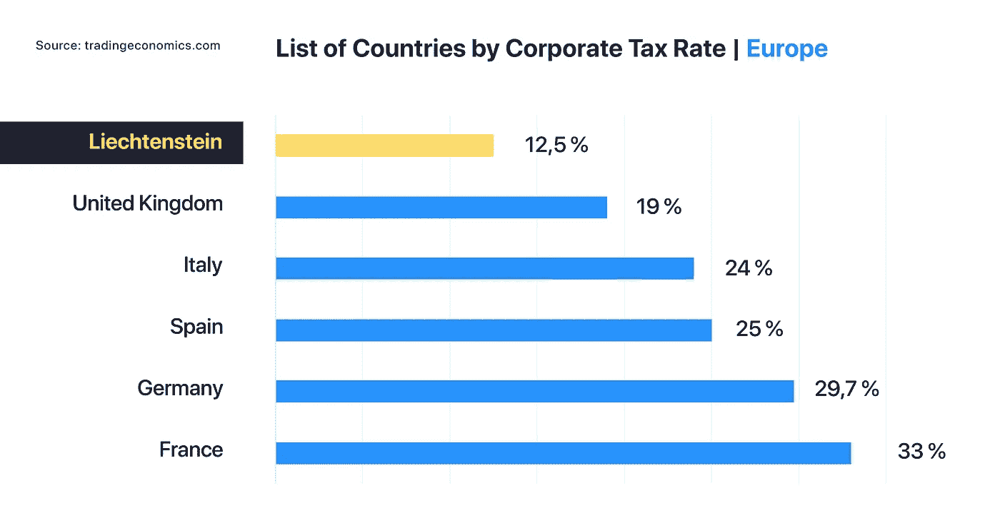

# 列支敦士登——这个微小但强大的国家正在区块链上全力以赴

> 原文：<https://medium.com/coinmonks/liechtenstein-the-tiny-but-mighty-alpine-state-going-all-in-on-blockchain-c70018b5209e?source=collection_archive---------2----------------------->

不是我们想听起来老套，而是……尺寸真的很重要吗？今天我们关注列支敦士登——世界第六小国，也是世界加密地图上最热门的地方之一。

## 估量机会

列支敦士登官员完全了解在其控制下的 160 公里的海面。对他们来说，不像其他世界政治家，这个国家的小领土实际上是一个很大的优势。

一个简单而透明的投票系统，再加上人口的减少，在确保支持新的州项目或通过立法方面提供了很大的灵活性。

早在 2016 年，列支敦士登政府就任命了一个工作组起草“基于可信技术的交易系统法”，也被称为区块链法。

列支敦士登总理阿德里安·哈斯勒在 2018 年[金融论坛列支敦士登 2.0](https://www.liechtensteinusa.org/article/keeping-a-grip-on-blockchain) 上正式介绍了区块链法案。在他看来，这套新法律将在为创新公司及其客户提供法律确定性方面发挥至关重要的作用。

为了保证用户和公司在代币经济中享有高度的法律安全，需要一个坚实的法律基础。迄今为止，任何国家都没有这种法律框架。列支敦士登政府将推出第一个区块链法案。

首相对区块链科技的承诺不容小觑。今年早些时候，他甚至[写了一篇文章](https://www.nzz.ch/meinung/rechtssicherheit-fuer-die-token-oekonomie-ld.1447043)概述这项即将出台的法律的重要性。

区块链技术的潜力不仅仅在于金融服务领域。区块链可以发挥作用的广泛领域通常被称为“象征性经济”。代币经济只不过是我们经济(包括金融服务)数字化的又一步。

为了全面监管代币经济，《区块链法》重点关注多个关键领域，包括:

*   安全性和资产令牌化
*   数字资产的所有权(公用设施和安全令牌、加密货币)
*   数字资产所有权的转移
*   数字资产存储的安全标准
*   数字资产存储的法律要求
*   代币经济中的商业许可证方案
*   首次硬币发行(ico)和其他代币生成事件(tge)

总体而言,《区块链法》( Blockchain Act)预计将在 2019 年年中成为具有法律约束力的法律，可以被解读为对世界的一个心照不宣的声明:列支敦士登是一个亲区块链、对加密友好的目的地。或者干脆说:“列支敦士登开门营业”。

这一点尤其重要，因为许多区块链和加密公司更愿意在欧洲的中心建立业务，而不是在马耳他、直布罗陀、新加坡、百慕大或开曼。

## 有远见的君主政体

你并不孤单。当有人提到“皇室”时，“现代”并不是第一个想到的词。好吧。也许我们只是有点嫉妒…

Lorde is jealous too.

抛开我们的个人观点不谈，事实证明，列支敦士登政府在接纳公共行政部门可能采用的新技术方面持开放态度。

在最近接受美国消费者新闻与商业频道采访时，世袭的列支敦士登王子阿洛伊斯表达了他对运用区块链技术改善治理的乐观态度。

“区块链将改变很多事情，它甚至可能有助于提高我们国家的管理效率。”

当被问及他对加密货币的立场时，这位皇室成员形容当前的市场“风险很大”。然而，阿洛伊斯留下了一些希望的空间:“特别是在这种全新的数字经济中，这是未来需要深入研究的事情。”

**更强的“合力”**

列支敦士登是欧洲经济区的非欧盟成员，该经济区允许公国进入欧盟单一市场。虽然这意味着该国需要遵守某些与欧洲经济区相关的法律，但这也意味着它不依赖于布鲁塞尔决定的对该地区最有利的任何事情。

但是不要对欧盟有错误的印象。事实上，欧盟一直在认真采取措施，在其境内推广区块链技术。2018 年初创建的欧盟区块链观察站(欧盟委员会的一项倡议)可能是最好的例子。

这一领域的其他重要进展包括启动了一项名为“[区块链社会公益奖](https://ec.europa.eu/research/eic/index.cfm?pg=prizes_blockchains)”的 500 万欧元奖金，以及欧洲议会工业、研究和能源委员会最近通过的一项决议，该决议将区块链技术作为经济共同体内部创新竞赛的一个重要因素。

在这些政府支持的积极举措之后，列支敦士登上个月决定[加入](https://ec.europa.eu/digital-single-market/en/news/liechtenstein-joins-european-blockchain-partnership)欧洲区块链伙伴关系，成为第 28 个这样做的国家。

简而言之，这一多边伙伴关系使签署国在建立欧洲区块链服务基础设施(EBSI)方面保持合作——这是部署跨境数字公共部门服务的第一步。如果一切按计划进行，EBSI 将于今年晚些时候启动，提供“欧盟海关和税收数据、EU-资助项目的审计文件、跨境文凭和资格认证，以及建立在 eIDAS 基础上的欧洲自主身份倡议”等服务

**死亡和税收**

正如本杰明·富兰克林曾写道:除了死亡和税收，没有什么是确定的。列支敦士登当局确保充分利用这一现实，将该国变成避税天堂。这是该国吸引新企业和富人战略的基石。

在阿尔卑斯山州，个人必须在每个纳税年度开始时以瑞士法郎申报他们的密码持有量。但关键在于:加密货币交易的投机利润不需要缴税。

相反，法律实体需要申报通过加密货币投资实现的利润，当然，个人免税并不适用。然而，他们可以享受 12.5%的统一公司税，是欧洲和世界上最低的公司税之一。

这就是了。列支敦士登清楚地证明了规模并不那么重要。从标准普尔(Standard & Poor's)的 AAA 评级，到与欧盟友好而谨慎的关系，再到全面的区块链法案和迷人的山地景观，这个小型金融中心有很大潜力成为区块链和加密中心。

## 关于[地穴](https://medium.com/u/3c3059b00067?source=post_page-----c70018b5209e--------------------------------)

根据毕马威和 H2Ventures 的说法，Crypterium 是最有前途的金融科技公司之一。我们的目标很明确:有了 Crypterium，无论你用传统货币做什么，你都可以用数字资产来做。

> [直接在您的收件箱中获得最佳软件交易](https://coincodecap.com/?utm_source=coinmonks)

