# 有和没有币安的生活

> 原文：<https://medium.com/coinmonks/life-with-and-without-binance-37df56f9c0bd?source=collection_archive---------5----------------------->

## 我们观察了币安在 2019 年 5 月 8 日至 15 日暂停提款/存款对以太网和一些代币的整体资金流有何影响。资金被盗后，由于币安采取的安全措施，币安用户的存款和取款被禁止。

# 我们如何构建令牌图

Bloxy.info 的 Token Graph 允许可视化指定时间范围内的主要资金流动:

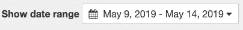

和选定的货币。

我们使用令牌图来构建币安暂停之前、期间和之后的资金流动图。我们选择了主要交易所的一部分，包括币安、Bitfinex、Okex、UpBit 和北海巨妖。

此外，您还可以使用该工具，试验由图表顶部的滑块控制的详细程度:

你会看到币安对以太坊的多重代币流有多么巨大的影响，尤其是自己的代币，BNB。

眼见为实…

# 事件发生前的乙醚流量

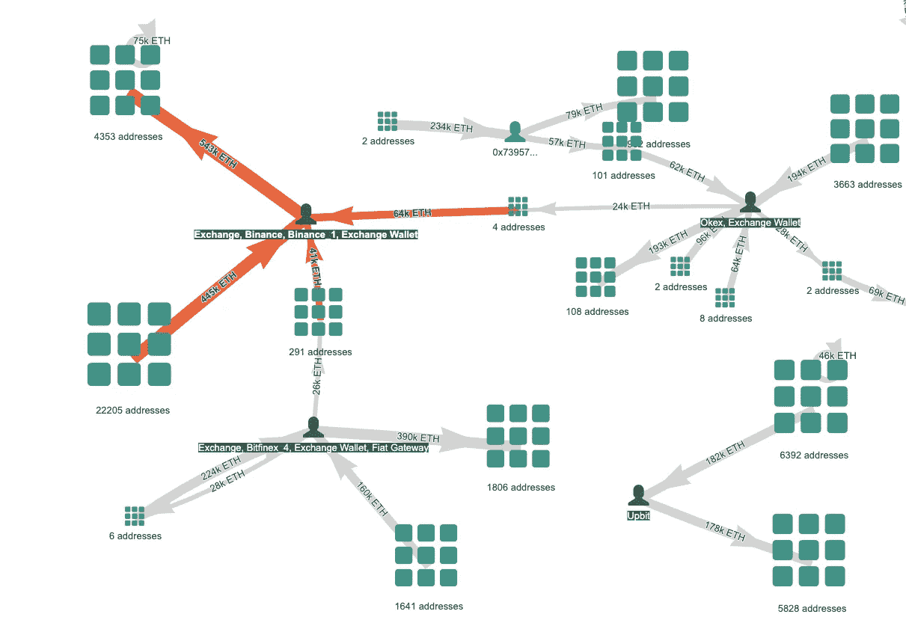

Ether 1–8 May, by [Token Graph, Bloxy.info](https://bloxy.info/token_graphs/ETH#)

# 币安悬架期间的乙醚流量

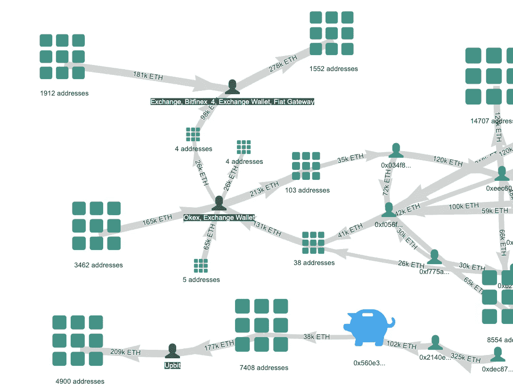

Ether 9–14 May, by [Token Graph, Bloxy.info](https://bloxy.info/token_graphs/ETH#)

# 币安悬架后的乙醚流量

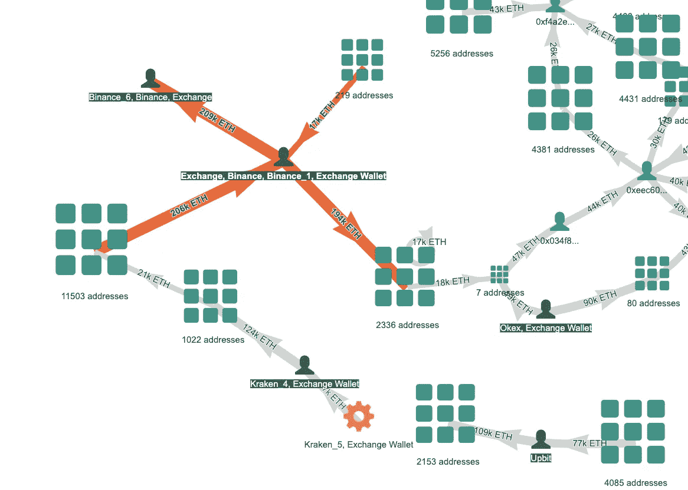

Ether 15–16 May, by [Token Graph, Bloxy.info](https://bloxy.info/token_graphs/ETH#)

# 事件发生前的 TUSD(系绳)令牌流

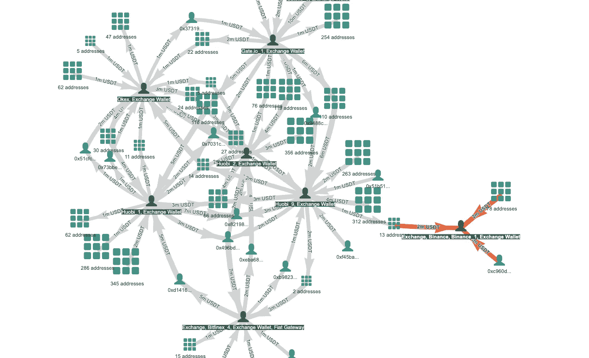

TUSD 1–8 May, by [Bloxy.info Token Graph](https://bloxy.info/token_graphs/0xdac17f958d2ee523a2206206994597c13d831ec7#)

# 暂停期间的 TUSD(系绳)令牌流

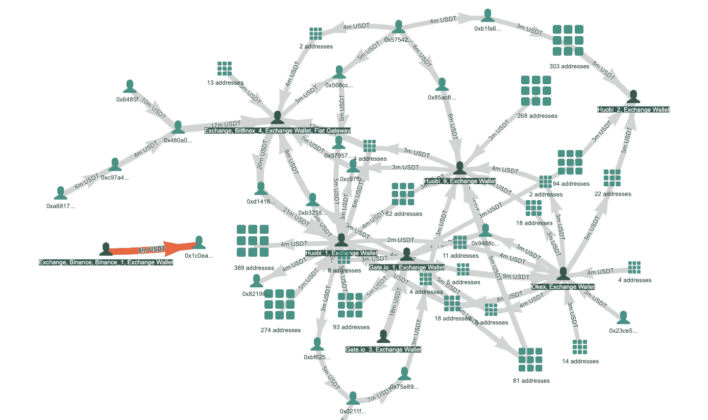

TUSD 9–14 May, by [Bloxy.info Token Graph](https://bloxy.info/token_graphs/0xdac17f958d2ee523a2206206994597c13d831ec7#)

# TUSD(系绳)令牌流暂停后

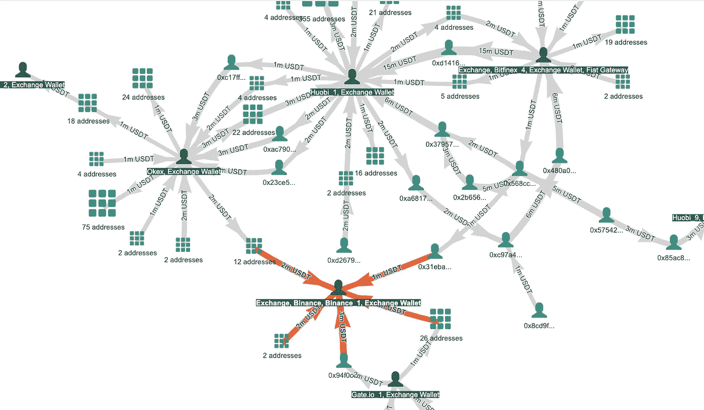

TUSD 15–16 May, by [Bloxy.info Token Graph](https://bloxy.info/token_graphs/0xdac17f958d2ee523a2206206994597c13d831ec7#)

# 事发前 BNB 代币流向

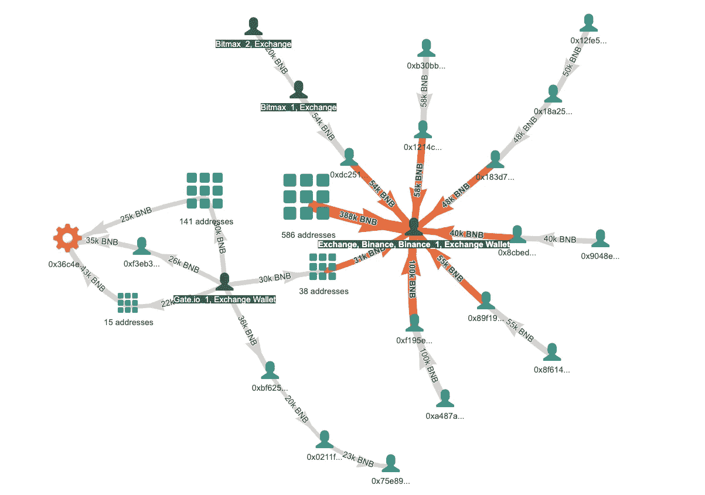

BNB 1–8 May, by [Bloxy.info Token Graph](https://bloxy.info/token_graphs/0xb8c77482e45f1f44de1745f52c74426c631bdd52#)

# 暂停期间的 BNB 令牌流

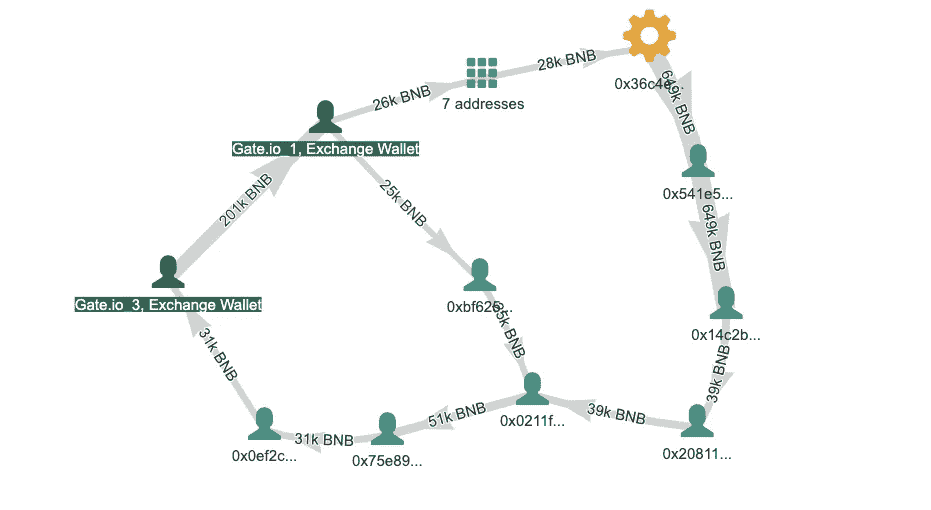

BNB 9–14 May, by [Bloxy.info Token Graph](https://bloxy.info/token_graphs/0xb8c77482e45f1f44de1745f52c74426c631bdd52#)

# BNB 令牌流暂停后

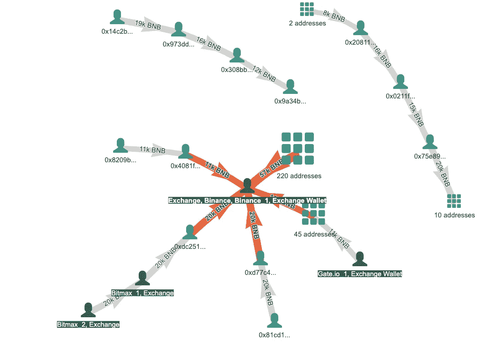

BNB 15–16 May, by [Bloxy.info Token Graph](https://bloxy.info/token_graphs/0xb8c77482e45f1f44de1745f52c74426c631bdd52#)

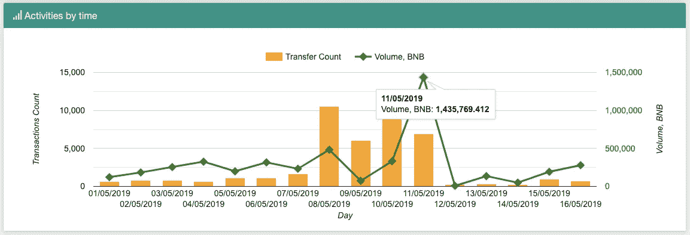

BNB transfers / volume over time, by [Bloxy.info](https://bloxy.info/address/0xb8c77482e45f1f44de1745f52c74426c631bdd52)

非常有趣地看到，在暂停期间，BNB 令牌周围的活动甚至有所增加，特别是在 5 月 10 日至 11 日。

这段时间发生了什么？这是:

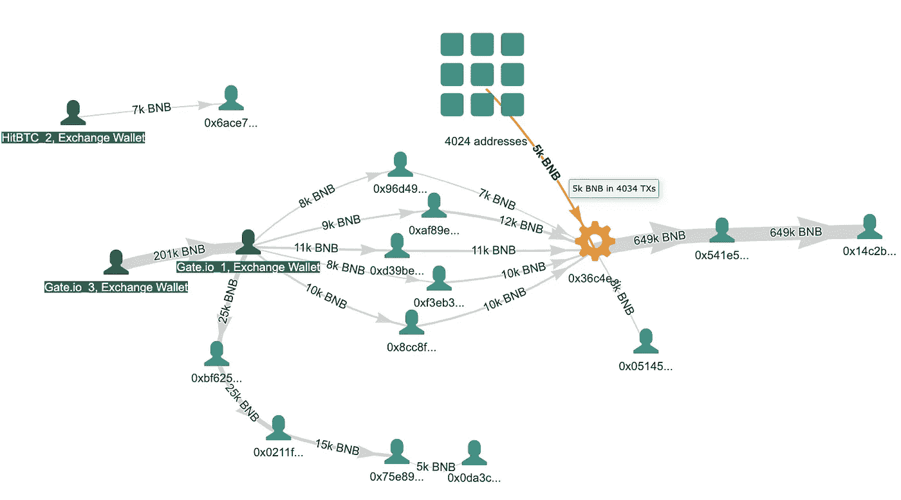

BNB flow 9–11 May, by [Bloxy.info Token Graph](https://bloxy.info/token_graphs/0xb8c77482e45f1f44de1745f52c74426c631bdd52#)

# 你自己试试——很有趣！

以太网令牌图可在链接:[https://bloxy.info/token_graphs/ETH](https://bloxy.info/token_graphs/ETH)获得

对于所有其他 ERC20/223/721 令牌，您可以在 Bloxy.info 上搜索令牌，然后选择“令牌图”选项卡。

令牌图也可以在 REST JSON API 中访问:【https://bloxy.info/api_methods#token 

[Bloxy 频道](https://www.youtube.com/channel/UCwk7mPo96sjS6xZ3rBnZt_A)上的一系列视频稍微解释了一下如何使用它:

Token Graph Explained

> [直接在您的收件箱中获得最佳软件交易](https://coincodecap.com/?utm_source=coinmonks)

