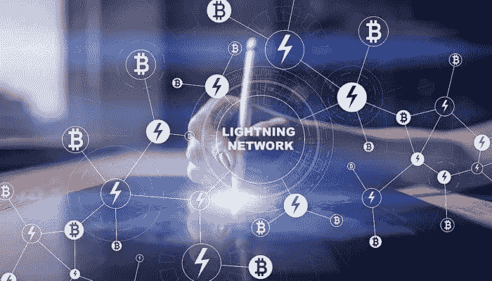

# 闪电网络

> 原文：<https://medium.com/coinmonks/lightning-network-7fcdf3e7b735?source=collection_archive---------9----------------------->

[https://www.newsbtc.com/2018/06/26/bitcoins-lightning-network-capacity-issues-remain-pressing-problem/](https://www.newsbtc.com/2018/06/26/bitcoins-lightning-network-capacity-issues-remain-pressing-problem/)

**关于**

2017-2018 年是区块链可扩展性的一年。在第 1 层和第 2 层下提出了许多解决方案。第 1 层解决方案将涉及核心区块链代码的更改。第 2 层协议涉及位于主链顶部的解决方案。闪电网络是流行的第 2 层解决方案之一。

**历史**

2015 年，约瑟夫·潘(Joseph Poon)和撒迪厄斯·德莱贾(Thaddeus Dryja)首次提出了《闪电网络》( Lightning network)白皮书。协议[规范](https://github.com/lightningnetwork/lightning-rfc/blob/master/00-introduction.md)于 2017 年 12 月发布。最初的实施来自 3 个组织—

1.  ACINQ — [艾克蕾尔](https://github.com/ACINQ/eclair)(闪电网络的 Scala 实现)
2.  block stream—[C-lightning](https://github.com/ElementsProject/lightning)(C 实现)
3.  闪电实验室—闪电网络守护程序( [lnd](https://github.com/lightningnetwork/lnd/) )

许多新团队正在努力建立他们的客户。即使这些是目前在比特币 mainnet 上测试版中流行的。此外，所有三个团队都在致力于一个可互操作的 LN(闪电网络)，使其对消费者更加友好。

LN 最初的目标是比特币。还有其他加密货币也启动了该协议，如 Litecoin、Stellar、Zcash、Ether 和 Ripple。

**它是如何工作的？**

基本上，闪电网络依靠支付渠道的概念。假设有两个人，我们著名的 Alice 和 Bob 想用 LN 来下一盘棋。他们为获胜者设立了 10 BTC 的奖金。下面是建立 LN 通道的步骤。

1.  艾丽丝和鲍勃每人投入 5 英镑，建立了一个多签名钱包。这笔交易将与钱包地址一起记录在主比特币区块链上。在两个节点之间创建支付通道。每当创建一个频道时，都会收取少量费用。
2.  此外，如果 Alice 和 Bob 不想为自己建立通道，他们甚至可以使用连接节点进行事务处理。这里唯一的问题是促进交易的节点可能会再次收取一些费用。
3.  现在，爱丽丝和鲍勃可以进行任意数量的交易。这些也是即时的，它们不需要像主链一样等待确认。
4.  所有的交易、对余额的更新都被提交到位于每个节点的资产负债表中。
5.  当他们完成游戏并准备关闭通道时，Alice 和 Bob 可以向主链提交资产负债表。请注意，主链不必执行 Alice 和 Bob 进行的所有中间事务。只有最后一个有期末余额。
6.  关闭一个频道也将确认主链上 Alice 和 Bob 的平衡。如果存在任何差异，则存在一个挑战期，在此期间，任何通道成员都可以通过提交来自其节点的交易历史来对抗。如果确定为受害者，所有 10BTC 将归受害者所有。

**好处**

*   适合微交易。
*   快速即时交易。LN 报价一百万 tps。
*   非常少的交易费用。
*   更多隐私。
*   桌面和移动客户端都可用，这意味着您可以使用 LN 进行支付，即使是移动支付。

**问题..问题..问题。**

*   LN 仍处于 beta 测试阶段。
*   它需要更多的人采用来实现提到的可伸缩性。
*   大额支付是困难的。目前，7800 个频道中最多只能有 20 美元。任何高于 5 美元的东西都有很高的失败率。
*   流动性非常少。
*   截至今天，10 个节点拥有主要容量。集中化的范围。目前，0.4 %的节点控制着 51%的容量。
*   为了使通道工作，节点需要联机。对于移动客户端来说非常困难。
*   不是所有的 LN 客户端现在都是用户友好的。
*   关闭一个支付通道有时需要几个小时。
*   不支持离线支付。
*   在 LN 网络上执行了一次 DDOS 攻击，导致许多节点宕机，这是一个很大的风险。

**未来前景**

*   瞭望塔和备份——这些有助于保护像手机这样的轻型客户端节点。
*   原子多方支付(AMP) —允许将大额交易拆分为一系列较小的交易。
*   更加用户友好的轻型客户端。
*   更好的路由协议。
*   跨链原子交换—在单独的区块链中即时交换资产。

**结论**

和区块链的所有事物一样，LN 还没有完全成熟。虽然它是供公众使用的测试版，但是你会有一定的风险。我们将不得不等待，看看这将走向何方..:)

**参考文献**

1.  [https://coin telegram . com/explained/lightning-network-explained](https://cointelegraph.com/explained/lightning-network-explained)
2.  [https://lightning . net/](https://lightning.network/)
3.  [https://medium . com/the daily dose/lightning-network-status-report-major-flaws-and-topology-concerns-AE 2c 9 f 0 D1 be](/thedailydose/lightning-network-status-report-major-flaws-and-topology-concerns-ae2c9f0d1be)
4.  [https://www . coin desk . com/bitcoins-lightning-network-problem-people-already-use/](https://www.coindesk.com/bitcoins-lightning-network-problem-people-already-using/)
5.  https://explorer.acinq.co/
6.  [https://www . investopedia . com/tech/比特币-闪电-网络-问题/](https://www.investopedia.com/tech/bitcoin-lightning-network-problems/)
7.  [https://dev . lightning . community/](https://dev.lightning.community/)
8.  [https://blog . lightning . engineering/announcement/2018/03/15/lnd-beta . html](https://blog.lightning.engineering/announcement/2018/03/15/lnd-beta.html)
9.  [https://www . news BTC . com/2018/06/26/bitcoins-lightning-network-capacity-issues-remain-pressing-problem/](https://www.newsbtc.com/2018/06/26/bitcoins-lightning-network-capacity-issues-remain-pressing-problem/)