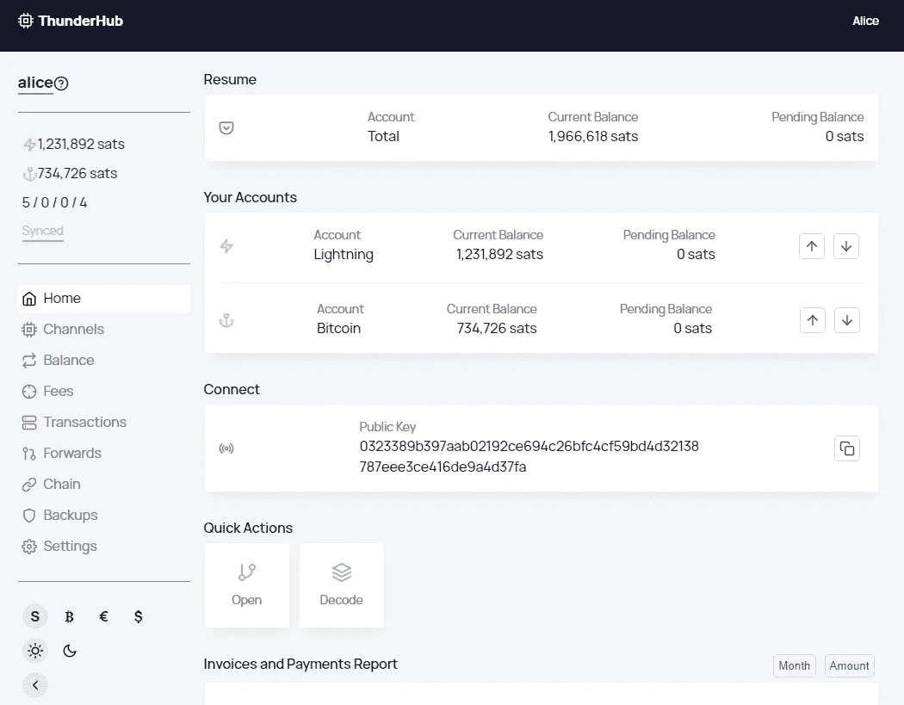
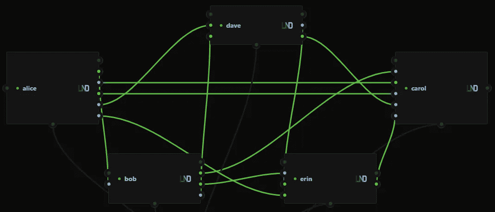
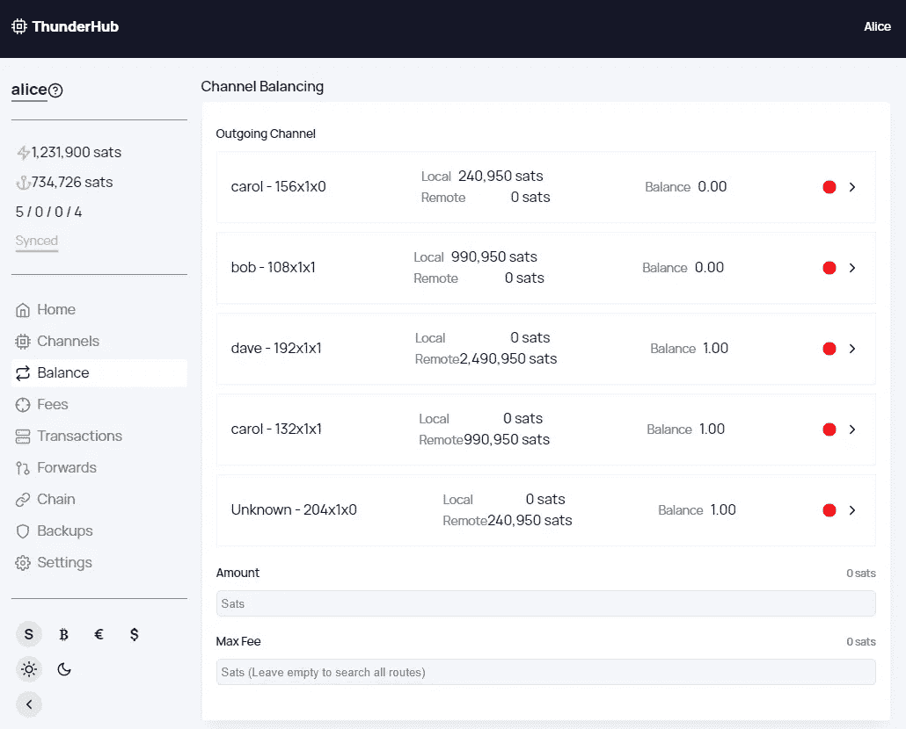
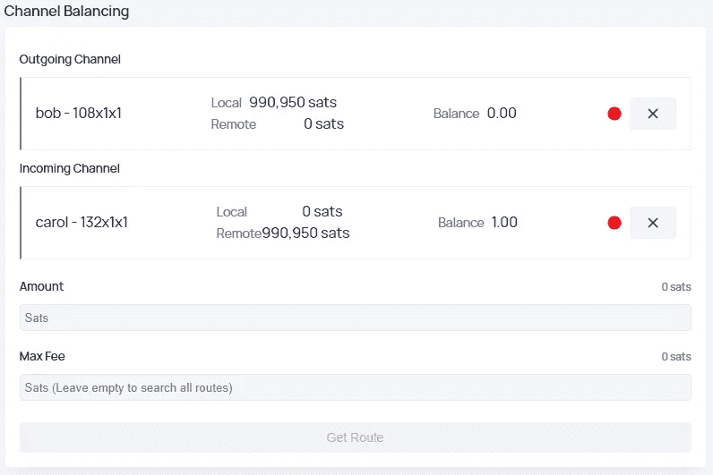
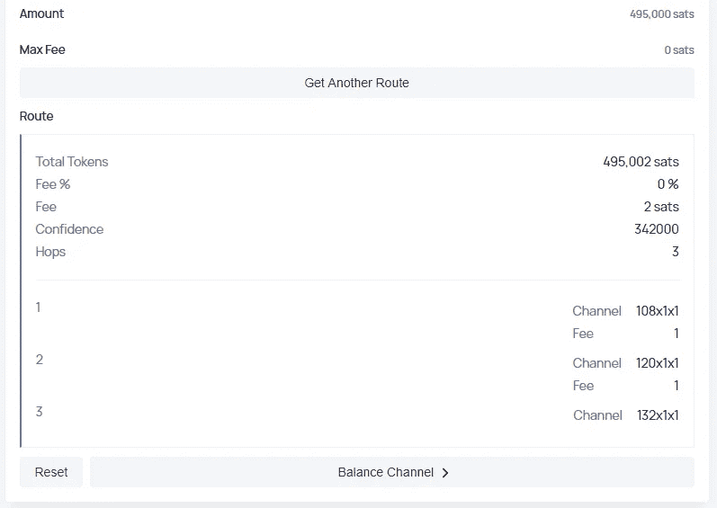
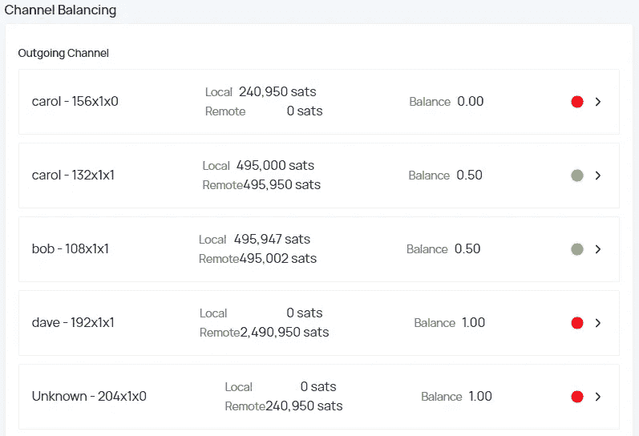
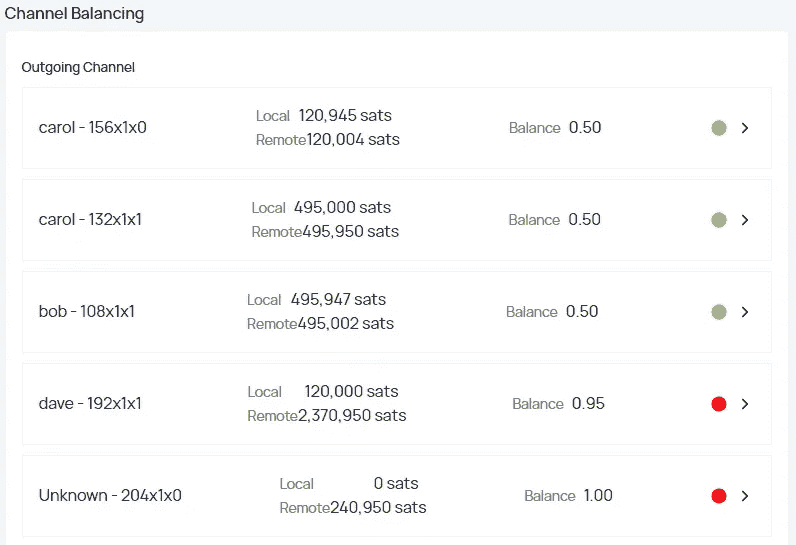
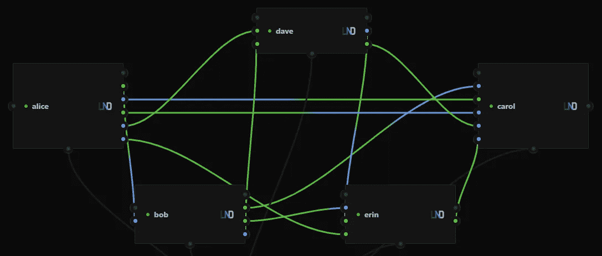

# 使用 ThunderHub 实现闪电网络通道平衡

> 原文：<https://medium.com/coinmonks/lightning-network-channel-balancing-with-thunderhub-972b41bf9243?source=collection_archive---------0----------------------->

随着 LND v0.9.0-beta 版在大约一个月前发布，我们看到了一些很棒的功能被发布，如多路径支付和 keysend，这些功能是我和许多闪电网络狂热分子高度期待的。在这个版本中，还有一个更小的特性引起了我的注意，那就是增加了对自己循环支付的支持。这意味着您现在可以直接通过 LND 重新平衡您的渠道，而不需要额外的脚本。

由于这一增加，平衡您的通道现在比以往任何时候都容易，您不需要通过安装脚本或研究寻路算法来保持您的通道平衡。在 [**ThunderHub**](https://www.thunderhub.io/) 中实现通道平衡功能也更容易，并且给 LND 命令行一个漂亮的用户界面。

为了向您展示使用 ThunderHub 平衡频道是多么容易，我将指导您完成平衡一些输入和输出频道的过程，有效地使它们成为双向的。

## 什么是 ThunderHub？

首先，在进入正题之前，先简单介绍一下 ThunderHub。ThunderHub 是一个开源的 LND 节点管理器，你可以在任何设备或浏览器上管理你的节点。它允许你用一个简单直观的 UX 来控制闪电网络。从渠道管理到转发报告和支付发票，它有许多功能，还有更多功能即将推出。如果你有一个 LND 节点，这绝对是一个你应该检查的工具。我可能有偏见😉

# 平衡您的渠道

现在为了更直观地展示网络，我们将使用[极坐标](https://lightningpolar.com/)。该网络将由 5 个节点组成，节点之间有多个通道。

Lightning Network consisting of 5 nodes.

所有这些信道都是单向的，这意味着它们只能在一个方向上使用，对于一个依赖于寻找到其他节点的最短/最便宜路径的网络来说，这没有太大的帮助，因为它减少了您将找到的路径的数量。

我们现在将通过使用 ThunderHub 来平衡这些频道。在此之前，我们连接到 Alice，进入 ThunderHub 的平衡部分。

Initial view

ThunderHub 会自动获取您的所有频道，并向您显示它们的平衡程度，频道越平衡，颜色指示器就会越绿。您可以看到，所有通道现在都完全不平衡，2 个通道只有本地平衡，3 个通道只有远程平衡。

首先你必须选择你想要平衡的输出通道。ThunderHub 按照平衡程度从 0 到 1 的递增顺序对它们进行排序。选择 Bob 的频道后，我们现在必须选择输入频道。查看频道现在是如何按降序排列的。这是因为理想情况下，你想通过一个< 0.5 balanced channel to a > 0.5 的平衡渠道来传递资金。

我们选择卡罗尔的通道，因为它与鲍勃的通道有相同的数量，但方向相反。

Outgoing and Incoming channel selected.

现在，我们必须定义我们希望从一个渠道传递到另一个渠道的金额，以及我们愿意支付的最高费用。如果您想搜索路径而不考虑您必须支付的费用，您可以将最大费用字段留空。

为了平衡这些信道，我们将把 Bob 信道中可用数量的一半(大约 495，000 sat)传递给 Carol 信道，并搜索所有路径，而不考虑费用。一旦我们点击**获取路线**,我们就会看到一条可能使用的路线和所需费用。

Possible path to use for the circular payment.

有了这条路径，我们需要做 3 跳，总共支付 2 次 satoshis，才能完成循环支付。现在，如果您想寻找另一条可能的路线，请点击**获取另一条路线**(如果找不到另一条，您将再次收到准确的路线)，但如果您对这条路线满意，请点击**平衡频道**。

ThunderHub 现在将进行循环支付，如果支付成功，您应该会在右上角看到一个绿色的确认。您的通道现在应该是这样的:

Bob and Carol’s channels successfully balanced.

如果我们对 Carol 的另一个通道和 Dave 的通道重复相同的过程，现在应该是这样的:

After balancing Carol and Dave’s channels.

这样，我们现在已经成功平衡了 Alice 的 3 个通道，现在可以双向使用它们来接收或发送付款。

爱丽丝的节点目前没有足够的本地平衡来平衡所有的通道，所以爱丽丝需要打开新的通道或使用 LND 的环路服务，但这是另一篇文章的主题。

如果我们现在看一下网络，我们可以看到不同渠道上的所有余额。

Network after 2 circular payments.

## 简历

简而言之，要平衡您的渠道，您必须:

1.  选择传出频道
2.  选择传入通道
3.  选择要平衡的金额(如果需要，还可以选择最高费用限额)
4.  平衡渠道

# 结论

有了 ThunderHub，你可以用一个比命令行更好的界面来平衡你的通道，并且对它们的平衡程度有一个更直观的体验。它的界面简单易用，我很高兴有更多的人试用它，并获得一些意见。因此，如果你有一个 LND 节点，去测试它，并保持该节点平衡！

如果你想查看这个项目，直接到[**ThunderHub**](https://www.thunderhub.io/)**或者直接查看 [**Github**](https://github.com/apotdevin/thunderhub) **上的代码。**如果您有任何问题或意见，请随时通过 [**Twitter**](https://twitter.com/tonyioi) 联系我。**

**我希望你喜欢这个小教程，直到下次！**

> **[在您的收件箱中直接获得最佳软件交易](https://coincodecap.com/?utm_source=coinmonks)**

********