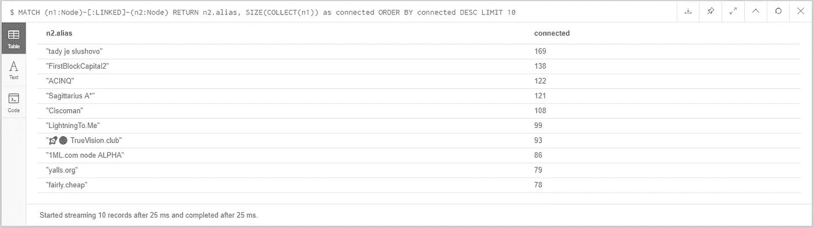

# ⚡Lightning 网络:如何探索拓扑

> 原文：<https://medium.com/coinmonks/lightning-network-how-to-explore-the-topology-32f234f4287f?source=collection_archive---------5----------------------->

# 从 LND 提取拓扑数据

在之前的故事中，我描述了我如何在家里安装了一个比特币闪电网络节点，在一个便宜的树莓 Pi3 上运行 LND。

lncli 提供了一个有用的命令来导出网络拓扑。我们可以简单地运行:

```
$ lncli describegraph > /tmp/describegraph.json
```

以获得包含从当前 lnd 节点看到的闪电网络拓扑的 json。

describegraph.json 的格式非常简单，不言自明:

```
{
    "nodes": [
        {
            "last_update": 1539310922,
            "pub_key": "02004c625d622245606a1ea2c1c69cfb4516b703b47945a3647713c05fe4aaeb1c",
            "alias": "LivingRoomOfSatoshi.com (LND) 2",
            "addresses": [
                {
                    "network": "tcp",
                    "addr": "172.81.178.151:9735"
                }
            ],
            "color": "#3399ff"
        },
 ...
 ...
 ],
 "edges": [
        {
            "channel_id": "595923207643922432",
            "chan_point": "dd0d25aadec1ff27a7215834bb3660cb2d0c5c030f3a8a27096e243313648ae2:0",
            "last_update": 1540314360,
            "node1_pub": "02cdf83ef8e45908b1092125d25c68dcec7751ca8d39f557775cd842e5bc127469",
            "node2_pub": "032c4b954f0f171b694b5e8e8323589e54196b48cf2efc27692513a360cb11d76f",
            "capacity": "500000",
            "node1_policy": {
                "time_lock_delta": 144,
                "min_htlc": "1000",
                "fee_base_msat": "1000",
                "fee_rate_milli_msat": "1",
                "disabled": false
            },
            "node2_policy": {
                "time_lock_delta": 144,
                "min_htlc": "1000",
                "fee_base_msat": "1000",
                "fee_rate_milli_msat": "1",
                "disabled": false
            }
        },
...
...
      ]
}
```

然后，我们可以快速计算节点和通道的数量:

```
$ cat /tmp/describegraph.json | grep “pub_key” | wc -l
877$ cat /tmp/describegraph.json | grep “channel_id” | wc -l
2796
```

# 在 Neo4j 中导入拓扑数据

## 安装 **Neo4jDesktop**

在探索网络拓扑时，什么比图形数据库更好？让我们从[https://neo4j.com/product/](https://neo4j.com/product/)下载 **Neo4jDesktop** 并旋转数据库以导入我们的 describegraph.json

我们现在可以在 Neo4jDesktop 中创建新图形，只需点击**添加图形→创建本地图形**，设置图形名称和密码，然后点击**创建**。

然后我们需要在 Neo4j 桌面安装 **APOC** 库(“Cypher 上的牛逼程序”):进入**管理**屏幕和**插件**标签。现在点击 APOC 盒中的**安装**按钮就完成了。

因为我们需要导入一个本地文件，所以我们需要更改默认配置:转到**管理**屏幕和**设置**选项卡并添加这一行:

```
apoc.import.file.enabled=true 
```

现在点击**打开浏览器**，准备开始或探索闪电网络。

## 导入网络数据

现在是时候将 describegraph 文件导入我们的图形数据库了。我们可以使用 APOC 库提供的过程`load.json`来加载 json 文件，然后遍历边，为我们在列表中找到的每个边创建 2 个`Node`对象，通过关系`LINKED`连接。然后我们可以向每个节点对象添加一个字段`alias`，以便更好地识别它们。

```
CALL apoc.load.json(“file:///full/path/to/describegraph.json”) YIELD value AS data
UNWIND data.edges as edge
MERGE (n1:Node {id:edge.node1_pub} )
MERGE (n2:Node {id:edge.node2_pub} )
CREATE (n1)-[:LINKED {capacity:edge.capacity}]->(n2)CALL apoc.load.json(“file:///full/path/to/describegraph.json”) YIELD value AS data
UNWIND data.nodes as node
MERGE (n:Node {id:node.pub_key} )
SET n.alias = node.alias
```

最后，我们可以在字段`alias`上添加一个索引来加快查询速度。

```
CREATE INDEX ON :Node(alias)
```

# 探索拓扑

我们现在准备使用 Neo4j 强大的查询引擎来发现一些关于网络的有趣事实。

## 节点和通道的数量

首先，我们来看看我们知道多少节点和通道。这是一个简单的查询，我们需要计算所有的`Nodes`对象，然后计算图中出现的所有关系`LINKED`:

```
MATCH (n:Node) RETURN COUNT(*)COUNT(*) 877MATCH (n)-[r:LINKED]->() RETURN COUNT(r)COUNT(r)2796
```

通过这些查询获得的数字与我们之前直接在`describegraph.json`文件上执行的“grep”中获得的数字相匹配，我们可以非常确信导入过程运行顺利。

根据 https://1ml.com/,[的说法](https://1ml.com/)目前我们在闪电网络中有超过 3000 个节点和超过 12000 个通道。因此，即使在运行了近 6 周后，我的节点对网络中存在的节点和通道的了解还不到 1/3 和 1/4。

这并不奇怪:**网状路由是计算机科学中尚未解决的问题**。

## 最长最短路径

网络中最长的最短路径被定义为节点之间的最大距离或网络直径。Neo4j 是一个面向图形的数据库，所以它提供了一个现成的`shortestpath`函数。我们可以很容易地找到所有最短的路径，并得到最长的路径:

```
MATCH (n1:Node), (n2:Node), route = shortestpath((n1)-[:LINKED*]-(n2))
WHERE id(n1) < id(n2)
RETURN route
ORDER BY LENGTH(route) DESC
LIMIT 1
```


The longest shortest path, according to the topology of the Lightning network as seen from my node.

所以，根据我对网络的看法，最远的节点在 8 跳之外。

## 最远的节点

我们还可以从一个给定的节点中找到距离最远的节点，例如，这里是距离我家节点最远的 5 个节点，别名为 **SLL** 。

```
MATCH (n1:Node), (n2:Node),
 route = shortestpath((n1)-[:LINKED*]-(n2))
WHERE id(n1) < id(n2) AND n1.alias = 'SLL'
RETURN route
ORDER BY LENGTH(route) DESC
LIMIT 5
```


The shortest paths to the 5 most distant nodes from mine

## 十大枢纽

让我们找到直接连接节点最多的节点(不是通道……)

```
MATCH (n1:Node)-[:LINKED]-(n2:Node)
RETURN n2.alias, SIZE(COLLECT(n1)) as connected
ORDER BY connected DESC
LIMIT 10
```



获胜者是节点 **tady je slushovo** ，有 169 个节点直接链接。

## 三角形计数

我们可以运行的一个有趣的查询是每个节点所属的三角形的计数:

```
CALL algo.triangleCount.stream(‘Node’,’LINKED’,{concurrency:4})
YIELD nodeId, triangles, coefficient
RETURN algo.getNodeById(nodeId).alias AS alias, triangles, coefficient
ORDER BY triangles DESC
```


**聚类系数**是其邻居也连通的可能性。你可以在维基百科页面[https://en.wikipedia.org/wiki/Clustering_coefficient](https://en.wikipedia.org/wiki/Clustering_coefficient)找到更多细节，但简单来说:如果连接到节点 a 的每个邻居都连接到该邻居内的每个其他节点，则节点 a 的聚类系数为 1，如果没有连接到该节点的节点连接到与其连接的任何其他节点，则聚类系数为 0。

按三角形数量排列的前 10 个节点似乎具有小于 10%的局部聚类系数

在完美的 tia 中

我们还可以计算网络**的平均聚类系数。**

```
CALL algo.triangleCount(‘Node’, ‘LINKED’,
 {concurrency:4, write:true, writeProperty:’triangles’,clusteringCoefficientProperty:’coefficient’})
YIELD nodeCount, triangleCount, averageClusteringCoefficient;
```


所以，我的节点知道网络中总共有 877 个节点，在 2045 个三角形中网格化，局部聚集系数的平均值约为 0.123。

# 结论

我希望您在发现闪电网络拓扑的一些有趣事实时感到有趣。

请随意建议运行更多有趣的查询:)

```
*Feel free to connect my Lightning Network node:
>$ lncli connect* 039401f72bc0d40efb58b01de15527a2a5ae1943d7c29067b725a1467a93c7e66f@2.238.144.76:9735
```

> 阅读下一篇:[为什么⚡Lightning Network⚡毫无意义😱](/coinmonks/why-lightning-network-makes-no-sense-39ca172f50d1?source=your_stories_page---------------------------)
> 
> [在您的收件箱中直接获得最佳软件交易](https://coincodecap.com/?utm_source=coinmonks)

[](https://coincodecap.com/?utm_source=coinmonks)