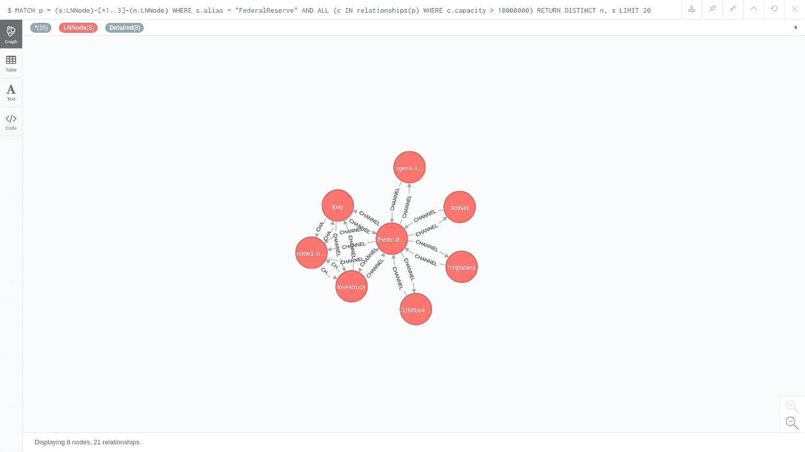
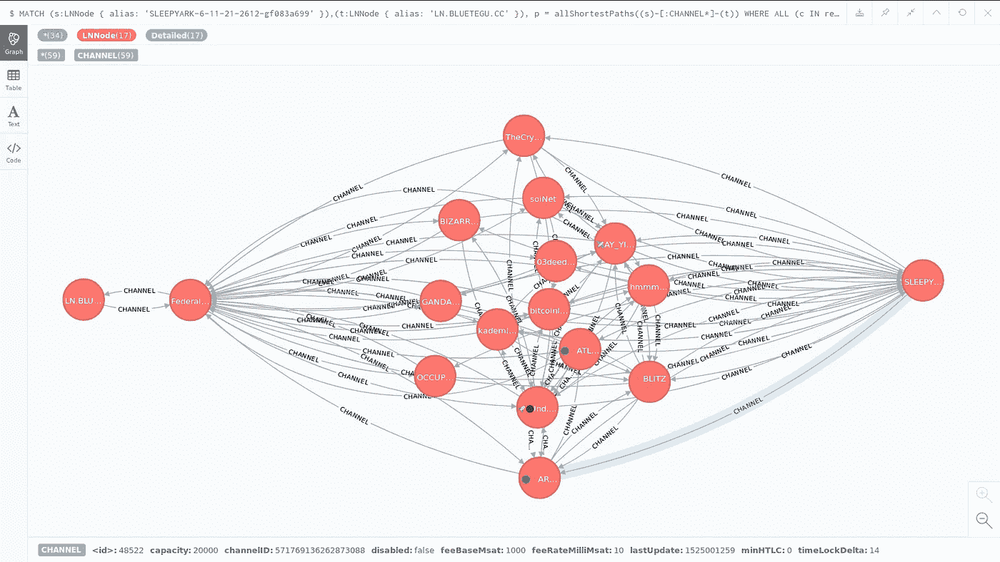
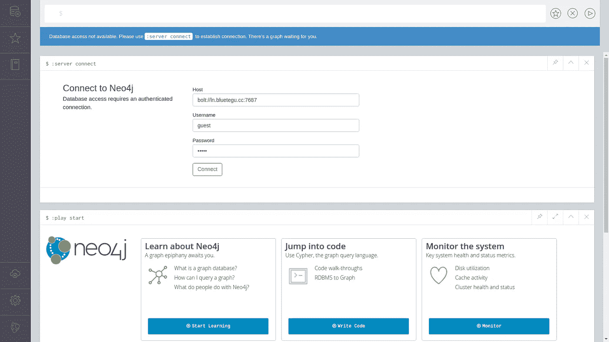
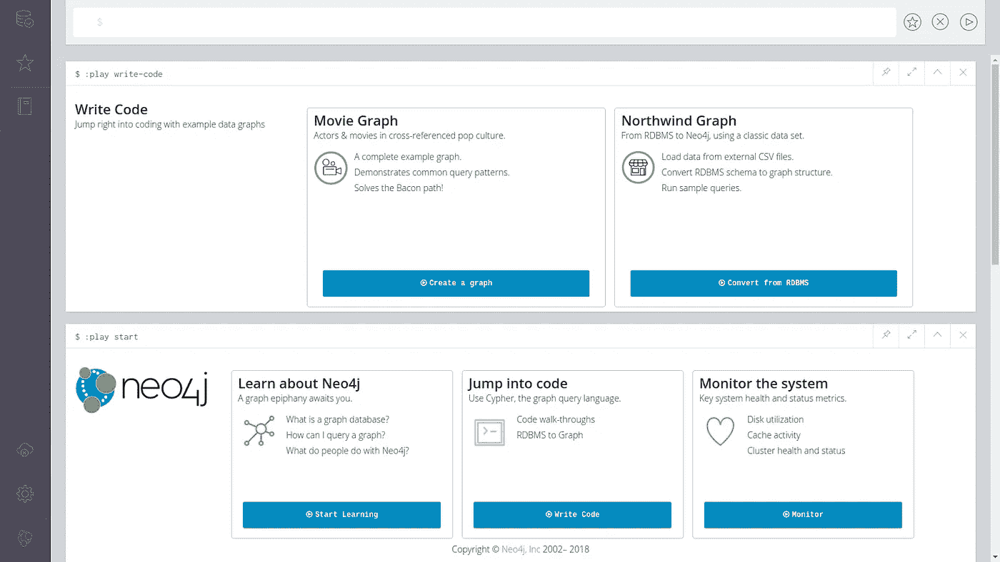

# 闪电网络:将拓扑导入 Neo4j 图形数据库

> 原文：<https://medium.com/coinmonks/lightning-network-import-the-topology-to-the-neo4j-graph-database-7c38a6e93a50?source=collection_archive---------1----------------------->

ELightning 网络中的每个节点都使用信道发现来创建和维护网络拓扑的本地视图，以便它可以发现到所需目的地的路由。使用源路由是为了让节点完全控制它们在网络中的支付路径。基于总累积费用和其他标准来选择路线。路由选择算法是一个活跃的研究领域。

图数据库被优化以表示通过关系彼此连接的一组节点，并用于横跨图的查询，即从特定节点(组)开始并搜索图中的模式，特别是找到两个节点之间的路径，即用于路线计算。Neo4j 是著名的开源图形数据库之一。参见[什么是图形数据库？](https://neo4j.com/developer/graph-database)和[从 Relational 到 Neo4j](https://neo4j.com/developer/graph-db-vs-rdbms) 了解更多详情。

这里我们描述如何将网络拓扑的节点本地视图导出到 Neo4j 数据库。使用闪电网络守护程序( [LND](https://github.com/lightningnetwork/lnd) )实现。该分支目前在[这里](https://github.com/bluetegu/lnd/tree/neo4j)可用，包括三个组件:

1.  命令行工具 **lncli** 中添加了一个新命令，用于创建通道数据库的快照(网络拓扑的节点本地视图)
2.  新的命令行工具 **lnneo4j** 用于将快照导入 neo4j 数据库
3.  可以在 Neo4j 浏览器上加载的 LN 指南教程，用于研究闪电网络快照。

这是一项正在进行的工作，希望其中的一些内容足够有用，可以合并到主要的 LND 代码中。欢迎评论、更正和投稿。

# 例子

以下示例摘自 Neo4j 浏览器的 LN 指南(上述第 3 项)。

图形数据库使用 Cypher 查询语言(类似于关系数据库中的 SQL)。 [Cypher](https://neo4j.com/docs/developer-manual/current/cypher/) 是一种声明式图形查询语言，允许表达性和高效地查询和更新图形存储。第一个示例使用以下查询:

`MATCH p = (s:LNNode)-[*1..3]-(n:LNNode) WHERE s.alias = “FederalReserve” AND ALL (c IN relationships(p) WHERE c.capacity > 10000000) RETURN DISTINCT n, s LIMIT 20`

该查询寻找连接到具有容量大于 0.1BTC 的“胖”信道的“**联邦储备**节点的所有节点，直到 3 跳远。它选择从该节点到 3 跳的所有路径，并过滤那些没有足够容量的路径。Neo4j 浏览器以图形方式显示了下面的结果。



Nodes connected to FederalReserve with ‘fat’ channels

浏览器允许您修改查询并重新提交它，这对于实验来说是理想的。 [Neo4j Cypher Refcard](https://neo4j.com/docs/cypher-refcard/current/) 可能对此有用。

第二个示例使用内置的最短路径查询来计算节点 **LN 之间的所有最短路径。BLUETEGU.CC** 和**块流存储**节点。使用的查询是:

`MATCH (s:LNNode { alias: ‘SLEEPYARK-6–11–21–2612-gf083a699’ }),(t:LNNode { alias: ‘LN.BLUETEGU.CC’ }), p = allShortestPaths((s)-[:CHANNEL*]-(t))
WHERE ALL (c IN relationships(p) WHERE c.disabled = false)
RETURN p`

最终的图形(经过一些手动拉伸)如下所示:



Shortest path between two nodes

注意，浏览器有局限性；呈现有许多节点和关系的图很慢，因此总是建议添加一个**限制**子句。它对检索的节点数量有一个内置的限制，为了呈现图形，它“补充”查询以获得关于节点之间关系的信息，即使您没有在 **RETURN** 子句中包含这些信息。

# 你自己试试吧

安装 Neo4j 非常简单，因此应该不难跨越一个实例，获取 channels 数据库的快照并将其导入 Neo4j，然后通过浏览器运行该指南。但至少在一段有限的时间内，您可以通过将下面的 url 复制到您的浏览器，在我的服务器上试用该浏览器:

```
[http://ln.bluetegu.cc:7474/browser](http://ln.bluetegu.cc:7474/browser/)
```

并使用用户“guest”和密码“guest”。不幸的是，Neo4j 的开源版本不允许控制每个用户的访问，因此访客用户也可以修改或删除数据，所以请小心行事，并理解服务器可能会停机或变慢。下面是登录屏幕。



Neo4j browser login screen

一旦进入，你有几个指南可以运行。如果你按“跳转到代码”，你会看到两个指南。您可以运行“电影图表”指南，引导您了解 Cypher 基础知识。不需要执行“创建”命令，因为数据库可能已经填充了电影图形节点。同样，不需要在结束时执行“Drop”命令。以下是可用指南的屏幕截图。



Run the Movie Graph tutorial

您可以运行 Lightning Network guide，方法是输入以下 play 命令并按 run(像浏览器上的任何其他命令一样):

`:play [http://ln.bluetegu.cc:80/html/ln.html](http://ln.bluetegu.cc:80/html/ln.html`)`

启动闪电网络指南。指南的第一页如下所示:


First page of the Lightning Networks tutorial

# 技术细节

## 创建快照

创建频道数据库快照的命令是:

`$ lncli snapshotchannels`

它在`[lnddir]/snapshot/graph/[network]/channel.db`创建或覆盖频道数据库的先前快照。例如，在 Linux 中使用比特币 mainnet 网络时的`~/.lnd/snapshot/graph/mainnet/channel.db`。

## 导入到 Neo4j

Neo4j 命令行工具首先从以前的快照清空 Neo4j 数据库，然后将节点和通道导入 Neo4j 数据库。该工具具有以下配置选项:

```
ubuntu@ln:~$ lnneo4j — help
NAME:
 lnneo4j — import a snapshot of your channel databse to neo4jUSAGE:
 lnneo4j [global options] command [command options] [arguments…]

VERSION:
 0.1.1 commit=

COMMANDS:
 help, h Shows a list of commands or help for one commandGLOBAL OPTIONS:
 — lnddir value path to lnd’s base directory (default: “/home/ubuntu/.lnd”)
 — network value either mainnet, testnet, simnet, regtest, etc. (default: “mainnet”)
 — neouser value neo4j user for authentication (default: “neo4j”)
 — neopass value neo4j password for authentication. Required unless neo4j authentication is disabled, e.g. dbms.security.auth_enabled=false is set in neo4j.conf
 — neohost value neo4j hostname (default: “localhost”)
 — neoport value neo4j port number (default: “7687”)
 — help, -h show help
 — version, -v print the version
```

运行时，它提供以下输出。请注意，导入过程需要一段时间才能完成:

```
ubuntu@ln:~$ lnneo4j -neopass <password>
[lnneo4j] 15615 nodes and channels deleted.
[lnneo4j] Added 2313 detailed nodes and 6 nodes known only by public key.
[lnneo4j] Added 6541 bi-directional channels, 314 uni-directional channels and 0 channels without edges dropped.
ubuntu@ln:~$
```

节点被分配了 **LNNode** 标签。收到通知的节点也标有**详细**标签。每个详细节点都模拟了以下属性:

*   公共密钥
*   别名
*   地址
*   颜色
*   上次更新

数据库中仅包含开放渠道(非待定或等待关闭渠道)。通道被建模为具有以下属性的**通道**关系:

*   channelID
*   容量
*   上次更新
*   有缺陷的
*   闵 TLC
*   feeBaseMsat
*   timeLockDelta
*   feeRateMilliMsat

## Neo4j 指南

该指南是根据[创建自定义 Neo4j 浏览器指南](https://neo4j.com/developer/guide-create-neo4j-browser-guide)编写的。特别是，该指南是以 adoc 格式编写的，并被编译成 html 格式。从 [neo4j-guides 库](https://github.com/neo4j-contrib/neo4j-guides)中编译指南所需的最小文件集被复制到项目中。在`/lnd/cmd/lnneo4j/guide/readme.adoc`的`readme.doc`包括如何编辑、编译和主持指南的所有细节。

## 安装

要安装这个版本，请遵循 LND 项目的说明，但是使用我的存储库中的 neo4j 分支。我这里的详细安装说明[可能会有帮助。](https://steemit.com/lightning/@bluetegu/lightning-network-get-your-sticker-a-detailed-howto)

```
ubuntu@x:~$ git clone [https://github.com/bluetegu/lnd](https://github.com/bluetegu/lnd) $GOPATH/src/github.com/lightningnetwork/lnd
ubuntu@x:~$ cd $GOPATH/src/github.com/lightningnetwork/lnd
ubuntu@x:~/go/src/github.com/lightningnetwork/lnd$ git checkout neo4j
Branch neo4j set up to track remote branch neo4j from origin.
Switched to a new branch ‘neo4j’
ubuntu@x:~/go/src/github.com/lightningnetwork/lnd$ 
ubuntu@x:~/go/src/github.com/lightningnetwork/lnd$ dep ensure
ubuntu@x:~/go/src/github.com/lightningnetwork/lnd$ go install . ./cmd/...
ubuntu@x:~/go/src/github.com/lightningnetwork/lnd$
```