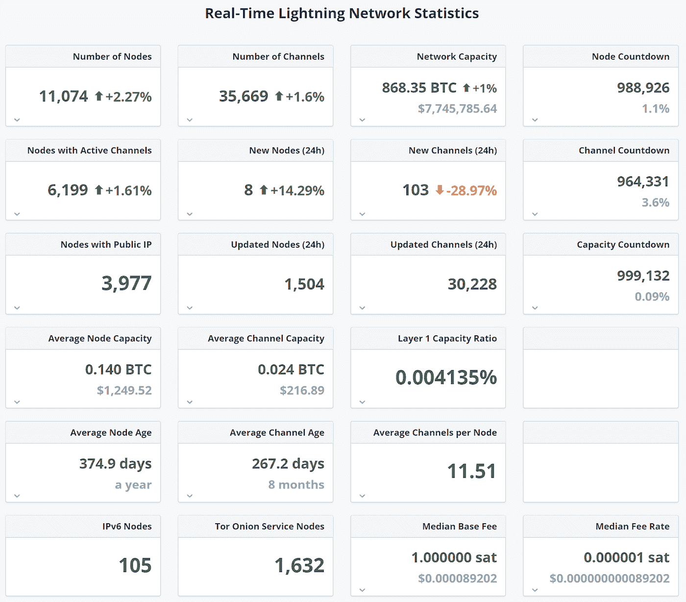

# 比特币闪电网络带来麻烦

> 原文：<https://medium.com/coinmonks/lightning-network-spells-trouble-46262f4c7263?source=collection_archive---------2----------------------->

*比特币流程链中每个区块约有* [*2500 笔交易*](https://www.blockchain.com/en/charts/n-transactions-per-block) *。给链条加一个块大概需要十分钟。这在大范围内不是很有用，因此在比特币区块链之上设计了另一层:闪电网络。*

*Photo by haik ourfal on Unsplash*

我花了一段时间来理解这个概念，现在我已经知道了足够的知识来解释这个概念，看看它会在哪里失败。这不会解决比特币的规模问题，实际上会给区块链带来额外的限制。以下是方法。

要连接到 lightning 网络并进行快速交易，您需要开通一个支付通道。因此，您将与您的对应方(通道的另一端)一起创建另一个带有私钥的钱包。你将把一些比特币或者比特币的一部分放入智能合约中，以防止重复消费。要释放您的比特币，您需要关闭此智能合约。这份合同在你和你的对手之间有一个平衡。因此，如果你把一枚比特币放进你的共享钱包，你的对手也会这么做。最后，当合同结束时，双方都根据存储在 Lightning 网络层中的余额获得部分。

假设你是 A，你有一个与 B 的支付渠道，你可以将尽可能多的交易放在余额上，只要它们不超过你在开始这个合同时承诺的资金。到目前为止一切顺利。如果这是你当地的星巴克，并且你经常去那里，这可能是有意义的。

如果 C 也想凑热闹，C 也可以和 B 开辟一个支付通道。b 和 C 必须用智能合约在他们的共享钱包中存储一些比特币。如果 C 想和你快速交易，这是可能的。C 与目的地 A 进行交易。首先，该交易金额在 C 和 B 之间结算，然后在 B 和 A 之间结算。当然，这仍然是一个小例子，但 A 和闪电网络中任何其他节点之间的结算链可以很容易地有十跳。任何中继点——在我们的例子中是 B——都需要不止一个通道作为中介。在一个通道关闭后，最终交易被存储在比特币区块链上。

LN 中最重要的指标是什么？见此[图](https://1ml.com/statistics)。你能发现它吗？

这是平均渠道年龄。

所以我认为接下来会发生什么。基本上这和比特币本身的问题是一样的。一个所谓的“香槟”问题，或者换句话说，一个你——通常——想要成功遇到的问题。比特币如此成功，以至于出现了规模问题。闪电网络也可能出现同样的情况。

要使用 LN，您需要一个“商家”服务，一个连接良好的枢纽，这样您就可以在多个地方使用您的 LN。商家可能由一家公司提供服务，该公司可能有良好的资金来保持渠道长期开放。

但是对于想让 LN 为咖啡买单的用户来说，这就不一样了。当用户打开 LN 频道时，它必须为该频道分配预算。“我要花多少钱？”。这是一个好问题，因为当你将比特币分配到这个渠道时，它不能用于任何其他用途。不知道你的实体钱包里有多少现金。但通常情况下，不会超过 100 欧元。

因此，用户可能会有更短的平均通道年龄，这意味着除了比特币之外的“正常”活动之外，还有 2 次比特币交易。假设 100 万用户的平均渠道年龄为 30 天。这意味着在 30 天的生命周期中有 200 万次交易，除以每 10 分钟 2500 次交易的容量，每月有五天半的时间可以打开和关闭通道。所以 100 万用户可能导致整个比特币交易能力的 18%。在这种情况下，500 万 LN 用户将阻塞整个系统和通向大型 mempool 的道路。节点将支持非 LN 交易，这将使整个闪电网络人口减少，不是吗？

因此，平均信道年龄是衡量闪电网络生存能力的重要指标。现在这还不是什么大问题，但如果 LN 在全球范围内被采用，这将是一个大问题。

那么，你有什么想法？我错过了什么吗？我的理论不正确吗？

英语不是我的母语，我会纠正错误的语法，谢谢你的耐心！

> 不想争论吗？使用这些比特币节点提供商运行一个比特币节点
> 
> [在您的收件箱中直接获得最佳软件交易](https://coincodecap.com/?utm_source=coinmonks)

