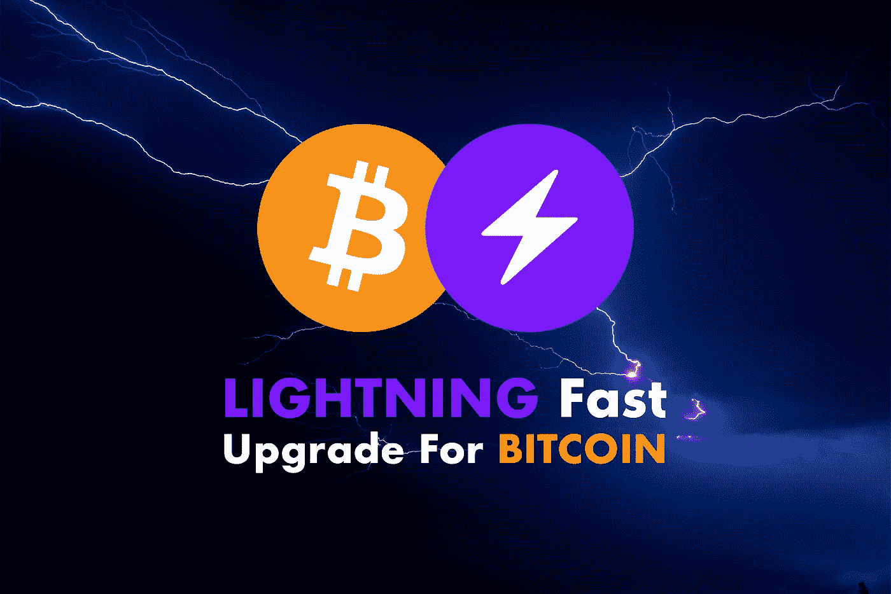

# 闪电:比特币需要的升级

> 原文：<https://medium.com/coinmonks/lightning-the-upgrade-that-bitcoin-needs-a01c22d81cf5?source=collection_archive---------13----------------------->

比特币的市值几乎达到 11000 亿美元，仍然是世界上最大的加密货币。在众所周知的区块链网络中，采矿者接管了对区块的处理，因此也接管了根据“工作证明”概念进行的交易。
不过也不是没有问题:**交易时间长，成本高，给用户造成困扰。**

Lightning-fast — Photo by [Leon Contreras](https://unsplash.com/@lc_photography?utm_source=unsplash&utm_medium=referral&utm_content=creditCopyText) on [Unsplash](https://unsplash.com/s/photos/lightning?utm_source=unsplash&utm_medium=referral&utm_content=creditCopyText), edited by the author