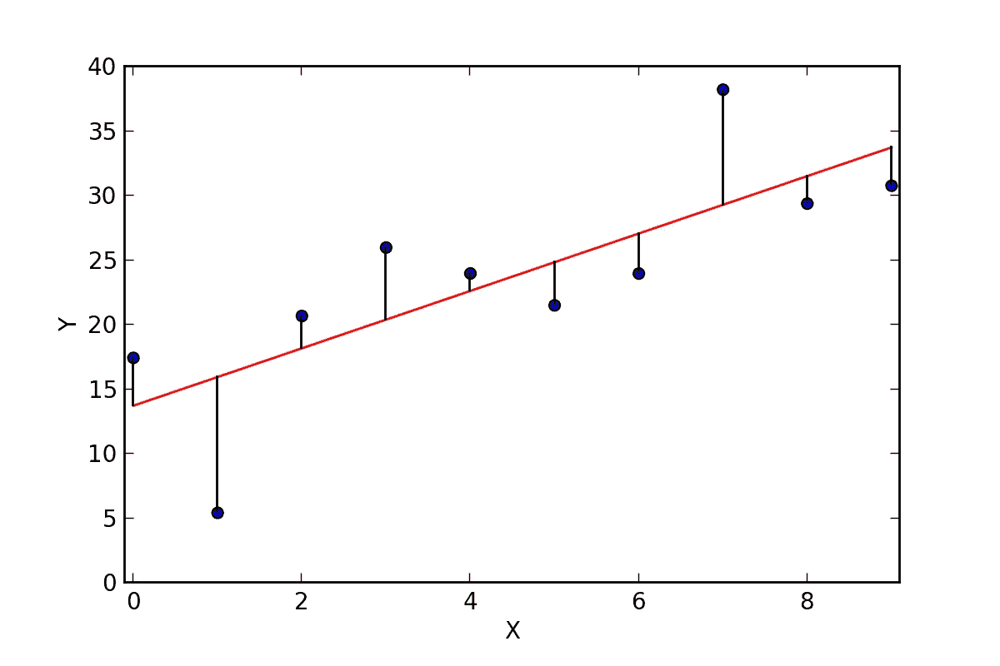

# 线性回归第一部分

> 原文：<https://medium.com/coinmonks/linear-regression-bf5141ce9ac8?source=collection_archive---------1----------------------->

## 线性回归是最简单的监督学习类型。

回归的目标是探索输入特征与目标值之间的关系，并为给定的未知数据提供连续的输出值。


This is a General data Flow diagram of a linear regression model

在线性回归中，我们用一个线性方程来研究输入和目标之间的关系。对于只有一个特征的简单线性回归模型，等式变为:

> Y=W1*X+b

*   y =预测值/目标值
*   x =输入
*   W1 =坡度/坡度/重量
*   b =偏差

该方程与直线方程相同(Y=MX+c)

***问题来了这个 W1 和 b 是什么？***

***— — >现在让我们假设它们是调整直线以获得最佳拟合的参数。通过调整 W1 和 b，我们得到的算法得到了最优的结果。***

## 多元回归:

现在我们有了一组输入特征 X={x1，x2，x3，…，xn}以及与之相关联的权重 W={w1，w2，w3，…wn}。因此，等式变为:

```
Y=(x1*w1+x2*w2+x3*w3+....+xn*wn)
```

或者


Multiple regression Equation

考虑到偏见

> Y=(x1*w1+x2*w2+x3*w3+…。+xn*wn)+b

或者


Multiple regression Equation with bias

***现在让我们回到权重:***

我们如何确定权重和偏差？

= >通过 MSE(均方误差)测量权重，并对其进行调整以获得最佳线性线。

MSE =平均值((预测值-y 的第 I 个值的实际值) )



**Image1** from([https://cdn-images-1.medium.com/max/1200/0*FjKhbw6Va8O8bCkF.png](https://cdn-images-1.medium.com/max/1200/0*FjKhbw6Va8O8bCkF.png))

让我们从图 1 来理解这个概念——‘T12’红线是我们的线性回归线或者我们的**预测值(y*’*)。**和“**蓝色**点是我们给定的数据或**实际值**。从蓝点(实际值)到红线(预测值)的距离的平方平均值必须最小，以获得最佳拟合回归线。

因此可以表示为


MSE where y’ is predicted value yi is actual value

为了获得最佳结果，我们需要最小化 MSE

因此，为了最小化该误差或 MSE，我们使用梯度下降来在 MSE 或误差率计算之后找到权重。梯度下降可等同于:


Gradient Descent

> 现在，在我们得到梯度下降后，我们需要每次更新权重，直到我们得到最佳拟合值

> 新权重=旧权重+(学习率*梯度下降)


new Weight=old Weight+(Learning Rate *Gradient Descent)

> alpha 或学习率是 0-1 之间的固定值，此时我们不需要知道太多。在下一篇文章中，我将解释多元回归是如何工作的。

# 现在让我们看看编码部分:

我们需要什么

*   python 3.6+ [下载 Python](https://www.python.org/downloads/)
*   熊猫图书馆(pip3 安装熊猫)
*   matplotlib 库(pip3 安装 matplotlib)
*   scikitlearn 库(pip3 安装 sklearn)
*   CSV 文件:[https://github . com/neelindresh/Neel blog/blob/master/house price . CSV](https://github.com/neelindresh/NeelBlog/blob/master/HousePrice.csv)

```
Code: for simple regressionimport pandas
#load csv file
df=pandas.read_csv('./DataSet/HousePrice.csv')
df=df[['Price (Older)', 'Price (New)']]#Define feature list (X) target(Y)
X=df[['Price (Older)']]
Y=df[['Price (New)']]#load predefined linearRegression model
from sklearn.model_selection import train_test_split
from sklearn.linear_model import LinearRegression
xTrain,xTest,yTrain,yTest=train_test_split(X,Y)
Lreg=LinearRegression().fit(xTrain,yTrain)#   formula=(W1*x+b)
print('Coef(W1):',Lreg.coef_)
print('Intercept(W0/b):',Lreg.intercept_)
W1=Lreg.coef_
b=Lreg.intercept_#ploting the same
import matplotlib.pyplot as plt
plt.scatter(X,Y)
plt.plot(X,W1*X+b,'r-')
plt.show()
#You can predict a value using
#print(Lreg.predict(someValue))
```

> *完整的代码和 csv 文件可以在:* [*从 github*](https://github.com/neelindresh/NeelBlog) 下载


Output

输出图表

# 描述:

CSV 文件有许多列。但是我只用了其中的两个来展示简单回归是如何工作的。“价格(旧)”与“价格(新)”，其中“旧”是 x 坐标，“新”是 y 坐标。

***加载 CSV 文件***

> *df=pandas.read_csv('。/DataSet/HousePrice.csv')*

***从数据框中切分‘价格(旧)’‘价格(新)’列:***

> *df=df[['价格(旧)'，'价格(新)']]*

***定义特征列表(X)目标(Y)***

> *X=df[['价格(旧)']]
> Y=df[['价格(新)']]*

***trainttestsplit 将数据集划分为 75%训练 25%测试数据***

> xTrain，xTest，yTrain，yTest=train_test_split(X，Y)

***LinearRegression()。fit(X，Y)- >将 X 值和 Y 值分别放入给定函数***

> Lreg =线性回归()。fit(xTrain，yTrain)

***给出最佳拟合的 W1 和 b(最终权重和最终偏差)***

> w1 = lreg . coef _
> b = lreg . intercept _

***使用 matPlotLib*** 绘图

> #绘制相同的
> 导入 matplotlib.pyplot 作为 plt
> plt.scatter(X，Y)
> plt.plot(X，W1*X+b，' r-')
> plt.show()

***你可以使用*** 来预测 a 值

> print(Lreg.predict(someValue))

> 在 youtube 上关注我:

[](https://www.youtube.com/channel/UCTJE1mGfe5qgO5OfWE6surg?view_as=subscriber) [## 尼尔·巴塔查里亚

### 编程爱情

www.youtube.com](https://www.youtube.com/channel/UCTJE1mGfe5qgO5OfWE6surg?view_as=subscriber) 

关注我的博客:

[](https://dataneel.wordpress.com/) [## 面向所有人的数据科学

### 线性回归是最简单的监督学习类型。回归分析的目的是探索…

dataneel.wordpress.com](https://dataneel.wordpress.com/)