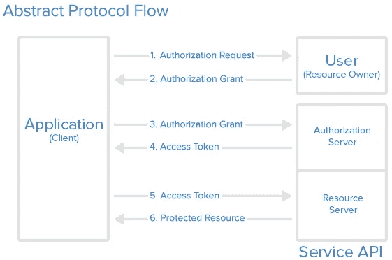
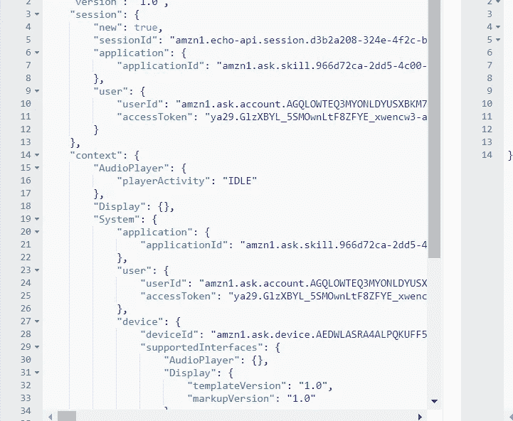
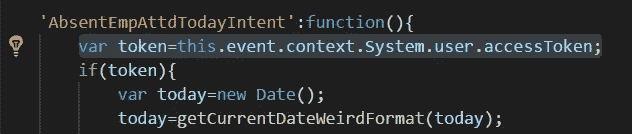
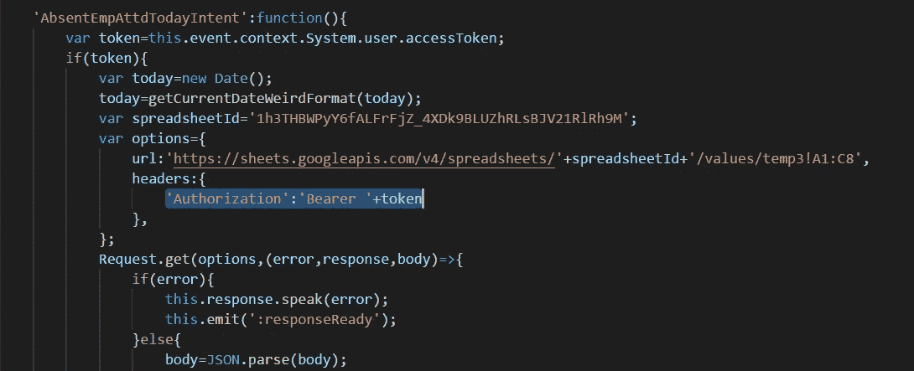

# 在 5 分钟内将你的亚马逊 Alexa 技能与谷歌 API 联系起来

> 原文：<https://medium.com/coinmonks/link-your-amazon-alexa-skill-with-a-google-api-within-5-minutes-7e488dc43168?source=collection_archive---------0----------------------->


亚马逊 Alexa 一直是好奇的开发者社区的吸引力中心，他们一直在尝试为 Alexa 开发技能。但是，当涉及到将他们的 Alexa 技能与谷歌 API 集成时，人们一直面临着问题。我不知道谷歌在 Alexa 的搜索查询上有什么，它们已经被重定向到谷歌的主页。本文只是试图帮助您成功集成 Google API。在本文中，我使用了 Google Sheets API v4。我们开始吧！

我假设你已经设置好了你的技能发展环境。如果您还没有配置自己的，那么请阅读这篇文章，以获得技能和 lambda 函数(如果您正在使用的话)集成方面的帮助，并按照这篇教程学习在 NodeJS 中为 Lambda 函数编码。您可能需要帮助来完成教程中的这个小变化，并且您已经准备好了。在教程中，他们试图像这样调用一个函数。AskQuestion 将返回一个未定义的输出。这可以通过将 *AskQuestion* 函数重写为:

```
function **AskQuestion(attributes)** {
    var language = attributes.language;
    var currentQuestion = flashcardsDictionary[attributes.currentFlashcardIndex].question;
    return "In "+ language+" "+ currentQuestion;
}
```

然后把这个问题叫做，

```
if (this.attributes.currentFlashcardIndex < DECK_LENGTH) {
  message += "Here is your next question. " + **AskQuestion(this.attributes)**;
  this.response.speak(message).listen(**AskQuestion(this.attributes)**);
}
```

现在，你知道了如何编写 Lambda 函数，并且已经掌握了基本技能。我们现在需要理解 OAuth2 框架是如何工作的。OAuth2 是一个容易理解的架构。基本上有一个客户端(您的技能)、一个资源所有者(用户)、一个资源服务器(Google Sheets)和一个认证服务器(Google OAuth)。下图可能会让您更好地理解该框架。



请看这个图，授权请求是一个登录页面，它授权用户的凭证并返回一个授权代码。进而当应用程序将授权码发送到授权服务器时，授权服务器返回刷新/访问令牌对。这个访问令牌与资源请求一起被发送到资源服务器，在那里它被验证，并且适当的响应被发送到客户机。默认情况下，此访问令牌的生命周期为一小时，因此当访问令牌到期时，将发送刷新令牌以获取新的访问令牌，请求-响应过程将继续。为了更好地理解 OAuth2 框架[请访问](https://developers.google.com/oauthplayground/)谷歌的 OAuth2 游乐场。这个网站可以用来调试常见的请求响应问题，就像我们在使用类似邮递员的软件建立网站时所做的那样。

理解了 OAuth2 框架的工作原理之后，我们现在可以在 Google 的 API 控制台中注册一个 API 了。请按照下面的步骤操作。

*步骤 1* :使用该向导注册您的项目，或者如果您已经创建了一个项目，则选择一个项目。单击继续并转到凭据。

*第二步*:在**添加项目证书**页面，点击**取消**按钮。

*步骤 3* :在页面顶部，选择 **OAuth 同意屏幕**选项卡。选择一个**电子邮件地址**，输入一个**产品名称**(如果尚未设置)，点击**保存**按钮。

*第四步*:选择**凭证**页签，点击**创建凭证**按钮，选择 **OAuth 客户端 ID** 。

*步骤 5:* 选择应用类型 Web 应用，点击**创建**按钮。

*第六步*:点击**确定**关闭弹出的对话框。

*步骤 7* :点击客户端 ID 右侧的下载图标(下载 JSON)按钮。将该文件另存为 client_credentials.json。

现在你需要按照下面的步骤将你的谷歌 API 和你的 Alexa 技能联系起来。

*第一步*:回到你的 Alexa 技能开发控制台，点击屏幕左下方的账户链接选项。这将打开一个表单。

*第 2 步*:打开账户链接，选择授权码授权类型。使用您下载的 client_credentials.json 文件中的凭据填写表单。(将客户端身份验证方案设置为推荐的 HTTP Basic)。

*第三步*:进入谷歌应用编程接口浏览器，或者直接进入谷歌应用编程接口浏览器，选择你的 Alexa 技能需要使用的应用编程接口，然后使用 OAuth2.0 打开一个对话框，要求检查一些范围。检查所需的并复制相同的内容。

*步骤 4* :回到你的 Alexa 技能开发控制台，粘贴示波器。以相同的形式从下面复制重定向 URL。

*第五步*:返回谷歌开发者控制台。单击左侧导航列中的凭据，然后单击您的 OAuth2.0 客户端，逐个粘贴重定向 URL，然后单击保存。



之后，你可以在手机上使用亚马逊 Alexa 应用程序测试账户链接。如果您收到成功消息，则帐户链接设置成功。继续从开发控制台测试你的 alexa 技能，尝试说任何话。如果帐户链接工作正常，你将能够看到 JSON alexa 技能请求中传递的 accessToken。你可以在“userId”下面的相邻图片中看到这一点。

***注***——如果请求中没有传递 accessToken，尝试从 app 中禁用启用你的技能。如果不行就告诉我。

如果您已经到达这里，您已经成功地启用了与您的 Alexa 技能的帐户链接。现在您需要在 Lambda 函数中处理技能请求内的 accessToken。Alexa 做得最好的事情是用 OAuth2.0 处理涉及访问令牌、刷新令牌和授权码的内部业务。您只需要处理与 API 请求一起发送的访问令牌，以便从资源服务器获取数据。

在您的技能的 Lambda 代码中，每当您需要从资源服务器请求数据时，请转到该特定意图并从技能请求中获取访问令牌，



跟随 alexa 技能请求中的访问令牌的目录。该访问令牌随后与 API 请求报头一起发送，



请注意，URL 应该遵循文档和参考资料中给出的格式。这里，URL 遵循 Google Sheets API 格式，从用户 Google 帐户的电子表格中获取一系列值。你可以随时使用 Google OAuth2.0 playground 查看响应格式。这将有助于您构建对 Alexa 技能的回应。

让我知道问题和疑问。谢谢你。