# 区块链 Ep01:揭开链的神秘面纱

> 原文：<https://medium.com/coinmonks/linked-lists-blockchains-36f400915c15?source=collection_archive---------2----------------------->

作为金融界的一员，我意识到我们正处于一项关键技术的边缘。有些人甚至认为这是互联网 3.0 版，尽管去中心化的想法一直存在。所以很自然地，我想知道为什么每个人都认为这是区块链革命。

正如我所有的未知之旅一样，这也是从书籍开始的，特别是 Antony Lewis 的— [*《比特币基础》和《区块链*](https://www.amazon.in/Basics-Bitcoins-Blockchains-Antony-Lewis/dp/1642503436/ref=sr_1_2?crid=2UHBBG7D8LBX2&keywords=the+basics+of+bitcoins+and+blockchains&qid=1636994283&qsid=262-1475325-7033158&sprefix=The+basics+of%2Caps%2C290&sr=8-2&sres=1642503436%2CB07TJ49VX4%2CB07W7W162D%2CB09BJXMYJP%2CB09L8P462X%2CB09LPDYCCF%2CB09LT646CM%2CB09LT48QY6%2CB09LR3FMS7%2CB09LR1CLL6%2CB09LT4KBLG%2CB09LHZSNRS%2CB09B2M2XWX%2CB09KVBT3KL%2CB08W9NQKBN%2CB092DZQG69) 。这本书以非常简单的语言，奠定了金融界对区块链的驱动需求——从什么是钱以及为什么我们当前世界的交易如此昂贵开始(*提示:集中式金融并不是真正非常集中*)。

在一系列博客文章中，我想概述一下我对区块链的理解，以及为什么我相信它真的有潜力改变世界。我写这些有两个主要目的-

*   我相信写作有助于巩固知识
*   我想听听真正了解的人和爱好者的意见，这样我可以学得更好

在这篇文章中，我将尝试建立一个非常原始的“区块链”，其协议类似于(但弱于)区块链。我从零开始，从我们所有人都见过的基础开始。希望在它结束时，我已经解释了链接块的真正含义。但是让我们从头开始，从第一个*啊哈！我有…*

# 啊哈时刻！

**区块链**由两个东西组成——**区块** *和* **链**。当我开始与**区块链**的旅程时，很长一段时间我都专注于**区块**，去理解它们，去欣赏其中的天才。直到很晚我才意识到链条的美丽。不要误解我的意思，**块**很重要，非常重要，没有链条它就不能工作。所以理解了**链**是如何工作的，你就有了 60%的把握。

那个*啊哈！那一刻，我意识到——我以前遇到过类似链条的东西…*

# 数据结构

我们都知道什么是数据——一条信息——你最新的帖子、一个单词、一个字母、一个像素、一个电脉冲！但是只有当数据有了结构，我们才能理解它。结构使我们能够处理数据，添加数据，删除数据。计算机也需要数据的结构。所以我们杰出的计算机科学家定义了不同的方式来组织数据。其中许多都来自我们都能理解的现实生活中的例子。

## 行列

我们以前都排过队，可能在星巴克，在航空公司办理登机手续，或者如果你像我一样，在足球场。你总是排在队伍的最后，你总是排在最前面。插队是一种亵渎。

计算机队列的工作方式非常相似。您只能从队列的前面删除/处理数据，只能在末尾添加新数据。在计算机术语中，这也叫做**先进先出**——先进先出。

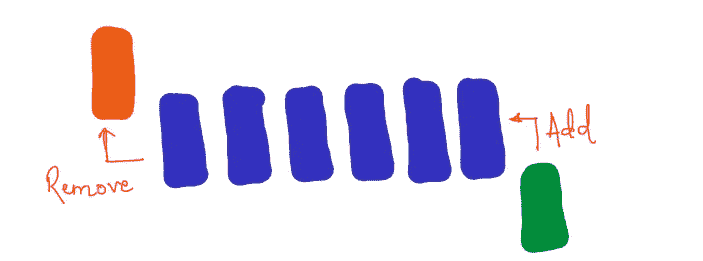

*If I got into the queue before you did, I’d want to exit before you did. Or we fight…*

## 大量

把一本书叠在另一本书上，对几本书也这样做。你会注意到你总是添加到栈顶。现在，一本书一本书地拿走——你是从书架的顶部拿走的。所以最近添加的书会先离开！

计算机堆栈也是这样工作的。数据被添加到栈顶，也从栈顶移除。后进先出— **后进先出**

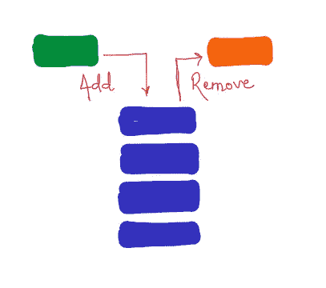

*If I join a queue after you, I want it to convert to stack immediately!*

***快速补充说明*** *队列和堆栈都是连续的——为了到达第 5 个数据(或人，或书),你必须遍历它前面的 4 个数据元素(或人，或书)。你不能跳，这不公平，也不可能。这是非常严格的——想象一下，如果你必须听 4 首歌才能听到第 5 首。真的想象一下——下图一点关联都没有；)*

90’s kids, where art thou?

## 列表

列表有点复杂，但也更灵活。您可以将数据添加到列表中的任何位置——开始、中间或结尾的任何位置；您可以从列表中的任何位置移除/process。想想你的购物清单。你可以以任何顺序购买这些物品，你也可以(如果不是在纸上)将它们添加到你想要的列表中的任何地方。

为了简化问题，让我们就列表由几个**元素**组合而成的术语达成一致。元素存储数据。在计算机中，每个元素都有一个隐藏的属性，称为**索引**。一个新元素可以被插入到列表中的任何一个*点*，所以必须有一种方法告诉计算机那个*点*是什么。这就是**索引**所做的一切，*它的作用就像一个地址*。

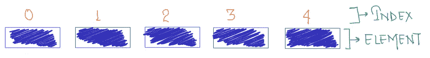

Index is an address, Elements store data

## 链接列表

现在让我们尝试列表，让我们修改元素，以便它存储两条信息——当前元素的数据和序列中下一个元素的索引。在这样做的时候，我们将列表的元素链接在一起，因为每个元素都给了*到下一个元素的方向*。链表就像*寻宝*(或者*寻宝*)。每解决一个谜题都会给你下一个谜题的线索，直到你解决了这个新的谜题，你才能进入下一轮。

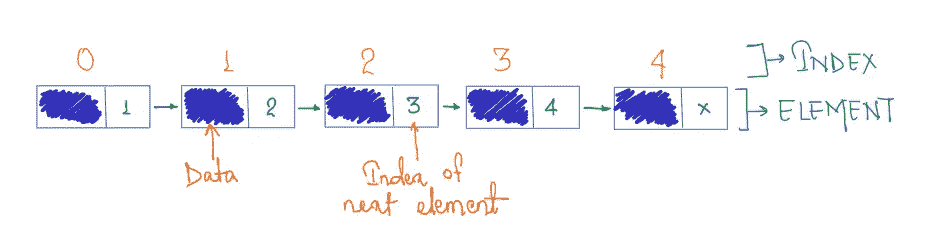

*Food for thought: Does LinkedIn connections have anything to do with Linked Lists?*

因为它变得有些复杂，让我们总结一下技术细节

*   链表中的每个元素包含两个部分——当前元素的**数据**和下一个元素的**索引**(或地址)

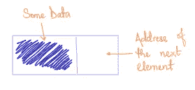

An element of Linked List

*   您可以在链表的任何位置输入新元素；你只需要*插入*这个新元素，这样**链接**就会以正确的方式更新

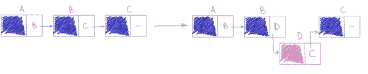

Adding element D between elements B & C. Letters represent the Index/Address

*   只要更新**链接**，就可以从链表的任何一点删除一个元素

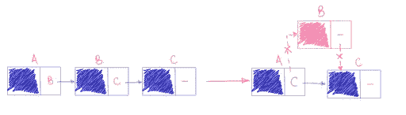

Removing element B

链表的这些特性使得*成为一个链*(不是**链**，还不是)。它是一个链，其中每个元素都连接到下一个，并且可以根据我们的需要修改多次，只要我们不断正确地更新链接。

*注意:链表有一些变体，但这不在这里讨论的范围之内。*

# 构建链条

从*链条*到**链条**的跳跃需要一些修改。在接下来的几个步骤中，我们将尝试使用链表概念构建一个非常简单的“块链”。

第零个修改是我现在将每个*元素*称为**块**(还不是**块**，大写很重要！)并稍微改变一下形状。我这样做是为了方便。

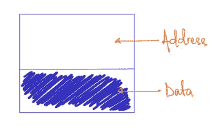

A ‘block’

第一次修改非常小。我们只是翻转方向。不是每个块存储下一个块的*的地址，而是存储前一个*块的*的地址。*

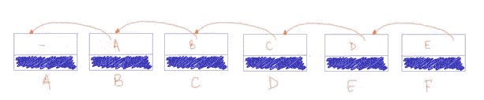

‘Flipping’ the direction of links. This representation can start getting noisier. So the image below, represents the same idea in a different format.

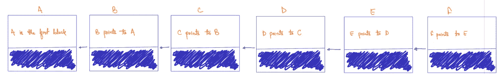

Same idea as image above, but a tidier representation

现在，改变游戏规则的第二次修改！在链表中，我们只存储前一个(因为我们已经翻转了方向)块的地址。这里，让我们也按正确的顺序存储链中每个在前元素的地址*。因此，最后一个块包含了在它之前的每个块的地址，并按照它们出现的顺序排列。很微妙，但是很厉害！*

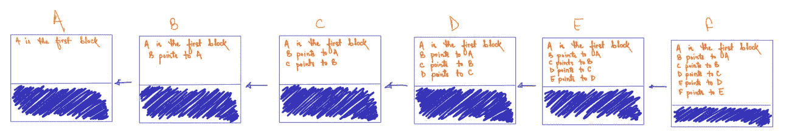

Storing the entire ‘preceding’ history of links in each block

第三个修改是**复制**——很多很多的复制。这个块链保存在网络上的许多计算机上。每次我们对这个链做任何改变时，我们都将更新后的链重新共享给所有这些计算机。本质上，网络中的每台计算机都有一个完全相同的链条副本。

## 链式验证协议

通过这些修改，我们已经远离了传统的数据结构领域。因此，现在是停下来反思我们所取得的成就的好时机。我们按照承诺建造了一个原始的“积木链”。这种结构的安全性非常弱，任何人都可以对链进行修改，只要他们遵循*链验证*的协议。

每次链被修改时，网络中的每台计算机都会收到更新，因为**重复**。这将在每台计算机接受更新的链之前启动一个验证过程。检查每个块，看它们是否有正确的顺序存储前面的块的地址。如果所有块中的所有地址都排序正确，计算机将接受更新后的链并保存它。如果没有，它们拒绝更新的链并保留原始版本。因为每台计算机都可以独立验证链接是否正确，所以我们引入了**去中心化**。*没有一台电脑能统治他们所有人*！

现在，让我们看看如何对这个链进行更改。

## 在链的末端添加新的块

这很简单。即使在真实的**区块链**中，这种情况也时有发生。添加新数据块是我们如何向“数据块链”添加更多数据，从而增加长度。如下所示，将块 G 添加到链中仅仅意味着从前面的块 F 中复制所有的地址，并向 G 上的地址添加额外的一行。

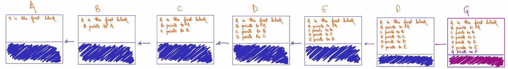

A new block at the end of the chain

## 在链的中间添加新的块

这没那么简单。因为如果我们不小心，我们可能会使*链验证*失败。在中间添加一个新块需要更新链中它后面的每个块。这不是不可能的，只是需要更多的工作。而只要我们做好这额外的工作，我们就会通过*链验证*！

让我们在 C 块和 d 块之间增加一个新的 G 块。

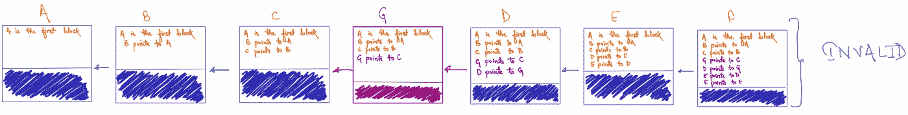

What did we miss?

一旦此更新作为**复制**的结果与其他计算机共享，每台计算机独立运行*链验证*协议。从块 F 开始，每个地址看起来都很好，因为使用地址部分中的信息，计算机可以从块 F 遍历到块 a。然后它试图从块 E 开始做同样的事情。但是验证失败，因为根据块 E， *D 指向 C* 。不是真的！因为在块 E 验证失败，所以该更新被拒绝。

可接受的更新应该是这样的

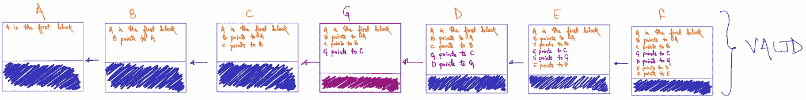

*A change in every block after the new block is inserted!*

## 在链的开始处添加新的块

这几乎是从上面得出的结论。如果我们在链的开始添加一个新的块，我们只需要更新链中每个块的地址。我不想用另一张图来占用空间，但我想你现在已经明白了。最重要的一点是— *我们在链的更高层添加一个新的块，我们必须修改的块越多，我们必须做更多的工作来保持链的有效性！*

# 总之…

到目前为止，我们已经构建了一个非常原始的块链，其中向链中添加新块相对来说比在中间(或任何更高的位置)添加新块更容易。当然，这并非不可能。但这是额外的工作。如果以某种方式，我们可以使工作变得非常困难(或昂贵)，在链条中间插入任何东西都将变得不切实际。这就是**区块链**的本质——在任何**模块**上添加这条新的 *X 点到 Y 点*的线路所需的工作是极其昂贵的，以至于不值得做一次以上(对于链末端的新模块)。

很多时候，我们读到类似**区块链**是不可变的(也就是说不能修改)。事实并非如此。理论上，**区块链**是可变的，它只是不实际(给定当前的计算基础设施)。

我故意忽略了存储在块中的数据。如果我们想修改现有块中的数据，会发生什么情况呢？现在没有办法阻止这种情况。此外，我们创建的链以非常低效的方式维护地址，如果链变得非常长，地址线的数量将爆炸式增长，并可能变得比存储的数据大得多。为了存储 5 MB 的数据，你需要 100 MB 的地址，太疯狂了！但是我希望你现在能够欣赏**链条**的*机构*。

你问的**块**呢？这是我下一篇文章的主题。到时见…

# 扣人心弦

真正的**区块链**让地址维护变得更简单，同时让数据/链修改变得几乎不可能，只需一次计算机魔法的嗖嗖声。**磕磕碰碰**！

> 加入 Coinmonks [电报频道](https://t.me/coincodecap)和 [Youtube 频道](https://www.youtube.com/c/coinmonks/videos)了解加密交易和投资

## 也阅读

 [## 杠杆代币[多头代币]终极指南

### 杠杆化令牌是具有杠杆化风险敞口的 ERC20 令牌，不考虑保证金、要求、管理…

medium.com](/coinmonks/leveraged-token-3f5257808b22)  [## 最佳加密交易所| 2021 年十大加密货币交易所

### 加密货币交易所的加密交易需要了解市场，这可以帮助你获得利润。之前…

blog.coincodecap.com](https://blog.coincodecap.com/crypto-exchange)  [## 2021 年最佳加密交换平台| CoinCodeCap

### 如果我们看看今天的场景，许多加密货币交换平台提供了广泛的功能和深度…

blog.coincodecap.com](https://blog.coincodecap.com/best-swap-platforms)