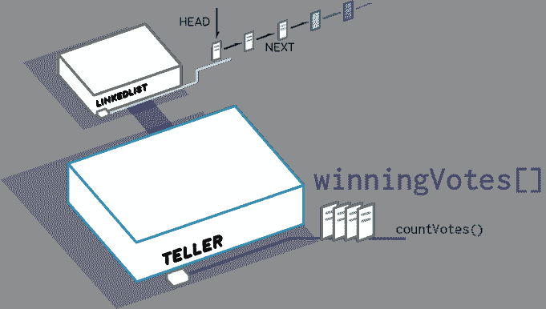

# Solidity 中的链表

> 原文：<https://medium.com/coinmonks/linked-lists-in-solidity-cfd967af389b?source=collection_archive---------0----------------------->

我们需要一个高效的结构来存储智能契约中的大量条目，以便快速遍历。即使物品数量增加，添加新物品也必须非常便宜。


solidity 中的映射数据类型非常适合存储信息，但是如果你不知道每一项的索引，就很难浏览。

有了一个链表，你就像一个链表一样存储了当前数据中**下一**数据的索引。为了使*写*成为我们最有效的操作，我们想通过跟踪一个**头**索引来将项目添加到列表的前面。当我们想要添加新元素时，我们将现有的**头**索引作为新元素的**下一个**索引，然后将**头**设置为新元素。对于任何大小的列表，这种操作花费相同的计算量。当我们想要浏览数据时，我们从**头**索引开始，并沿着**下一个**索引的轨迹前进。

让我们创建一个名为 **LinkedList** 的契约，它存储了所有链接在一起的**对象**的列表。一个**对象**是一个*结构*数据类型，它保存下一个对象的索引以及一个**名称**和一个**编号**。出于演示的目的，让我们假设这个契约旨在保存来自小的、虚构的地区的投票信息，其中 **name** 是候选人的名字， **number** 是候选人在该地区获得的票数。

同样，我们将跳过编译、部署和脚本机制，假设读者已经遵循了[之前的探索](https://concurrence.io/exploration/deployingacontract)。

```
node compile LinkedList
node deploy LinkedList

0xFD400Ff1b9f23b105386350309C0616A50c969bE
```

然后，让我们用一组类似于以下内容的事务填充合同:

```
node contract addEntry LinkedList null 93 "Bram"
```

(这个条目说候选人**布拉姆**获得了 **93** 张选票。)

让一些地区报告他们的结果:

```
node contract addEntry LinkedList null 26 "Hal"
node contract addEntry LinkedList null 23 "Julian"
node contract addEntry LinkedList null 27 "Hal"
node contract addEntry LinkedList null 33 "Eva"
node contract addEntry LinkedList null 23 "Julian"
node contract addEntry LinkedList null 42 "Eva"
node contract addEntry LinkedList null 34 "Hal"
node contract addEntry LinkedList null 12 "Julian"
node contract addEntry LinkedList null 57 "Hal"
```

然后，我们可以运行我们的 **getTotal()** 函数来计算总票数:

```
node contract getTotal LinkedList

TOTAL:370
```

我们可以免费运行 **getTotal()** 离线，但是如果我们需要改变合同的状态，我们将不得不支付汽油费用。让我们再深入探讨一下汽油成本，看看我们在处理什么。

让我们运行 **setTotal()** 函数，它将运行 **getTotal()** ，就像我们离线时那样，但它会将它写入 **writtenTotal** *uint* 。因为状态发生了变化，网络中的每一个契约都必须遍历我们的链表，并最终达到相同的总数。这将耗费我们一些汽油:

```
node contract setTotal LinkedList
```

(在 [etherscan.io](https://ropsten.etherscan.io/tx/0xb09dcff01d528aa00dd1cee5703dee4fc8ee6383afc310cedd279f13614dc9c0) 上的交易)

要遍历列表，跟踪总数，并最终将总数写入 state，需要花费 **0.001034044** ether。

(参见 [etherscan.io](https://ropsten.etherscan.io/vmtrace?txhash=0xb09dcff01d528aa00dd1cee5703dee4fc8ee6383afc310cedd279f13614dc9c0) 上的所有 349 个操作)

现在，如果我们使用 **resetTotal()** 函数在不遍历列表的情况下更改相同的状态，让我们看看代价是什么:

```
node contract resetTotal LinkedList
```

(在 [etherscan.io](https://ropsten.etherscan.io/tx/0x8fc15b5fe628b203323d0fe6c9f43bbf931066bfcdaf34f4185e83181a5a88d9) 上的交易)

哇，真便宜，才 0.000292974 乙醚。所以也许我们可以减去这两个数字，然后大概算出遍历这个列表要花多少钱？

以美元计算，假设 ETH 约为 300 美元，支付 22 gwei 的天然气，设置我们的 uint 值约为 **$0.09** ，遍历我们的 10 个条目列表约为 **$0.22** 以保持运行总数。回头看添加一个条目，按同样的速率，大约花费了 **$0.63**



记住*关注点分离*，让我们创建第二个契约，它将与 **LinkedList** 契约交互，而不是将功能直接写入 **LinkedList** 契约。这份契约将被称为**计票员**，一旦达到**法定人数**就将计票。

使用 *enum* 数据类型，我们可以将出纳员编码为像状态机一样执行。注意 **countVotes()** 函数在检测到新的条件时是如何改变状态的。这里最重要的概念是**极限转向**。由于 gas 限制(参见[停止问题](https://en.wikipedia.org/wiki/Halting_problem)，我们无法在一个事务中遍历整个列表。我们要做的是遍历它的一部分，然后跟踪事务之间的运行总数。在生产中，我们将使用 **msg.gas** 变量，但出于演示目的，我们一次只数四个。

```
node compile Teller
node deploy Teller

0x3c67a0e63a967810fcC5e48F9a94c6D561D9a7cd
```

**链表**合同的当前 **getTotal()** 正在返回 **370** 。因此，如果我们针对 **LinkedList** 合同地址运行 **countVotes()** 函数，那么**出纳员**应该停留在状态 **0** :

```
node contract countVotes Teller null 0xFD400Ff1b9f23b105386350309C0616A50c969bE
node contract getState Teller

STATE:0
```

让我们进行最后一次计票，使总数超过所需的法定人数:

```
node contract addEntry LinkedList null 32 "Bram"
node contract getTotal LinkedList

TOTAL:402
```

现在，当我们触发 **countVotes()** 函数时，状态应该变为 **1** ，代表**count votes**的状态:

```
node contract countVotes Teller null 0xFD400Ff1b9f23b105386350309C0616A50c969bE
node contract getState Teller

STATE:1
```

在我们开始计票之前，让我们检查一下**出纳员**合同中的几个变量:

```
node contract getCounted Teller
COUNTED:0

node contract getCurrentPointer Teller
CURRENTPOINTER:0x0000000000000000000000000000000000000000000000000000000000000000
```

现在让我们开始第一轮计票，总共应该有前四张选票:

```
node contract countVotes Teller null 0xFD400Ff1b9f23b105386350309C0616A50c969bE

node contract getCounted Teller
COUNTED:4

node contract getCurrentPointer Teller
CURRENTPOINTER:0xa286649c24c2fe84cceb42001867f0d66be3fcc1e9612f9974ed74d6fb86375f
```

在前四张选票合计后，我们也可以看到谁领先，但由于该州仍在计票，我们知道选举还没有结束:

```
node contract getWinningName Teller
WINNINGNAME:Hal

node contract getWinningVotes Teller
WINNINGVOTES:91

node contract getState Teller
STATE:1
```

让我们通过运行 **countVotes()** 函数来结束选举，直到状态变为 **2** ( **选举完成**):

```
node contract countVotes Teller null 0xFD400Ff1b9f23b105386350309C0616A50c969bE
node contract countVotes Teller null 0xFD400Ff1b9f23b105386350309C0616A50c969bE

node contract getState Teller
STATE:2
```

现在我们可以确信我们已经选出了真正的获胜者，我们的选举已经结束:

```
node contract getWinningName Teller
WINNINGNAME:Hal

node contract getWinningVotes Teller
WINNINGVOTES:144

node contract getTotal Teller null Bram
TOTAL [Bram]:125

node contract getTotal Teller null Eva
TOTAL [Eva]:75

node contract getTotal Teller null Julian
TOTAL [Julian]:58
```

这个链表和部分遍历概念将是我们如何在区块链上达成共识的基础。矿工会离线请求，并在链上发布他们的结果。然后，我们将遍历一个列表，根据结果添加“标记”记号，以找到最佳答案。

> [直接在您的收件箱中获得最佳软件交易](https://coincodecap.com/?utm_source=coinmonks)

[](https://coincodecap.com/?utm_source=coinmonks)

*这是摘自* [*的并发链表探索*](https://concurrence.io/exploration/linkedlists/) 。

阅读更多关于[并发](https://concurrence.io)和我们其他[探索](https://concurrence.io/exploration/)的信息。