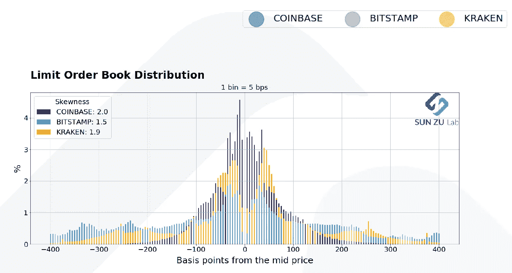
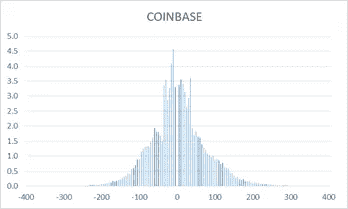
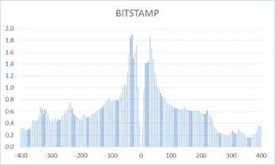
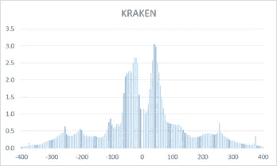
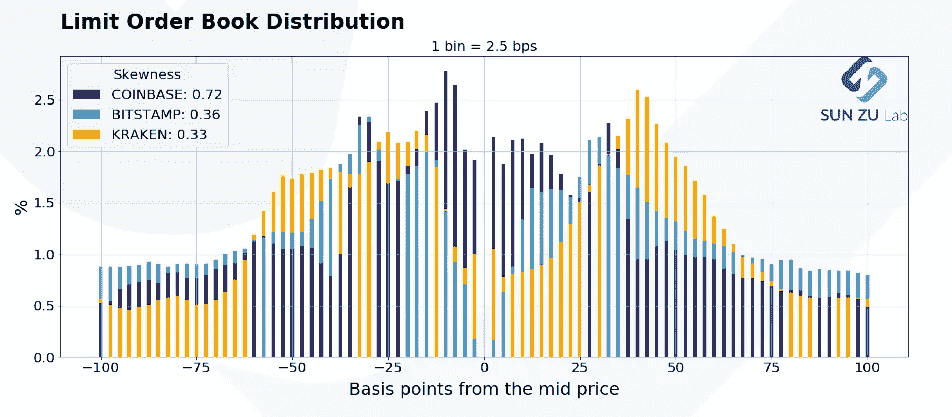
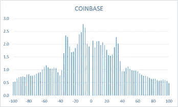
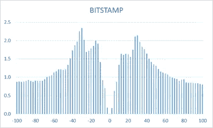
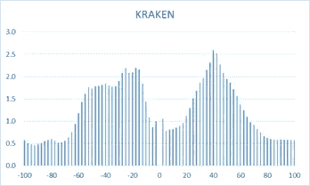

# 流动性和订单分配

> 原文：<https://medium.com/coinmonks/liquidity-and-order-book-distribution-908e4ebd9173?source=collection_archive---------1----------------------->

## 看看中等价位附近的订单分布

当我们组建团队[启动 SUN ZU Lab](https://sunzulab.com/) 时，我们主要有一个问题:加密资产是否具有流动性，如果确实存在流动性，它在数量或质量上与我们 25 年来在传统市场上看到的有多大不同？

> 流动性被定义为在没有重大不利价格变动的情况下购买或出售大规模资产的能力。

这个直截了当的问题并不简单，而且有许多分支。事实上，如果你能够对流动性进行定性和量化，那么你应该能够更好地执行(即价格的不利变动较小)。因此，无论谁从订单簿分析开始，都应该准备好一直进行实时“智能”订单路由。

在 SUN ZU，我们不是逃避这种挑战的人，所以我们决定迈出第一步，[定期分享我们的成果](https://sunzulab.com/research/)。在我们将探索、记录、评论的众多发现中，我们想从一个基本要素开始:订单分配。

下图显示了中间价附近的流动性总量(摘自我们的第一份公开研究报告[点击这里](https://sunzulab.com/wp-content/uploads/2020/09/liquidity_analysis_September_2020-3.pdf))。为了了解这一点，我们绘制了三个交易所(比特币基地、Bitstamp 和北海巨妖)的 BTC/美元订单簿中的订单分布，并对 9 月上半月的结果进行了平均:

Order book distribution at +/- 400 bps from mid-price. Data from Kaiko.com.

该图如下所示:每根棒线代表在距离中间价(mid =(买价+卖价)/ 2)的给定距离找到的订单的比例(百分比)。例如，在-150 bps 的 0.7%棒线表示在该价格区间内所有订单的 0.7%[-4%；+4%]可在中间价以下 1.5%找到。根据结构，对于每个交易所，所有棒线的总和等于 100%。

事实上，上面的图表是三张独立图片的叠加:

将这三个图表分层的好处是呈现流动性的总体视图，以及流动性在三个交易所之间的划分，使用单一尺度和清晰的颜色编码。

如果我们关注一个更小的区间，比如说[-1%；1%]，我们得到如下分布:

Order book distribution at +/- 100 bps from mid-price. Data from Kaiko.com.

如前所述，此图像是三个独立图表分层的结果:

那些图表有什么意义？为什么我们选择汇总所有交易所的数据，并按时间进行平均？其目的是衡量投资者、单个交易所和整个市场(这里只代表三个交易所)的行为模式。这里有几个有趣的地方:

*   *钟形曲线*:钟形曲线有意义吗？的确是这样:很直观的是，订单密度会随着远离交易发生地(即中间价)而降低。然而，当*接近*中等价位时，差异就相当明显了:在某些情况下，书中可用的篇幅会增加，在其他情况下会减少。例如，比特币基地的价差比 Bitstamp 或北海巨妖要窄得多，看起来 Bitstmap 上的投资者似乎想远离书中的第一个限制。事实上，我们打算投入更多的工作来调查这些问题，以提供定性和定量的见解，帮助投资者更好地理解和执行他们的交易。
*   *衰减速度*:从流动性衰减的速度中可以提取信息吗？绝对是:在一个高度波动的世界里，许多投资者会希望在远离交易水平的地方下单，以从剧烈波动中获益。这种策略在统计套利中很常见，如果在加密领域看不到类似的东西出现，那将是一个惊喜。尾部的“肥满度”也是“潜在”流动性的指标，即在适当情况下等待执行的订单。
*   *对称*:那些分布应该是对称的，有什么根本原因吗？嗯，是也不是。做市商下单的方式往往是对称的。为一方提供流动性而不为另一方提供流动性是没有意义的(如果你碰巧承诺提供流动性，实际上你没有选择)。相反，本地买家或卖家会站在这一边或那一边。因此，它们的相对比例可能会改变订单簿的对称性。然而，在一个市场操纵普遍存在的世界里，这种关系被严重削弱:任何人都可以下大量订单，除了“装点门面”之外别无其他目的。这里再次需要更多的分析来理解订单动态。
*   *交易所之间的相对值*:交易所有*非常*不同的订单簿。对此可以有多种解释:费用结构、有具体义务的做市计划、或多或少的严格市场监督、最小交易或最大持股规模、杠杆的可用性等。因为在一个给定的交易所进行交易仍然需要法定和加密的保证金，并意味着托管风险，所以比较不同交易所的流动性对于在众多可用的交易所中选择几个是非常重要的。
*   *时间相关性*:这里的数据是 9 月上半月的数据。SUN ZU 实验室将定期生成这些报告，以便进行不同时期的比较。如果单个交易所或总体情况发生变化，这可能表明流动性在增加、减少或转移。肯定是值得知道的事情。
*   *绝对分布与相对分布*:我们在此展示了相对分布，即没有提及各订单簿中的绝对尺寸。此外，我们只考察了一项资产，即 BTC。我们能做的也就这么多了。请耐心听我说，在这些问题上我们还有很多话要说！！

欢迎来到流动性分析的世界。

## 另外，阅读

*   最好的[密码交易机器人](/coinmonks/crypto-trading-bot-c2ffce8acb2a)
*   [密码本交易平台](/coinmonks/top-10-crypto-copy-trading-platforms-for-beginners-d0c37c7d698c)
*   最好的[加密税务软件](/coinmonks/best-crypto-tax-tool-for-my-money-72d4b430816b)
*   [最佳加密交易平台](/coinmonks/the-best-crypto-trading-platforms-in-2020-the-definitive-guide-updated-c72f8b874555)
*   最佳[加密借贷平台](/coinmonks/top-5-crypto-lending-platforms-in-2020-that-you-need-to-know-a1b675cec3fa)
*   [最佳区块链分析工具](https://bitquery.io/blog/best-blockchain-analysis-tools-and-software)
*   [加密套利](/coinmonks/crypto-arbitrage-guide-how-to-make-money-as-a-beginner-62bfe5c868f6)指南:新手如何赚钱
*   最佳[加密制图工具](/coinmonks/what-are-the-best-charting-platforms-for-cryptocurrency-trading-85aade584d80)
*   [莱杰 vs 特雷佐](/coinmonks/ledger-vs-trezor-best-hardware-wallet-to-secure-cryptocurrency-22c7a3fd391e)
*   了解比特币的[最佳书籍有哪些？](/coinmonks/what-are-the-best-books-to-learn-bitcoin-409aeb9aff4b)
*   [3 商业评论](/coinmonks/3commas-review-an-excellent-crypto-trading-bot-2020-1313a58bec92)
*   [AAX 交易所评论](/coinmonks/aax-exchange-review-2021-67c5ea09330c) |推荐代码、交易费用、利弊
*   [Deribit 审查](/coinmonks/deribit-review-options-fees-apis-and-testnet-2ca16c4bbdb2) |选项、费用、API 和 Testnet
*   [FTX 密码交易所评论](/coinmonks/ftx-crypto-exchange-review-53664ac1198f)
*   [n 零审核](/coinmonks/ngrave-zero-review-c465cf8307fc)
*   [Bybit 交换审查](/coinmonks/bybit-exchange-review-dbd570019b71)
*   [3Commas vs Cryptohopper](/coinmonks/cryptohopper-vs-3commas-vs-shrimpy-a2c16095b8fe)
*   最好的比特币[硬件钱包](/coinmonks/the-best-cryptocurrency-hardware-wallets-of-2020-e28b1c124069?source=friends_link&sk=324dd9ff8556ab578d71e7ad7658ad7c)
*   最佳 [monero 钱包](https://blog.coincodecap.com/best-monero-wallets)
*   [莱杰 nano s vs x](https://blog.coincodecap.com/ledger-nano-s-vs-x)
*   [Bitsgap vs 3 commas vs quad ency](https://blog.coincodecap.com/bitsgap-3commas-quadency)
*   [莱杰 Nano S vs 特雷佐 one vs 特雷佐 T vs 莱杰 Nano X](https://blog.coincodecap.com/ledger-nano-s-vs-trezor-one-ledger-nano-x-trezor-t)
*   [block fi vs Celsius](/coinmonks/blockfi-vs-celsius-vs-hodlnaut-8a1cc8c26630)vs Hodlnaut
*   [bits gap review](/coinmonks/bitsgap-review-a-crypto-trading-bot-that-makes-easy-money-a5d88a336df2)——一个轻松赚钱的加密交易机器人
*   为专业人士设计的加密交易机器人
*   [PrimeXBT 审查](/coinmonks/primexbt-review-88e0815be858) |杠杆交易、费用和交易
*   [埃利帕尔泰坦评论](/coinmonks/ellipal-titan-review-85e9071dd029)
*   [赛克斯·斯通评论](https://blog.coincodecap.com/secux-stone-hardware-wallet-review)
*   [BlockFi 评论](/coinmonks/blockfi-review-53096053c097) |赚取高达 8.6%的加密利息