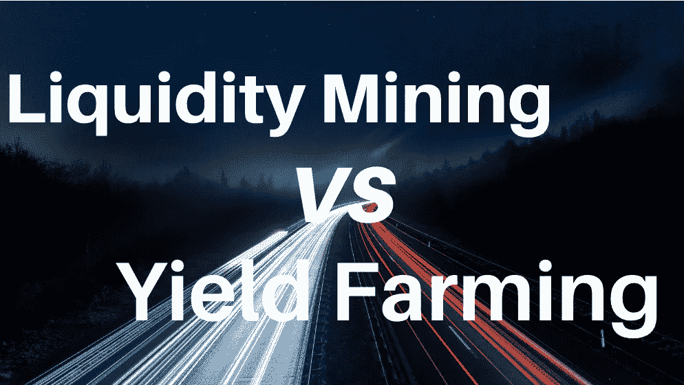

# 流动性采矿与高产农业

> 原文：<https://medium.com/coinmonks/liquidity-mining-vs-yield-farming-5e68bcb561a9?source=collection_archive---------0----------------------->

## 理解加密世界中两个最有趣现象的简单指南，产量农业和流动性挖掘。这两者有什么区别？

对于加密货币和区块链世界的粉丝来说， **2020 年绝对是 Defi** 年:信不信由你…