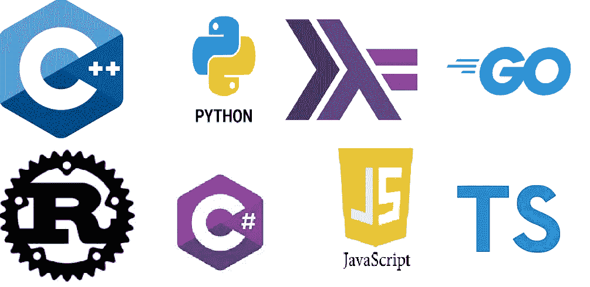

# 41 个加密项目中使用的编程语言和框架列表

> 原文：<https://medium.com/coinmonks/list-of-programming-languages-and-frameworks-used-in-41-crypto-projects-2b7223099c57?source=collection_archive---------0----------------------->

## Mainnets、智能合同、GUI、改进建议、钱包、dApps、API 等等。



```
**Table of Contents:**· [#1 —  Bitcoin (BTC): C++, Python](#7fc4)
· [#2 —  Ethereum (ETH): Go, Solidity, C++, Javascript](#e3bf)
· [#3 — Binance Coin (BNB): Go, Typescript, Solidity](#3434)
· [#4 —](#3e8e)…
```