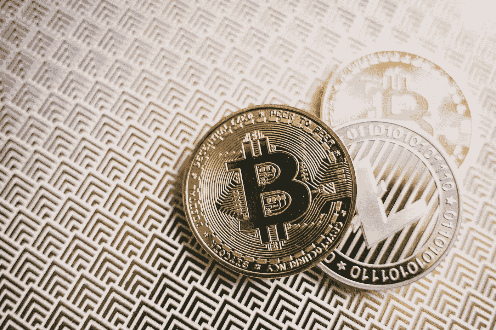

# 莱特币与比特币:哪个更好？

> 原文：<https://medium.com/coinmonks/litecoin-vs-bitcoin-which-is-better-d12d11f7ecf5?source=collection_archive---------11----------------------->

Photo by [Alesia Kozik](https://www.pexels.com/@alesiakozik?utm_content=attributionCopyText&utm_medium=referral&utm_source=pexels) from [Pexels](https://www.pexels.com/photo/pattern-texture-vintage-business-6777560/?utm_content=attributionCopyText&utm_medium=referral&utm_source=pexels)

如果你是加密领域的新手，欢迎。这篇文章是给你的。

加密货币就是数字货币。你看不见它，摸不着它。你不能把它从自动提款机里取出来(嗯，技术上是不能的)，但它是存在的，并且被用作虚拟世界中的金融交换手段。

现有数百种加密货币，然而，在加密领域有两个竞争者似乎引起了一点骚动。

也就是莱特币和比特币。

对于一些人来说，莱特币与比特币的辩论非常激烈。在本文中，我们将深入探讨这两者之间的区别，并帮助您决定哪一个更适合您。

# 加密货币简史

加密货币的理论框架已经存在了几十年。“加密货币”得名于“密码学”，即研究安全通信方法的学科。这意味着确保信息在信息传递者和目标接收者之间被锁定。

大约在 20 世纪 80 年代，一位名叫 David Chaum [的美国密码学家发明了一种算法](https://www.moneycrashers.com/cryptocurrency-history-bitcoin-alternatives/#:~:text=It%20was%20first%20outlined%20in,exchanging%20and%20mining%20the%20currency.)，直到今天，这种算法对于基于网络的加密仍然至关重要。它为未来的电子货币转移铺平了道路，被称为“盲币”。

Chaum 继续发展一家名为 DigiCash 的公司，该公司于 90 年代倒闭。电子金融交易的概念还没有流行起来，而且似乎风险太大。其他一些人尝试了加密货币，但也失败了。

更传统的产品开始出现在数字现金时代之后，比如贝宝。e-Gold 公司也进入了市场，但我们都知道结果如何。

直到 2009 年，从比特币开始，加密货币才重返舞台。

# 莱特币与比特币

除了一个名字，谁创造了比特币仍然是个谜，那就是中本聪。然而，使用比特币的优势是显而易见的。

比特币既是数字货币，也是支付网络。这意味着 BTC 体系的运作完全不依赖任何政府机构、货币经济学家或其他此类监管者。

比特币是第一个这种类型的东西，[允许同行之间自由地、几乎匿名地交换价值。](https://cryptonews.com/guides/bitcoin-pros-and-cons.htm)

有几个比特币交易平台可供用户购买、出售和交换。使用比特币的一些优点是:

*   开放式金融系统，无需传统银行，即可在全球范围内全天候支付。
*   比特币不能从你这里被没收。BTC 的交易是不受审查的。
*   任何人都可以在没有任何信用记录验证的情况下开立比特币账户。
*   比特币的价值是设计升值的，不受通货膨胀的影响。

当要决定莱特币还是比特币时，这是一个艰难的决定，因为它们在本质上是同质的。尽管如此，还是有一些不同之处。

# 莱特币

莱特币是 2011 年左右出现的。就像比特币一样，是一个开源的全球支付网络。没有中央政府监督它。

一个麻省理工学院的毕业生开发了查理·李的 LTC。他将莱特币设计成比特币“黄金”的“白银”。他的目标是改进比特币的缺点。

和比特币一样，有几个平台可以用来购买、出售或交易莱特币。一旦你进入了加密领域，交换就变得简单了，甚至是国际性的。较发达的国家允许国际伙伴关系有更大的灵活性。

莱特币具有与比特币相同的优势，还有一些额外的优势:

*   与其他加密货币系统相比，莱特币可以在更短的时间内处理更多的交易，使其更快和可扩展
*   交易费用是象征性的
*   不断改进网络功能，如闪电网络协议
*   采矿效率

# 有什么区别？

虽然比特币和莱特币表面上看起来一样，但有一些关键的区别。两者之间的大辩论似乎主要在于莱特币的交易速度与比特币的实力。

许多人认为比特币将在整个市场波动中始终保持冠军地位，然而，莱特币已被证明进行了一场体面的战斗。莱特币和比特币之战肯定会继续下去。

你觉得怎么样？

> 加入 Coinmonks [电报频道](https://t.me/coincodecap)和 [Youtube 频道](https://www.youtube.com/c/coinmonks/videos)了解加密交易和投资

## 另外，阅读

*   [网格交易机器人](https://blog.coincodecap.com/grid-trading) | [Cryptohopper 审查](/coinmonks/cryptohopper-review-a388ff5bae88) | [Bexplus 审查](https://blog.coincodecap.com/bexplus-review)
*   [7 个最佳零费用加密交易平台](https://blog.coincodecap.com/zero-fee-crypto-exchanges)
*   [分散交易所](https://blog.coincodecap.com/what-are-decentralized-exchanges) | [比特 FIP](https://blog.coincodecap.com/bitbns-fip) | [Pionex 审查](https://blog.coincodecap.com/pionex-review-exchange-with-crypto-trading-bot)