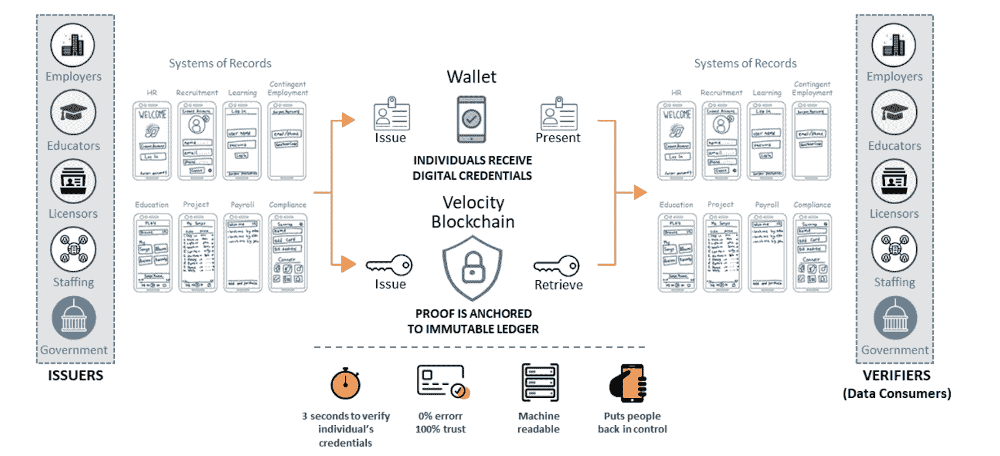

# 信纸:经验的证明

> 原文：<https://medium.com/coinmonks/litepaper-proof-of-experience-da1b76001efa?source=collection_archive---------3----------------------->

简历可以翻译为人生历程，大多数人把它称为 CV。这是一份由申请工作的人写的文件，列出了他的技能和经验，希望说服读者雇用他。这是主要问题所在。信任。读者如何才能知道申请人没有编造整个事情，或者至少夸大了听起来更适合这份工作？单从履历上看，他不行。

看完简历，他需要工作面试，背景调查和评估中心。对求职者和雇主来说都是一个痛苦的过程。当申请一份仅持续几周的自由职业时，痛苦会成倍增加。没有合适的关系或网络，不经过多次面试和测试，很难找到工作。通过信任来简化和缩短这一过程，会增加很多价值。

# 如何证明经验

大问题；如何证明经历或技能？前任老板的评价信、学位证书、工作面试或评估中心都是验证经验的经典方式。但是大部分都非常耗时。

LinkedIn 对这个问题有一个更现代的方法。社交网络上的一级关系可以认可档案中维护的技能。一项技能获得的支持越多，它在 Linkedin 搜索引擎上的权重就越高。一项由 20 名同行认可的 JavaScript 前端开发技能，将让招聘人员对这一说法的真实性有一些信心。尽管如此，同事们可能不想伤害彼此，可能会认可技能作为一种帮助。

对于在数字世界工作的人来说，事情要简单一些。一个作家可以链接到他的博客或文章，并通过显示读者、喜欢或参与的统计数据来证明她的技巧有多好。一个开发者，尤其是开源世界的开发者，可以链接到 GitHub，展示她对项目投入了多少，这些项目有多受欢迎(明星)。设计师可能会对她的作品做类似的事情。

另一种证明经验的传统方式可以在自由职业者的世界里找到。自由职业者大多通过满意的客户推荐获得工作。通常口碑比证书或简历更能证明经验。像 Fiverr 和 Upwork 这样的自由职业平台通过回顾过去的约定，将这一点提升到了一个新的水平。在完成工作和付款后，客户可以审查自由职业者，她的工作能力，并帮助其他不确定声称的技能。

有些工作比其他工作更容易证明。项目经理、闭源开发者、顾问、产品经理或会计师将不能依赖数字内容，而必须使用前面描述的传统方式。

我们总结一下。经验可以通过以下方式证明:

*   雇主的鉴定信
*   大学或其他正规培训的证书
*   评估中心测试您的经验或背景调查
*   来自同行的支持(比如 LinkedIn)
*   在 GitHub、博客或作品集上数字化
*   审查自由职业者平台上已完成的工作

# 体验的数字验证

区块链及其分布式账本开辟了许多可能性。特别是代币的发行和使用。具有特定属性的代币可以被铸造到区块链上，并且每个人都能够[检查该代币的属性](https://levelup.gitconnected.com/technical-deep-dive-into-ethereums-nft-erc-721-70ee37f09104)和交易历史。一旦上了区块链，信息就不能更改，即。可以相信，如果它是正确发行的，它一定仍然有效。

如果一份简历可以由一堆代表你经验的不可更改的标记或徽章组成，会怎么样？简历可以简单地是以太坊上的一个钱包，里面装着一堆类似 NFT 的代币。只是他们需要不可转让和不可替代。丹·罗梅罗[发布了](https://twitter.com/dwr/status/1403389706105098241)该领域的 ERC 令牌标准(或仍将成为标准)概述:

每一次经历、培训或工作都可以铸造这样一个标志。用户钱包中所有这些令牌的集合构成了 CV。申请工作可能只是一个链接，链接到你在 etherscan 上的钱包地址。

剩下的问题是如何确保这样一个 NTNFT 实际上可以与它所代表的体验进行适当的验证？NTNFT 可以是一个大学学位，为了把它放进钱包，它需要在通过所有考试后由大学铸造。新加坡已经开发了 [Opencerts](https://www.opencerts.io/) ，它将证书的数字表示发布到以太坊区块链上。这表明机构愿意并愿意参与。想要加入 Opencert 的机构需要[向 SkillFuture Singapore 注册](https://www.opencerts.io/registry)。

任何涉及机构的此类过程都很简单。该机构需要被授权铸造代币，然后可以将证书代币发行到钱包中。同样的过程也适用于就业。只要雇主被授权铸造 NTNFTs，它就可以应雇员的要求这样做，并将其转移到他的钱包中。然后，令牌将确认角色和角色中的体验。它由雇主的私钥签名，由于其授权，该私钥将正确地验证体验。

**无机构**

没有一个机构，整个核查过程变得更加复杂。根据我们可证明的经验，以下内容不是由中央权威发布的:

*   来自同行的支持(比如 LinkedIn)
*   在 GitHub、博客或作品集上数字化
*   审查自由职业者平台上已完成的工作

## LinkedIn 喜欢背书

LinkedIn 的[背书](https://www.jobscan.co/blog/linkedin-endorsements/)概念是一种在社交网络中证明经验的有趣方式。从理论上讲，越多的同龄人认可一项技能，这项技能就越可信。然而，支持同龄人不需要任何成本，所以这纯粹是基于互惠。这在这种情况下只是部分期望的，因为签注应该仅针对真实的体验而给出，而不是因为给予者期望作为回报的签注。这个过程很难控制，所以 LinkedIn 会询问技能的质量，以及你是如何发现它的，以便从某种角度来看待背书。

第二个需要防范的是虚假代言。是什么阻止了一个人买代言，就像给亚马逊买假评论一样？如果是免费创建背书，任何零体验钱包都可以简单的为别人背书。该系统可以通过创建支持他人的虚假账户来欺骗([西比尔攻击](https://en.wikipedia.org/wiki/Sybil_attack))。系统中需要一些激励或成本来阻止这种行为。钱包可以被要求具有最小量的经验或背书，以便能够为其他人背书。或者，可以根据代言人的经历对代言进行加权，这将使得以有意义的方式造假变得更加困难。LinkedIn 也有类似的方法，显示技能是否得到了具有相同技能的人的认可。

Linkedin 可以被用作一个 API 来获取支持并处理它们，但 LinkedIn 是一个集中的机构，可以随时关闭、审查或改变其服务。也许 LinkedIn 甚至可以作为一个机构，根据他们系统中的内容铸造体验令牌。

## 平台内容

对于开源开发者来说，Github 账户的链接已经成为简历的一部分。Github 简介会告诉你很多关于开发者的信息。对项目的贡献显示了活动，星级表明了项目的重要性，因为编码和文档是公开显示的，所以这是检查风格的好来源。这些信息中的一部分可以通过 Github API(或者是[的摘录](https://ghtorrent.org/))获得，因此可以在验证体验时自动检查。一篇[研究论文](https://www.gousios.gr/bibliography/HG15.html)描述了如何从 Github 中提取与工作相关的信息来匹配工作搜索。这是一个很好的基础，可以用来提取相关的技能，并将它们作为经过验证的体验放进用户的钱包。

对于发布内容的作者，可以使用类似的方法。如果写作可以在网上获得，并且平台有 API，那么验证技能的一个很好的指标就是阅读和参与写作的次数。如果发布平台不提供这种信息，文本挖掘甚至可以用于自动分类文章。

## 自由平台

自由职业者平台可能会提供另一个很好的技能信息来源。他们通常跟踪职位发布(包括范围)、工作分配和支付的过程。经验的最好证明是大量已完成的有偿工作——越多越好。像 Upwork 和 Fiverr 这样的平台上成功的自由职业者有一个完整的工作清单，这些工作已经完成，已经支付，甚至可能被客户评级/评论。如果可以利用的话，这是一个很好的经验证明来源(Upwork 有一个 [API](https://developers.upwork.com/?lang=python#public-profiles_search-for-freelancers) 提供技能)。

将机构验证的经验与平台上的内容验证的经验结合起来，可以创建一个良好的总结，并以此建立一个经过验证的数字简历。

# 生态系统参与者

生态系统的主要部分将是 NTNFT(或类似的)令牌。它可以由网络参与者铸造到用户的钱包中，并保存有关经验、学位或技能的信息。它是不可转让的，就像大学学位是不可转让和不可替代的。不可替代意味着它不能与另一个人的大学学位互换，因为可能会有不同的科目和成绩。

*   前面和中间是**体验钱包**。任何人都可以创造一个，但经验或技能是什么，可以添加什么，可能会有一些界限。
*   为公司工作或攻读学位的用户可以请求由**机构**铸造的经验。
*   在铸造经验代币之前，机构本身需要被验证。添加机构的一种可能方式是通过协议令牌进行一致投票。如果足够大的用户基础支持机构的验证，它将被允许创造验证的体验。
*   添加经过验证的经验不会让机构付出任何代价，但如果没有员工或学生的激励和足够的压力，他们可能仍然会缓慢采用。因此，该协议可以向机构支付用于验证体验的代币，这又可能导致人工创建体验以取回代币作为奖励。
*   该协议的主要收入来源可能是通过**体验搜索**。尽管还不清楚如何将公众对这些公开数据的访问货币化。如果获得足够大的用户群，该协议将成为招聘人员和猎头寻找合适员工的绝佳来源。每次搜索都可以收取代币，这反过来会奖励验证者。
*   作为一种机器可读的、经过验证的经验记录，经验搜索将成为**招聘人员的一个有价值的工具。简历没有标准化的格式，其中的大部分信息仍然需要验证。因此，与常见的工作平台相比，使用该协议会带来显著的好处。雇主可以节省验证和背景调查的时间。**
*   第二种也是更灵活的验证体验的方式是**验证者**。在最简单的形式中，这可以是一个连接到 API 以验证所提供信息的实体，如上一节所述。
*   要成为**验证者**，验证的类型需要得到协议治理(GitHub、作家、设计师、自由职业平台等)的批准。).这也可以通过一致投票来实现。
*   重要的是，核查应对新的提议和机制保持开放，因为只有开放的生态系统才能跟上快速发展的技术。如果出现了一种新的体验验证类型，并且可以被批准，那么它应该是可实现的，并且可以被任何看到这样做的商业案例的人连接到协议。
*   验证者可能不得不参与某种形式的赌注，以确保他们的行为符合网络的最大利益。或者，他们可能需要使用 oracle 来访问离线信息。Chainlink 已经为此提供了一些基础设施。他们的 [ChainLinkClient](https://docs.chain.link/docs/make-a-http-get-request/) 可用于调用外部 API，并跨其节点验证数据。
*   用户**可以从协议中请求体验验证。一种避免垃圾邮件验证的机制是支付少量的验证费用。这笔费用可以由招聘者支付的搜索费补贴，因此用户不必支付全部费用。**
*   这种验证中缺少的一个组成部分是用户如何证明要验证的在线帐户实际上是他自己的帐户。用户可以通过用钱包的私钥签署交易来证明钱包是他自己的，但这不适用于 GitHub 帐户。[Bitclout.com](http://bitclout.com)和 [Mirror.xyz](https://mirror.xyz/) 通过让用户[发布他们自己的公钥](https://docs.bitclout.com/#tweet-to-claim-your-profile)来进行类似的验证，以将钱包连接到 twitter。然后，平台会找到此消息，并检查它是否是由它想要连接的帐户创建的。如果一切都正确，帐户被链接。可以实现类似的过程来证明自己在 GitHub 或 LinkedIn 上的帐户。InterRep [描述了](https://jaygraber.medium.com/introducing-interrep-255d3f56682)一个类似的便携式信誉解决方案。该团队已经建立了一个 MVP，并有了如何使解决方案真正去中心化的想法。

# 安全性/隐私

实现提议的解决方案意味着在 chain 上存储经验和技能数据，公开提供给每个人看。这引发了隐私问题，因为任何人都有可能查看前雇主的评估信，泄露私人信息。存储这些信息的钱包有点像假名，因为人们无法从钱包持有者的地址中获得其详细信息。然而，人们仍然可以从经验和技能中逆向工程信息。

一个需要进一步探索的解决方案是[零知识证明](https://www.notboring.co/p/zero-knowledge)是否有助于隐藏一些细节。因此，钱包只会显示类似平面设计的第 6 级(共 10 级),详细信息会被包装起来，只有在需要时才会显示。

# 最小可行产品

NTNFT——不可转让、不可替代的代币或徽章在 [ERC 1238](https://github.com/ethereum/EIPs/issues/1238) 中有所描述。这个想法适合认证或经验，因为它不能转移给别人。ERC 1238 目前只是一个提案，还没有在以太坊网络中实现，因此不会轻易得到钱包等的支持。然而，任何人都可以简单地创建智能合同，因此构建这种不可转让的令牌并不困难。

使这一工作的核心特征应该包括令牌、由机构和验证者铸造令牌以及搜索。

*   令牌智能合约需要具有 ERC 1238 中描述的功能。对于机构而言，代币只能由授权方铸造。令牌需要具有某些描述特征，如技能类型、经验水平，以及与证书的数字版本的潜在链接。如果大学学位仅仅是这些代币的等级，这是有争议的。
*   该协议需要一个符合 ERC 20 协议的治理令牌用于投票和协议激励。
*   铸造令牌应该需要在协议的治理令牌中支付费用。这需要在协议生成智能合同中得到保证。
*   为了从机构之外的来源铸造代币，验证者契约将需要关注从外部来源验证经验信息的过程。ChainLink 的 API 可以用来通过 oracle 运行这个。一个简单的来源似乎是 Upwork 或 Fiverr，它们的 API 提供了对概要文件的评论和技能的访问。一旦通过 oracle 检索和检查了信息，就可以将它作为单独的技能放入钱包中。验证者合同将需要根据第三方来源具体实施，这将需要注意创造技能/经验。
*   所有钱包中的技能都应该是可搜索的。或者直接通过以太网扫描，或者通过可由支付代币使用的定制搜索功能。

# 类似的产品/项目

[**可信地**](https://info.credly.com/) 提供数字徽章，可以用来在他们的平台上验证技能。这是一个伟大的想法，也是朝着正确方向迈出的一步，但它不是一个分散的解决方案，只涵盖某些机构的证书。本文档中描述的开放生态系统具有向创新者和新的潜在验证实施开放的优势，因此可以理想地创建包含所有经验和技能的简历。

[**sky LZ**](https://twitter.com/skyllz_platform?lang=en)**是一个有着非常相似目标的有趣项目，不幸的是由于团队资金耗尽而退出。我无法获得白皮书的副本，因此不知道该项目为何无法获得额外资金以及其他挑战/收获是什么的任何细节。**

****Velocity Network** 正计划建立一个[职业记录商店](https://www.velocitynetwork.foundation/wp-content/uploads/2020/09/Velocity-Non-Technical-Whitepaper-123120-V1.17.pdf)，允许用户在 chain 上存储他们技能和经验的证明。从文档来看，似乎 Velocity Network 正在计划建立自己的区块链，这似乎是一个在实际应用之前的大任务。职业记录将由机构发布，因此它很可能只涵盖员工的一部分技能，可能不适合像 web3 这样快速发展的生态系统。然而，白皮书提到了与自由职业者平台的集成，以从过去的约定中检索数据，这可能是 gig 经济和密码行业的一个巨大的信息来源。该团队对验证器的工作方式含糊其辞，但看起来他们会支付网络费用来获取个人证书。**

**Velocity Networks 的目标客户/用户是机构，因为他们主要受益于在钱包上检查申请人的验证信息。进入机构很容易，但让普通员工使用钱包而不是简历就不容易了。我相信网络效应，因此重点应该放在用户、员工或申请人身上。**

****

**[**StickerCard.eth**](https://stickercard.xyz/) 是一个致力于验证可信度的有趣项目，主要关注可以从钱包内的信息中获得的可信度。**

# **结论**

**我越想这个解决方案，就越想在我的职业生活中亲自使用它。数字简历是零工经济和自由职业者不断增长的生态系统繁荣发展所需要的。我渴望进一步探索这个主题，建立一个原型，并撰写一份白皮书，了解更多细节。我不打算开发或构建这个封闭的源代码，而是希望有一个在 DAO 结构中协同工作的生态系统来推进它。如果您有兴趣参与或了解类似的主题，请联系我们。**

> **加入 [Coinmonks 电报频道](https://t.me/coincodecap)，了解加密交易和投资**

** [## 最佳加密交易所| 2021 年十大加密货币交易所

### 加密货币交易所的加密交易需要了解市场，这可以帮助你获得利润…

blog.coincodecap.com](https://blog.coincodecap.com/crypto-exchange)  [## 2021 年 9 大最佳加密借贷平台

### 当谈到加密货币贷款时，大量因素等同于良好的收入状况。此外，借款的一部分…

blog.coincodecap.com](https://blog.coincodecap.com/crypto-lending)  [## 2021 年最佳加密交易机器人(免费和付费)

### 2021 年币安、比特币基地、库币和其他密码交易所的最佳密码交易机器人。四进制，位间隙…

medium.com](/coinmonks/crypto-trading-bot-c2ffce8acb2a)  [## 最佳 4 个加密交易信号电报通道

### 这是乏味的找到正确的加密交易信号提供商。因此，在本文中，我们将讨论最好的…

medium.com](/coinmonks/best-crypto-signals-telegram-5785cdbc4b2b)  [## BlockFi 评论 2021:利弊和利率

### 今天，我们提出了一个全面的 BlockFi 评论，这是一个成立于 2017 年的加密贷款平台，拥有其…

blog.coincodecap.com](https://blog.coincodecap.com/blockfi-review)  [## 如何在印度购买比特币？2021 年购买比特币的 7 款最佳应用[手机版]

### 如何使用移动应用程序购买比特币印度

medium.com](/coinmonks/buy-bitcoin-in-india-feb50ddfef94)  [## 加密税务软件——五大最佳比特币税务计算器[2021]

### 不管你是刚接触加密还是已经在这个领域呆了一段时间，你都需要交税。

medium.com](/coinmonks/best-crypto-tax-tool-for-my-money-72d4b430816b)  [## Pionex 评论 2021 |免费加密交易机器人和交换

### Pionex 是为交易自动化提供工具的后起之秀。Pionex 上提供了 9 个加密交易机器人…

medium.com](/coinmonks/pionex-review-exchange-with-crypto-trading-bot-1e459d0191ea)  [## 存储比特币的最佳加密硬件钱包[2021]

### 保管您的数字资产很容易，但找到正确的存储方式却是一项繁琐的任务。在线钱包有一个风险…

blog.coincodecap.com](https://blog.coincodecap.com/best-hardware-wallet-bitcoin)**