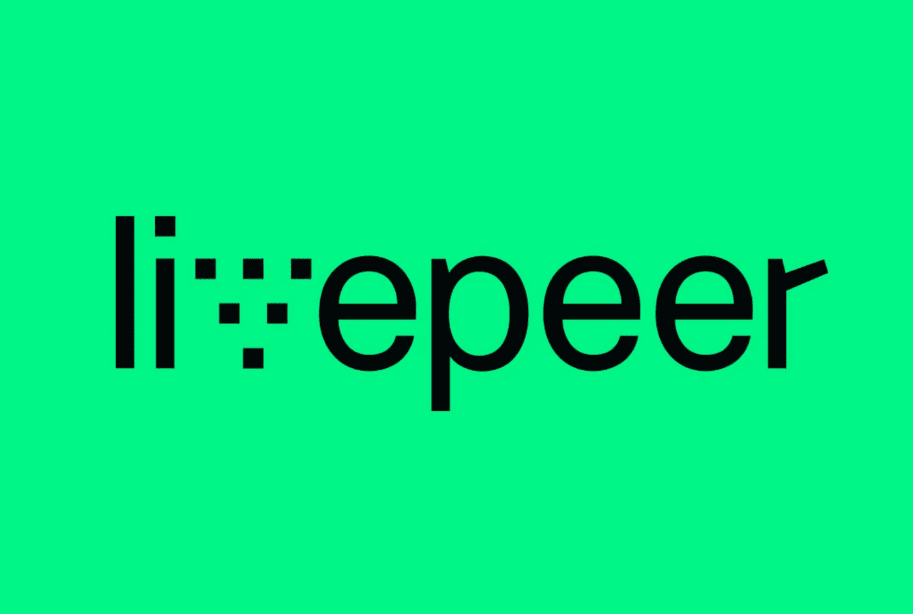
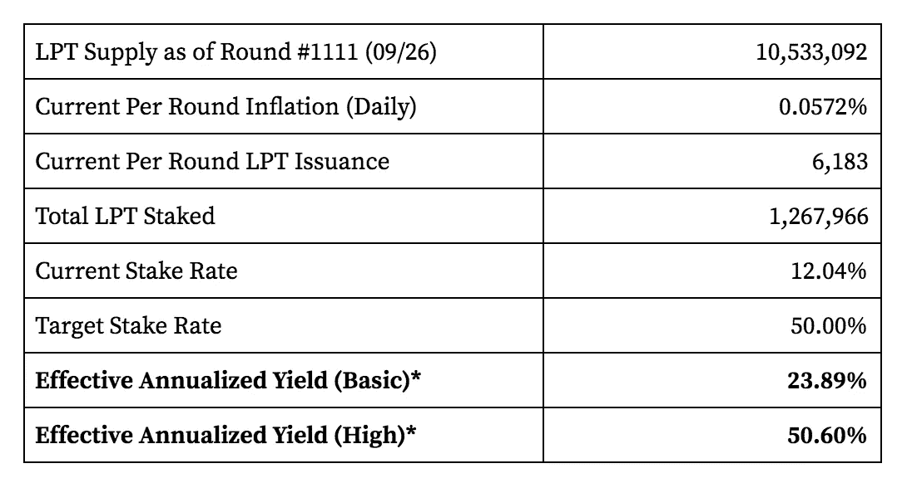
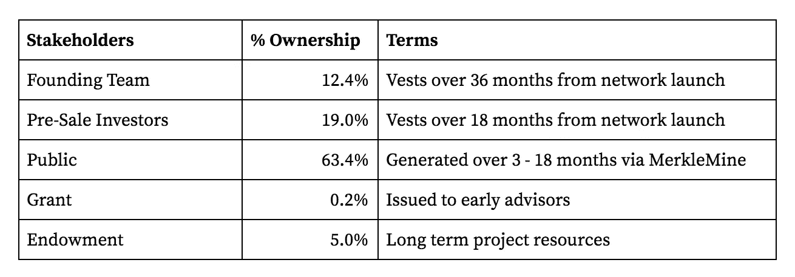
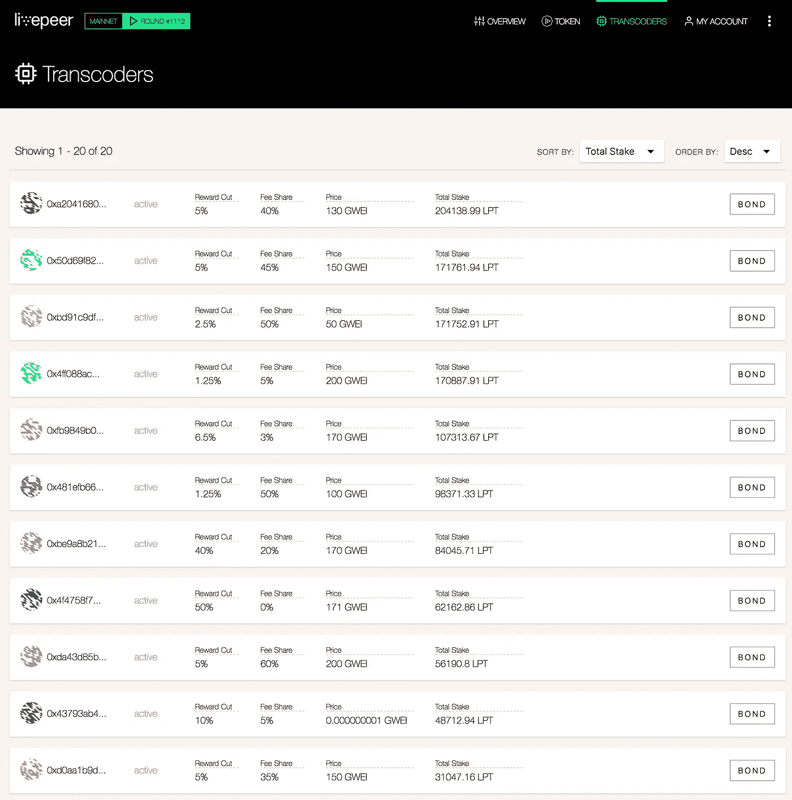
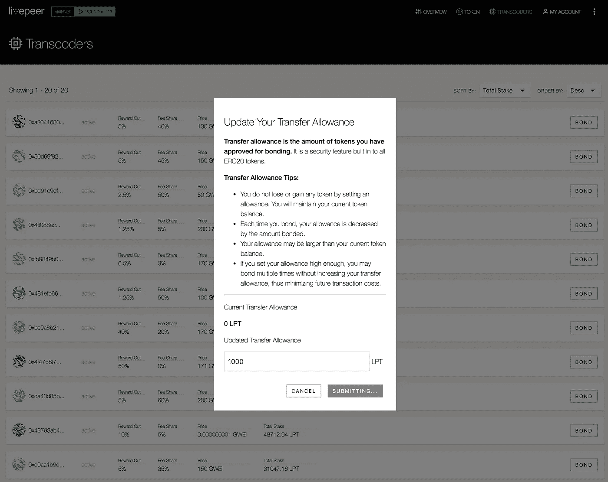
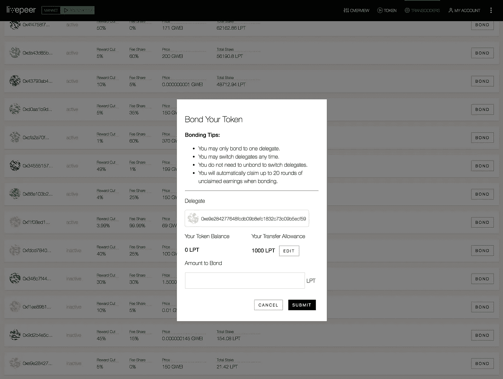
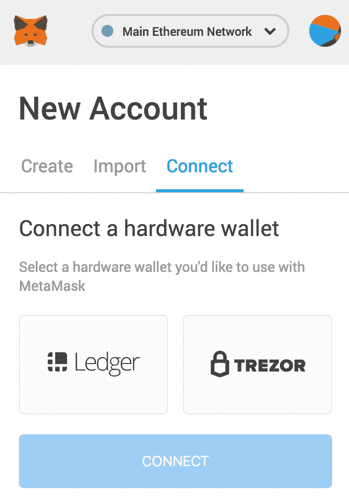

# Livepeer 赌注指南

> 原文：<https://medium.com/coinmonks/livepeer-staking-guide-de9fb52db671?source=collection_archive---------1----------------------->

## Livepeer 提供了一个非常有吸引力的赌注收益率:目前约 24%的年化基础。



Livepeer aims to decentralize live video broadcast by developing a live video streaming (p2p) network protocol and infrastructure layer on the Ethereum blockchain.

## 摘要

[Livepeer](http://livepeer.io/) 提供了非常诱人的赌注收益率:**目前年化收益率约为 24%** 。如果全网持股比例保持在 50%以下(截至 2018 年 9 月 26 日为 12.04%)，收益率每天都会上升，将利益相关者的年化收益率提高到 **~ 50%+** 。

> 想要下注你的硬币吗？检查这些赌注服务提供商



The effective annual yield (Basic) of 23.89% is calculated assuming a consistent per round inflation rate of .0572% (((1+.0572%)³⁶⁵)-1). The effective annual yield (High) of 50.60% is calculated assuming per round inflation growth of .0003%.

[https://supermax . cool/live peer](https://supermax.cool/livepeer)是实时通货膨胀和利率指标的绝佳资源。

如果你拥有 Livepeer，建议将它绑定到代码转换器上，这样你就可以赚取赌注收益。要将您的 LPT 委托给 Staked，请使用以下地址:

```
[https://explorer.livepeer.org/accounts/0xe9e284277648fcdb09b8efc1832c73c09b5ecf59](https://explorer.livepeer.org/accounts/0xe9e284277648fcdb09b8efc1832c73c09b5ecf59)0xE9E284277648fcdb09B8EfC1832c73c09b5Ecf59
```

委托是非托管的，代表不能花你的 LPT，你的股份没有风险。

## 概观

Livepeer 旨在通过在以太坊区块链上开发直播视频流(p2p)网络协议和基础设施层来分散直播视频广播。Livepeer 协议旨在激励游戏理论上安全、高性能和可扩展的实时视频转码和分发。Livepeer alpha network 于 2018 年 5 月 1 日在以太坊主网上线。

Livepeer 协议是基于轮次的，每轮大约持续一天。令牌持有者委托他们的股份来选举执行视频转码工作的转码器节点。在第 961 轮推出后，该网络截至 2018 年 9 月 26 日处于第 1111 轮。

在每一轮结束时，广播公司费用和新产生的(通过通货膨胀)LPT 被分配，代码转换器因任何恶意活动而被削减(受到资金损失的惩罚)，并且活动的代码转换器池基于总委托股份被重置，所有这些都在协议级别以编程方式进行。

## 代码转换器

在 Livepeer 网络中,“代码转换器”负责视频代码转换，这是将来自广播公司的视频输入流转换为许多不同格式的过程，并参与基于 Truebit 的代码转换验证协议。

除了从等待列表中随机选择的一个代码转换器之外，Livepeer 网络每轮支持 N 个(当前为 15 个)活动代码转换器，其中 N 是可调整的网络参数。积极转码器组的成员在每轮比赛中按照他们在 LPT 的总委托股份比例赚取通货膨胀奖励和转播费。活跃代码转换器池在每一轮都会根据总委托赌注进行重置。


转码器公布其对一段视频进行转码的价格(每段价格)，新发布的 LPT 的块奖励分成百分比(块奖励分成)，以及 ETH 广播费的费用分成百分比(费用分成)。

转码器需要强大的硬件来实现高效的转码(可能使用 GPU 加速转码)、高带宽连接来实现低延迟视频分发，以及 DevOps 专业知识来为视频广播公司运营高度可用、安全可靠的基础设施。

## 实时对等令牌(LPT)

Livepeer Token (LPT)使用利益证明(PoS)绑定机制来确定转码器节点的活动池，协调网络上验证器节点之间的转码工作分配，并确保视频转码和分发的博弈论安全性和性能保证。广播公司不使用 LPT 作为 Livepeer 网络中的交换媒介，而是使用 ETH 向视频转码和分发服务的验证节点付费。

## 象征经济学

在 Livepeer genesis 模块中产生了 10，000，000 个 LPT 令牌。根据协议定义的膨胀时间表(相对于未完成的浮动)每轮生成新令牌，并基于用于执行代码转换服务的委托股份按比例发放给代码转换器。

Livepeer block 奖励由协议定义的通货膨胀提供资金。初始通货膨胀率设定为 0.0500%，并计划每轮增加 0.0003%，直到 LPT 总供应量的 50%被保税。截至第 1，111 轮(2018 年 9 月 26 日)，已创建 533，092 个新 LPT，当前每轮通胀率为 0.0587%，12.04%的 LPT 为保税 LPT。**当前有效年化收益率介于 23.89%和 50.60%之间，取决于多快达到 50%的保税 LPT 目标利率。**当 50%的 LPT 供应已被绑定时，预计每轮通货膨胀率将达到当时每轮通货膨胀率的平衡。

随着创始团队和投资者拥有的 LPT 继续授权和发行，新的 LPT 发行给活跃的代码转换器，以及在 genesis 分配中分配给公众的剩余约 10%的 LPT 通过 MerkleMine 算法进行分配，预计在未来 12 个月内将达到 50%的目标债券利率。


The effective annual yield (Basic) of 23.89% is calculated assuming a consistent per round inflation rate of .0572% (((1+.0572%)³⁶⁵)-1). The effective annual yield (High) of 50.60% is calculated assuming per round inflation growth of .0003%.

由于未能通过验证、未能在需要时调用验证、或未能基于委托的股份执行成比例的代码转换工作，代码转换器可能会被削减，或受到损失 LPT 的惩罚。

## 令牌分发



## 委托

所有令牌持有人都可以选择在 Livepeer 智能合约中使用债券交易将他们的 LPT 股份“委托”给代码转换器。令牌持有者被激励委托 LPT，以便从代码转换器获得奖励(LPT 通货膨胀+ ETH 广播公司费用),更重要的是，确保有效的代码转换器被选出并为广播公司提供高效的现场视频广播服务。

## LPT 委托说明

要将 LPT 委托给转码器，使用 Livepeer [block explorer](http://explorer.livepeer.org/transcoders) 访问网络上的活动和候选转码器列表以及以下说明:



With an Ethereum enabled browser such as MetaMask, Parity or Mist enabled, click the ‘BOND’ button in the list of transcoders for the node to whom you want to delegate.



After clicking on the BOND button, you will need to update your LPT transfer allowance to the amount of LPT you want to approve for bonding.



After updating your transfer allowance, enter the amount of LPT to be delegated, and submit a transaction to the Ethereum network.

委托是非托管的，代表不能花你的 LPT，你的股份没有风险。要将您的 LPT 委托给 Staked，请使用以下地址:

```
[https://explorer.livepeer.org/accounts/0xe9e284277648fcdb09b8efc1832c73c09b5ecf59](https://explorer.livepeer.org/accounts/0xe9e284277648fcdb09b8efc1832c73c09b5ecf59)0xE9E284277648fcdb09B8EfC1832c73c09b5Ecf59
```

## MetaMask +硬件钱包

现在可以将硬件钱包连接到元掩码帐户以获得额外的安全性。



To connect your wallet, make sure you’re using MetaMask 4.10.0 or higher and the MetaMask ​beta UI​.

1.  将您的 Ledger 或 Trezor 设备插入您的电脑，进入 MetaMask 和的右上方菜单，并寻找“连接硬件钱包”选项
2.  选择“分类帐”或“Trezor ”,然后点击“连接”
3.  选择您要使用的帐户，然后单击“导入”

## 关于标桩

[Staked](http://staked.us) 为领先的利益证明(PoS)协议运营高可用性和高安全性的机构级利益基础设施。Staked 基础设施部署在多层签名和监听云配置中，该配置结合了本地数据中心和云提供商的地理多样性和冗余性。我们使用 Google 的 Kubernetes 容器编排来实现近乎无限的规模、自我修复和硬件去中心化。

> 加入 Coinmonks [电报频道](https://t.me/coincodecap)和 [Youtube 频道](https://www.youtube.com/c/coinmonks/videos)获取每日[加密新闻](http://coincodecap.com/)

## 另外，阅读

*   [复制交易](/coinmonks/top-10-crypto-copy-trading-platforms-for-beginners-d0c37c7d698c) | [加密税务软件](/coinmonks/crypto-tax-software-ed4b4810e338)
*   [网格交易](https://coincodecap.com/grid-trading) | [加密硬件钱包](/coinmonks/the-best-cryptocurrency-hardware-wallets-of-2020-e28b1c124069)
*   [密码电报信号](http://Top 4 Telegram Channels for Crypto Traders) | [密码交易机器人](/coinmonks/crypto-trading-bot-c2ffce8acb2a)
*   [最佳加密交易所](/coinmonks/crypto-exchange-dd2f9d6f3769) | [印度最佳加密交易所](/coinmonks/bitcoin-exchange-in-india-7f1fe79715c9)
*   [币安 vs Bitstamp](https://coincodecap.com/binance-vs-bitstamp) | [Bitpanda vs 比特币基地 vs Coinsbit](https://coincodecap.com/bitpanda-coinbase-coinsbit)
*   [如何购买瑞波(XRP)](https://coincodecap.com/buy-ripple-india) | [非洲最好的加密交易所](https://coincodecap.com/crypto-exchange-africa)
*   [非洲最佳加密交易所](https://coincodecap.com/crypto-exchange-africa) | [Hoo 交易所评论](https://coincodecap.com/hoo-exchange-review)
*   [eToro vs robin hood](https://coincodecap.com/etoro-robinhood)|[MoonXBT vs by bit vs Bityard](https://coincodecap.com/bybit-bityard-moonxbt)
*   [开发人员的最佳加密 API](/coinmonks/best-crypto-apis-for-developers-5efe3a597a9f)
*   最佳[密码借贷平台](/coinmonks/top-5-crypto-lending-platforms-in-2020-that-you-need-to-know-a1b675cec3fa)
*   [免费加密信号](/coinmonks/free-crypto-signals-48b25e61a8da) | [加密交易机器人](/coinmonks/crypto-trading-bot-c2ffce8acb2a)
*   杠杆代币的终极指南