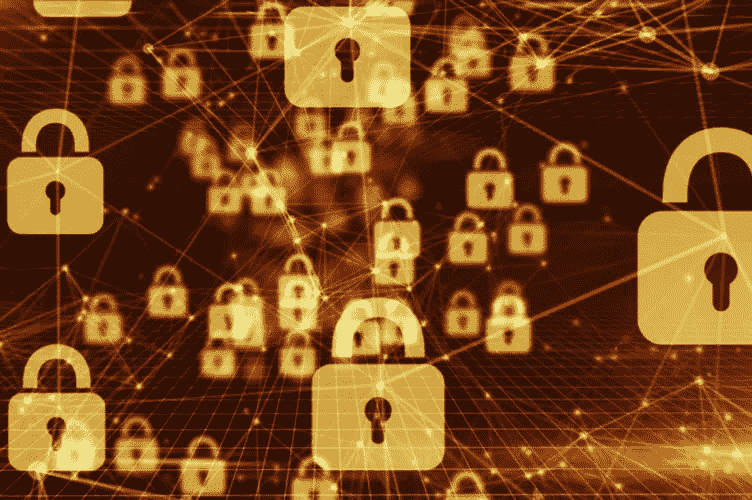

# 生活在 GDPR 世界——用零知识证明保护我们的信息(见 Fiat-Shamir 等人)

> 原文：<https://medium.com/coinmonks/living-in-a-gdpr-world-preserving-our-information-with-zero-knowledge-proofs-68061c9cfcf?source=collection_archive---------6----------------------->

我们泄露了太多信息！为什么我们仍然在传递密码，为什么我们仍然以散列形式存储密码？

安全世界正越来越多地围绕离散对数构建。为此，我使用了一个生成器值(G)，一个质数(p)和一个随机数…