# LocalBitcoins 评论 2021 |安全吗？

> 原文：<https://medium.com/coinmonks/localbitcoins-review-6cc001c6ed56?source=collection_archive---------2----------------------->

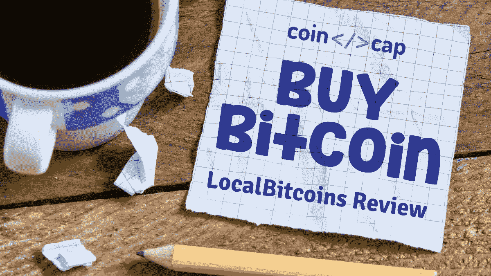

有没有想过，如果政府禁止所有私人交易平台，你会在哪里交易比特币？或者你会在哪里出售它们以获取利润？许多私人加密货币，包括[比特币](https://blog.coincodecap.com/a-candid-explanation-of-bitcoin)，都可以被禁止。几乎所有的国家都在制定新的法律，包括印度。

因此，你需要一个平台，为你提供在你的国家买卖加密货币的功能。你如何看待一个在全球广泛使用的平台？ [LocalBitcoins](http://blog.coincodecap.com/go/localbitcoins) 在超过 248 个国家提供服务。在本文中，我们将回顾本地比特币。

# 本地比特币评论:摘要

*   [LocalBitcoin](http://blog.coincodecap.com/go/localbitcoins) 为卖家和买家提供一个互动和交易的平台。
*   他们提供卖家和买家的名单。
*   付款方式取决于你和卖家的选择。
*   他们对成功的交易象征性地收取 1%的费用。
*   提供存储比特币的钱包。
*   他们在交易过程中使用托管来存储比特币。
*   他们过去有过一些麻烦。
*   提供广泛的常见问题。
*   LocalBitcoins 提供了一个移动应用程序来进行远程交易。

# 什么是本地比特币？

[LocalBitcoins](http://blog.coincodecap.com/go/localbitcoins) 是一个平台，你可以在这里用你的当地货币买卖比特币和其他加密货币。该平台允许您在兑换时选择汇率和支付方式。

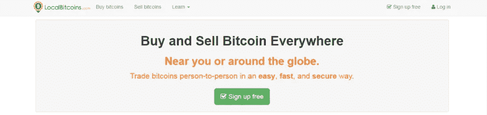

[LocalBitcoins](http://blog.coincodecap.com/go/localbitcoins) 为您提供**点对点**交易，并存储您的比特币，直到交易完成。他们为你提供一个钱包来收发你的比特币。

它们在全球范围内广泛传播，并且正在扩张，意在让比特币遍布世界各个角落。

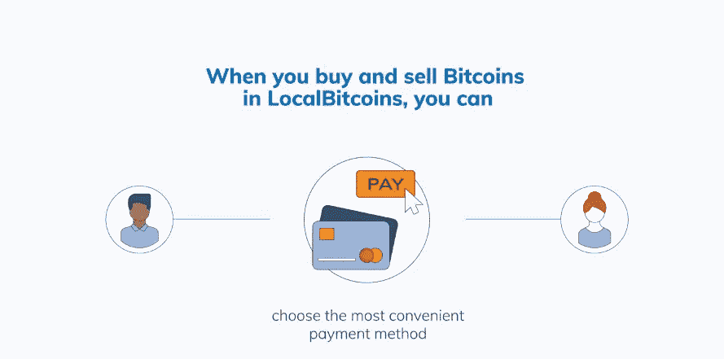

[LocalBitcoins](http://blog.coincodecap.com/go/localbitcoins) 不像其他平台一样在交易中充当中间人。他们只连接卖家和买家。

# 本地比特币的历史

本地比特币于 2012 年诞生，并于 2013 年 2 月开始创收。Jeremias Kangas 是 LocalBitcoins 的创始人兼首席执行官，该平台在芬兰赫尔辛基运营。

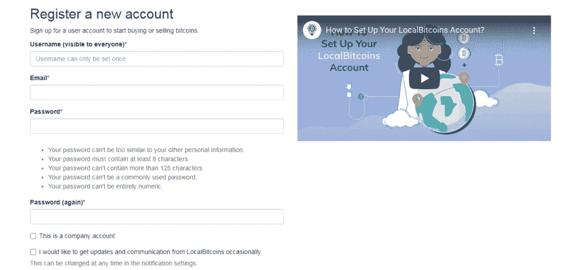

# 如何使用本地比特币？

[本地比特币](https://localbitcoins.com/)让你可以选择通过直接与买家或卖家互动来进行交易。他们通过在主屏幕上为卖家和买家提供机会来简化这个过程。

这个平台为你提供了很多交易的选择，但是你需要在知道这些之前建立你的账户。

# 如何创建 LocalBitcoins 账户？

您可以按照以下步骤创建您的本地比特币账户:

1.  访问 localbitcoins.com，点击主页上的注册免费按钮。
2.  输入您的详细信息，如用户名、电子邮件和密码。
3.  然后点击“我不是机器人”复选框来验证你是人
4.  点击提交按钮后，仔细阅读“服务条款”和“隐私政策”，如果您同意，请点击“我同意”
5.  现在，通过邮件中的链接确认您的帐户。
6.  确认后，你必须填写用户名、联系电话、估计交易量等细节。
7.  非常您的联系号码，你都设置好了。

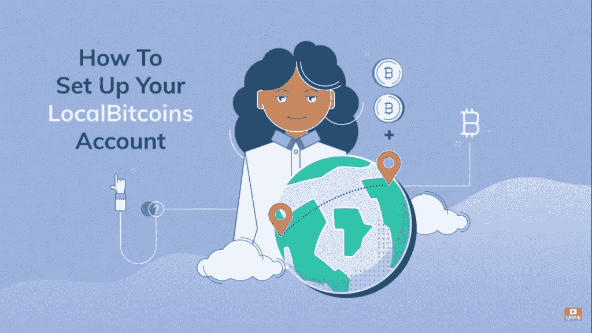

注册成功后，您有两个选择。要么卖掉你的比特币，要么从卖家手里买一个。

# 如何在 LocalBitcoins 上销售？

[LocalBitcoins](http://blog.coincodecap.com/go/localbitcoins) 为你提供一个简单的用户界面来出售你的比特币，并为你找到完美的买家。要开始出售你的比特币，你可以遵循以下步骤:

# 出售比特币的步骤

1.  你可以很容易地在主屏幕上找到“快速出售”标签，然后点击它。
2.  填写最适合您的详细信息，然后点击搜索按钮。
3.  一份潜在买家的名单会摆在你面前。对它们进行分类，选择适合你的买家。

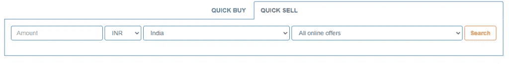

1.  按下出售按钮。
2.  在下一页，输入你希望出售的比特币数量，并给买家输入信息。
3.  点击“发送交易请求”按钮，开始交易。

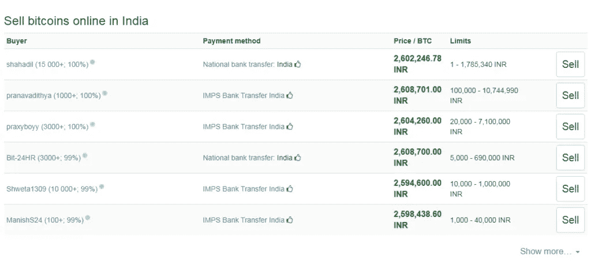

# 如何在 LocalBitcoins 上创建订单？

要卖出一枚比特币，你需要创建一个卖单。尽管要创建订单，您需要成为一级或更高级别的认证用户。你还需要在你的[本地比特币钱包](https://localbitcoins.com/accounts/wallet/)里有比特币。创建订单的步骤如下:

1.  从主屏幕转到创建订单页面。
2.  现在选择买入或卖出的选项。
3.  输入所有必需的详细信息，然后单击预览，查看买家将如何查看您的订单。
4.  交叉检查完所有细节后，点击“发布”即可上线。

# 如何在 LocalBitcoins 上购买？

如果你是本地比特币的买家，他们会让你很容易找到你想要的卖家。你搜索卖家的第一个选项是直接在主页上。您可以遵循以下步骤:

# 购买比特币的步骤

1.  根据你的要求填写细节。
2.  当你点击搜索按钮时，屏幕上会出现一个卖家列表。
3.  请注意最低和最高交易金额以及首选的支付方式。
4.  点击你感兴趣的行业，了解更多详情。

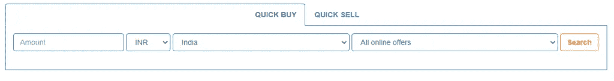

1.  现在，如果你同意卖家的出价，请输入详细信息，然后点击“打开交易”
2.  不要忘记在支付窗口到期前支付，因为这将导致交易取消。
3.  另外，不要忘记点击“我已付款”按钮

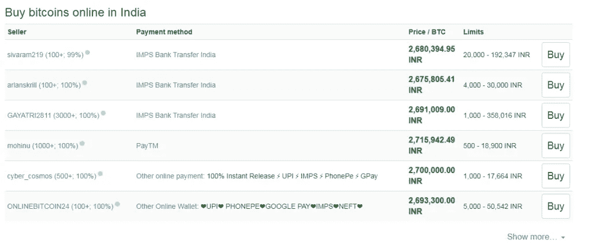

# 购买验证

交易开始后，卖家收到付款后，他会释放比特币。当卖家释放比特币时，你会在你的[本地比特币](http://blog.coincodecap.com/go/localbitcoins)钱包中收到它。

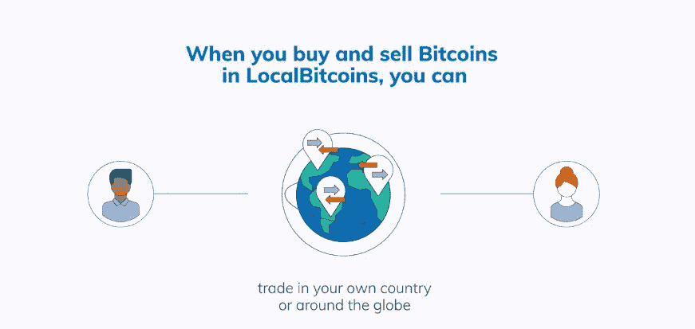

# 本地比特币存款

你需要在决定接受卖家的出价后，将金额存入卖家偏好的付款方式。存款的步骤如下:

# 存款步骤

交易时，您可以按照以下步骤进行存款:

1.  找到符合你需求的卖家后，下订单。
2.  你可以收到卖家的账号并转账。

# 本地比特币支付选项

[本地比特币](http://blog.coincodecap.com/go/localbitcoins)提供多种支付方式，例如:

1.  贝宝
2.  借记卡/信用卡
3.  电汇

付款方式取决于你的卖家。除了现金，你可以使用任何你们双方都满意的支付方式。

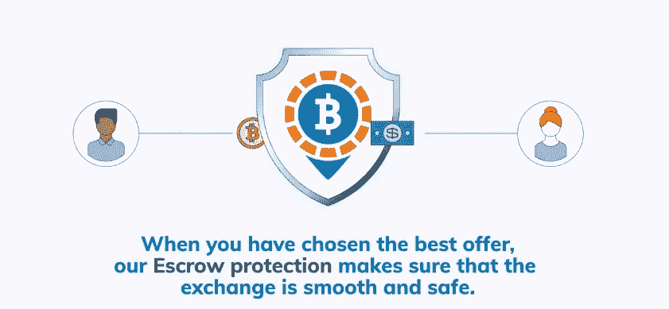

# LocalBitcoins 评论:提现比特币

在你完成向卖家转账的过程后，你可以从[本地比特币](http://blog.coincodecap.com/go/localbitcoins)钱包中提取比特币。

然而，由于这一过程完全是点对点的，在交易完成后，卖方释放比特币后，就没有提款选项了。然而，你总是可以和卖家谈一谈，弄清楚一些事情。

# 本地比特币应用

本地比特币提供桌面和移动应用服务。它可以帮助您在旅途中完成交易。

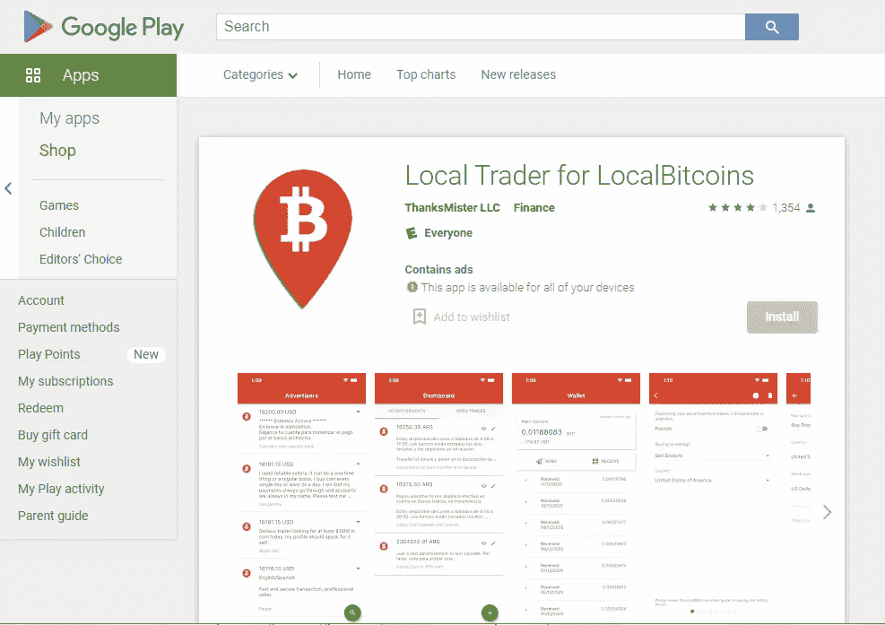

# 本地比特币费用

平台不收你任何买卖或者只是注册的费用。LocalBitcoins 对每笔完成的交易收取 1%的费用。

向本地比特币钱包之外的钱包提现需要支付一笔费用，作为比特币交易费。

# 本地比特币评论:安全性

在发布订单时，卖家必须存入[比特币](https://blog.coincodecap.com/a-candid-explanation-of-bitcoin)。这个比特币是存托管的，防止卖家骗你。

[LocalBitcoins](http://blog.coincodecap.com/go/localbitcoins) 提供其他功能，如[双因素认证](https://en.wikipedia.org/wiki/Multi-factor_authentication)，增加你钱包的安全性。

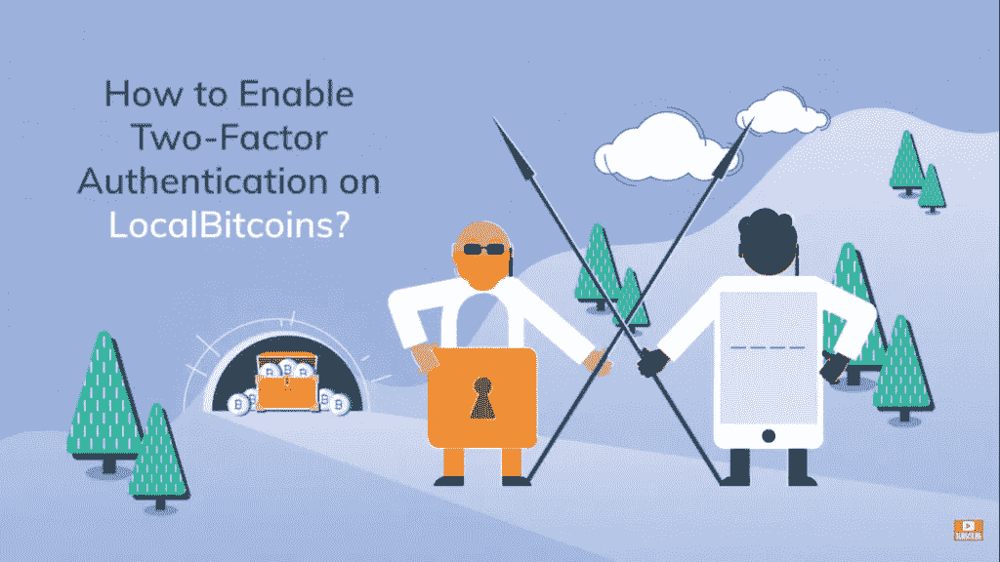

# 本地比特币评论:声誉

LocalBitcoins 的名声类似于那些过去遭遇过严重问题的公司。我们可以列举其中一些:

*   使用本地比特币的人在 2014 年、2016 年和 2018 年因洗钱和类似犯罪而受到关注。
*   2019 年 1 月，黑客从用户的钱包中赚了约 28，000 美元。

# 客户支持

LocalBitcoins 提供的联系客户支持的唯一选择是通过电子邮件。最重要的是，他们甚至可以花一周的时间来回应你的不满。然而，他们有一个独家的常见问题解答，可能有你的问题的答案。

你可以给他们写一条信息，如果必要的话附上一些文件，让他们对你的情况有更多的了解。

# LocalBitcoins 评论:谨防骗子

由于它是一个点对点的平台，人们在过去经常遭受诈骗。所以强烈建议考虑卖家的评分，不要去平台外做任何交易。

# 如何在 LocalBitcoins 避开骗子？

除了从你的角度考虑安全性，你还可以信任[本地比特币](http://blog.coincodecap.com/go/localbitcoins)。该平台将比特币储存在托管账户中，只有在交易完成后才会释放。这里有一些方法可以防止自己被骗:

*   在转移资金之前，一定要索要政府批准的身份证，并反复核对这些身份证。
*   骗子也可以将资金转移到一个与你无关的账户，然后指责你诈骗他们。小心点！
*   即使你去行政部门，确保你有真实的证明，因为骗子可以很容易地创建假的数字证明。
*   谨防恶搞。
*   记住这一点，在网上交易时，永远不要相信任何人。

# 本地比特币评论:利弊

他们允许你在本地交易。除了比特币不支持其他币。你可以用当地货币购买比特币。由于过去的事故，LocalBitcoins 的声誉不佳。他们提供托管服务。现金选项已被禁用。简单的用户界面。

# 本地比特币评论:结论

LocalBitcoins 自 2012 年开始提供服务，是当地最受欢迎的比特币交易网站。尽管它们有着令人不安的过去，但在当地交易时，它们确实是你的最佳选择。他们提供的托管服务仍然具有高度的保护性。历史上的黑客事件除了让他们更强大来解决这些问题之外，什么也没做。

# 常见问题(FAQ)

**我如何确信自己不会被诈骗？**

LocalBitcoins 要求卖家在交易时将比特币存入托管账户。这样可以保护卖家不会卷走你的钱。因此，你被阻止从一个骗局。然而，一些骗子利用这一点来诈骗卖家。因此，即使是卖家也应该在交易时有所警觉。

**交易完成后，我该如何取回我的钱？**

LocalBitcoins 的交易是不可逆的，因此不可能从 LocalBitcoins 取回你的钱。所以你必须确保你输入的账号是正确的。然而，您可以随时联系您的银行，与受益人讨论解决问题。

**即使向卖家付款，我也没有收到我的比特币。正常吗？**

完成交易可能需要时间，因为这取决于卖方何时释放资金。如果卖家有问题，你可以联系本地比特币支持。

> 加入 Coinmonks [Telegram group](https://t.me/joinchat/EPmjKpNYwRMsBI4p) 学习加密交易和投资

## 另外，阅读

*   什么是[闪贷](https://blog.coincodecap.com/what-are-flash-loans-on-ethereum)？
*   最好的[密码交易机器人](/coinmonks/crypto-trading-bot-c2ffce8acb2a) | [网格交易](https://blog.coincodecap.com/grid-trading)
*   [3 商业评论](/coinmonks/3commas-review-an-excellent-crypto-trading-bot-2020-1313a58bec92) | [Pionex 评论](/coinmonks/pionex-review-exchange-with-crypto-trading-bot-1e459d0191ea) | [Coinrule 评论](https://blog.coincodecap.com/coinrule-review-a-perfect-trading-bot)
*   [AAX 交易所审查](/coinmonks/aax-exchange-review-2021-67c5ea09330c) | [德里比特审查](/coinmonks/deribit-review-options-fees-apis-and-testnet-2ca16c4bbdb2) | [FTX 密码交易所审查](/coinmonks/ftx-crypto-exchange-review-53664ac1198f)
*   [n 零审核](/coinmonks/ngrave-zero-review-c465cf8307fc)
*   [Bybit Exchange 审查](/coinmonks/bybit-exchange-review-dbd570019b71) | [Bityard 审查](https://blog.coincodecap.com/bityard-reivew) | [CoinSpot 审查](https://blog.coincodecap.com/coinspot-review)
*   [3Commas vs Cryptohopper](/coinmonks/3commas-vs-pionex-vs-cryptohopper-best-crypto-bot-6a98d2baa203)
*   最好的比特币[硬件钱包](/coinmonks/the-best-cryptocurrency-hardware-wallets-of-2020-e28b1c124069?source=friends_link&sk=324dd9ff8556ab578d71e7ad7658ad7c) | [BitBox02 回顾](/coinmonks/bitbox02-review-your-swiss-bitcoin-hardware-wallet-c36c88fff29)
*   [莱杰 vs n 格拉夫](https://blog.coincodecap.com/ngrave-vs-ledger) | [莱杰纳米 s vs x](https://blog.coincodecap.com/ledger-nano-s-vs-x)
*   [加密副本交易平台](/coinmonks/top-10-crypto-copy-trading-platforms-for-beginners-d0c37c7d698c) | [比特码副本交易](https://blog.coincodecap.com/bityard-copy-trading)
*   [Vauld Review](https://blog.coincodecap.com/vauld-review)|[you hodler Review](/coinmonks/youhodler-4-easy-ways-to-make-money-98969b9689f2)|[BlockFi Review](/coinmonks/blockfi-review-53096053c097)
*   最好的[加密税务软件](/coinmonks/best-crypto-tax-tool-for-my-money-72d4b430816b) | [硬币追踪评论](/coinmonks/cointracking-review-a-reliable-cryptocurrency-tax-software-5114e3eb5737)
*   最佳[加密借贷平台](/coinmonks/top-5-crypto-lending-platforms-in-2020-that-you-need-to-know-a1b675cec3fa)
*   [莱杰 Nano S vs Trezor one vs Trezor T vs 莱杰 Nano X](https://blog.coincodecap.com/ledger-nano-s-vs-trezor-one-ledger-nano-x-trezor-t)
*   [BlockFi vs Celsius](/coinmonks/blockfi-vs-celsius-vs-hodlnaut-8a1cc8c26630)|[Hodlnaut 回顾](https://blog.coincodecap.com/hodlnaut-review)
*   [Bitsgap 审核](/coinmonks/bitsgap-review-a-crypto-trading-bot-that-makes-easy-money-a5d88a336df2) | [Quadency 审核](/coinmonks/quadency-review-a-crypto-trading-automation-platform-3068eaa374e1)
*   [埃利帕尔泰坦评论](/coinmonks/ellipal-titan-review-85e9071dd029) | [赛克斯斯通评论](https://blog.coincodecap.com/secux-stone-hardware-wallet-review)
*   [DEX Explorer](https://explorer.bitquery.io/ethereum/dex) | [区块链 API](https://explorer.bitquery.io/graphql)
*   [最佳区块链分析工具](https://bitquery.io/blog/best-blockchain-analysis-tools-and-software)
*   [加密套利](/coinmonks/crypto-arbitrage-guide-how-to-make-money-as-a-beginner-62bfe5c868f6)指南:新手如何赚钱
*   最佳[加密制图工具](/coinmonks/what-are-the-best-charting-platforms-for-cryptocurrency-trading-85aade584d80) | [最佳加密交易所](https://blog.coincodecap.com/crypto-exchange)
*   了解比特币的[最佳书籍有哪些？](/coinmonks/what-are-the-best-books-to-learn-bitcoin-409aeb9aff4b)

> [直接在您的收件箱中获得最佳软件交易](/coinmonks/newsletters/coinmonks)

*原载于 2021 年 2 月 3 日 https://blog.coincodecap.com**[*。*](https://blog.coincodecap.com/localbitcoins-review)*