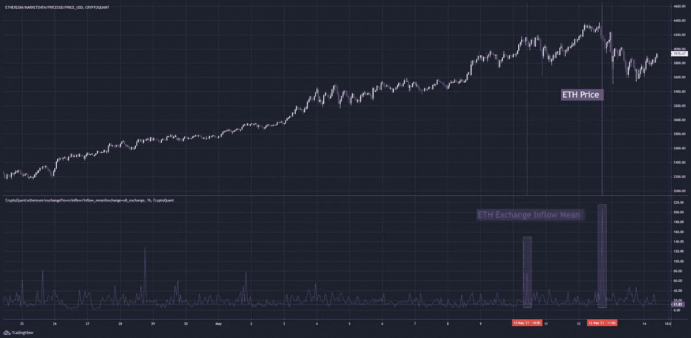
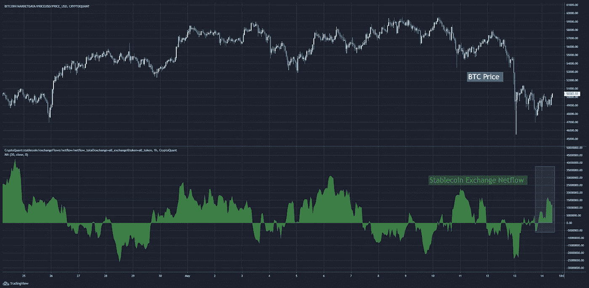

# 在 Elon 发布推文之前查看链上流量

> 原文：<https://medium.com/coinmonks/looking-at-on-chain-flows-before-elons-tweet-e94c68f493d2?source=collection_archive---------6----------------------->

*(原载于 2021 年 5 月 14 日贾维斯实验室出版的***)**

*掌声平息了，人群中一片寂静。*

*空气中弥漫着期待。*

*接力棒升起。演奏者深吸一口气，手指迫不及待地摆好姿势，准备让他们的乐器充满活力。*

*指挥发出信号，我们就像起跑的马一样，突然行动起来。*

*节奏快，有弹性。几个小节之后，乐队完全同步了。典型地，我们的指挥古怪的手势和表情布满了他的脸。但是这一次，经过这么多小时的练习…这是一个微笑。*

*我们可以预测他想要什么，然后用他的指挥棒把它强加给我们。*

*我们唱出了每一个音符。强调每一种口音。*

*进展得几乎太顺利了。*

*毫无征兆地，一个中音萨克斯管演奏者开始出错。当她在关键部分吹得太用力时，她的乐器会发出吱吱声。*

*观众不会注意到。但是乐队就不一样了。虽然很微妙，但乐队的其他成员都注意到了..*

*这种焦虑像病毒一样传播，一个接一个的球员都有点不同步。音符太早了，四分音符保持的时间有点长。当指挥家的脸因不安而蠕动时，他的脸上显示出和声的变化。*

*就在我们认为事情不会变得更糟的时候，鼓手掉了一根棍子。虽然只有乐队成员知道萨克斯管关了，但每个人都看到木棍在地板上滚动。*

*现在是一片混乱。*

*指挥承认失败，并用他的指挥棒快速快速地绕了一圈。游戏结束。沉默随之而来。*

*在尴尬的沉默中，指挥抬起闪亮的额头向人群道歉。失败。*

*在看完本周的《on-chain 展开》后，我很快想起了那场音乐会。*

*一开始像发条一样的东西在一角钱上转动了，因为伊隆不只是丢下他的鼓槌，而是把它扔向指挥。*

*让我告诉你我的意思。*

# *同步的*

*周一早上醒来时，迎接我的是 BTC 和瑞士联邦理工学院在交易所的净流量。这是一个典型的看跌信号，因为卖方在周末开始出现。*

**

*BTC 和瑞士联邦理工学院都开始抛售股票。*

**

*在本周开盘前，甚至稳定的硬币净流量也是负数。没有新的买家出现来承受房屋出售的压力。*

**

*结合技术分析，我们得到了一个高概率的交易设置。*

*在下面的第一张图表中，你可以看到周一比特币正在推动目前限制市场的 59k 阻力区。它已经在一周前被该区域拒绝。随着它在经历一波 BTC 流入交易所的过程中遭到拒绝，一切都进展顺利。*

**

*联邦理工学院在它的范围内表现良好。*

**

*因此，应用我们的资产流量、稳定货币流量和 TA 公式，我们得到:*

*   *BTC 和 ETH 净流量正面:负面*
*   *稳定资本净流量为负:看跌*
*   *价格逼近阻力:看跌*

*有了这个组合，我们就有了三连胜的看跌格局。*

# *失去同步*

*在周一小幅下跌后，我们在周二横盘整理。*

*但在那之后，一些微妙的信号开始出现了。*

*正如我们之前提到的，周一有一些看跌的比特币流入交易所。但在周三，我们得到了一个更大的流入。你可以在下面的图表中看到峰值。*

**

*这些峰值向我们表明，有不寻常的 BTC 流入交易所，表明抛售压力增加。*

*鉴于我们已经经历了三连败，这让坏消息变得更糟。*

*ETH 资金流入与 BTC 的情况相呼应…*

**

*然后我得到了伊隆推文的通知，看到了特斯拉暂停用比特币购买的公告。*

*他刚刚向指挥扔了鼓槌。*

*54k 折了，50k 跟着，价格像石头一样掉了。*

*在 46k 附近找到支撑。*

*具有讽刺意味的是，在特斯拉 2 月 8 日宣布他们已经购买比特币之后，比特币在 46k 达到了最初的高点。*

*ETH 进行了很好的斗争，最初拒绝放弃 4k，但抵抗是徒劳的。一旦 BTC 跌破 50k，抛售压力占据上风，价格猛烈下跌至 3.5k*

**

*有趣的是，我观察到在两次下跌期间，稳定的外汇流入出现了一些峰值，这告诉我，一些买家利用了抛售。*

*在一个流动性可能瞬间枯竭的市场，目睹买家涌入交易所是一件好事。*

**

*现在，虽然这些资金流入的激增非常有趣，但很明显，在埃隆的推文发布之前，市场推动者已经为抛售做好了准备。*

*这是另一个例子，说明观察资金进出交易所可以改善你的交易结果。重要的是现在要单独依靠他们。你需要与现有的论文融合。在我的情况下，我使用 TA。*

*你可以用别的东西。*

*如果你有，请让我知道。我很想听听你觉得有用的东西。*

*至于现在…*

*稳定的硬币净流量已经转为正值，这有助于目前的价格上涨。*

**

*然而，我仍然保持谨慎。即使我们坐在一个支撑上，我希望看到比特币向前发展的更好的网络流量。*

*尤其是当埃隆继续通过[在推特上发布关于总督](https://twitter.com/elonmusk/status/1392974251011895300?s=20)的消息来探索加密货币领域的时候。*

**

*与此同时，请务必在 twitter @ tempting _ beef 上关注我，因为我会在一周内发布比特币、以太坊和稳定币流的更新。*

*提供链上切割，*

*@诱人 _ 牛肉*

*附:我是本·莉莉。我希望你喜欢《诱人的牛肉》中的另一篇文章。他在分解网络流方面做得非常好。希望它能提高你自己的成绩。*

*我想插一句，问你还想在 Espresso 中看到什么其他指标、数据或分析。如果我们没有它，我们可以构建它，或者找到已经在做它的人，或者如果我们已经有了它，我们可以向您展示度量标准。*

*我们的目标是建立指标和工具，帮助您在加密的海量数据中找到信号。让我们一起建造它。享受你的周末。一如既往，感谢您的收听！也阅读*

> *另请阅读:[投资印度加密货币指南](https://blog.coincodecap.com/crypto-investing-guide)*