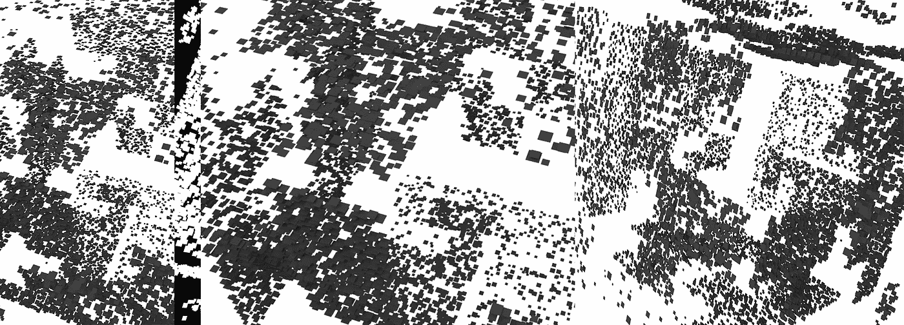
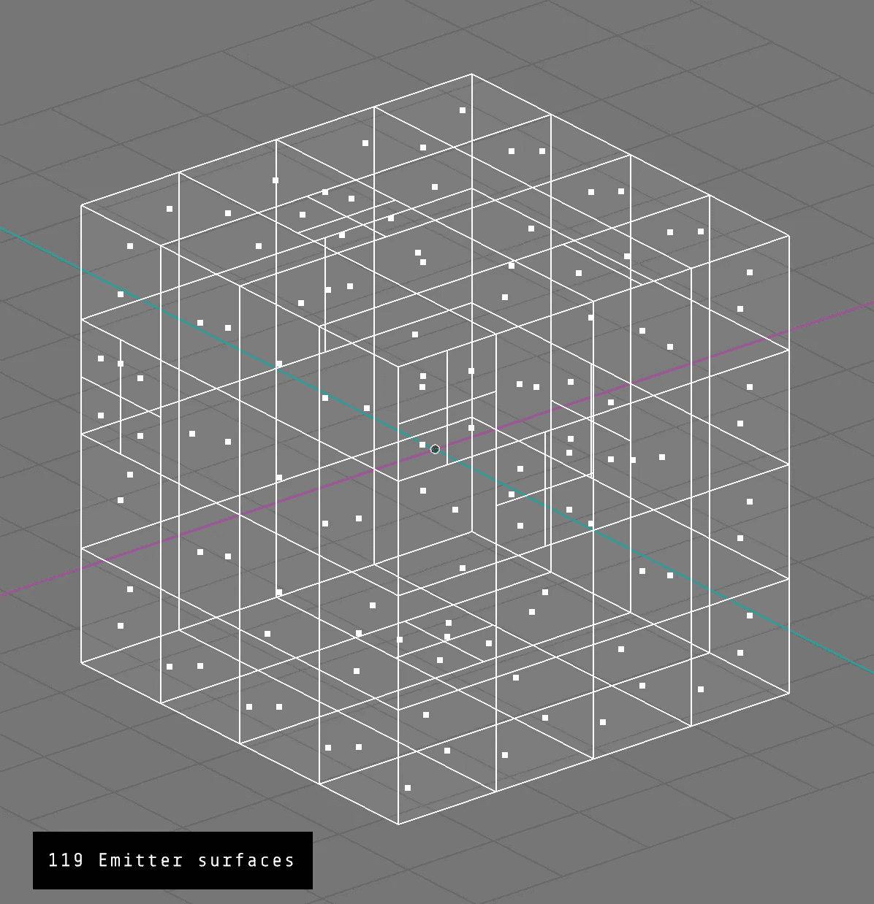
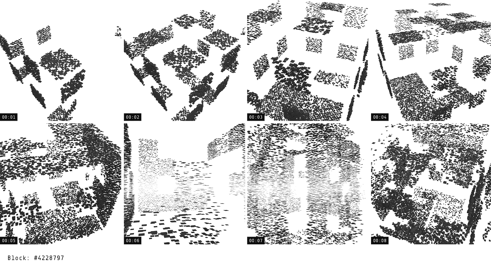
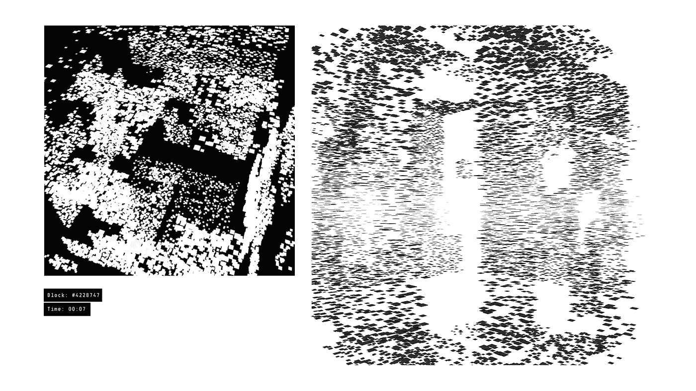

# 看起来像一个街区

> 原文：<https://medium.com/coinmonks/looks-like-a-block-2718c4cd2c6f?source=collection_archive---------7----------------------->

将区块链的形式可视化

一个应用周期通常从验证模型的发明者开始，然后迅速落到加速发明规模的投资者手中。在规模上，采用在创造阶层中搅动，他们使它公开可及。最终，这项新发明在市场上以一种不引人注意的状态出现，就好像它一直存在一样。

在区块链，我们看到创意阶层的涌入；如果上述流程成立，这是该技术的一个有前途的位置。随着这种情况的发生，呈现用户体验和技术故事的新方法浮出水面。早期创意人员更好的理解提供了更简单的体验，缩小了新人加入所需的知识差距。它还允许围绕该技术的使用进行新的思考。

受到采用曲线上这一点的启发，我决定给自己一个简单的挑战，为新的雷达办公室设计装饰。我们的想法是建造一幅壁画，突出我们发起的街区；一个合适的纪念品，纪念我们的产品和我们开始的地方。这开始于 279 天 17 小时前开采的以太坊 4228747 号区块。

在对 Etherscan 进行了一些探索后，我提取了我们的块特征。在那里，我组装了一个模拟块大小、事务数量和处理时间的 3D 粒子系统。

**街区特征**

*块号:4228747
字节大小:17948
事务数:119
处理时间:8 秒*

粒子系统正好包含 17，948 个粒子，以参考块的字节大小。粒子在一系列 119 个网格对象上随机发射，这些对象代表该块中发生的每个事务。粒子系统运行了 8 秒或 196 帧，以重新创建块处理时间。

一个令人高兴的意外来自向外发散的粒子运动。虽然我们——或者至少我——通常认为区块链是块的连续“堆叠”,但这种可视化将块呈现为从矿工显现，向外分布到节点系统，在那里它将被复制和确认。我想这也可以被看作是对矿工集中地位的一种否定的说法…但是，我会把这个问题留给你。我只是喜欢它实际上改变了我对区块开采过程的看法。

Ethereum Block #4228747

结果是 3D 空间中的块的半随机抽象。从纯粹的视觉意义上来说，图形图案是惊人的，它形成了一个适应性强的视觉系统，可以用于印刷、动画或 NFT。将块可视化符号化的想法非常元🤔。

每 24 帧或 1 秒钟，我从不同的角度拍摄一张照片来捕捉这个过程的维度。这些剧照成为一个 8 件系列，将生活在我们的物理空间。从概念上讲，它将我们发射的空灵本质带入了一个有形的、物理的人工制品中。

1 second snapshots of the block as it processes

创造性产出将是区块链下一阶段的关键。随着越来越多的学科涉足该领域，新的视角将推动我们思考该技术的用例。虽然我绝不认为创意是这里唯一的英雄，但拥有比计算机科学更具可塑性的思维和输出将导致可能性(和事故)的爆炸，这将有助于工程类制定如何建造和建造什么。

Mock up for one of the finalized installations

如果你有任何想法，请在下面留下评论，或者联系我:brandon@radarrelay.com。让我们创造一些东西。