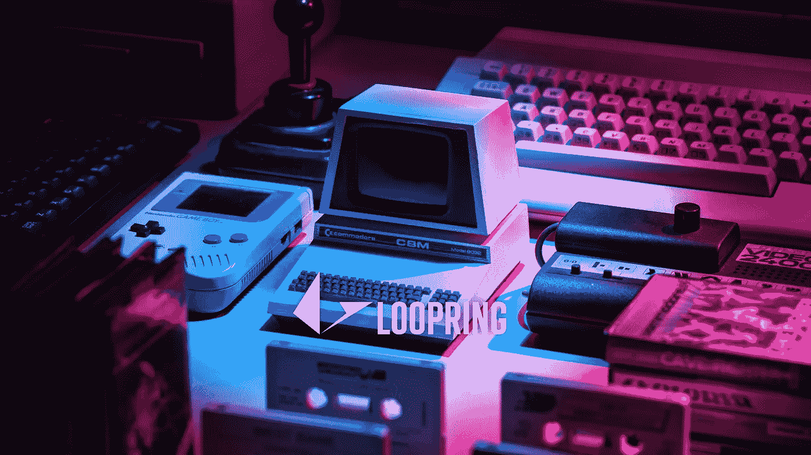
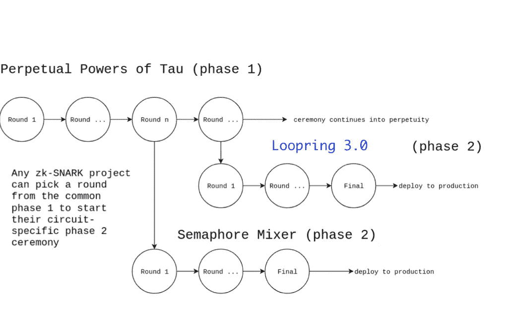
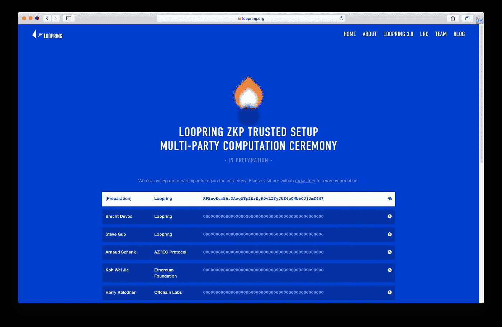

# Loopring 开始 zkSNARK 可信设置多方计算仪式

> 原文：<https://medium.com/coinmonks/loopring-starts-zksnark-trusted-setup-multi-party-computation-ceremony-cd1b98113773?source=collection_archive---------1----------------------->

Loopring v3 可信设置的第二阶段已经开始！仪式的总部设在 https://loopring.org/#/ceremony，参与者和观察员可以随时了解进展。这是 Loopring v3 beta 用于生产之前的最后一步。以太坊安全的高性能订单交换只是一个仪式！

# 为什么仪式是必要的？

Loopring 3.0 依靠 zkSNARKs 来执行链外重载计算，并且仅通过简洁的 ZK 证明将数据推送到链上以进行高效验证。对于[协议](/loopring-protocol/loopring-open-sources-its-zksnark-circuit-code-53c934b67ce5)中使用的每个电路，我们需要生成证明和验证密钥。正如您可以从名称中推断出的那样，这些密钥用于生成证明和验证证明。

问题是在生成这些密钥时，一段名为 ***有毒废物*** 的数据必须被丢弃*，*否则，它会被用来生成伪造的证明，从而使协议不安全。

这就是可信设置多方计算仪式的用武之地。在这个仪式中，信任设置由多人完成。只要每个阶段只有一个人删除他/她的有毒废物，该协议就是安全的。

# 两个阶段

仪式分为两个阶段。第一阶段是 Tau 仪式的[永久能量，可以永久持续并被所有电路使用。Loopring 已经参与了第一阶段。阶段 2 是特定于电路的，需要为环路协议中的每个电路执行。要生成伪造的证明，必须从第一阶段和第二阶段的所有*参与者那里回收*所有*有毒废物。*](/coinmonks/announcing-the-perpetual-powers-of-tau-ceremony-to-benefit-all-zk-snark-projects-c3da86af8377)

Image borrowed from Wei Jie Koh’s [post](/coinmonks/announcing-the-perpetual-powers-of-tau-ceremony-to-benefit-all-zk-snark-projects-c3da86af8377) with modification.

# Loopring(二期)仪式

我们在第一阶段的第 11 轮[的基础上开始了第二阶段的仪式。正如](https://github.com/weijiekoh/perpetualpowersoftau)[事先在推特上宣布的](https://twitter.com/loopringorg/status/1190701331771723778)，我们在区块高度 [602168](https://blockexplorer.com/block/00000000000000000013a0dab9d26be0353108f6eb5a2be6ac389986296607c7) 使用比特币区块哈希做了一个额外的第一阶段贡献。由此产生的数据将构成 Loopring 第二阶段的基础。

每个参与者需要下载一个大约 75GB 的文件。然后，这些数据被用于运行一些计算，在现代计算机上完成这些计算大约需要 12 个小时。结果是一个大约 75GB 的新文件，包含了参与者的贡献。然后需要上传这个新文件，以便后续参与者可以在此基础上进行构建。

仪式的第二阶段也可以像第一阶段一样无限期运行。一旦我们觉得有足够的参与者，例如 6 到 8 个，我们将生成必要的密钥，以便协议 3.0 beta4 可以用于生产。稍后，如果需要，我们可以在有更多人参与的时候生成新的密钥。(大约 30 名参与者正在排队)。

**如果你想参加，请** [**告诉我们**](mailto:foundation@loopring.org) ！有关流程&指令的更多技术细节，请查看我们的 [GitHub repo](https://github.com/Loopring/trusted_setup) 。要了解整体进展，请访问我们的[网站](https://loopring.org/#/)。或者以上任何一个问题，只要在 twitter 上给我们写信就可以了，地址是 [@loopringorg](https://twitter.com/loopringorg) 。

[https://loopring.org/#/ceremony](https://loopring.org/#/ceremony)

请注意，上述网页中的参与顺序是临时的，可能会在每一轮之后根据人们的可用性进行更改。我们深切感谢所有潜在的与会者。

# 承认

我们要感谢 [Koh 韦杰](/@weijiek)、 [Kobi Gurkan](https://kobigurk.com/) 和 [BarryWhiteHat](https://github.com/barryWhiteHat) 主持信任仪式的第一阶段。我们还要感谢 [Kobi Gurkan](https://kobigurk.com/) 、 [Matter Labs](https://matter-labs.io/) 和 [Sean Bowe](https://twitter.com/ebfull) 编写了用于运行这些可信设置阶段的大部分代码。最后，我们要感谢 [Zcash](https://z.cash/) 基本上创造了这里使用的所有技术。

Loopring 是一种用于在以太坊上构建高性能、非托管、基于订单簿的交换的协议。您可以 [**报名参加我们的双周更新**](https://loopring.substack.com/) ，在【Loopring.org】的[了解更多信息，或者查看我们的:](https://loopring.org/)

[推特](http://twitter.com/loopringorg) ⭑ [电报](http://t.me/loopring_en)⭑[Reddit](http://reddit.com/r/loopringorg)⭑[github](https://github.com/Loopring)⭑[不和](http://discord.gg/KkYccYp)⭑[YouTube](https://www.youtube.com/channel/UChUsnhrJmjvIZ0l0cuAXjeQ)⭑[LinkedIn](https://www.linkedin.com/company/loopring/)

> [直接在您的收件箱中获得最佳软件交易](https://coincodecap.com/?utm_source=coinmonks)

