# LoremBoard:您的加密产品组合的 Oracle

> 原文：<https://medium.com/coinmonks/loremboard-the-oracle-for-your-crypto-portfolio-92ca80506a0b?source=collection_archive---------5----------------------->

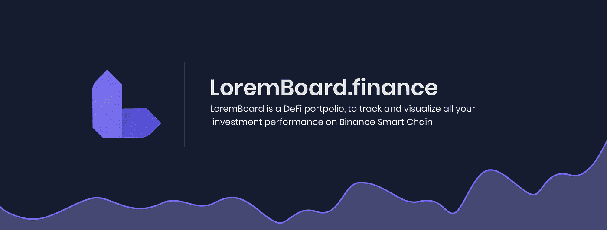

对于农民来说，LoremBoard 是最好的投资组合仪表板。它不仅为今天提供加密跟踪，还可以获取帮助你预测的历史记录。该平台提供宝贵的见解，帮助您做出投资决策。它有助于收集、显示、分析、通知和建议任何类型的信息。

这篇文章将介绍 LoremBoard 平台，重点介绍它的一些令人惊叹的特性。

# 钱包历史记录

第一大特色是带有历史功能的钱包。您可以在一个屏幕中轻松查看过去的所有钱包交易，如下图所示:

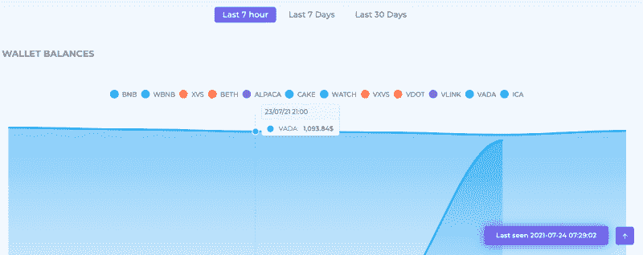

# 累积 PNL

就投资决策而言，统计和图形分析是一个重要方面。该平台借助折线图提供累计损益，便于您进行分析:

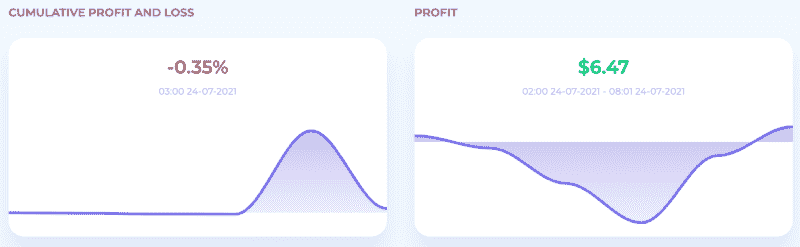

它还以条形图的形式提供数据:

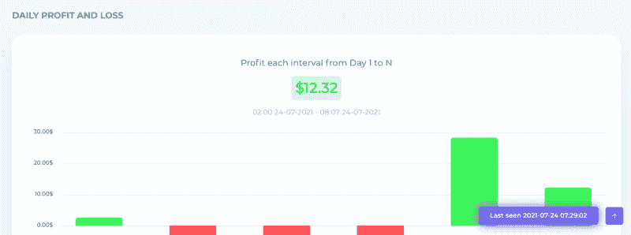

# 农场摘要

您可以轻松地以统计方式查看您的所有资产价值，也可以在 Farm summarize 屏幕的 do-nut 图表中查看，如下图所示:

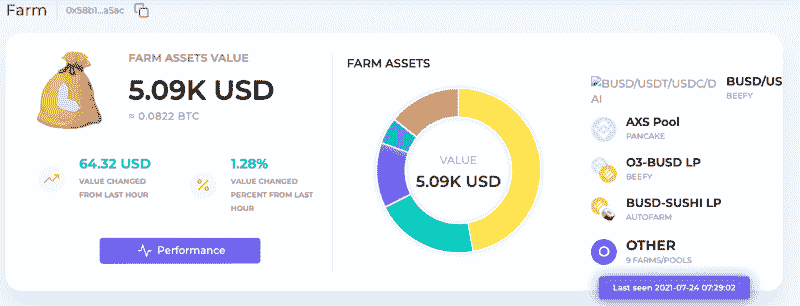

此外，您还可以从屏幕上获得每个 LP 对的详细信息:

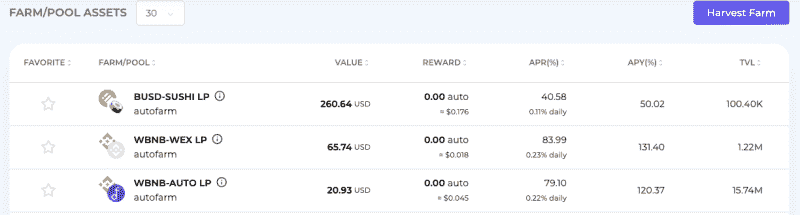

由于该平台侧重于分析和决策制定，因此还提供了具有以下观点的深入分析:

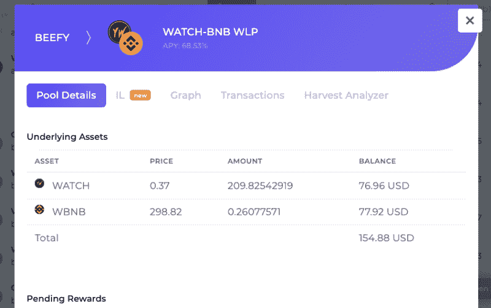

您还可以通过图形分析来检查性能:

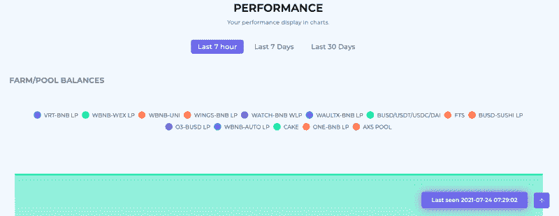

# 历史

历史页面使我们能够访问我们过去的所有投资组合交易的详细信息:

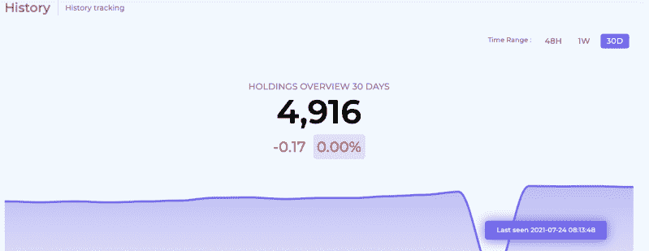

您还可以根据 TVL、奖励或价值过滤您的视图:

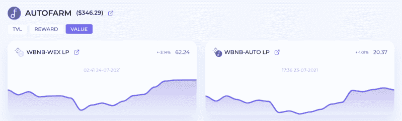

# 支持农场

该平台支持 BSC 上超过 48 个支持场，并且还在不断增加:

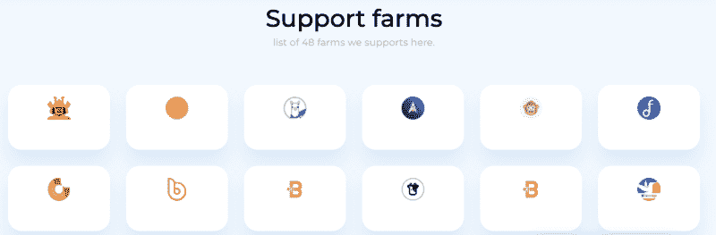

# การระดมทุน劳工组织

LoremBoard 计划于 7 月 31 日至 8 月 1 日在 [FoodCourt Finance](https://foodcourt.finance/) 上筹集资金。你可以在[电报](https://t.me/loremboard_community)上找到细节。

# 社区

*   [Line Openchat](https://line.me/ti/g2/gDVML0l7VcLFxA71J6MpAQ)
*   [电报](https://t.me/loremboard_community)
*   [文件](https://loremboard.gitbook.io/loremboard/)