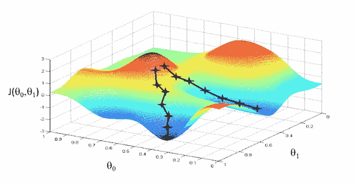

# 科学 Python 中的损失优化

> 原文：<https://medium.com/coinmonks/loss-optimization-in-scientific-python-d1efbbe87171?source=collection_archive---------3----------------------->



Visualizing loss defined by two parameters

为了找到优化的参数而对数据进行训练的过程在机器学习中是经常发生的。当你使用像 MRSE 这样的标准损失函数时，很容易找到标准包来训练你的模型。然而，当实现(或编写)新算法时，您可能必须自己处理自己的损失函数。

Scientific Python 在 *scipy.optimize* 包中提供了许多优化例程。在本文中，我们将实现其中的两个例程。我们将利用 Kaggle 提供的波士顿住房预测数据。你可以在这里买到[。让我们从导入所需的包开始。](https://www.kaggle.com/c/boston-housing)

```
import pandas as pd
import numpy as np
from scipy.optimize import fmin, minimize
```

让我们获取、加载和提取我们的 numpy 数组。

```
train_df = pd.read_csv('./train.csv', index_col='ID')y = train_df['medv'].values
y = y.reshape(-1, 1)train_df['constant'] = 1
columns = ['constant', 'crim', 'zn', 'indus', 'chas', 'nox', 'rm', 'age', 'dis', 'rad', 'tax', 'ptratio', 'black', 'lstat']
x = train_df[columns].values
```

我们将实现简单的线性回归 *y = w.x* ，所以让我们实例化一个初始值为 0 的数组 *w* 。我们需要关注我们的维度，所以我们的维度没有静态值。

```
w = np.zeros([x.shape[1], 1])
```

接下来，让我们创建我们的线性回归函数。

```
def pred(x, w):
    return np.dot(x, w)
```

然后我们可以通过调用这个函数进行预测。

```
y_pred = pred(x, w)
```

为了训练我们的模型并优化 w，我们需要一个损失函数。接下来我们来定义一下。

```
def loss(_w):
    p = pred(x, _w)
    e = y - p
    se = np.power(e, 2)
    rse = np.sqrt(np.sum(se))
    rmse = rse / y.shape[0]
    return rmse
```

# fmin

我们将使用的第一个优化例程是 fmin。这使用了 Nelder-Mead 单纯形算法来寻找我们的函数的最小值。它不要求我们的函数是可微的。然而，它不能很好地推广到高维数据。让我们使用这个。我们需要指定迭代的次数，这样这个算法才能找到好的值。如果没有它，数据的默认步骤数可能会提供

```
min = fmin(loss, w, maxiter=1000)
```

函数调用返回 *w* 的优化值。然后，当 *w* 全为 0 时，我们可以继续比较我们的新预测值与我们的初始预测值，以及我们的基本事实。

```
y_min = pred(x, min)
out = pd.DataFrame({'y': y[:,0], 'y_pred': y_pred[:,0], 'y_min': pred(x, min)})
out.head(n=15)
```

# 最小化

当处理高维数据，或者一阶或二阶导数的损失函数时，我们可以利用 *minimize()* 。它是很多东西，所以最好是小心翼翼，循序渐进地接近它。

让我们从实现与 *fmin()* 相同的解决方案开始。

```
nms = minimize(loss, w, method='nelder-mead')
```

你可能注意到的第一件事是我们现在有了一个*方法*参数。为了复制 *fmin()* ，我们指定*‘内尔德-米德’*。其次，我们现在在调用 *minimize()* 的结果中有了更多的数据。在这种情况下，我们对参数 *x* 感兴趣。让我们来做一个预测。

```
out_2 = pd.DataFrame({'y': y[:,0], 'y_pred': y_pred[:,0], 'y_min': pred(x, nms.x)})
out_2.head()
```

可以定义另一个函数，它是我们损失的导数，然后在调用中使用它来最小化()。我们将把它留给另一篇文章。

现在，我们在下面的要点中有上述所有代码。

下次见。