# 丢了 metamask 钱包？怎么挽回？

> 原文：<https://medium.com/coinmonks/lost-metamask-wallet-the-forensic-way-c1871c3768f3?source=collection_archive---------1----------------------->

## 法医的方式

## 我是怎么搞砸的

这一切都始于 metamask(或 chrome)在使用 chrome + metamask 时放弃对硬件钱包的支持。在那之前，我一直使用 chrome 和我的 ledger nano s，从来不用担心种子短语或私钥(如果你还没有硬件钱包，并且处理的数据超过 3 位数，请帮自己一个忙，买一个)。所以我开始使用 Firefox，仍然带着我的硬件钱包，一切似乎都很好。8 月份，我像其他人一样铸造了 NFT，直到我接触了一些需要 EIP-1559 类型交易的合同，而 metamask 在与硬件钱包一起使用时还不支持它…所以我在 metamask 中创建了一个“临时”软件钱包…我的想法是用这个钱包铸造一些 NFT，然后我会立即把它们放回我的主地址，除非我没有(汽油费，懒惰？？).我持续使用了几个星期，忘记了我还没有备份我的种子短语，所以在我丢失它的那天，我有大约 2ETH 价值的令牌和 NFT。

## D 日

因此，9 月 18 日，我试图再次使用元掩码，但它不断失败，有一个新的元掩码版本，显然，分类帐用户需要更新固件，但在我阅读之前，我在其他地方看到降级元掩码版本解决了问题，因为我急于交换一些东西，我这样做了。扩展没有降级按钮，你必须卸载当前版本并安装旧版本。我照做了，不像你升级扩展时，钱包数据丢失了，所以我被要求输入我的种子短语。

在这里，我有点惊慌，我意识到我没有种子短语，我重新安装了新版本，再次卸载它…这可能会使它变得更糟，如果你以后试图恢复数据，因为你可能会覆盖它。所以如果你在这一点上，把你的手从电脑上拿开，深呼吸！

## 解决方案

**免责声明**:我将要描述的方法依赖于你仍然拥有元掩码密码，如果你没有，你可以停止阅读。如果你保存了它们，你可以通过它的创建日期来检查它是哪一个，并且因为每个新的元蒙版安装使用一个新的 UUID，它不会被覆盖。

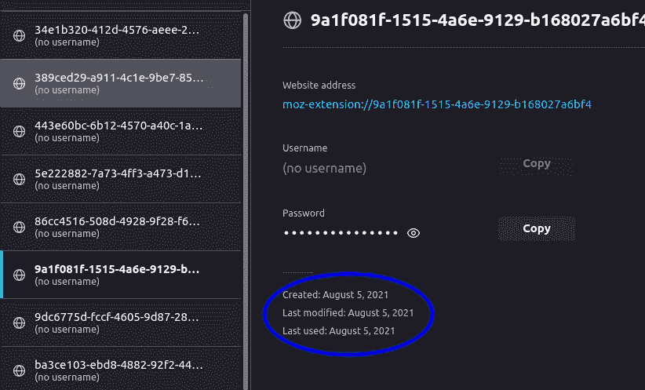

我使用的方法依赖于这个[工具](https://metamask.github.io/vault-decryptor/)，metamask 将这里的[描述为从已安装的 metamask 扩展中获取种子短语的方法。但是如果你出于某种原因卸载了这个扩展，那么你需要的所有文件都不见了。此外，如果你使用 Firefox，他们甚至没有描述从文件中恢复它的方法，所以即使你已经有了文件，但不知道如何从中获得 vault 数据，这篇文章的最后一部分对你来说可能非常有用。](https://metamask.zendesk.com/hc/en-us/articles/360018766351-How-to-use-the-Vault-Decryptor-with-the-MetaMask-Vault-Data)

## **Firefox 中的数据存储在哪里**

在[他们的帮助页面](https://metamask.zendesk.com/hc/en-us/articles/360018766351-How-to-use-the-Vault-Decryptor-with-the-MetaMask-Vault-Data)上，metamask 支持团队描述了如何从控制台获取 vault 文件，但这将为当前的 metamask 安装获取 vault，这对我们的案例来说是非常无用的。除了有人说它在你的火狐档案文件夹里，然后是“存储”，我找不到太多关于这些数据存储在哪里的信息。四处搜索和测试，我找到了确切的地方。

*   请转到“关于:支持”来查找您的配置文件路径

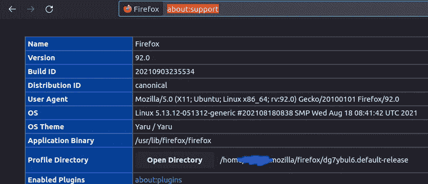

*   然后导航到存储/默认/。我们要找的文件夹是那些从 moz-extension 开始的文件夹。如果您重新安装了元掩码，您会发现新的文件夹。请注意，如果您使用 Solana wallet phantom，它使用类似的文件夹结构，这愚弄了我几个小时，以为我找到了元掩码的旧数据。

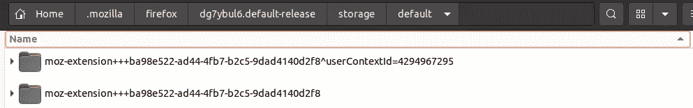

在 moz-extension 文件夹中，您会发现一些 sqlite 文件，在 idb 文件夹中，有一个带有数字名称的二进制文件。

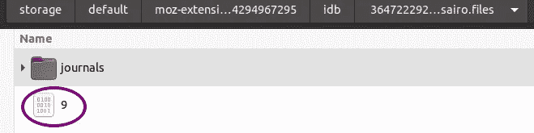

This is the file you should have to use the vault decryptor or the file we are going to try to recover.

这个文件包含了我们可以和金库解密器一起使用的数据串。如果您使用十六进制编辑器打开该文件，您将找到 vault 数据:

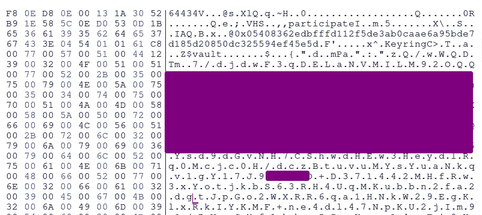

简单对吗？如果您有文件，请跳到最后一步。但是记住我们卸载了扩展…这就是法医派上用场的地方。

## 使用取证技术恢复 vault 文件

在恢复我们意外删除的内容时，有几种程度的“恢复”,每一种程度都需要更高级但通常不太成功的方法来完全恢复数据。但是不要绝望，我还以为我再也拿不回我的钱包了…

从现在开始，最好的方法是卸载安装 firefox 和 metamask 的分区，这样可以确保我们试图恢复的数据不会被覆盖。你可以使用一个活动的 USB 或类似的东西，或者如果你的/home 分区在另一个驱动器上，只需引导到恢复模式并卸载它。

因此，第一个程度是您刚刚删除了您的扩展，您立即意识到，没有触及任何东西，并且能够使用恢复逻辑文件的软件。为此，您可以使用 [testdisk](https://www.cgsecurity.org/wiki/TestDisk) 、[extendelet](http://extundelete.sourceforge.net/)、 [ext4magic](http://ext4magic.sourceforge.net/howto_en.html) 或任何其他尝试自动恢复已删除文件的工具。如果这对你有用，那就是你的幸运日和**你可以跳过下面的步骤**并转到最后一步，在那里我们将快速二进制文件解压缩并获得保险库数据。

下一个严重程度包括在磁盘中查找原始数据。当一个文件被删除时，只有它与实际数据的链接被删除，数据仍然存在，但磁盘扇区被标记为空闲，因此它可以随时被其他文件覆盖。如果我们没有太多的可用磁盘空间，这很可能在我们删除文件后不久发生。即使我们有很多空闲空间，并且卸载了分区，所以我们非常确定数据没有被覆盖，但挑战仍然是检索组成文件的数据，因为它现在是未链接的，甚至可以存储在多个不连续的块中。幸运的是，我们正在搜索的文件是一个小文件，所以它被存储在一个块中的可能性很高。

## 那我们怎么找到它呢？文件雕刻。

当我们开始搜索未分配的空间以试图取回结构化数据时，我们就进入了“文件雕刻”的领域。当我们试图在没有任何元数据或系统文件结构信息的帮助下重建文件时，我们可以说是文件雕刻。我们拥有的唯一数据是文件的内容，也就是说，我们期望在文件内部找到什么以及文件的结构。

## **magicrescue 和** [**最前面的**](http://foremost.sourceforge.net/)

这些都是类似的文件雕刻工具，在这种情况下，我最先使用[因为它看起来更简单，对我来说也很好，但我认为用 magic rescue 可以获得类似的结果。](http://foremost.sourceforge.net/)

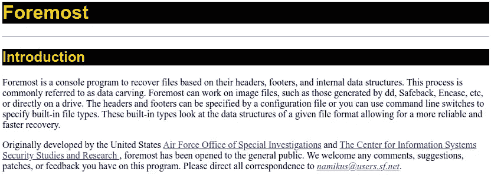

foremost 的工作方式是在磁盘的原始数据中寻找模式。它已经为一些常见的文件类型预定义了模式，如 jpeg、mp3、giff 等，但是我们可以从任何给定的数据字符串中进行搜索，或者定义我们自己的页眉和页脚模式，以帮助我们找到以这些模式开始和结束的文件。

为此，我们可以编辑文件/etc/foremost.conf，并添加如下所示的新行:

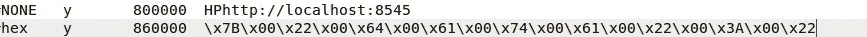

第一列是将赋予文件的扩展名，第二列是“是”或“否”,搜索区分大小写，第三列是文件的大小，这意味着如果没有定义结束模式，或者如果定义了结束模式，但在搜索的长度内没有找到，它将在该大小修剪恢复的数据。

给我找回钱包的希望的第一次搜索是通过以下配置完成的:

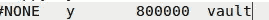

它将只搜索字符串“vault”，我知道它在文件中。我使用以下命令运行搜索:

```
foremost -v -i /dev/nvme0n1p1 -o /output -c /etc/foremost.conf
```

这意味着，在设备 */dev/nvme0n1p1* 中运行搜索，将结果保存在 */output* 中(注意它是另一个分区，因此我们不会在搜索过程中陷入递归循环，也不会覆盖任何我们想要恢复的潜在数据)，并且我们还使用-c 来指示我们的配置文件所在的位置(使用模式“ *NONE y 800000 vault* )。

然后我在/output 文件夹中 grep“salt ”,这是我知道文件中包含的另一个单词，很快我就找到了我要找的东西:

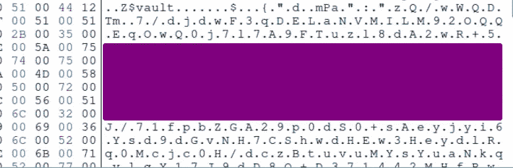

所以我很快复制了保险库字符串，并尝试了 [metamask 保险库解密器](https://metamask.github.io/vault-decryptor/)但是……它不起作用。我看了看数据，似乎有些不对劲，一些奇怪的字符，我试图删除，一些丢失的信息，如保险库开头的字符串“data”...因此，在这里我意识到，数据要么是损坏的，要么这个文件需要以某种方式处理后才能被读取。

## 快速压缩

在这一点上，你非常接近恢复你的数据，但如果你不明白这一点，你会死在岸上。

如果你使用 firefox，这是非常重要的一步，不管你是如何获得文件的(要么恢复它，要么你从未删除它，你只是想要回种子短语)。我看到几个[帖子在谷歌上搜索](https://ethereum.stackexchange.com/questions/97833/read-metamask-firefox-vault-binary-file)寻找我自己的问题，那里的人们都停留在这一步。他们设法得到了保险库的数据，但解密器似乎不起作用。与 Chrome 相反，在 Chrome 中，保险库数据可以以纯文本的形式从文件中获取，正如这里所描述的，在 firefox 中，文件不能以纯文本的形式读取，它是一个二进制文件，并且已经使用名为 [snappy](https://en.wikipedia.org/wiki/Snappy_(compression)) 的软件进行了压缩。

在这一点上，我的希望没有找到 vault 数据时那么高，因为我意识到要解压缩数据，我需要整个文件，但我没有，因为我只搜索字符串“vault ”,最重要的是只恢复匹配字符串后的数据。当文件被压缩时，文件中给定位置的数据依赖于该位置之前的数据，所以我认为很难得到整个文件，或者如果我得到了它，它将部分损坏。我还是努力了。

为了获得完整的快速文件，我对 foremost 使用了以下模式:

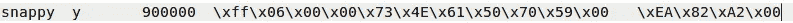

我检查了一个正在运行的 firefox snappy 文件(从头开始安装新的 metamask ),注意到该文件的第一个和最后一个字节是\xff\x06\x00…和\xEA\x82\xA2\x00

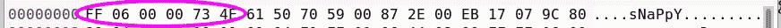

header of the metamask/firefox snappy file

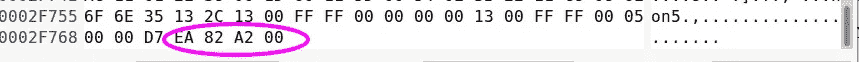

footer of the snappy file

我再次运行 foremost，得到了相当多的文件(snappy 显然用于其他东西，如 googlefonts ),但检查大小时，我可以缩小一点，最终找到我正在寻找的文件。我看到了我丢失的钱包的地址，并再次看到了我之前已经找到的保险库数据，但这一次是在整个 snappy 文件的上下文中。

我只需要尝试解压缩它，它可能仍然损坏或不完整。我试着用 python 脚本和 snappy-python 解压它，但没有成功，然后我谷歌 firefox snappy，找到了这个工具:

> [https://github.com/berdav/snappy-fox](https://github.com/berdav/snappy-fox)

我运行以下命令，指示工具将 956280320.snappy(我从 foremost 恢复的文件)中的数据解压缩到 out2.text，我的希望再次非常高:

> 。/snappy-fox 956280320 . snappy out 2 . text

当我打开 out2.text 时，我可以看到一些清晰的文本，并立即知道保险库解密器这次会工作。请注意与之前截图的不同之处。数据现在清楚地以明文显示。

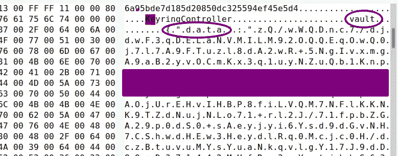

我打开保险库解密器，粘贴保险库数据和我的旧密码，瞧，我的记忆术回来了:

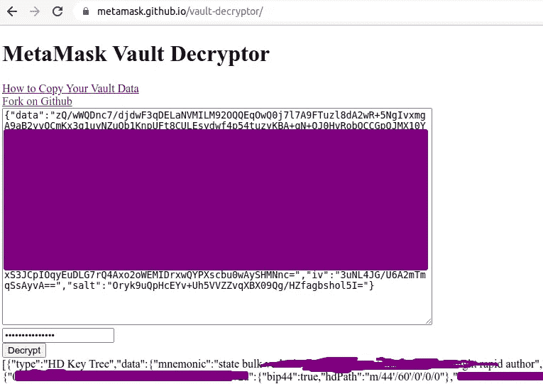

I got the mnemonic back!

我希望这能帮助你们中的一些人阅读。我知道有些人很快就能找回他们的钱包，只需要解压这个爽快的文件，而其他人也许可以利用上面描述的一些取证技术。无论如何，如果这篇文章帮助你拿回了你的资金或 NFTs，或者你认为这是一个很好的故事，你可以给我买一瓶啤酒(或一台新的笔记本电脑:D ),给我发一些 eth 或 ftm 或任何你想要的东西到下面的地址:

> 0 xce 5 f 27 be 8 feaa 17 c 0713 c 39143539780d 71 ef 38 c

感谢阅读并保管好你的记忆法(或者最好买些硬件钱包！).如果你需要更多的帮助，请留下你的评论。

> 加入 Coinmonks [电报频道](https://t.me/coincodecap)和 [Youtube 频道](https://www.youtube.com/channel/UCbyDhTbOiKh2iUMKBi4-4Zg)了解加密交易和投资

## 另外，阅读

*   [霍比评论](https://blog.coincodecap.com/huobi-review) | [OKEx 保证金交易](https://blog.coincodecap.com/okex-margin-trading) | [期货交易](https://blog.coincodecap.com/futures-trading)
*   [Godex.io 审核](/coinmonks/godex-io-review-7366086519fb) | [邀请审核](/coinmonks/invity-review-70f3030c0502) | [BitForex 审核](https://blog.coincodecap.com/bitforex-review)
*   [Crypto.com 费用](/coinmonks/binance-fees-8588ec17965) | [僵尸加密审查](/coinmonks/botcrypto-review-2021-build-your-own-trading-bot-coincodecap-6b8332d736c7) | [替代品](https://blog.coincodecap.com/crypto-com-alternatives)
*   [有哪些交易信号？](https://blog.coincodecap.com/trading-signal) | [Bitstamp vs 比特币基地](https://blog.coincodecap.com/bitstamp-coinbase) | [买索拉纳](https://blog.coincodecap.com/buy-solana)
*   [ProfitFarmers 回顾](https://blog.coincodecap.com/profitfarmers-review) | [如何使用 Cornix Trading Bot](https://blog.coincodecap.com/cornix-trading-bot)
*   [MXC 交易所评论](/coinmonks/mxc-exchange-review-3af0ec1cba8c) | [Pionex vs 币安](https://blog.coincodecap.com/pionex-vs-binance) | [Pionex 套利机器人](https://blog.coincodecap.com/pionex-arbitrage-bot)
*   [我的加密副本交易经历](/coinmonks/my-experience-with-crypto-copy-trading-d6feb2ce3ac5) | [比特币基地评论](/coinmonks/coinbase-review-6ef4e0f56064)
*   [CoinFLEX 评论](https://blog.coincodecap.com/coinflex-review) | [AEX 交易所评论](https://blog.coincodecap.com/aex-exchange-review) | [UPbit 评论](https://blog.coincodecap.com/upbit-review)
*   [AscendEx 保证金交易](https://blog.coincodecap.com/ascendex-margin-trading) | [Bitfinex 赌注](https://blog.coincodecap.com/bitfinex-staking) | [bitFlyer 点评](https://blog.coincodecap.com/bitflyer-review)
*   [麻雀交换评论](https://blog.coincodecap.com/sparrow-exchange-review) | [纳什交换评论](https://blog.coincodecap.com/nash-exchange-review)
*   [加密货币储蓄账户](/coinmonks/cryptocurrency-savings-accounts-be3bc0feffbf) | [加密交易机器人](https://blog.coincodecap.com/best-crypto-trading-bots)
*   [BigONE 交易所评论](/coinmonks/bigone-exchange-review-64705d85a1d4) | [CEX。IO 审查](https://blog.coincodecap.com/cex-io-review) | [交换区审查](/coinmonks/swapzone-review-crypto-exchange-data-aggregator-e0ad78e55ed7)
*   [最佳比特币保证金交易](/coinmonks/bitcoin-margin-trading-exchange-bcbfcbf7b8e3) | [比特币保证金交易](https://blog.coincodecap.com/bityard-margin-trading)
*   [加密保证金交易交易所](/coinmonks/crypto-margin-trading-exchanges-428b1f7ad108) | [赚取比特币](/coinmonks/earn-bitcoin-6e8bd3c592d9) | [Mudrex 投资](https://blog.coincodecap.com/mudrex-invest-review-the-best-way-to-invest-in-crypto)
*   [WazirX vs coin dcx vs bit bns](/coinmonks/wazirx-vs-coindcx-vs-bitbns-149f4f19a2f1)|[block fi vs coin loan vs Nexo](/coinmonks/blockfi-vs-coinloan-vs-nexo-cb624635230d)
*   [BlockFi 信用卡](https://blog.coincodecap.com/blockfi-credit-card) | [如何在币安购买比特币](https://blog.coincodecap.com/buy-bitcoin-binance)
*   [火币交易机器人](https://blog.coincodecap.com/huobi-trading-bot) | [如何购买 ADA](https://blog.coincodecap.com/buy-ada-cardano) | [Geco？一次审查](https://blog.coincodecap.com/geco-one-review)
*   [加密复制交易平台](/coinmonks/top-10-crypto-copy-trading-platforms-for-beginners-d0c37c7d698c) | [五大 BlockFi 替代品](https://blog.coincodecap.com/blockfi-alternatives)
*   【Crypto.com 评论】|[|](/coinmonks/crypto-com-review-f143dca1f74c)|[信用交易](/coinmonks/huobi-margin-trading-b3b06cdc1519)
*   [Bybit vs 币安](https://blog.coincodecap.com/bybit-binance-moonxbt)|[stealth x 回顾](/coinmonks/stealthex-review-396c67309988) | [Probit 回顾](https://blog.coincodecap.com/probit-review)
*   [顶级付费加密货币和区块链课程](https://blog.coincodecap.com/blockchain-courses)
*   [在美国如何使用 BitMEX？](https://blog.coincodecap.com/use-bitmex-in-usa) | [BitMEX 评论](https://blog.coincodecap.com/bitmex-review)
*   [比特币基地跑马圈地](https://blog.coincodecap.com/coinbase-staking) | [Hotbit 评论](/coinmonks/hotbit-review-cd5bec41dafb) | [KuCoin 评论](https://blog.coincodecap.com/kucoin-review)
*   [最佳加密交易信号电报](/coinmonks/best-crypto-signals-telegram-5785cdbc4b2b) | [MoonXBT 评论](/coinmonks/moonxbt-review-6e4ab26d037)
*   [Coinswitch 俱吠罗评论](/coinmonks/coinswitch-kuber-review-1a8dc5c7a739) | [电网交易机器人](https://blog.coincodecap.com/grid-trading) | [比特币基地收费](/coinmonks/coinbase-fees-831e77d4f2c5)
*   [Bitget 评论](https://blog.coincodecap.com/bitget-review) | [双子座 vs BlockFi](https://blog.coincodecap.com/gemini-vs-blockfi) | [OKEx 期货交易](https://blog.coincodecap.com/okex-futures-trading)
*   [OKEx vs KuCoin](https://blog.coincodecap.com/okex-kucoin) | [摄氏替代度](https://blog.coincodecap.com/celsius-alternatives) | [如何购买 VeChain](https://blog.coincodecap.com/buy-vechain)
*   [币安期货交易](https://blog.coincodecap.com/binance-futures-trading)|[3 commas vs Mudrex vs eToro](https://blog.coincodecap.com/mudrex-3commas-etoro)
*   [在印度利用加密套利赚取被动收入](https://blog.coincodecap.com/crypto-arbitrage-in-india)
*   [Coldcard 评论](https://blog.coincodecap.com/coldcard-review) | [BOXtradEX 评论](https://blog.coincodecap.com/boxtradex-review)|[uni swap 指南](https://blog.coincodecap.com/uniswap)
*   [阿联酋 5 大最佳加密交易所](https://blog.coincodecap.com/best-crypto-exchanges-in-uae) | [SimpleSwap 评论](https://blog.coincodecap.com/simpleswap-review)
*   购买 Dogecoin 的 7 种最佳方式
*   [美国最佳加密交易机器人](https://blog.coincodecap.com/crypto-trading-bots-in-the-us) | [经常性回顾](https://blog.coincodecap.com/changelly-review)
*   [huo bi 的加密交易信号](https://blog.coincodecap.com/huobi-crypto-trading-signals) | [BitMEX 评论](https://blog.coincodecap.com/bitmex-review)