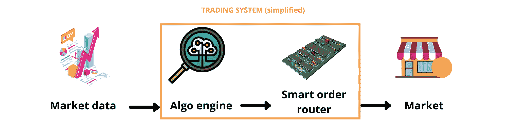
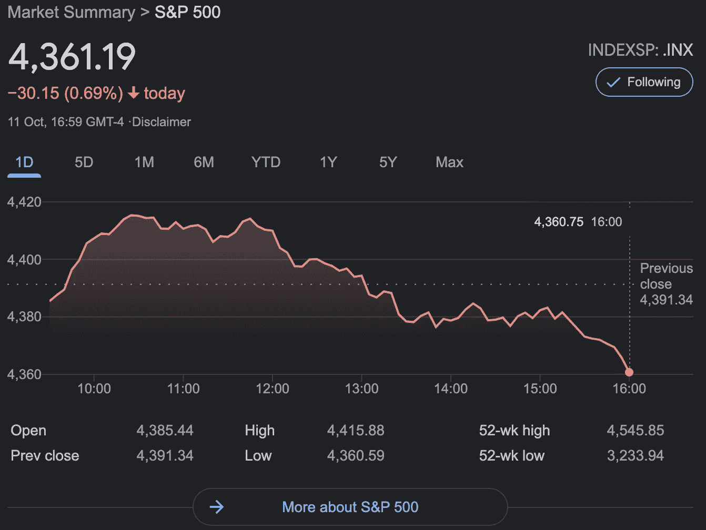
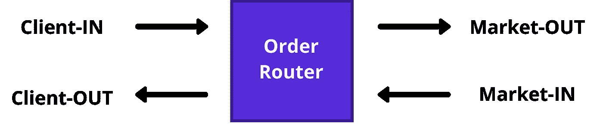
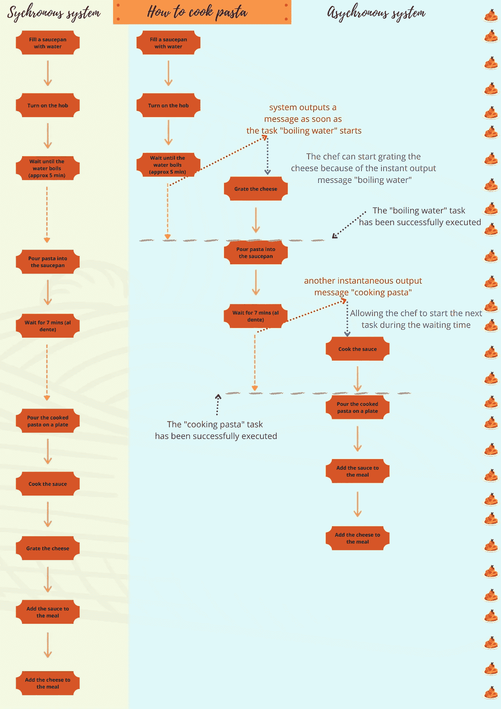
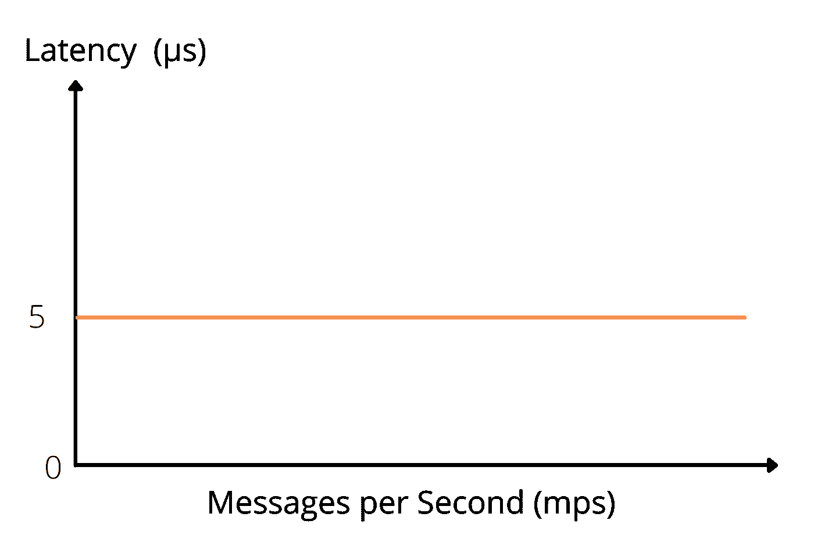

# 低延迟交易系统和…意大利面条？

> 原文：<https://medium.com/coinmonks/low-latency-trading-systems-and-spaghetti-f504ffd7fc95?source=collection_archive---------3----------------------->

对我来说，交易系统似乎太复杂了，难以理解。为什么？因为它们实际上很复杂，也因为它们在不断发展并使用尖端技术。这些系统已经成为金融机构的重要工具，占据了美国股票市场大约 50%的交易量。

## 低延迟交易是什么鬼？(别急，这篇文章的标题很快就有意义了)

在这 7 分钟的阅读结束时，你将对交易系统的技术方面有一个大致的了解。不需要工程或金融经验。

为此，让我们回答以下问题:

1.  什么是低延迟交易系统？
2.  这些系统的主要挑战是什么？

# 1.低延迟交易系统

## 1.a .交易系统概述

交易系统庞大而繁琐。因此，有必要就定义达成一致。

Fig.1\. General view of Trading Systems

简单地说，一个**交易系统**处理**市场数据**自动返回一个**最优订单**(或一组指令)路由到一个适当的**交易场所。**

**algo 引擎**寻找最优订单，而**智能订单路由器**寻找相关交易场所。

*注意:什么是最佳订单或合适的交易场所将取决于交易系统用户和市场监管机构设定的标准。*

> **市场数据**是由交易场所(如股票市场)报告的给定金融工具(当事人之间的货币合同)的任何一条数据(如价格)。

其中**交易场所**，也称为交易所、交易所或交易交易所，是:

> 一个买卖可交易证券、商品、外汇、期货和期权合约的有组织的市场。

Fig.2\. Example of market data (Google screenshot of S&P 500 Market Summary, 11/10/2021)

> 算法引擎是决策者:它由一个算法组成，通过处理输入的市场数据自动对趋势做出反应。它返回一个订单(例如“购买 100 股 XYZ 公司的股票”)。

但是有很多交易场所。哪个最赚钱？

> **智能订单路由器**执行。它自动为 algo 引擎返回的订单寻找利润最高的交易场所。

## 1.b .交易系统的复杂性，类似于生物系统

坚持这样的定义会严重低估交易系统。事实上，根据来自 Neeve Research【2】的[Kevin a . Goldstein r .](https://www.linkedin.com/in/kevin-goldstein-38a3213/)(+18 年华尔街见闻)，

> "交易系统是一个复杂的生态系统，所有的组件都朝着一个目标协同工作."
> 
> 凯文·a·戈尔茨坦

但是凯文·戈尔茨坦并没有就此止步；他继续将交易系统与生物系统甚至有机系统进行比较。令人惊讶的是，这种比较似乎是对交易系统最恰当的定义。

佩里·j·考夫曼所著的 [*交易系统与方法*](https://www.wiley.com/en-us/Trading+Systems+and+Methods%2C+6th+Edition-p-9781119605355) 中，引用查尔斯·达尔文(Charles Darwin)的话介绍了交易系统(其中“物种”代表交易系统)。

> 生存下来的不是最强壮的物种，也不是最聪明的物种，而是对变化反应最灵敏的物种
> 
> —查尔斯·达尔文

这种比较是如此的准确，以至于像生物系统一样，交易系统会经历突变和进化。这就是为什么在交易系统中，为完成一项任务而编写的软件最终会执行不同的任务。此外，遗传算法已被用于启发式算法，导致证券交易中的成功操作。

> **启发式算法***【3】*(与传统算法相比)以最优性、准确性、精确度或完整性为代价，针对最大速度进行优化。
> 
> **遗传算法***【4】*基于模拟生物进化的自然选择过程来解决分类和未分类的优化问题(包括非生物问题)。

## 1.c .交易系统的常见行为，一个基本订单管理器的例子

Fig.3\. A common behaviour of trading systems with an Order Router

*   **客户输入**代表客户(客户即交易系统用户)设定的订单要求；例如，它可以禁止暗池等不受欢迎的交易场所。
*   **客户端输出**可定制；它可以代表有关交易的信息，即实时交易跟踪系统或控制台；
*   **市场导入**代表市场数据。
*   **平仓**是代表订单的信息信号；例如，“以$XYZ 的价格卖出一只股票 ABC”。

乍一看，交易系统的共同行为似乎相当简单:它接收信息，处理信息，然后发回一些信号。

即便如此，当一个人想要快速执行大量操作时，复杂性就来了。高频交易者可以在大约 64 万分之一秒的时间内进行交易。因此，必须考虑构建一个异步系统。

> 与同步系统不同，**异步系统**不依赖于一个全局时钟，该时钟会输出二进制信号，导致在信号正沿执行一系列操作。操作不是由时钟沿驱动的，而是使用事件驱动的架构来执行。

多无聊的定义啊。让我把我的酱料加进去(字面意思)。

**这里有一个简单的同步和异步系统的例子，使用……意大利面条！**

*👉想象一下这个场景:*你是一名烹饪意大利面条的厨师。让**{食材+厨师}** 做系统。

Fig.4\. Synchronous vs Asynchronous systems

在**同步系统**中，厨师必须**等待**水烧开后才能继续烹饪。在等待时间内，**没有输出**:系统“**处于等待状态**”。任务被逐一执行**。输出取决于预设时间(即开始烧水后 7 分钟开始将意大利面倒在盘子上。).**

**在**异步系统**中，厨师可以同时执行**不同的操作**。更重要的是，任务一启动，系统就发送**即时输出**，让厨师并行启动其他任务**。****

****请注意，同步系统比异步系统更容易理解。****

****好的，那很酷。但是交易系统呢？****

*****👉考虑一个由智能订单路由器(又名 SOR)组成的异步系统。参见图 3)。*****

****从订单路由器中输入的**客户入**和**市场入**数据中，一些**市场出**和**客户出**数据会在接收更多输入数据的同时立即输出，而不需要等待订单路由器进程运行。此外，订单路由器流程非常复杂。幸运的是，这些过程可以以状态图的形式呈现，使得 SOR 操作更容易被人类理解。****

# ****2.交易系统的主要挑战****

****交易系统的三大要求，按重要性排序。****

## ****一.业绩****

> ****延迟是指“在数据传输指令发出后，数据传输开始之前的延迟时间。”****

****交易系统的延迟越低，其性能就越好。低延迟交易系统运行速度非常快，在执行和数据处理速度上远远超过人类。****

****在 2018 年，一个有竞争力的低延迟交易系统将在 **5 μs** (微秒)的入口到出口运行，这意味着从交易系统的数据入口到数据出口点。然而，因为没有一个系统是完美的，这些数字通常在 **5 到 20 μs** 之间，这很好，只要低延迟系统的速度不低于 20 μs，以保持对其他交易系统的竞争力。****

****请注意，在上述数字中没有考虑线路延迟。通常，数据中心保证所有交易系统都有相同的线路长度。这样，在股票市场上，线路延迟就不能被认为是一种竞争优势。****

## ****二。一致性****

****不管餐馆忙不忙，厨师都必须为你提供一顿美餐。同样，交易系统必须以每秒 10.000 或 100.000 条消息的速度执行相同的操作，标准差仅为 1 μs(大约，以 2018 年的标准为准)。****

********

****Variation of latency with the volume of processed messages for a trading system****

## ****三。可靠性****

****交易系统不能承受订单、执行或确认的损失。但是无论我们怎么努力，我们都会失去订单。这就是为什么可靠性不仅仅是努力不丢失订单，也是为了保存订单。交易系统的设计必须能经受住流程和机器故障。****

# ****结论****

****在本文中，我们假设低延迟交易系统架构相当于一个简单的交易系统，由一个用于决策的算法引擎和一个用于执行的智能订单路由器组成。实际上，低延迟交易系统更复杂。****

****然而，所提供的信息足以理解低延迟交易系统的典型行为。****

****你知道算法交易、自动交易、高频交易、低延迟交易和超低延迟交易的区别吗？这将是我的下一篇博文。两周后见！****

****喜欢你读的书吗？**我试图理解定量金融，并清晰地解释我的发现。******

# ****接下来该写什么？****

****欢迎在评论区告诉我。****

****以下是相关博客创意的建议:****

*   ****模拟我的交易系统，并解释如何操作。****
*   ****量子金融。****
*   ****使用遗传算法解决优化问题(可能使用 Matlab 遗传算法工具箱)。****
*   ****数量金融学背后的 EEE 研究论文解读。****
*   ****使用逆向工程技术对真实交易系统进行定量研究。****
*   ****交易系统背后的电气和电子硬件研究。****
*   ****订购路由器设计和流程(出于计算机编程目的，不一定是财务目的)和/或 sor。****
*   ****ASIC 应用于区块链挖掘研究。****
*   ****EEE 在区块链后面。****
*   ****更多烹饪材料(是的，请😋).****
*   ****还有其他建议吗？****

# ****参考资料和相关资源****

****本文受到了一些资源的启发，这些资源如下:****

****[1]尼夫研究公司作者(2021):[https://www.neeveresearch.com/](https://www.neeveresearch.com/)****

****[2] [交易系统与方法](https://www.amazon.co.uk/Trading-Systems-Methods-Wiley/dp/1119605350/ref=asc_df_1119605350/?tag=googshopuk-21&linkCode=df0&hvadid=406170683277&hvpos=&hvnetw=g&hvrand=16198497438311144046&hvpone=&hvptwo=&hvqmt=&hvdev=c&hvdvcmdl=&hvlocint=&hvlocphy=1006656&hvtargid=pla-834172661206&psc=1&th=1&psc=1&tag=&ref=&adgrpid=88284845402&hvpone=&hvptwo=&hvadid=406170683277&hvpos=&hvnetw=g&hvrand=16198497438311144046&hvqmt=&hvdev=c&hvdvcmdl=&hvlocint=&hvlocphy=1006656&hvtargid=pla-834172661206)，第五版(2013)****

****[3] [启发式算法](https://optimization.mccormick.northwestern.edu/index.php/Heuristic_algorithms#:~:text=A%20heuristic%20algorithm%20is%20one,a%20class%20of%20decision%20problems)，文章由西北大学麦考密克工程学院的文森特·肯尼、马修·纳塔尔和斯潘塞·萨尔达纳撰写(2014 年 5 月 25 日)****

****[4] [土木工程中的纺织纤维复合材料](https://www.sciencedirect.com/science/article/pii/B9781782424468000124)，作者 C . g . papanicolaou&I . C . papantoniou(2016)****

*   ****[什么是高频交易？](https://smartasset.com/investing/high-frequency-trading)来自[https://smartasset.com](https://smartasset.com/)****
*   ****[交易系统状态图](https://velocimetrics.com/clients/reducing-equities-trading-losses/)，公司作者——Beeks 原名 Velocimetrics。****
*   ****页（page 的缩写）G. a. K. Zimmermann,《算法交易实践》,牛津，2018 年 2 月。****
*   ****r.N. R. Kevin A. Goldstein R .,“内存计算峰会”，载于*内存技术，低延迟交易*，2018 年 10 月。****
*   ****南 Seth，“投资媒体”，投资媒体，2021 年 5 月 5 日。【在线】。可用:[https://www . investopedia . com/articles/active-trading/101014/basics-algorithm-trading-concepts-and-examples . ASP](https://www.investopedia.com/articles/active-trading/101014/basics-algorithmic-trading-concepts-and-examples.asp.)【2021 年 10 月访问】。****
*   ****J.帕特森，“金融巨头”，金融巨头，2015 年 9 月 18 日。【在线】。可用:[https://www . finance magnates . com/executives/insights/what-do-a-trading-system-mean/](https://www.financemagnates.com/executives/insights/what-does-a-trading-system-mean/.)【2021 年 10 月访问】。****
*   ****维基百科，16 12 2020。【在线】。可用:[https://en . Wikipedia . org/wiki/Smart _ order _ routing # Algorithmic _ trading _ and _ SOR](https://en.wikipedia.org/wiki/Smart_order_routing#Algorithmic_trading_and_SOR.)【2021 年 10 月访问】。****
*   ****金融百科，2020 年 7 月 14 日。【在线】。可用:【https://fincyclopedia.net/exchanges/p/parent-order 【2021 年 10 月接入】。****
*   ****市场维基。2021 年 5 月 27 日。【在线】。可用:[https://marketswiki.com/wiki/Order_routing](https://marketswiki.com/wiki/Order_routing.)【2021 年 10 月接入】。****

> ****加入 Coinmonks [电报频道](https://t.me/coincodecap)和 [Youtube 频道](https://www.youtube.com/c/coinmonks/videos)了解加密交易和投资****

## ****也阅读****

**** [## 最佳加密交易所| 2021 年十大加密货币交易所

### ICON _ PLACEHOLDEREstimated 预计阅读时间:28 分钟加密货币交易所的加密交易需要知识…

blog.coincodecap.com](https://blog.coincodecap.com/crypto-exchange)  [## 2021 年 10 大最佳加密贷款平台| CoinCodeCap

### 当谈到加密货币贷款时，大量因素等同于良好的收入状况。此外，借款的一部分…

blog.coincodecap.com](https://blog.coincodecap.com/crypto-lending)  [## 2021 年最佳免费加密交易机器人

### 2021 年币安、比特币基地、库币和其他密码交易所的最佳密码交易机器人。四进制，位间隙…

medium.com](/coinmonks/crypto-trading-bot-c2ffce8acb2a)****