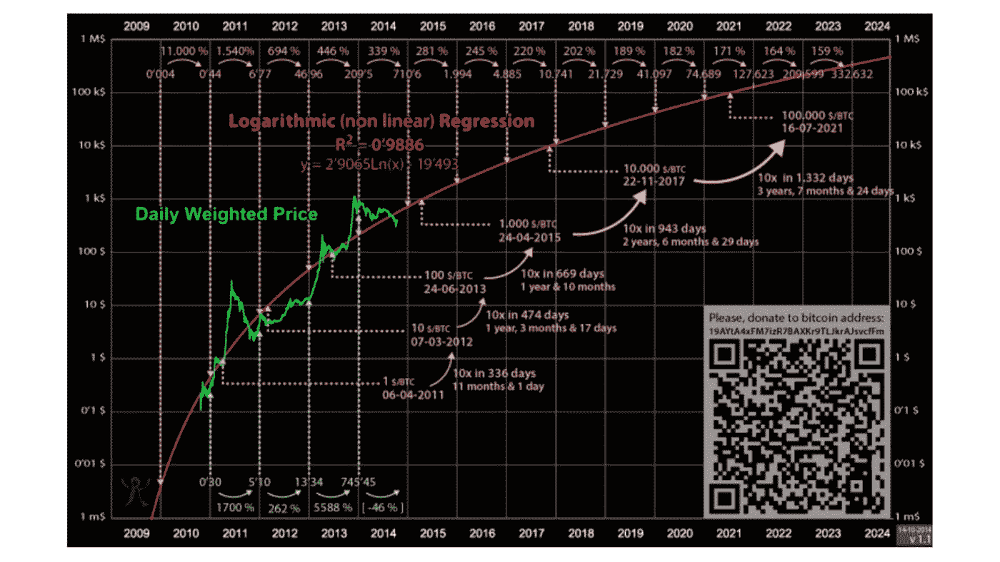

# 低风险、高回报:投资密码的最佳方式

> 原文：<https://medium.com/coinmonks/low-risk-high-reward-the-single-best-way-to-invest-in-crypto-688d8c01398d?source=collection_archive---------0----------------------->

## 我只把一小部分内容放在媒体上。如果你想获得所有加密实用主义新闻更新、投资公告和 altcoin 报告的全部信息，请在此免费注册简讯。

上周，我们权衡了简单的美元成本平均法(一种一致的、同等规模的投资)与同时将所有资金投入加密并终身持有的优势。

但是，如果你从数学的角度，从风险调整的角度来看，无论是平均成本还是长期持有都不是最佳的投资方式。今天，我想提出一个更好的投资加密货币的框架。

​

**动态美元成本平均法**

使用风险调整水平的动态美元成本平均法经常被更简单的模型所忽略。大多数在密码领域呆过一段时间的人都会认识到它的简单之美:这个框架降低了风险，同时提高了回报。

虽然这个概念有很多变化，但我们今天将看看最常见的一个:彩虹图。

​

**彩虹图**

著名的彩虹图创建于 2014 年，试图使用与现有价格数据匹配的对数回归来预测加密货币随着时间推移的公平估值。

对数回归向我们展示了两件事:

*   估价过高的时期，价格高于最佳回归线，这代表获利的机会
*   低估时期，价格低于最佳回归直线，下跌风险低

下面是原始图表:

注意缩放轴，说明比特币的指数增长和收益递减。

后来，增加了同名的彩虹带，代表买卖的不同风险水平。
以太坊也存在一个图表:

虽然彩虹图有时会偏离数千美元，但最初的回归确实有一些非常显著的预测价值:它预测比特币将于 2021 年 7 月 16 日突破 10 万美元大关，而这一切都发生在 7 年前，当时比特币的交易价格约为当前价格的 1/100。

鉴于今年的历史新高 64，000 美元，如果你有一个更老，更准确的模型，请让我知道。

不，彩虹图并不完美(人们不应该期望它是完美的)，但它在预测高高估事件和推动用户利用非凡的购买机会方面非常出色。

模型不一定要完美，它只需要确定风险高于或低于正常水平的时期。

​

**工作方式**

如果我们深入彩虹图本身，这里的蓝色和绿色代表相对低估，因此是一个买入机会。在这些风险水平上花费一段时间后，价格往往会上涨，我们应该尝试在这些水平上最大化我们的投资金额。

红色和橙色是高估，代表高风险和获利回吐的潜在机会。如果我们在这些价位卖出，我们可以在周期底部获利再投资。

中间的黄色带理论上是一个“公平”的估值，以原始回归线为中心。它可以作为保守投资者的卖出信号，普通投资者的持有信号，激进投资者的买入信号。

​

使用彩虹图作为投资模型
但归根结底，我们并不太关心数学、对数或最佳拟合线。我们关心的是如何用加密货币赚钱。让我们来看看一个普通投资者如何利用该框架的真实执行情况。

一如既往，我们必须将我们的投资与某种基准进行比较。上周，我们将 1800 美元的一次性投资与简单的美元成本平均投资进行了比较，在 18 个两周的时间内配置了 100 美元。今天，我们将把这种模式添加到组合中，并使用过去六个月的作为我们的参考点，来看看它相对于其他两种策略的表现如何。

为了与其他模型进行公平的比较，我们将在实验过程中尽可能投入接近 1800 美元的资金。策略是这样的:

*   在最低(冷色)风险级别，我们将投资，在最低风险级别每两周增加 500 美元，在较高风险级别按比例减少(第二低的 400 美元，第三低的 300 美元，等等)
*   按照合理的估价，我们每两周投资 100 美元
*   在公平估价之上，我们将一点一点地把利润从桌子上拿走，在最上面的红色区域最大化，在那里我们每两周拿走 500 美元

由于以太坊和比特币彩虹图都可以免费获得，我们来看看这两项投资。

**结果:**

**爆料**

首先，免责声明:面对黑天鹅事件(全球互联网丢失)，彩虹图没有预测价值。鉴于比特币几种可能的熊市中的任何一种(政府监管严厉，创新导致资产过时，另一种加密货币在效用方面大大超过比特币，或底层技术的一些安全缺陷)，该模型可能会完全崩溃。但是到目前为止它一直是有用的。

这些想法几乎从未被谈论过，并经常被视为 FUD(恐惧、不确定性、怀疑)，但可能会完全破坏加密货币的向上增长，并真正扰乱今天有效的投资模型。

**为什么我喜欢动态成本平均法**

这种经风险调整的投资策略有几点需要注意:

*   动态 DCA 比简单 DCA 产生更高的回报
*   动态 DCA 内置获利策略
*   动态 DCA 隔离风险
*   动态 DCA 产生的回报比在低风险水平下直接购买要低
*   动态 DCA 最大限度地减少了下降带来的痛苦

​

**那么，为什么拥抱比仅仅拥抱更好呢？**

我认为这是一个公平的问题，也是对任何 DCA 战略的一个简单批评。如果你以足够低的价格买入，随着时间的推移，你将击败任何 DCA 策略。

当我们看波动性时，差异就出现了。下表列出了在我们观察的时间窗口内，每种策略的最大跌幅:

因此，如果我们将波动因素考虑在内(最大百分比跌幅)，两件事就变得很清楚了:

*   简单的数据处理会产生更高的波动性
*   简单的数据处理会产生更差的回报

所以选择动态数据缓存而不是简单的重复购买是非常有意义的。如果我们用一次性资本权衡动态投资与购买和持有:

*   持有会产生更高的波动性
*   持有会产生不同的回报，这取决于你的运气

是否存在简单 DCA 可能优于动态 DCA 策略的时间段？是的，但只有在高风险水平下，即使接近峰值，你也会继续向投资中投入资金。动态 DCA 让你在市场周期的那个点上获取利润。

然后，不可避免地，它会降低风险水平，你继续投入相同数量的资本而不获利，而一个活跃的投资者会增加他们的投资。考虑到价格随着时间的推移而整体上涨，准备好根据风险进行调整的投资者每次都会胜过不太复杂的策略。

**我们的立场**

如今，比特币的估值舒适地位于“持有”区间，我认为这是整体市场情绪的基准:投资者知道比特币不像两个月前那样被低估，但许多人都在等待更高的价格水平。

因此，如果动态 DCA 策略对你有吸引力，考虑定期检查这些彩虹带。就目前而言，这是坚持下去的好时机，但有了这些知识，任何上涨或下跌都可能是采取行动的好信号。

记住:有准备的投资者才是成功的投资者。

杰克·尼沃尔德
密码实用主义者

[**点击这里**](http://cryptopragmatist.com/sign-up/) **在你的收件箱里获得这样的内容，绝对免费。**

加入 [Coinmonks 电报频道](https://t.me/coincodecap)，了解加密交易和投资

## 另外，阅读

*   [尤霍德勒 vs 考尼洛 vs 霍德诺特](/coinmonks/youhodler-vs-coinloan-vs-hodlnaut-b1050acde55a) | [Cryptohopper vs 哈斯博特](https://blog.coincodecap.com/cryptohopper-vs-haasbot)
*   [币安 vs 北海巨妖](https://blog.coincodecap.com/binance-vs-kraken) | [美元成本平均交易机器人](https://blog.coincodecap.com/pionex-dca-bot)
*   [如何在印度购买比特币？](/coinmonks/buy-bitcoin-in-india-feb50ddfef94) | [WazirX 评论](/coinmonks/wazirx-review-5c811b074f5b) | [BitMEX 评论](https://blog.coincodecap.com/bitmex-review)
*   [Bookmap 评论](https://blog.coincodecap.com/bookmap-review-2021-best-trading-software) | [美国 5 大最佳加密交易所](https://blog.coincodecap.com/crypto-exchange-usa)
*   [如何在 FTX 交易所交易期货](https://blog.coincodecap.com/ftx-futures-trading) | [OKEx vs 币安](https://blog.coincodecap.com/okex-vs-binance)
*   [如何在势不可挡的域名上购买域名？](https://blog.coincodecap.com/buy-domain-on-unstoppable-domains)
*   [印度的秘密税](https://blog.coincodecap.com/crypto-tax-india) | [altFINS 审查](https://blog.coincodecap.com/altfins-review) | [Prokey 审查](/coinmonks/prokey-review-26611173c13c)
*   [Blockfi vs 比特币基地](https://blog.coincodecap.com/blockfi-vs-coinbase) | [比特坎评论](https://blog.coincodecap.com/bitkan-review) | [币安评论](/coinmonks/binance-review-ee10d3bf3b6e)