# LPWAN、LoRa、LoRaWAN 和物联网

> 原文：<https://medium.com/coinmonks/lpwan-lora-lorawan-and-the-internet-of-things-aed7d5975d5d?source=collection_archive---------0----------------------->

## 第一部分-了解 LPWAN、LoRa 和 LoRaWAN 技术

# 什么是 LPWAN？

**低功率广域网络** ( **LPWAN** )或**低功率广域网络** ( **LPWA** )或**低功率网络** ( **LPN** )是一种无线电信广域网，旨在允许以低比特率进行物体(连接物体)之间的长距离通信，例如使用电池的传感器。

LPWAN 的电池寿命长达数年，专为需要从不同环境中以每小时几次的速度远距离发送少量数据的传感器和应用程序而设计。

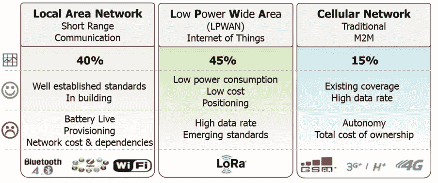

**Image from lora-alliance.org**

LoRa 和 LoraWAN 属于非蜂窝 LPWAN 无线通信网络协议和播放器的范畴，在无许可证频谱中运行。其他在无执照频段运行的技术包括 Sigfox、ingu 和其他一些技术。

无线物联网协议的完整列表可在此处找到。

*   [https://www . link-labs . com/blog/complete-list-IOT-network-protocol](https://www.link-labs.com/blog/complete-list-iot-network-protocols)
*   [https://www . ITU . int/en/ITU-D/Regional-Presence/Asia Pacific/site assets/page/Events/2016/Dec-IoT/IoT training/IoT % 20 network % 20 planning % 20 ST % 2015122016 . pdf](https://www.itu.int/en/ITU-D/Regional-Presence/AsiaPacific/SiteAssets/Pages/Events/2016/Dec-2016-IoT/IoTtraining/IoT%20network%20planning%20ST%2015122016.pdf)

虽然 LoRA、LoRaWAN 在开放的无许可频谱上运行，但其他公司可能在许可频率上运行。因此，LPWAN 通常可分为许可和无许可 LPWAN 生态系统。

LoRa 和 Sigfox 属于非蜂窝物联网技术。NB-IoT(窄带 IoT)属于蜂窝 IoT 范畴，通过蜂窝频率传输。

*   [http://www . rfwire-world . com/terminals/NB-IoT-vs-LoRa-vs-sigfox . html](http://www.rfwireless-world.com/Terminology/NB-IoT-vs-LoRa-vs-SigFox.html)

***注意:****LoRa(或任何 LP WAN 设备)可以用低功率进行长距离传输，因为物理定律规定，为了进行长距离传输；你要么需要增加功率，要么减少带宽。由于 LoRa 嵌入式传感器传输距离较远，但使用的功率较低(电池)，其带宽受到极大限制。*

# 什么是 LoRa 和 LoRaWAN(以及交响乐链接)？

**洛拉***(****Lo****ng****Ra****nge)*是法国格勒诺布尔的 Cycleo 公司研发的数字无线数据通信物联网专利技术。它于 2012 年被 Semtech 收购，该公司拥有 LoRa 传输方法的知识产权。

LoRa 通过免许可证的亚千兆赫无线电频段进行传输，如 169 MHz、433 MHz、868 MHz(欧洲)和 915 MHz(北美)。LoRa 能够以低功耗实现超远距离传输(在农村地区超过 10 公里)。

**该技术分为两部分——物理层 LoRa 和；建立在底层 LoRa 物理层上的通信协议。通信层可以是 LoRaWAN(远程广域网)，由 LoRa 联盟协会定义的开源通信协议；或者可以是 Symphony Link，由一家名为 Link Labs 的公司定义的另一种开源通信协议。**

因此， ***LoRaWAN 定义了网络的通信协议和系统架构，而 LoRa 物理层实现了远程通信链路*** 。LoRa WAN 通信协议确保可靠的通信、安全的通信，并在数据包中添加额外的报头。

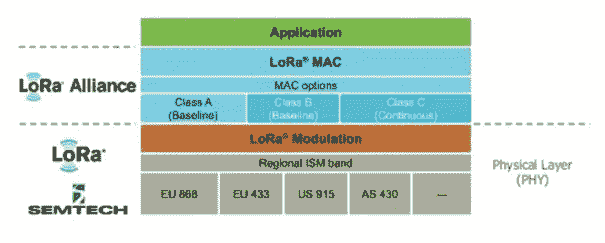

LoRa and LoRaWAN

***LoRaWAN 通信协议*** 由 ***LoRa 联盟定义，这是一个由 500 多家成员公司组成的非营利性技术联盟，*** 致力于通过开发和推广 LoRa wan 开放标准来实现低功耗广域网(LPWAN)物联网的大规模部署。

首个 LoRaWAN 标准由 LoRa 联盟于 2015 年 6 月公布。2017 年发布了 LoRaWAN 规范 1.1。

参考:[https://www . link-labs . com/white paper-symphony-link-vs-lora wan](https://www.link-labs.com/whitepaper-symphony-link-vs-lorawan)

LoRa 和 LoRaWAN 允许农村、偏远地区和近海行业的物联网设备实现廉价的远程连接。它们通常用于采矿、自然资源管理、可再生能源、洲际物流和供应链管理。

***LoRaWAN 是最常采用的 LPWAN 类型，承诺在户外物联网应用中实现无处不在的连接，同时保持网络结构和管理简单。***

# LoRa 和 LoRaWAN 网络拓扑

LoRaWAN 网络架构部署在星形拓扑中(相对于网状拓扑，如 Zibgee)。

LoRaWAN 网络采用星形拓扑结构，基站在传感器节点和网络服务器之间转发数据。

传感器节点和基站之间的通信通过利用 LoRa 物理层的无线信道进行，而网关和中央服务器之间的连接通过基于 IP 的骨干网络进行处理。

*   **端节点**使用 LoRa 直接向范围内的所有网关传输。
*   **网关**使用 IP 在终端设备和中央网络服务器之间传递消息。

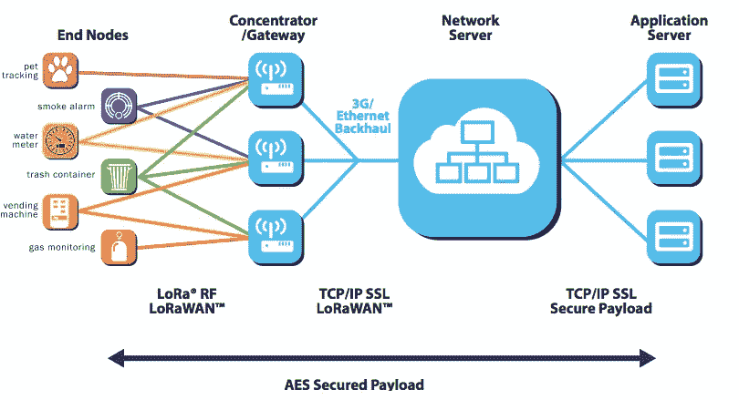

**端节点** 端节点为 LoRa 嵌入式传感器。这些节点通常具有，

*   **传感器**(用于检测变化的参数，如温度、湿度、加速度计、gps)。
*   **LoRa 转发器**通过 LoRa 专利无线电传输方法传输信号，以及
*   可选的**微控制器(带板载存储器)。**

传感器可以连接到 LoRa 应答器芯片，或者传感器可以是嵌入了 LoRa 应答器芯片的集成单元。

**可以用微型 Python 或微型 Javascript 对微控制器进行编程。这使得开发人员可以使用来自加速度计、温度等传感器的数据。并且实现某些用例，例如，跌倒检测算法可以通过基于来自加速度计和其他传感器的输入对微控制器进行编程来实现。**

LoRaWAN 端节点(传感器)通常使用低功率并由电池供电(A 类和 B 类)。LoRa 嵌入式传感器依靠电池运行，通常可持续使用 2-5 年。LoRa 传感器可以在 1 公里到 10 公里的距离内传输信号。

**网关** LoRa 传感器向 LoRa 网关传输数据。LoRa 网关通过标准 IP 协议连接到互联网，并将从 LoRa 嵌入式传感器接收的数据传输到互联网，即网络、服务器或云。

网关设备总是连接到电源。网关通过标准的 IP 连接连接到网络服务器，并作为一个透明的网桥，简单地将 RF 包转换成 IP 包，反之亦然。

**网络服务器** 网络服务器可以是基于云的平台解决方案，如物联网(TTN)或 LoRIOT。网络服务器连接到网关并对数据包进行重复数据删除，然后将其路由到相关应用程序。网络服务器可用于上行链路(即传感器到应用)或下行链路(即应用到传感器)通信。

物联网网络服务器有一个路由器、代理和处理器，处理来自 LoRaWAN 网关的数据包。它还有一个 AWS 桥，连接 TTN 和 AWS IOT 平台。

**应用服务器**
应用通常可以使用 Lambda、DynamoDb 或 S3 服务在 AWS IoT 等物联网平台上构建。

*第三部分详细介绍了端到端连接、TTN 和整体物联网架构。*

# 洛拉万保安公司

安全性是任何大规模物联网部署的首要问题，对任何 LPWAN 都极其重要。

LoRaWAN 利用了两层安全性:一层用于网络，另一层用于应用程序。网络安全确保网络中节点的真实性，而应用层安全确保网络运营商不能访问终端用户的应用数据。

因此，LoRaWAN 规范定义了两层加密技术:

*   终端设备和网络服务器之间共享的唯一 128 位网络会话密钥
*   在应用程序级别端到端共享的唯一的 128 位应用程序会话密钥(AppSKey)

LoRaWAN 上的数据加密了两次；传感器数据由节点加密，然后由 LoRaWAN 协议再次加密；只有这样，它才被发送到 LoRa 网关。网关通过普通的 IP 网络向网络服务器发送数据。

网络服务器拥有网络会话密钥(NwkSkey)，并解密 LoRaWAN 数据。然后，它将数据传递给应用服务器，应用服务器使用应用会话密钥(AppSKey)对传感器数据进行解密。

这一点很重要，因为 LoRa 网关工作在开放频率上，因此可以接收来自附近任何传感器的数据。因此，重要的是 LoRa 网关不能解密传感器数据。

值得注意的是，是 LoRaWAN 通信协议增加了加密。LoRa 传输本身是简单的无线电波传输，不能加密。

LoRaWAN 设备有两种加入网络的方式。首先是 **OTAA** ，空中激活。设备和网络交换 128 位的 AppKey。当设备发送加入请求时，AppKey 用于创建消息完整性代码( **MIC** )，然后服务器用 AppKey 检查 MIC。如果检查有效，服务器将创建两个新的 128 位密钥，即应用会话密钥( **AppSkey** )和网络会话密钥( **NwkSkey** )。使用 AppKey 作为加密密钥，将这些密钥发送回设备。当接收到密钥时，设备解密并安装两个会话密钥。

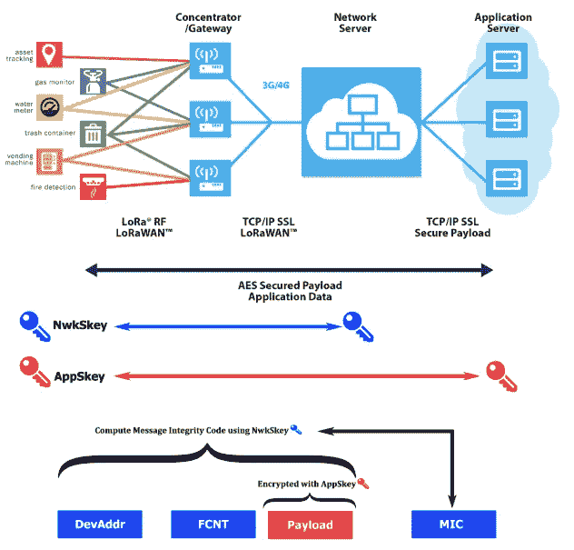

**NwkSkey** 用于保证从设备到 LoRa 网络服务器的消息完整性。 **AppSkey** 用于从设备到应用服务器的端到端 AES-128 加密。

网络连接的第二种方法是 **ABP** ，通过个性化激活。在这种情况下，设备会话密钥由用户插入，因此可能存在安全问题。

# 使用免许可频率的 LoRa 的监管考虑

LoRa 设备在开放频率范围内传输，不需要政府许可。也就是说，LoRa 工作在免许可的频带，在这些频率上传输不需要政府或州的许可。

劳拉使用，

*   415 兆赫
*   868 兆赫
*   915 兆赫

然而，值得注意的是，免费或免执照频率因洲而异。

**将 LoRa 应答器芯片配置为根据位置在正确的频率上传输是极其重要的。不遵守这些规定会招致这些国家当地政府的巨额罚款和处罚。**

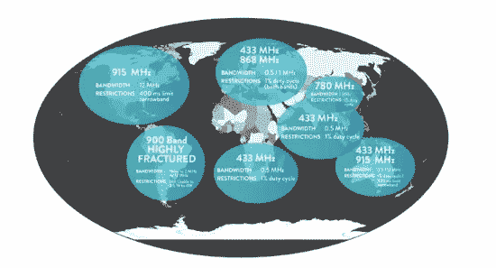

LoRa open frequency map

# LoRaWAN 带宽考虑

LoRaWAN 数据以字节的形式以数字格式传输。

**在各种条件下可靠传输数据有效载荷的实际限制是 100 字节**。虽然有可能略高，但 100 字节的最大值是一个很好的工作规则。

LoRaWAN 网络已经测试成功，在很长一段时间内每 7 秒钟发送 100 字节的信息。然而，在实践中，不推荐比每分钟传输一次更频繁的传输。

单个网关可以同时处理数千个 LoRa 节点。

# 劳拉旺的利与弊

## 劳拉旺的优势

*   低功率传感器和以千米为单位测量的宽覆盖区域
*   在免费(无需许可的)频率上运行，使用该技术无需前期许可成本
*   低功耗意味着设备的电池寿命长。传感器电池可持续使用 2-5 年(A 类和 B 类)
*   单个 LoRa 网关设备被设计成照顾成千上万的终端设备或节点
*   由于其简单的体系结构，它易于部署
*   它广泛用于 M2M/物联网应用
*   与 12 字节的 SigFox 相比，更好的有效载荷大小(100 字节)
*   开放:开放的联盟和开放的标准。与竞争对手 SigFox 相比的开放技术
*   每日消息的最大数量没有限制(相比之下，SigFox 的限制是每天 140 条)
*   LoRaWAN 的优势在于它是一个采用开放方法而非专有方法的联盟(SigFox)。
*   远程支持智能城市应用等解决方案。
*   低带宽使其非常适合数据量较少和/或数据传输不稳定的实际物联网部署。
*   低(额)连接成本。
*   无线，易于设置和快速部署。
*   安全性:一层是网络安全层，另一层是 AES 加密应用程序安全层。
*   完全双向交流。
*   由思科、IBM 和 LoRa 联盟的其他 500 家成员公司支持。

## 劳拉旺的缺点

*   不适用于大数据有效负载，有效负载限制为 100 字节。
*   不用于连续监测(C 类设备除外)。
*   不适合要求较低延迟和有限抖动的实时应用。
*   LoRaWAN 网络的密集化:随着网关在城市地区的部署，LPWAN 技术(尤其是 LoRaWAN)的发展带来了共存挑战。
*   开放频率的缺点是，您可能会在该频率上受到干扰，且数据速率可能较低。(对于 GSM 或授权频率，您可以在该频率上进行传输，不会受到任何干扰。使用特定频率的 GSM 运营商为使用这些频率向政府支付大量许可费。LoRa 的工作频率是开放的，不需要州政府的许可。请记住，开放频率因国家而异)。

***参考文献:***

*   [http://www . RF wireless-world . com/terminals/Advantages-and-lessons-of-Lora-or-Lora wan . html](http://www.rfwireless-world.com/Terminology/Advantages-and-Disadvantages-of-Lora-or-LoRaWAN.html)

# LoRa 和 LoRaWAN 与竞争对手的比较

## 洛拉万对西格福克斯

LoRaWAN 和 Sigfox 都为长距离、低功率段提供无线数据连接。然而，LoRaWAN 和 Sigfox 是非常不同的技术和商业模式。下表重点介绍了其中一些。

SigFox 的缺点，

*   它不是到处都部署的，所以目前它不能用于大量的用例。
*   通信最好从端点向上到基站。它具有双向功能，但从基站到端点的容量有限，而且下行链路预算比上行链路预算要少。
*   Sigfox 设备很难移动。
*   Sigfox 只能上传。虽然有限的下行链路是可能的，但它有不同的链路预算，并且非常受限制。

***参考文献:***

*   [https://www . wnd group . io/2017/10/10/lora-vs-n b-IOT-vs-SIG fox-one-best/](https://www.wndgroup.io/2017/10/10/lora-vs-nb-iot-vs-sigfox-one-best/)

## 劳拉旺对恩比奥

LoRa 和 Sigfox 属于非蜂窝物联网技术。NB-IoT 属于蜂窝物联网类别。窄带物联网

NB-IoT 工作在蜂窝许可频谱上，**设备必须定期(相对频繁地)与网络同步**。**在基于 ALOHA 的 LoRa 架构中不需要这样的网络同步**。

**LoRa 物联网技术工作于免许可无线电频谱** (Sigfox 也是如此)。因此，由 LoRaWAN 供电的应用程序成本最低，电池性能得到提升。 **NB-IoT 服务是同步的，它们是在许可频段上提供的，**频段许可的成本很高，每 MHz 的成本为>500 美元。电信运营商可以选择在保护频带、4G LTE 频谱以及独立网络中部署 NB-IoT。

LoRa 和 NB-IoT 都提供 10 公里到 15 公里范围内的覆盖。然而， **NB-IoT 在复杂的城市地区**工作得最好，在郊区或农村地区(几乎任何没有强大、无故障 4G 覆盖的地方)其性能**达不到标准。由于 LoRaWAN 的运行不依赖于蜂窝数据或 wifi，其**覆盖范围在所有类型的位置*保持相对稳定。*****

**注意:**LoRa 基站的建设成本仅为部署 NB-IoT 所需的 4G-LTE 基站的一小部分。LoRa 所需的较低投资在很大程度上对其有利。

因为 NB-IoT 是一种蜂窝级无线技术，所以芯片更加复杂。这意味着用户获得了与蜂窝连接相关的高性能水平，但代价是更复杂和更大的功耗。

NB-IoT 的优势在于，

*   覆盖面会很大。NB-IoT 设备依赖于 4G 覆盖，因此它们将在室内和人口稠密的城市地区工作良好。
*   它比 LoRa 有更快的响应时间，并能保证更好的服务质量。

NB-IoT 的缺点是，

*   LoRa 设备的电池寿命比 NB-IoT 设备更长。
*   LoRa 设备在移动时工作良好，这使得它们对于跟踪移动中的资产(如货物)非常有用。
*   网络和发射塔切换将是一个问题，因此 NB-IoT 最适合主要是静态的资产，如固定位置的仪表和传感器，而不是漫游资产。

***参考文献:***

*   [https://www.amihotechnology.com/lora-vs-nbiot/](https://www.amihotechnology.com/lora-vs-nbiot/)
*   [https://www.link-labs.com/blog/nb-iot-vs-lora-vs-sigfox](https://www.link-labs.com/blog/nb-iot-vs-lora-vs-sigfox)

## 洛拉万对齐贝吉

ZigBee 是建立在 IEEE 802.15.4 基础上的无线 2.4 GHz 标准。您可以在它上面运行许多不同的应用程序概要文件——因为它是由一个标准团体管理的，所以它可以跨多个制造商进行互操作。

ZigBee 是一个网状网络，因此 ZigBee 系统中的每个节点都可以充当无线数据端点或中继器。数据从一个节点传输到另一个节点，直到到达路由器。它专为数据速率相对较低的应用而设计，通常用于家庭自动化和智能照明。

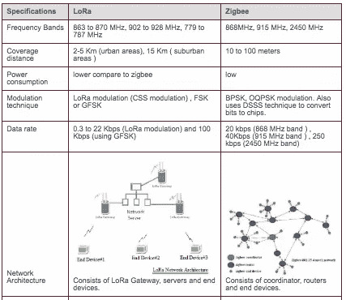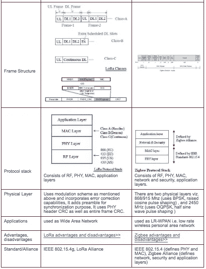

参考资料:

*   [http://www . RF wireless-world . com/terminals/LoRa-vs-ZigBee . html](http://www.rfwireless-world.com/Terminology/LoRa-vs-Zigbee.html)
*   https://www.link-labs.com/blog/zigbee-vs-xbee

## Zigbee 网状网络架构与 LoRaWAN 星对星网络架构的比较？

LoRaWAN 使用星型拓扑，Zigbee 使用网状拓扑。

在网状网络中，各个终端节点转发其他节点的信息，以增加网络的通信范围和小区大小。虽然这增加了范围，但也增加了复杂性，降低了网络容量， ***减少了电池寿命，因为节点接收和转发来自其他节点的可能与它们无关的信息。*** 对于远程而言，当可以实现远程连接时，星型架构对于延长电池寿命最有意义。

LoRaWAN 网络中的节点是异步的，当它们准备好发送数据时进行通信，无论是事件驱动的还是预定的。这种类型的协议通常被称为 Aloha 方法。在网状网络或同步网络(如蜂窝网络)中，节点必须频繁“醒来”以与网络同步并检查消息。这种同步消耗大量能量，并且是电池寿命缩短的头号驱动因素。在 GSMA 最近对解决 LPWAN 空间问题的各种技术进行的研究和比较中，与所有其他技术选项相比，LoRaWAN 显示出 3 到 5 倍的优势。

## LoRa(万)比竞争对手强吗？

【LoRa 和 LoRaWAN 是否优于其他技术(NB-IoT，Sigfox 等。)?

*   LoRaWAN 的优势在于它是一个采用开放方式而非专有方式的联盟。
*   在 2016 年 6 月的一篇博客文章[中，思科的 Tony Shakib 宣布了几个新的物联网解决方案，包括用于 LoRaWAN 产品的思科解决方案。](http://blogs.cisco.com/digital/cisco-digitizes-industrial-solutions-with-iot)

LoRaWAN 是采用最多的 LPWAN 类型，承诺在户外物联网应用中实现无处不在的连接，同时保持网络结构和管理简单。

***参考文献:***

*   [https://www . lora-alliance . org/sites/default/files/2018-04/what-is-lora wan . pdf](https://www.lora-alliance.org/sites/default/files/2018-04/what-is-lorawan.pdf)

# 洛拉和洛拉万可信度

## **劳拉和劳拉旺有财团或大公司支持吗？**

LoRaWAN 和 LoRa 由 LoRa Alliance 提供支持，LoRa Alliance 是一个非营利性组织，也是发展最快的技术联盟之一，拥有 500 多家成员公司(截至 2018 年)，致力于通过开发和推广 LoRaWAN 开放标准来实现低功耗广域网(LPWAN)物联网的大规模部署。

LoRa 联盟的创始公司包括技术供应商和电信运营商:

**技术供应商**

*   活动性
*   **思科**
*   Eolane
*   **IBM**
*   Kerlink
*   IMST
*   多技术
*   Sagemcom
*   微芯片技术

**电信**

*   布伊格电信公司
*   KPN
*   新加坡电信
*   普罗西莫斯
*   瑞士电信
*   FastNet(南非电信的一部分)

***参考文献:***

*   [https://www.lora-alliance.org/](https://www.lora-alliance.org/)
*   [https://www . postscapes . com/long-range-wireless-IOT-protocol-lora/](https://www.postscapes.com/long-range-wireless-iot-protocol-lora/)
*   [https://www . lora-alliance . org/sites/default/files/2018-04/what-is-lora wan . pdf](https://www.lora-alliance.org/sites/default/files/2018-04/what-is-lorawan.pdf)

## 物联网领域的 LoRa 和 LoRaWAN 采用轨迹？

*   使用 LoRaWAN 协议的 LoRaWAN 网络由 70 多家网络运营商提供，并且在 100 多个国家(包括私人国家)部署了 LoRaWAN 物联网。
*   LoRa 和 LoRAWAN 已成为主要的非蜂窝 LPWAN 生态系统和解决方案。它拥有强大的生态系统，包括硬件供应商、开发商、合作伙伴、物联网平台、系统集成商、物联网技术/解决方案供应商和电信提供商。
*   LoRaWAN 和 LoRa 已经在几个欧洲国家、亚太地区、澳大利亚和美国广泛销售。2016 年 6 月 30 日，荷兰成为世界上第一个拥有面向物联网应用的全国 LoRa 网络的国家。
*   LORIOT.io 已经开发了一种 LoRaWan 云，并在 70 多个国家使用，包括俄罗斯、中国、南美大部分地区和几个非洲国家。

***参考文献:***

*   [https://www . I-scoop . eu/internet-of-things-guide/IOT-network-lora-lora wan/](https://www.i-scoop.eu/internet-of-things-guide/iot-network-lora-lorawan/)

# 室内物联网应用的 LoRaWAN 适用性研究

研究了以下研究论文，以了解 LoRaWAN 的局限性，并研究其在室内高障碍物环境中的适用性。

## 研究 1——用于室内远程健康监护的 LoRa LPWAN 技术评估

本研究以实验量测的方式来探讨室内劳氏照明器的性能。测量是在芬兰奥卢大学主校区使用商业上可获得的设备进行的。该研究有效地证明了超过 300 米的室内(障碍)通信链路与 LoRa 和 LoRaWAN 是可能的。

***室内远程健康监护 LoRa LPWAN 技术评估*** [*【http://jultika.oulu.fi/files/nbnfi-fe201704076006.pdf】*](http://jultika.oulu.fi/files/nbnfi-fe201704076006.pdf)

## 研究 2——将 LoRaWAN 用于室内工业物联网应用

以下研究的结果显示，就可靠性、及时性和能耗而言，LoRaWAN 在室内工业监控系统中表现非常出色。

***关于利用劳拉旺进行室内工业物联网应用***[*https://www.hindawi.com/journals/wcmc/2018/3982646/*](https://www.hindawi.com/journals/wcmc/2018/3982646/)

## 研究 3——了解劳拉旺的局限性

本文旨在通过探索该技术的局限性，将它们与应用用例相匹配，并陈述开放的研究挑战，来阐明 LoRaWAN 的范围。

***了解洛拉万的极限(2017 年 2 月)***[*https://arxiv.org/pdf/1607.08011.pdf*](https://arxiv.org/pdf/1607.08011.pdf)

## 研究 4 —面向大规模物联网部署的 LPWAN 技术对比研究

本文对不同的 LPWAN 技术进行了全面的比较研究，这些技术是连接智能、自治和异构设备的有效解决方案。

面向大规模物联网部署的 LPWAN 技术对比研究
[**https://www . science direct . com/science/article/pii/s 2405959517302953 # sec 2**](https://www.sciencedirect.com/science/article/pii/S2405959517302953#sec2)

# LoRaWAN 使用案例

LoRaWAN 和 LoRa 已成功用于以下用例中，

*   **跌倒检测**
    [https://www . SEM tech . com/uploads/technology/LoRa/app-briefs/a b-SEM tech-LORA-智能-健康-跌倒检测。PDF](https://www.semtech.com/uploads/technology/LoRa/app-briefs/AB-SEMTECH-LORA-SMART-HEALTH-FALL-DETECTION.PDF)
*   **预测性维护**
    [https://www . SEM tech . com/uploads/technology/LoRa/app-briefs/SEM tech _ HB _ Predictive Maintenance _ app brief-final . pdf](https://www.semtech.com/uploads/technology/LoRa/app-briefs/Semtech_HB_PredictiveMaintenance_AppBrief-FINAL.pdf)
*   **工业温度控制**
    [https://www . SEM tech . com/uploads/technology/LoRa/app-briefs/SEM tech _ IndCntrl _ Industrial temp _ app brief-final . pdf](https://www.semtech.com/uploads/technology/LoRa/app-briefs/Semtech_IndCntrl_IndustrialTemp_AppBrief-FINAL.pdf)

仅当我们不想检测快速变化时，才应使用 LoRaWAN。例如，停车位的占用，或植物湿度的变化。 ***如果过渡仅限于跟踪每分钟的变化，那么 LoRa 设备是没问题的。***

LoRaWAN 的其他使用案例部署包括:

实时监控农业、泄漏检测或环境控制，减少了周期/非周期消息的数量并放宽了延迟限制。

智能城市应用 LoRaWAN 展示了智能照明、智能停车和智能废物收集的关键成功案例，这得益于这些应用所产生的数据的规模和性质。这些包括具有一定延迟容限的周期性消息传递。例如，智能停车应用程序在检测到变化时会报告停车点的状态。停车事件很慢，因此网络信令限于每天几十条消息。类似地，智能废物收集系统和智能照明启动或报告信息，以响应具有大变化周期的测量。虽然延迟和抖动在这些应用中不是主要问题，但在某些应用中，触发因素对大量终端设备来说是同时发生的。例如，日落和日落触发了整个城市周围的照明元素，从而导致信息的雪崩。LoRaWAN 是一种适合这种使用情况的技术，因为它可以处理广泛的覆盖区域和大量的用户，但会增加冲突、延迟和抖动的数量。

## 用例挑战

*   **跌倒检测用例中的挑战:**跌倒检测用例很难检测，因为跌倒检测算法没有得到很好的开发，并且会导致几起误报和遗漏跌倒的情况。
*   **终端设备的地理位置:**终端设备的位置是特定用例的强制要求。然而，基于 GPS 的解决方案由于成本、CPU 和能量消耗而不可行。目前，为洛拉万开发基于 TDOA(到达时间差)的三角测量技术的有趣工作已经开始。事实证明，这种方法受益于大型 SFs 和密集网关部署。
*   **持续监控:**工业自动化、关键基础设施监控和驱动需要某种实时操作。实时通常被理解为低延迟和有界抖动，并且取决于特定的应用。LoRaWAN 技术不能声称是工业自动化的候选解决方案。
    LoRaWAN，尽管存在应用特定的周期性，但无法保证确定性操作，因为 ALOHA 接入会受到影响网络抖动的竞争的影响。尽管如此，小型的 LoRaWAN 网络可以为需要每秒钟采样数据的应用提供适当的服务。

# 第二部分——LoRa 和 LoRaWAN 硬件

# LoRa(WAN)传感器、模块、网关和构建模块——以及从哪里获得它们

**Semtech 是 LoRa 知识产权的所有者。该公司销售半导体解决方案，如 LoRa 收发器和网关，以及集成电路等其他解决方案。**

LoRa 和 LoRaWAN 设备的其他制造商，从传感器板和模块到网关等，许可 LoRa IP，包括 STMicroelectronics、Microchip、mcf88、AllThingsTalk、Gumstix、Adeunis、Netvox Technology、Telit、Libelium、Yokogawa Electric Corporation、Lite-On 等。

如果 Semtech 是无线电芯片的唯一供应商，LoRa 联盟真的是一个真正的开放标准吗？从联盟的角度来看，基于 LoRa 的 LoRaWAN 通信协议是开源的。微控制器供应商 Microchip、ST 微电子和瑞萨已经公开宣布打算采用 LoRa 无线电技术。在不久的将来，还可能有其他半导体公司提供解决方案。

# LoRa 嵌入式传感器(端节点)

LoRa 节点设备是传感器连接的端节点设备。节点是启动与 LoRa 网关通信的从设备。

LoRa 尽最大努力传输，但没有确认。你可以通过劳拉传送任何数据。LoRa 端节点通常由 LoRa 转发器(传输数据)+微控制器(处理来自传感器的信号)+ GPIO 处理组成

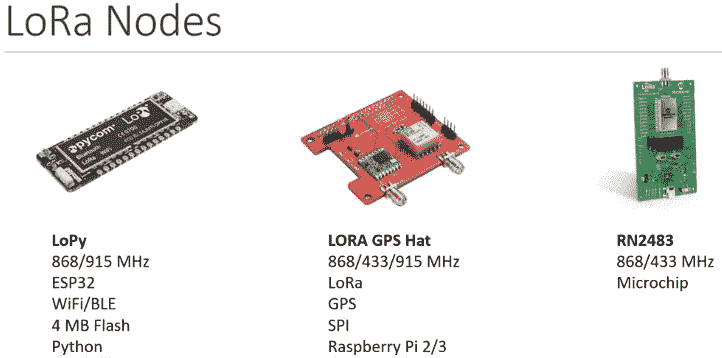

LoPy and LORA GPS Hat are the most common used LoRa Devices.

*   **LoPy** 是最流行最常见的 LoRa 节点。LoPy 可以连接到传感器，接收闪存上存储的数据(如果需要),并通过 LoRa 信号发送到 LoRa 网关。可在 micro Python 中编程。确保您在正确的国家使用正确的频率设置。欧洲 868 Mhz，美国 915 Mhz(这是一个重要的法律考虑因素)。费用为 20-25 美元。
*   **LoRa GPS Hat** 可以同时作为节点/网关使用。

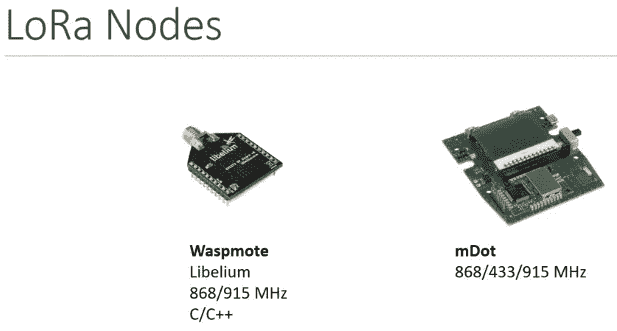

Other LoRa Nodes

## **LoRaWAN 节点设备被定义为 3 类，以节省电池寿命。**

**A 类:**传感器由电池供电，大部分时间都处于睡眠状态，即设备大部分时间都不工作。A 类设备发送数据，然后在接收延迟期后唤醒以接收数据。这意味着 A 类设备发送的数据必须立即得到确认。A 类设备的电池寿命通常为 2-5 年。

**B 类:**电池供电的传感器，睡眠由网络控制，网络可以指示设备何时睡眠何时醒来。这是新的，这类设备不多。

**C 类:**常接电源，常醒。

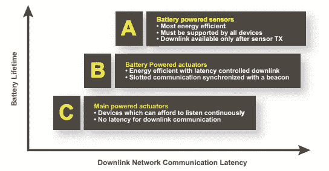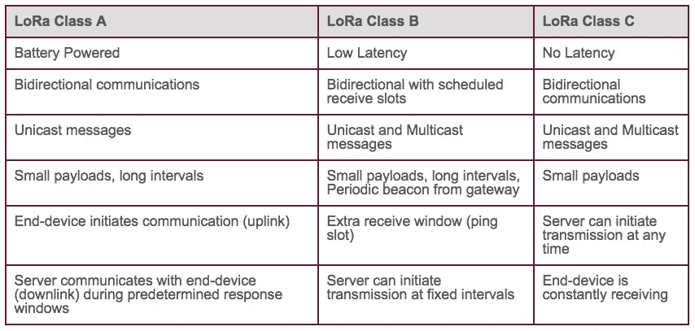

# **LoRa 网关**

LoRa 网关连接到电源(不在电池上)，接收来自 LoRa 传感器的数据，并通过 IP 发送到服务器。

**LoRa 网关价格约为 1000 美元，工业级网关价格约为 2000 美元。像 IMST IC880-SPI 这样的 DIY 网关。**

# LoRaWAN 认证产品

以下是目前可用于满足 LoRaWAN 提供的广泛物联网使用案例的一系列认证产品。

*   [https://www.lora-alliance.org/lorawan-certified-products](https://www.lora-alliance.org/lorawan-certified-products)
*   [https://kotahi.net/devices/](https://kotahi.net/devices/)

# LoRa 入门套件

## 适用于 LoRa 技术的多连接 ConduitTMIoT 入门套件

*   多连接 mDot 盒中包含温度、光线、压力和加速度传感器以及 GPS
*   适用于欧洲和北美的 868 和 915 MHz。
*   灵活地进行 LoRa 现场调查和/或从头开始开发端到端的 LoRa 概念验证，支持几乎无限的物联网用例需求

[https://www . multi tech . com/brands/multi connect-conduit-lora-starter-kits](https://www.multitech.com/brands/multiconnect-conduit-lora-starter-kits)

## Symphony Link 开发套件

*   支持 Wifi 的 [Symphony Link 网关](https://www.link-labs.com/52301?data-resolve-url=true&data-manual-id=52301)(型号 LL-BST-8–915-SYM-W-I-US)，包括操作网关的外围组件:

[https://www . link-labs . com/documentation/symphony-link-development-kit](https://www.link-labs.com/documentation/symphony-link-development-kit)

## **Dragino LoRa 物联网套件**

*   旨在方便初学者和开发者快速学习 LoRa 和物联网技术。
*   **LoRa 物联网套件**将展示如何构建 LoRa 网络，以及如何使用网络将数据从 LoRa 传感器节点发送到各种物联网服务器。当用作专用的 LoRa 网络时，LoRa 网关将连接您的其他 LoRa 节点，最远可达 5 公里-10 公里。

[http://www . dragino . com/products/lora/item/120-lora-IOT-kit . html](http://www.dragino.com/products/lora/item/120-lora-iot-kit.html)

## **LoRa 物联网入门套件—带 was promote**

*   LoRa 物联网入门套件——868 MHz 允许用户通过 Waspmote 以低数据速率发送数据并达到极远距离。
*   该套件包括 1 个 Waspmote SX1272 LoRa 模块 SMA 4.5 dBi-868 MHz 1 个 Waspmote Gateway SX1272 LoRa 模块 SMA 4.5 dBi-868 MHz 1 个 6600mA/h 可充电电池，您也可以找到 900Mhz 美国版本

[https://www.cooking-hacks.com/lora-iot-starter-kit-868](https://www.cooking-hacks.com/lora-iot-starter-kit-868)

## **Wise-DK1510 LoRa 入门套件**

*   WISE-1510 是 M2.COM 标准化物联网传感器节点，集成了 ARM Cortex-M4 处理器和 LoRa 收发器，以支持公共 LoRaWAN
*   研华 WISE-1510 还为传感器和 I/O 控制提供多种接口。借助 ARM mbed 嵌入式微处理器操作系统和附加软件堆栈，

[http://www . advantech . com/products/ed 549 ce 6-ff1b-4f 36-A350-2 ECA beb 2418 a/wise-dk 1510-lora-starter-kit/mod _ 8301523 b-b190-43bc-9545-f 51 b 5c 7 CEB 43](http://www.advantech.com/products/ed549ce6-ff1b-4f36-a350-2ecabeb2418a/wise-dk1510-lora-starter-kit/mod_8301523b-b190-43bc-9545-f51b5c7ceb43)

## **MOST-Link 入门套件 LoRa 技术入门套件**

*   开发软件包包括 LoRa 网关实用程序、Arduino 节点库和示例代码。
*   LoRa 入门套件为制造商/开发商提供了一个便捷的平台，快速展示 LoRa 技术的长距离和低功耗能力。

[https://www . globalsat . com . tw/en/product-258861/Starter-Kits-for-LoRa % C2 % AE-Technology-MOST-Link-Starter-Kits . html](https://www.globalsat.com.tw/en/product-258861/Starter-Kits-for-LoRa%C2%AE-Technology-MOST-Link-Starter-Kits.html)

# 第三部分——读取 LoRaWAN 有效载荷

在第一部分中，我们重点介绍了 LoRa 和 LoRa 技术。在第二部分中，我们重点介绍了 LoRaWAN 硬件。在第三部分，我们将重点关注端到端生态系统，以及如何使用 LoRAWAN 建立一个完整的物联网生态系统。

# 洛拉万生态系统

洛拉万生态系统由四个主要部分组成。

*   终端节点，即连接到 LoRa 转发器的传感器。这些都是电池供电，可以传输超过 5 公里-10 公里的范围。根据使用情况，电池可以使用 2-5 年。
*   从终端节点传感器接收数据的网关。这些是通常插在电源上的用电设备。网关通过 LoRa 接收 LoRa 数据包，然后通过互联网协议(IP)将数据包转发给网络服务器。单个网关可以接收来自数千个传感器的数据。
*   网络服务器，它从网关接收数据包(以字节为单位),然后对其进行处理并将其转发给应用服务器。网络服务器将是第三部分的重点。网络服务器通常是云上的托管解决方案，例如物联网(TTN)或 LoR-IOT 云。或者，它也可以是内部部署，例如[https://www.resiot.io/en/](https://www.resiot.io/en/)。
*   应用服务器，这是应用程序对从传感器接收的数据进行“处理”的地方。应用服务器可能位于像 AWS IoT 或 Azure 这样的云基础设施解决方案上。该应用程序可以使用 Lambda 等 AWS 服务构建，也可以使用 S3 或 DynamoDB。这是您构建物联网应用或仪表盘等的地方。

# **洛里奥**

LORIOT 是 LoRaWAN Networks 的软件提供商和网络运营商。

LORIOT 是一家瑞士物联网领域的初创企业，成立于 2015 年。
他们的核心产品是用于 LoRaWAN 网络和端到端应用程序的可扩展、分布式、弹性操作的软件，他们以各种商业模式提供这些软件。

典型的客户是物联网业务中的中小型企业、城市、市政当局和无线网络运营商。

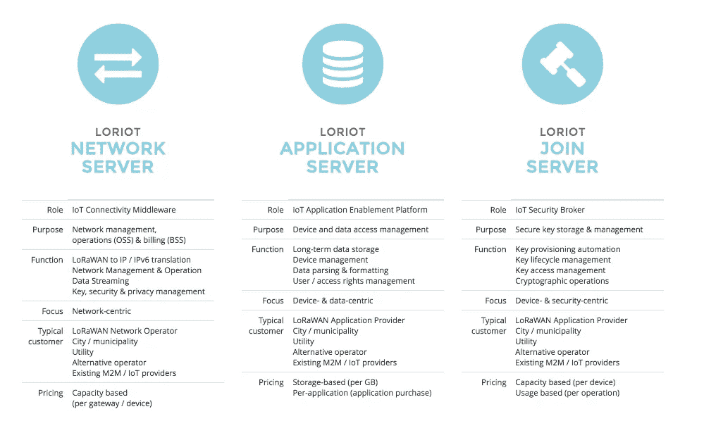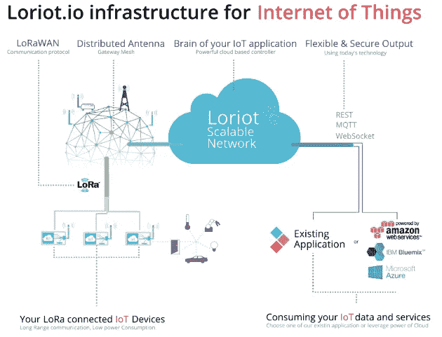

LORIOT software product offerings for LoRaWAN Networks

## ***喜欢看文章？*** [***关注我上媒***](/@prashantramnyc) ***获取相关文章和最新更新！***

***发现这个帖子有用吗？点击*👏*按钮显示你有多喜欢它:)***

***参考文献:***

*   [https://www.loriot.io/technology.html](https://www.loriot.io/technology.html)
*   [https://www.loriot.io/pricing.html](https://www.loriot.io/pricing.html)

***参考文献:***

*   [https://www.semtech.com/technology/lora/what-is-lora](https://www.semtech.com/technology/lora/what-is-lora)
*   https://www.youtube.com/watch?v=OXte21FnI-A
*   【https://www.resiot.io/en/what-is-lorawan/ 

> 加入 Coinmonks [电报频道](https://t.me/coincodecap)和 [Youtube 频道](https://www.youtube.com/c/coinmonks/videos)获取每日[加密新闻](http://coincodecap.com/)

## 另外，阅读

*   [密码电报信号](http://Top 4 Telegram Channels for Crypto Traders) | [密码交易机器人](/coinmonks/crypto-trading-bot-c2ffce8acb2a)
*   [复制交易](/coinmonks/top-10-crypto-copy-trading-platforms-for-beginners-d0c37c7d698c) | [加密税务软件](/coinmonks/crypto-tax-software-ed4b4810e338)
*   [电网交易](https://coincodecap.com/grid-trading) | [加密硬件钱包](/coinmonks/the-best-cryptocurrency-hardware-wallets-of-2020-e28b1c124069)
*   [加密交换](/coinmonks/crypto-exchange-dd2f9d6f3769) | [印度的加密应用](/coinmonks/buy-bitcoin-in-india-feb50ddfef94)
*   开发人员的最佳加密 API
*   最佳[加密贷款平台](/coinmonks/top-5-crypto-lending-platforms-in-2020-that-you-need-to-know-a1b675cec3fa)
*   [CoinDCX 评论](/coinmonks/coindcx-review-8444db3621a2) | [加密保证金交易交易所](https://coincodecap.com/crypto-margin-trading-exchanges)
*   [红狗赌场评论](https://coincodecap.com/red-dog-casino-review) | [Swyftx 评论](https://coincodecap.com/swyftx-review) | [CoinGate 评论](https://coincodecap.com/coingate-review)
*   [Bookmap 点评](https://coincodecap.com/bookmap-review-2021-best-trading-software) | [美国 5 大最佳加密交易所](https://coincodecap.com/crypto-exchange-usa)
*   [如何在 FTX 交易所交易期货](https://coincodecap.com/ftx-futures-trading) | [OKEx vs 币安](https://coincodecap.com/okex-vs-binance)
*   [CoinLoan 评论](https://coincodecap.com/coinloan-review) | [YouHodler 评论](/coinmonks/youhodler-4-easy-ways-to-make-money-98969b9689f2) | [BlockFi 评论](https://coincodecap.com/blockfi-review)