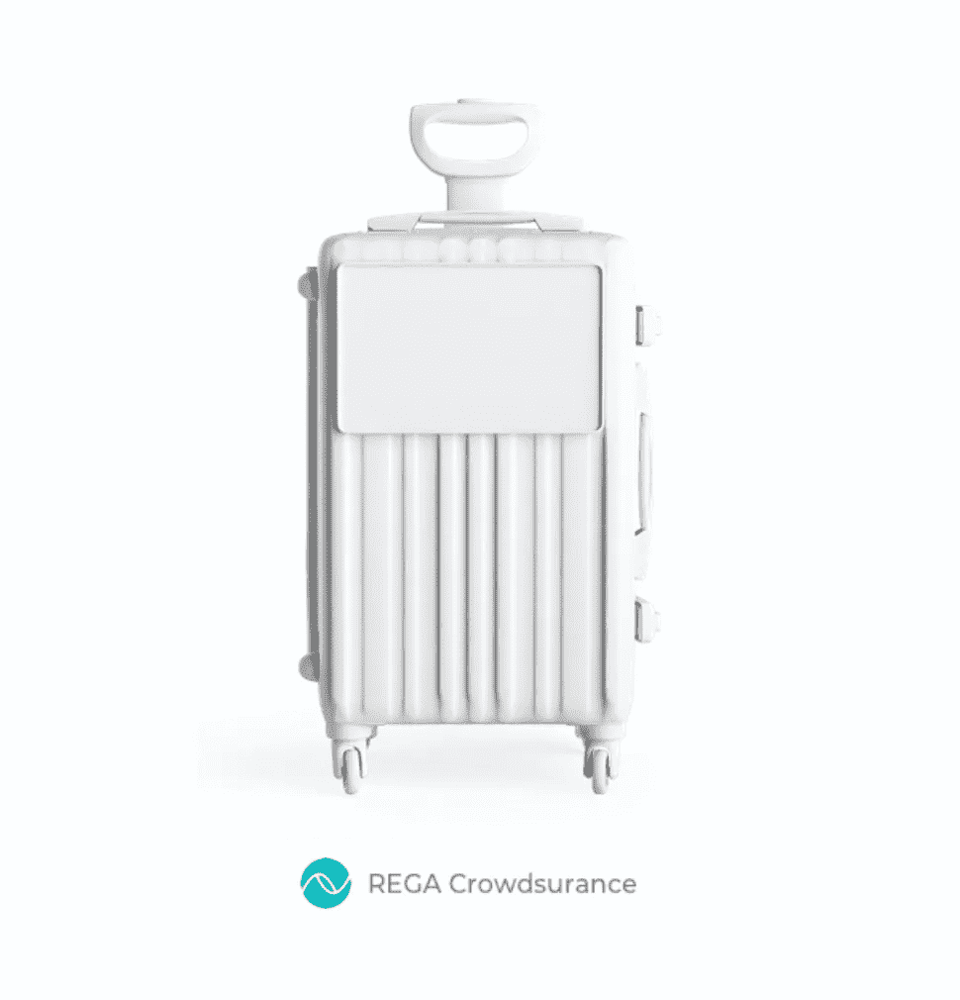
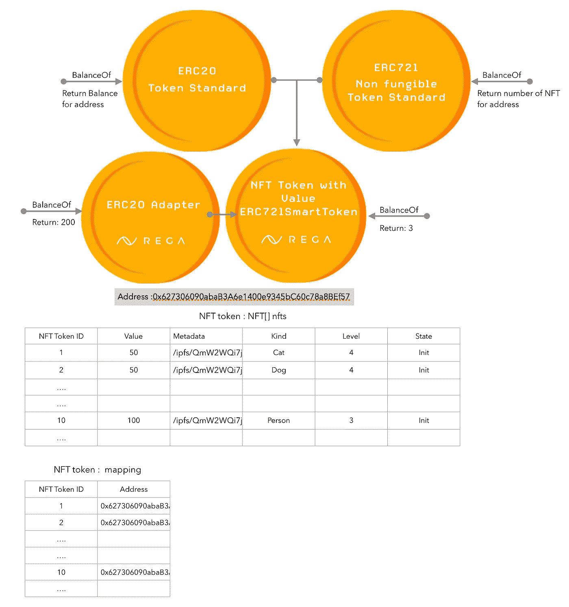
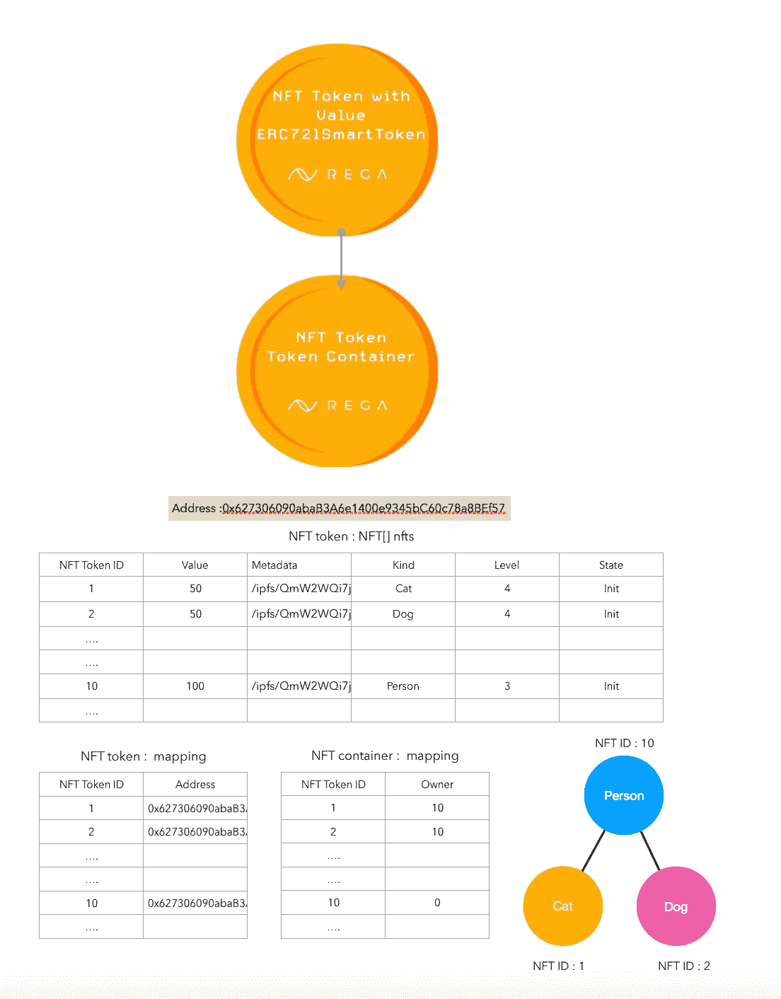
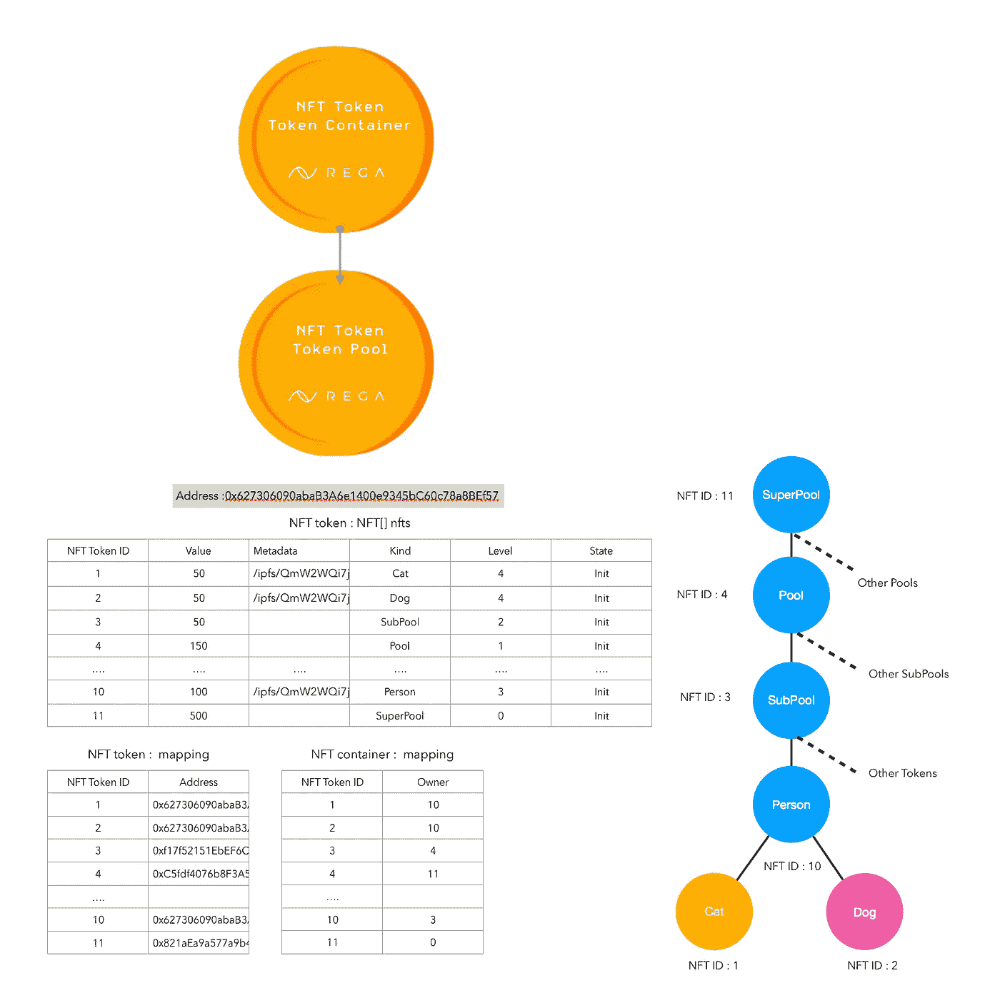
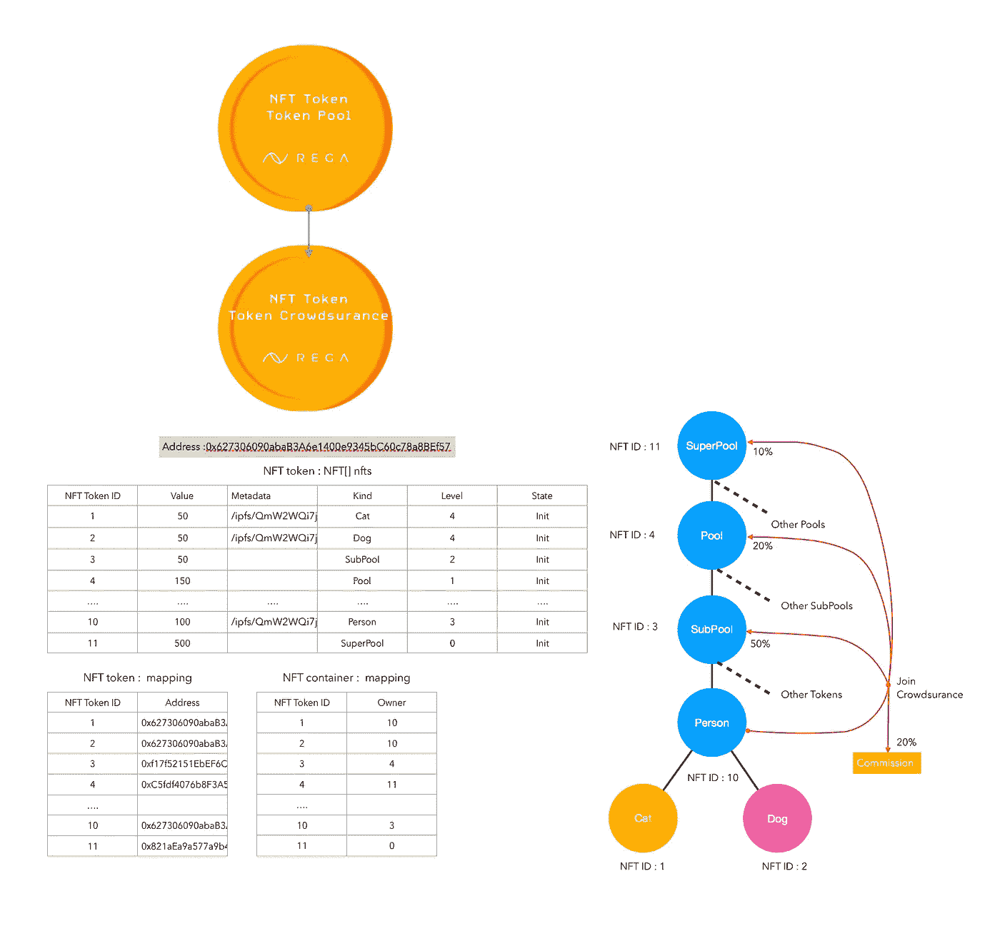
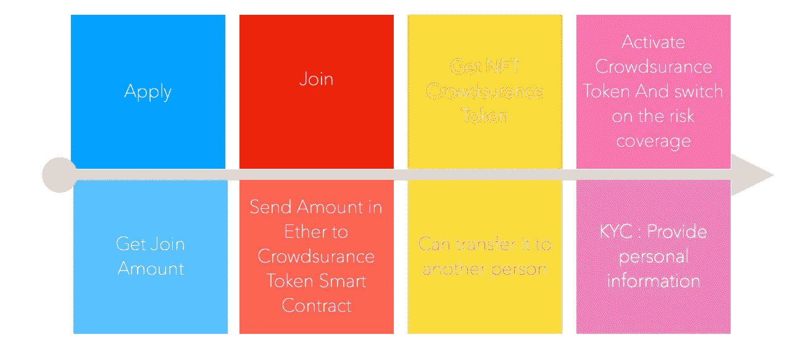
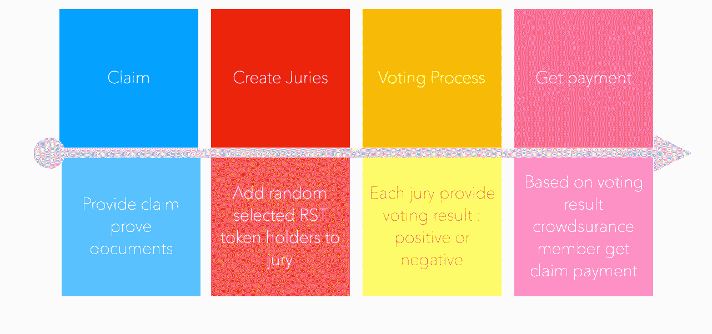
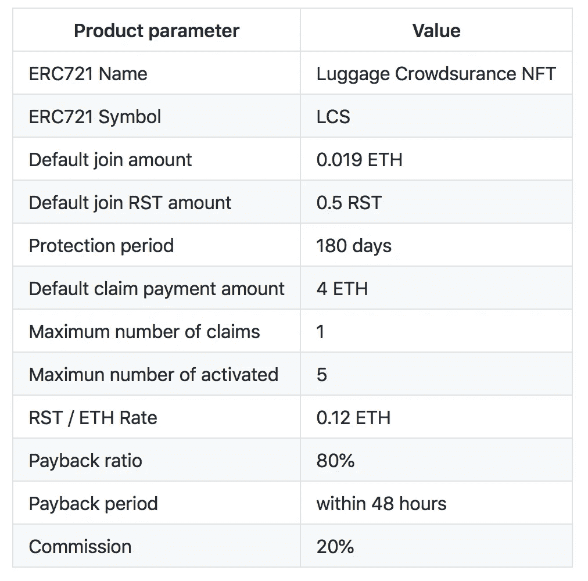

# 行李集体保险

> 原文：<https://medium.com/coinmonks/luggage-crowdsurance-d685d3d73121?source=collection_archive---------7----------------------->

行李众保产品为`TokenCrowdsurance` [NFT721SmartToken](https://github.com/REGA-RS/ERC721SmartToken) 。为了建立一个去中心化的金融产品，我们需要使用不可替代的令牌标准 ERC721，但是由于每个令牌都有自己的价值，所以我们将这个标准与 ERC20 令牌联系起来。下图展示了它的工作原理:

为了访问具有 ERC721 令牌的 ERC20 功能，我们创建了 ERC20 适配器，它是连接到实现 ERC 20 控制器的 ERC721SmartToken 的智能合约。因此，要获得特定帐户地址的 ERC20 余额，我们应该调用 ERC20Adapter 的 BalanceOf，结果(在我们的示例中)将是 200。如果我们想得到属于同一个地址的多个令牌，我们将调用 ERC721 的 BalanceOf 函数并得到结果 3。这只是如何使用 ERC721SmartToken 的一个示例。完整的智能合同描述是[这里](https://github.com/REGA-RS/ERC721SmartToken/blob/master/help.md)。

构建众包产品的下一步是添加 TokenContainer 概念。一个 ERC721 令牌可以持有同一智能合约中的其他令牌。

在这个例子中，NFT ID 10 拥有宠物令牌:猫——NFT ID 1 和狗——NFT ID 2。[令牌容器](https://github.com/REGA-RS/ERC721SmartToken#tokencontainer)提供了许多使用容器的功能，包括添加和删除令牌。

对于特定的任务，包括众包，我们需要创建下一个级别，我们称之为[令牌池](https://github.com/REGA-RS/ERC721SmartToken#tokenpool)。

现在我们有 4 级池层次结构:超级池，池，子池和 NFT 令牌。最后一级也可以是容器，如我们的示例所示，其中 NFT 令牌人拥有两个宠物令牌，并且属于子池 NFT ID 3。

基于[令牌池](https://github.com/REGA-RS/ERC721SmartToken#tokenpool)，我们开发了[令牌众保](https://github.com/REGA-RS/ERC721SmartToken#tokencrowdsurance)智能合约，提供众保产品的功能。“众保”一词意味着人们在社区中团结起来，为意外损失提供赔偿保证。得益于`ERC721SmartToken`,众保产品可以“令牌化”,并可作为 ERC20 令牌使用。

在这个例子中，我们可以看到“加入”众保功能是如何工作的。加入量已经在代币提供商的池和佣金之间分配。发行过程的描述:

下图展示了出现付款申请时，索赔付款流程是如何工作的:

最后，我们引入带有以下参数的[lugagecrowdsurance](https://github.com/REGA-RS/ERC721SmartToken#luggagecrowdsurance)令牌:

