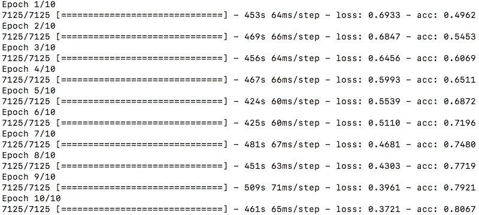
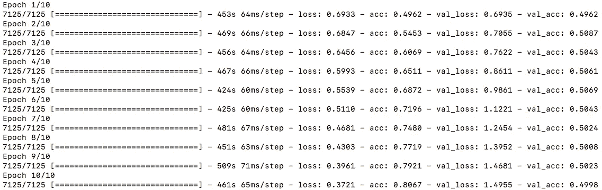

# 一个关于过度拟合你的神经网络的小故事

> 原文：<https://medium.com/coinmonks/machine-learning-essentials-a-short-story-about-over-fitting-your-network-or-the-importance-of-c4229957410d?source=collection_archive---------11----------------------->

## 一个关于过度拟合你的神经网络的小故事(或者 Keras 上验证数据的重要性)

这是一个简短的故事，讲述了添加一个验证分区的重要性，该分区将在每个时期进行评估，而不是等到训练结束后才测量训练模型在预测训练阶段从未见过的实例方面有多好，或者换句话说，概括问题。

# 部分灵感来自真实事件

让我们假设你正在 Keras 上使用递归神经网络开发一个文本分类器。一个二元问题，其中一个句子被逐字输入网络，预期输出是一个单值，预测该句子是“**正**还是“**负**”(无论在你的上下文中是什么意思)。是的，是的，就像我在之前的故事中详述的[😉：](/@monocasero/text-classifier-with-keras-tensorflow-using-recurrent-neural-networks-ad63dd5fc316)

为了训练分类器，你不用像 Keras 提供的那样使用预先准备好的数据集[。您已经创建了自己的集合，仔细准备了训练示例及其标签。](https://keras.io/datasets/)

此时您可能不知道，或者您不打算将验证数据发送到 [Keras fit 函数](https://keras.io/models/sequential/)，但是您确实打算在训练结束时分割数据集进行评估(假设 90%训练，10%评估)。为此目的**你选择创建自己的函数来混洗和分割数据集**，而不是使用一个已经可用的函数[(如 sklearn 的 train_test_split](http://scikit-learn.org/stable/modules/generated/sklearn.model_selection.train_test_split.html) )。

> ***然而，你在不知不觉中犯了一个错误！不是一起混洗训练集(X)和它们的标签(Y ),而是独立地混洗它们，因此你把所有的标签(Y)都混在一起了。***

你把标签弄乱了！但既然你还不知道，你就开始训练吧。因为句子的真实性质和它的标签之间没有真正的关系，所以训练会一塌糊涂，对吗？对吗？

与我们预期的相反，乍一看，它并不像是一片混乱:

如你所见，10 个时期和超过 1 小时的训练已经过去，损失(损失:0.3721)正在减少，并且训练集上的准确度已经稳定地增加到 80% (acc: 0.8067)！发生了什么事？

使用一个相当复杂的网络架构，特别是没有正则化(像在这种情况下)，**训练将能够适应调整到例子的细节以及它们的噪声**。在这种情况下，由于标签是混淆的，训练集主要是随机噪声，不知何故，网络仍然能够“学习”这种噪声的细节。

# 那你应该怎么做？

如果您已经开始了相同的训练，向 fit(或 fit_generator)函数发送验证数据，则每个时期您都会看到**验证集(val_acc，最后一列)上的精度根本没有增加**，而且损失(val_loss:)在增加(在时期 10 结束时从 0.6935 增加到 1.4955):

> 毫不奇怪，对于训练过程中从未见过的例子，分类器不比抛硬币好。

如果您发送验证数据，您将能够在少量时间后检测到这种问题，而不是等到培训结束时才发现有问题。

# 怎么做？

这很简单，如果你使用的是[**model . fit**](https://keras.io/models/model/)**(没有数据生成器)有一个参数可以从训练集中自动拆分:**

*   ****validation_split** :在 0 和 1 之间浮动。用作验证数据的训练数据部分。该模型将把这部分训练数据分开，不在其上训练，并且将在每个时期结束时评估该数据的损失和任何模型度量。在洗牌之前，从提供的`x`和`y`数据的最后样本中选择验证数据。**

**另一方面，使用 **model.fit_generator** ，您将需要发送带有以下参数的验证数据或数据生成器:**

*   ****validation_data** :可以是**

1.  **验证数据的生成器或`Sequence`对象**
2.  **元组`(x_val, y_val)`**
3.  **元组`(x_val, y_val, val_sample_weights)`**

**在每个时期结束时在其上评估损失和任何模型度量。该模型不会根据此数据进行训练。**

*   ****验证 _ 步骤**:仅当`validation_data`为发电机时相关。在每个时期结束时停止之前，从`validation_data`发生器产生的总步骤数(样品批次)。它通常应等于认证数据集的样本数除以批次大小。`Sequence`可选:如果未指定，将使用`len(validation_data)`作为步数。**

# **更多信息:**

*   **[https://keras.io/models/sequential/](https://keras.io/models/sequential/)**
*   **[https://machine learning mastery . com/over fitting-and-under fitting-with-machine-learning-algorithms/](https://machinelearningmastery.com/overfitting-and-underfitting-with-machine-learning-algorithms/)**
*   **[http://sci kit-learn . org/stable/modules/generated/sk learn . model _ selection . train _ test _ split . html](http://scikit-learn.org/stable/modules/generated/sklearn.model_selection.train_test_split.html)**
*   **[https://Stanford . edu/~ sher vine/blog/keras-how-to-generate-data-on-the-fly . html](https://stanford.edu/~shervine/blog/keras-how-to-generate-data-on-the-fly.html)**